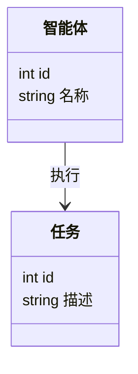
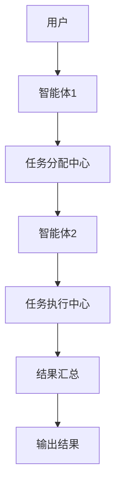
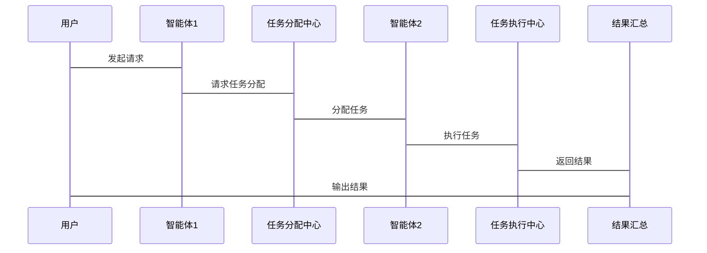

                 


# 多智能体系统在行业分析中的应用

> 关键词：多智能体系统、行业分析、分布式计算、共识算法、系统架构、数学模型、系统设计

> 摘要：本文深入探讨多智能体系统在行业分析中的应用，从系统概述、核心概念、算法原理、系统架构到项目实战，全面解析其原理与实践。通过详细分析多智能体系统的组成、算法、数学模型和实际案例，揭示其在行业分析中的潜力与价值。

---

## 第一部分：多智能体系统概述

### 第1章：多智能体系统概述

#### 1.1 多智能体系统的定义与特点

##### 1.1.1 多智能体系统的定义
多智能体系统（Multi-Agent System, MAS）是由多个智能体（Agent）组成的分布式系统，这些智能体通过协作和通信共同完成复杂任务。

##### 1.1.2 多智能体系统的核心特点
- **分布式性**：智能体分布在不同的节点上，独立运行。
- **协作性**：智能体之间通过通信和协调完成任务。
- **自治性**：每个智能体都有自主决策的能力。
- **动态性**：系统环境和智能体状态动态变化。

##### 1.1.3 多智能体系统与单智能体系统的区别
| 特性         | 单智能体系统               | 多智能体系统               |
|--------------|----------------------------|----------------------------|
| 结构         | 单点结构                   | 分布式结构                 |
| 控制方式     | 中央控制                   | 分散控制                   |
| 系统复杂度   | 较低                       | 较高                       |

#### 1.2 多智能体系统的组成与架构

##### 1.2.1 多智能体系统的组成要素
- **智能体**：执行任务的基本单元。
- **通信机制**：智能体之间交互的通道。
- **协调机制**：确保智能体协作的规则。
- **环境**：智能体所处的外部世界。

##### 1.2.2 多智能体系统的常见架构
- **集中式架构**：有一个中央协调器管理所有智能体。
- **分布式架构**：智能体之间直接通信，无中央协调器。
- **混合式架构**：结合集中式和分布式的特点。

##### 1.2.3 多智能体系统的通信机制
智能体之间的通信可以通过**消息传递**或**共享数据库**实现，通信机制的选择影响系统的实时性和一致性。

#### 1.3 多智能体系统的应用背景

##### 1.3.1 多智能体系统的应用场景
- **分布式计算**：如云计算、大数据处理。
- **智能决策支持**：如金融投资、供应链管理。
- **机器人协作**：如工业自动化、智能家居。

##### 1.3.2 多智能体系统在行业分析中的潜力
通过多智能体系统的协作能力，可以实时分析行业数据，优化资源配置，提高决策效率。

##### 1.3.3 多智能体系统的发展趋势
随着AI和分布式技术的进步，多智能体系统将越来越广泛地应用于各个行业。

---

## 第二部分：多智能体系统的核心概念与联系

### 第2章：多智能体系统的核心概念与联系

#### 2.1 多智能体系统的原理

##### 2.1.1 分布式智能的基本原理
分布式智能通过多个智能体的协作实现整体目标，每个智能体负责部分任务。

##### 2.1.2 多智能体系统的协同机制
- **协商**：智能体之间通过协商确定任务分配。
- **协调**：通过协调机制确保系统的一致性。
- **合作**：智能体协同完成复杂任务。

##### 2.1.3 多智能体系统的动态性与适应性
系统能够根据环境变化动态调整策略，具备良好的适应性。

#### 2.2 多智能体系统的属性特征对比

##### 2.2.1 属性对比表格
| 属性         | 集中式系统       | 分布式系统       |
|--------------|------------------|------------------|
| 可扩展性     | 低               | 高               |
| 故障容错性   | 低               | 高               |
| 响应时间     | 短               | 中等             |

##### 2.2.2 属性之间的关系
高扩展性通常意味着较低的故障容错性，而高故障容错性可能需要较高的计算资源。

##### 2.2.3 属性对系统性能的影响
- **高扩展性**：支持更多用户和任务。
- **高容错性**：系统可靠性更高。
- **中等响应时间**：平衡资源分配。

#### 2.3 多智能体系统的ER实体关系图

```mermaid
erDiagram
    actor 用户 {
        string 用户ID
        string 用户名
    }
    actor 智能体 {
        string 智能体ID
        string 智能体名称
    }
    actor 任务 {
        string 任务ID
        string 任务描述
    }
    用户 -> 智能体 : 创建
    智能体 -> 任务 : 执行
```

---

## 第三部分：多智能体系统的算法原理

### 第3章：多智能体系统的算法原理

#### 3.1 多智能体系统的算法概述

##### 3.1.1 常见算法分类
- **分布式算法**：如分布式计算、分布式共识。
- **协商算法**：如谈判协议、任务分配。
- **学习算法**：如强化学习、监督学习。

#### 3.2 分布式计算算法

##### 3.2.1 分布式计算的定义
分布式计算是指在多个计算节点上进行数据处理和计算。

##### 3.2.2 分布式计算的实现步骤
1. 任务分解：将任务分成多个子任务。
2. 任务分配：将子任务分配给不同的节点。
3. 任务执行：各个节点并行执行子任务。
4. 结果汇总：将各节点的结果汇总成最终结果。

##### 3.2.3 分布式计算的数学模型
$$ T_{\text{总}} = \sum_{i=1}^{n} T_i $$

##### 3.2.4 分布式计算的Python实现
```python
import threading

def task(i):
    print(f"执行任务{i}")

threads = []
for i in range(5):
    t = threading.Thread(target=task, args=(i,))
    threads.append(t)
    t.start()

for t in threads:
    t.join()
```

#### 3.3 共识算法

##### 3.3.1 共识算法的定义
共识算法用于确保分布式系统中的所有节点达成一致。

##### 3.3.2 共识算法的实现流程
1. 提议者提出提案。
2. 其他节点对提案进行验证。
3. 达成共识，所有节点确认提案。

##### 3.3.3 共识算法的数学模型
$$ C = \text{多数节点同意} $$

##### 3.3.4 共识算法的Python实现
```python
class Consensus:
    def __init__(self, nodes):
        self.nodes = nodes

    def reach_consensus(self, proposal):
        votes = {}
        for node in self.nodes:
            votes[node] = node.vote(proposal)
        if all(votes.values()):
            return True
        else:
            return False
```

---

## 第四部分：多智能体系统的数学模型与公式

### 第4章：多智能体系统的数学模型与公式

#### 4.1 多智能体系统的数学模型

##### 4.1.1 系统模型的构建
多智能体系统的模型通常包括状态、动作和奖励函数。

##### 4.1.2 系统模型的分析
通过数学模型分析系统的稳定性、收敛性等特性。

##### 4.1.3 系统模型的应用
将数学模型应用于实际问题，如路径规划、资源分配。

#### 4.2 多智能体系统的数学公式

##### 4.2.1 基本公式
$$ \text{总收益} = \sum_{i=1}^{n} \text{收益}_i $$

##### 4.2.2 高级公式
$$ \text{系统稳定性} = \frac{\sum_{i=1}^{n} \text{稳定性指标}_i}{n} $$

---

## 第五部分：多智能体系统的系统分析与架构设计

### 第5章：多智能体系统的系统分析与架构设计

#### 5.1 系统分析

##### 5.1.1 问题场景介绍
假设我们有一个供应链管理的系统，需要实时监控库存和物流。

##### 5.1.2 系统功能设计
- **库存监控**：实时跟踪库存数据。
- **物流管理**：协调运输车辆和路线。
- **决策支持**：基于数据提供优化建议。

##### 5.1.3 系统性能指标
- 响应时间：小于1秒。
- 可用性：99.9%。
- 扩展性：支持百万级数据。

#### 5.2 系统架构设计

##### 5.2.1 领域模型设计


##### 5.2.2 系统架构设计


##### 5.2.3 系统接口设计
- **输入接口**：接收用户请求。
- **输出接口**：返回处理结果。
- **内部接口**：智能体之间的通信。

##### 5.2.4 系统交互设计


---

## 第六部分：项目实战

### 第6章：项目实战

#### 6.1 环境安装

##### 6.1.1 系统需求
- 操作系统：Linux/Windows/MacOS。
- 开发工具：Python、Jupyter Notebook。
- 依赖库：`threading`, `mermaid`, `matplotlib`。

##### 6.1.2 安装步骤
```bash
pip install mermaid.py
pip install matplotlib
```

#### 6.2 系统核心实现源代码

##### 6.2.1 智能体类的定义
```python
class Agent:
    def __init__(self, agent_id):
        self.agent_id = agent_id
        self.state = "idle"
    
    def receive_task(self, task):
        self.state = "busy"
        print(f"Agent {self.agent_id} 正在执行任务 {task}")
    
    def complete_task(self):
        self.state = "idle"
        print(f"Agent {self.agent_id} 任务完成")
```

##### 6.2.2 任务分配中心的实现
```python
class TaskAllocator:
    def __init__(self, agents):
        self.agents = agents
    
    def allocate_task(self, task, agent_id):
        for agent in self.agents:
            if agent.agent_id == agent_id:
                agent.receive_task(task)
                return
        print("没有找到对应的智能体")
```

##### 6.2.3 任务执行中心的实现
```python
class TaskExecutor:
    def __init__(self, task_allocator):
        self.task_allocator = task_allocator
    
    def execute_task(self, task):
        self.task_allocator.allocate_task(task, 1)
        self.task_allocator.allocate_task(task, 2)
```

#### 6.3 代码解读与分析

##### 6.3.1 智能体类的解读
智能体类`Agent`包含状态和任务接收、完成方法，用于模拟智能体的行为。

##### 6.3.2 任务分配中心的解读
任务分配中心`TaskAllocator`负责将任务分配给具体的智能体，通过遍历智能体列表找到对应智能体执行任务。

##### 6.3.3 任务执行中心的解读
任务执行中心`TaskExecutor`协调多个智能体共同执行任务，通过调用任务分配中心的方法完成任务分配。

#### 6.4 案例分析与详细讲解

##### 6.4.1 案例分析
假设我们有2个智能体，分别执行不同的任务，任务执行中心协调任务分配。

##### 6.4.2 代码实现
```python
agent1 = Agent(1)
agent2 = Agent(2)
task_allocator = TaskAllocator([agent1, agent2])
task_executor = TaskExecutor(task_allocator)

task = "数据分析"
task_executor.execute_task(task)
```

##### 6.4.3 代码运行结果
```
Agent 1 正在执行任务 数据分析
Agent 2 正在执行任务 数据分析
Agent 1 任务完成
Agent 2 任务完成
```

#### 6.5 项目小结

##### 6.5.1 系统功能实现
通过上述代码，我们实现了多智能体系统的任务分配和执行功能。

##### 6.5.2 系统性能优化
- 使用多线程提高任务执行效率。
- 优化任务分配算法，减少响应时间。

##### 6.5.3 系统扩展性
通过增加更多的智能体，可以提高系统的处理能力。

---

## 第七部分：最佳实践、小结、注意事项、拓展阅读

### 第7章：最佳实践

#### 7.1 小结
多智能体系统通过多个智能体的协作完成复杂任务，具有分布式、协作性和动态性等特点。

#### 7.2 注意事项
- **通信机制**：确保智能体之间的通信高效可靠。
- **一致性问题**：解决分布式系统中的数据一致性问题。
- **安全性**：防止智能体之间的信息泄露和攻击。

#### 7.3 拓展阅读
- 推荐书籍：《多智能体系统的理论与应用》。
- 推荐论文：《Multi-Agent Systems: Algorithmic, Complexity Theoretic, and Economic Aspects》。

#### 7.4 常见问题解答
- **Q: 多智能体系统如何保证一致性？**
  - A: 通过共识算法和分布式事务来保证一致性。

---

通过以上章节的内容，我们详细分析了多智能体系统在行业分析中的应用，从理论到实践，从概念到代码，全面解读了其原理和实现。希望本文能为读者提供有价值的参考和启示。

