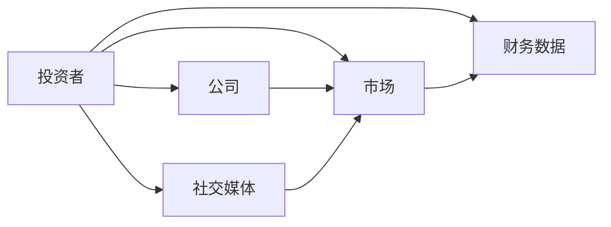
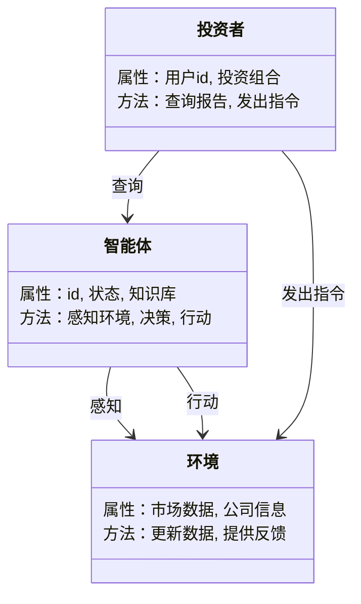

                 


# 多智能体系统在行业分析中的应用：深化价值投资研究

---

## 关键词：多智能体系统，价值投资，行业分析，协同学习，强化学习，金融建模

---

## 摘要：  
随着金融市场的复杂化和数据量的爆炸式增长，传统的单智能体分析方法已难以满足深度价值投资研究的需求。多智能体系统（Multi-Agent System, MAS）作为一种新兴的分布式计算范式，能够通过多个智能体的协同工作，有效解决复杂金融场景下的信息处理、决策优化和风险控制问题。本文将深入探讨多智能体系统在行业分析中的应用，重点分析其在价值投资研究中的潜力与优势。通过结合多智能体协同学习、强化学习等算法，本文将揭示如何利用MAS技术提升金融建模的精度和投资决策的智能化水平，为投资者提供更高效、更可靠的投资策略支持。

---

# 第一部分：多智能体系统与价值投资概述

## 第1章：多智能体系统与价值投资的背景

### 1.1 多智能体系统的基本概念  
多智能体系统（Multi-Agent System, MAS）是指由多个智能体（Agent）组成的分布式计算系统。每个智能体都是一个能够感知环境、做出决策并采取行动的独立实体。多智能体系统的核心在于智能体之间的协同与合作，通过分布式计算和信息共享，实现复杂问题的最优解。  

#### 1.1.1 多智能体系统的定义与特点  
- **定义**：多智能体系统是由多个智能体组成的分布式系统，智能体之间通过通信和协作完成任务。  
- **特点**：  
  - **分布式性**：智能体独立运行，无中心节点。  
  - **协同性**：智能体通过通信和协调实现目标。  
  - **动态性**：环境和智能体状态实时变化。  
  - **自主性**：智能体能够自主决策。  

#### 1.1.2 多智能体系统的核心要素  
- **智能体**：具备感知、决策、行动能力的实体。  
- **通信机制**：智能体之间的信息交换方式。  
- **协调机制**：智能体协同工作的规则和策略。  
- **环境模型**：智能体所处的外部环境描述。  

#### 1.1.3 多智能体系统与传统单智能体系统的区别  
| 特性 | 单智能体系统 | 多智能体系统 |  
|------|--------------|--------------|  
| 结构 | 单一中心节点 | 分布式结构 |  
| 协作 | 无 | 智能体间协作 |  
| 灵活性 | 低 | 高 |  

---

### 1.2 价值投资的基本原理  

#### 1.2.1 价值投资的定义与特点  
- **定义**：价值投资是一种以公司基本面分析为基础，寻找市场价格低于其内在价值的投资策略。  
- **特点**：  
  - 长期视角：关注公司的长期价值。  
  - 逆向思维：在市场低迷时寻找低估资产。  
  - 风险控制：注重安全边际。  

#### 1.2.2 价值投资的核心要素  
- **基本面分析**：公司财务数据、行业地位、竞争优势。  
- **市场情绪分析**：投资者心理和市场趋势。  
- **风险评估**：潜在风险和回报的平衡。  

#### 1.2.3 多智能体系统与价值投资的结合点  
多智能体系统能够通过多个智能体分别关注不同的分析维度（如财务数据、市场情绪、行业趋势等），并通过协同学习优化整体投资策略。  

---

### 1.3 多智能体系统在金融领域的应用前景  

#### 1.3.1 金融领域中的多智能体系统应用案例  
- **高频交易**：多个智能体协同完成订单优化和市场监控。  
- **风险评估**：多个智能体分别分析不同风险因子，协同生成风险报告。  
- **投资组合优化**：智能体协同优化资产配置和风险分散。  

#### 1.3.2 多智能体系统在价值投资中的优势  
- **分布式计算能力**：能够同时处理多维度数据。  
- **协同学习能力**：通过智能体间的协作，提升分析精度。  
- **动态适应能力**：能够快速响应市场变化。  

#### 1.3.3 多智能体系统应用的挑战与机遇  
- **挑战**：智能体间的通信延迟、信息同步问题、计算资源分配问题。  
- **机遇**：通过技术创新（如边缘计算、分布式 ledger）解决上述问题。  

---

## 第2章：多智能体系统的核心概念与联系  

### 2.1 多智能体系统的结构与功能  

#### 2.1.1 多智能体系统的组成结构  
- **智能体**：具备感知、决策、行动能力的实体。  
- **环境**：智能体所处的外部环境，包括市场数据、交易规则等。  
- **通信机制**：智能体之间的信息交换方式。  

#### 2.1.2 多智能体系统的功能模块  
| 功能 | 描述 |  
|------|------|  
| 感知模块 | 获取环境信息（如市场数据、公司财报）。 |  
| 决策模块 | 根据信息生成行动策略。 |  
| 行动模块 | 执行决策（如发出买卖指令）。 |  
| 通信模块 | 与其他智能体共享信息。 |  

#### 2.1.3 多智能体系统的通信机制  
- **同步通信**：智能体之间实时交换信息。  
- **异步通信**：智能体间按需交换信息。  
- **事件驱动通信**：基于特定事件触发信息交换。  

---

### 2.2 价值投资与多智能体系统的关联  

#### 2.2.1 价值投资中的信息处理需求  
- **数据来源**：公司财报、行业趋势、市场情绪等。  
- **数据类型**：结构化数据（财务数据）与非结构化数据（新闻、社交媒体）。  

#### 2.2.2 多智能体系统如何满足价值投资的需求  
- **分布式数据处理**：多个智能体分别处理不同数据源。  
- **协同分析**：智能体协同完成跨市场的综合分析。  
- **动态调整**：根据市场变化快速调整投资策略。  

---

### 2.3 多智能体系统的ER实体关系图  



---

## 第3章：多智能体系统在行业分析中的算法原理  

### 3.1 多智能体协同学习的基本原理  

#### 3.1.1 分布式计算与多智能体协同  
- **分布式计算**：任务分解到多个智能体完成。  
- **协同学习**：智能体通过共享知识提升整体性能。  

#### 3.1.2 多智能体系统的通信与协调机制  
- **信息共享**：智能体之间定期同步数据。  
- **任务分配**：根据智能体能力动态分配任务。  

---

### 3.2 基于强化学习的多智能体协同算法  

#### 3.2.1 强化学习的基本原理  
- **定义**：通过智能体与环境的交互，学习最优策略。  
- **核心要素**：状态（State）、动作（Action）、奖励（Reward）。  

#### 3.2.2 多智能体强化学习的挑战  
- **竞争与合作**：智能体之间的博弈关系。  
- **信息共享**：如何高效地共享信息。  

#### 3.2.3 解决多智能体强化学习问题的方法  
- **分布式训练**：每个智能体独立训练，再进行策略同步。  
- **集中式训练**：统一训练多个智能体的策略。  

---

### 3.3 多智能体系统的数学模型  

#### 3.3.1 多智能体系统的状态表示  
$$ s_i = \{s_{i1}, s_{i2}, \ldots, s_{in}\} $$  
其中，$s_i$ 表示第 $i$ 个智能体的状态，$s_{ij}$ 表示第 $i$ 个智能体的第 $j$ 个状态特征。  

#### 3.3.2 多智能体系统的动作空间  
$$ a_i = \{a_{i1}, a_{i2}, \ldots, a_{ik}\} $$  
其中，$a_i$ 表示第 $i$ 个智能体的动作，$a_{ik}$ 表示第 $i$ 个智能体的第 $k$ 个动作。  

#### 3.3.3 多智能体系统的奖励机制  
$$ R = \sum_{i=1}^{n} r_i $$  
其中，$R$ 表示总奖励，$r_i$ 表示第 $i$ 个智能体的奖励。  

---

### 3.4 多智能体系统的算法流程图  


---

## 第4章：多智能体系统的系统分析与架构设计  

### 4.1 系统分析  

#### 4.1.1 问题场景介绍  
- **目标**：构建一个基于多智能体系统的价值投资分析平台。  
- **场景**：投资者通过平台获取多维度的行业分析报告和投资建议。  

#### 4.1.2 项目介绍  
- **项目名称**：多智能体价值投资分析系统。  
- **主要功能**：行业分析、风险评估、投资策略生成。  

---

### 4.2 系统架构设计  

#### 4.2.1 领域模型设计  



#### 4.2.2 系统架构设计  

```mermaid
graph LR
    U[用户] --> A[智能体1]
    U --> B[智能体2]
    A --> D[数据源]
    B --> D
    A --> C[知识库]
    B --> C
    C --> U: 提供分析结果
    D --> U: 提供市场反馈
```

---

## 第5章：项目实战  

### 5.1 环境安装  

#### 5.1.1 安装Python和相关库  
- **Python版本**：3.8以上。  
- **依赖库**：numpy, pandas, scikit-learn, gym, ray。  

```bash
pip install numpy pandas scikit-learn gym ray
```

---

### 5.2 系统核心实现源代码  

#### 5.2.1 智能体类实现  

```python
import numpy as np

class Agent:
    def __init__(self, id):
        self.id = id
        self.state = None
        self.knowledge = {}

    def感知环境(self, environment):
        self.state = environment.get_state(self.id)
        return self.state

    def 决策(self):
        # 简单决策逻辑：基于当前状态选择动作
        if self.state['市场情绪'] > 0.5:
            return '买入'
        else:
            return '卖出'

    def 行动(self, action):
        # 执行动作并更新知识库
        self.knowledge[self.id] = action
        return action
```

---

### 5.3 案例分析  

#### 5.3.1 数据分析与可视化  

```python
import pandas as pd
import matplotlib.pyplot as plt

data = pd.read_csv('market_data.csv')
data['价格'].plot(kind='line')
plt.show()
```

#### 5.3.2 系统性能测试  

```python
import ray

@ray.remote
def run_agent(agent_id):
    agent = Agent(agent_id)
    return agent.决策()

# 启动多个智能体
agents = [run_agent.remote(i) for i in range(10)]
results = ray.get(agents)
print(results)
```

---

## 第6章：总结与展望  

### 6.1 本章总结  
多智能体系统通过分布式计算和协同学习，为价值投资研究提供了新的思路。本文从理论到实践，详细探讨了多智能体系统的架构设计、算法实现和项目应用，展示了其在金融领域的巨大潜力。

### 6.2 未来展望  
- **技术优化**：探索更高效的多智能体协同算法。  
- **应用场景扩展**：将多智能体系统应用于更多金融场景（如量化交易、风险对冲）。  
- **技术创新**：结合边缘计算、区块链等技术，提升多智能体系统的性能和安全性。  

---

## 参考文献  
1. Russell, S., & Norvig, P. (2010). *Artificial Intelligence: A Modern Approach*. Pearson.  
2. Lecun, Y., Bengio, Y., & Hinton, G. (2015). *Deep Learning*. Nature.  
3. Sun, Y., & Zhang, Y. (2020). *Multi-Agent Reinforcement Learning: A Survey*. arXiv preprint arXiv:2006.05696.  

--- 

# END

