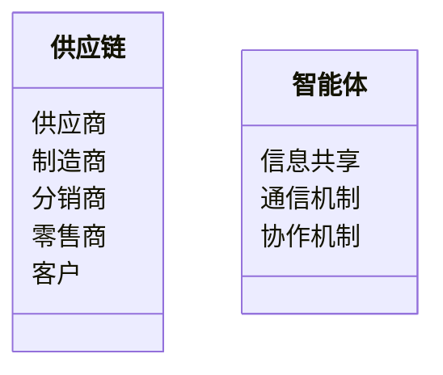
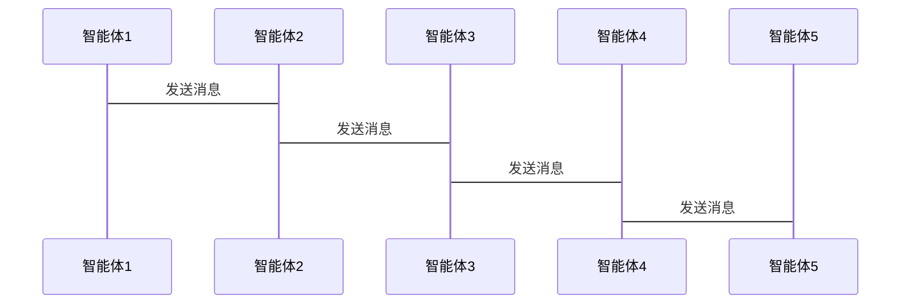

                 


# 多智能体系统在评估公司供应链韧性中的应用

> 关键词：多智能体系统，供应链韧性，供应链管理，协作算法，分布式系统

> 摘要：本文探讨了多智能体系统（MAS）在评估公司供应链韧性中的应用。通过分析供应链韧性的关键指标和多智能体系统的协作机制，提出了一种基于MAS的供应链韧性评估模型，并详细介绍了算法实现和系统架构设计。通过实际案例分析，展示了MAS在供应链韧性评估中的优势和应用效果。

---

# 第一部分: 多智能体系统与供应链韧性概述

## 第1章: 多智能体系统与供应链韧性概述

### 1.1 供应链韧性的定义与重要性

#### 1.1.1 供应链韧性的定义
供应链韧性是指供应链在面对外部干扰（如自然灾害、疫情、市场波动等）时，能够保持连续性、恢复性和适应性的能力。一个有韧性的供应链能够在危机发生时迅速响应，减少损失，并快速恢复正常运营。

#### 1.1.2 供应链韧性的重要性
供应链韧性是企业生存和发展的关键能力。在全球化背景下，供应链的复杂性和不确定性不断增加，企业需要具备应对突发事件的能力，以确保供应链的稳定性和高效性。

#### 1.1.3 供应链韧性的影响因素
供应链韧性的影响因素包括：
- **供应商的多样性**：依赖单一供应商会增加风险。
- **物流网络的弹性**：物流环节中断会影响整个供应链。
- **库存管理**：合理的库存水平能够应对突发事件。
- **信息共享机制**：信息透明化有助于快速决策。
- **应急计划**：完善的应急预案能够有效降低风险。

### 1.2 多智能体系统（MAS）的基本概念

#### 1.2.1 多智能体系统的定义
多智能体系统（Multi-Agent System, MAS）是由多个独立但相互协作的智能体组成的系统。这些智能体能够通过通信和协作完成复杂的任务。

#### 1.2.2 多智能体系统的特点
多智能体系统具有以下特点：
- **分布式性**：智能体分布在网络中，没有集中控制节点。
- **协作性**：智能体之间通过协作完成共同目标。
- **自主性**：每个智能体都有一定的自主决策能力。
- **反应性**：智能体能够实时感知环境变化并做出反应。

#### 1.2.3 多智能体系统在供应链中的优势
多智能体系统在供应链管理中的优势包括：
- **分布式决策**：能够快速响应局部问题。
- **协作能力强**：智能体之间可以高效协作，优化整体供应链效率。
- **适应性高**：能够灵活应对供应链中的各种变化。

### 1.3 本章小结
本章介绍了供应链韧性的定义、重要性和影响因素，以及多智能体系统的定义、特点和在供应链管理中的优势。通过这些内容，读者可以理解MAS在供应链韧性评估中的应用背景和潜力。

---

## 第2章: 多智能体系统的原理与架构

### 2.1 多智能体系统的原理

#### 2.1.1 智能体的定义与分类
智能体（Agent）是指能够感知环境并采取行动以实现目标的实体。智能体可以分为：
- **反应式智能体**：基于当前感知做出反应。
- **认知式智能体**：具有推理和规划能力。

#### 2.1.2 多智能体系统的通信机制
多智能体系统中的通信机制是智能体之间共享信息的桥梁。通信机制包括：
- **消息传递**：智能体通过发送消息进行交流。
- **共享数据库**：多个智能体共享同一数据库。

#### 2.1.3 多智能体系统的协作机制
协作机制是多智能体系统的核心，主要包括：
- **任务分配**：智能体根据自身能力和任务需求分配任务。
- **协作协议**：智能体之间通过协议达成一致行动。
- **冲突解决**：在协作过程中，智能体可能会出现冲突，需要通过协商或仲裁机制解决。

#### 2.1.4 多智能体系统的属性特征对比表

| 属性 | 单一智能体 | 多智能体系统 |
|------|------------|--------------|
| 独立性 | 高 | 高 |
| 协作性 | 低 | 高 |
| 反应性 | 高 | 高 |
| 资源共享 | 低 | 高 |

### 2.2 多智能体系统的架构设计

#### 2.2.1 分层架构
分层架构将多智能体系统分为多个层次，每个层次负责不同的功能。例如：
- **感知层**：负责收集环境信息。
- **决策层**：负责制定决策。
- **执行层**：负责执行决策。

#### 2.2.2 分布式架构
分布式架构将智能体分布在网络中，每个智能体负责一部分功能。这种架构具有高度的并行性和灵活性。

#### 2.2.3 集中式架构
集中式架构有一个中央控制节点，负责协调和管理所有智能体。这种架构适用于任务简单且需要统一控制的场景。

### 2.3 多智能体系统的核心算法

#### 2.3.1 协作算法
协作算法是多智能体系统中智能体之间协作的核心算法。常见的协作算法包括：
- **分布式协作算法**：智能体之间通过协商达成一致。
- **层次化协作算法**：将协作任务分解成多个层次。

#### 2.3.2 调度算法
调度算法用于智能体之间的任务分配和资源调度。常见的调度算法包括：
- **轮询调度**：按顺序分配任务。
- **负载均衡调度**：根据负载情况动态分配任务。

#### 2.3.3 通信协议
通信协议是智能体之间通信的规则。常见的通信协议包括：
- **HTTP/REST**：基于HTTP的RESTful API。
- **WebSocket**：实时通信协议。

### 2.4 本章小结
本章详细介绍了多智能体系统的原理、架构和核心算法。通过理解这些内容，读者可以更好地理解MAS在供应链韧性评估中的应用。

---

## 第3章: 供应链韧性评估的多智能体系统模型

### 3.1 供应链韧性评估的指标体系

#### 3.1.1 供应链的弹性
弹性是指供应链在面对外部干扰时的适应能力。弹性包括：
- **恢复时间**：供应链在中断后恢复的时间。
- **恢复成本**：供应链恢复所需的成本。

#### 3.1.2 供应链的恢复能力
恢复能力是指供应链在中断后恢复到正常状态的能力。恢复能力包括：
- **应急响应能力**：供应链在中断时的应急响应能力。
- **资源冗余**：供应链是否有冗余资源。

#### 3.1.3 供应链的抗风险能力
抗风险能力是指供应链在面对各种风险时的抵抗能力。抗风险能力包括：
- **风险识别能力**：供应链是否能够识别潜在风险。
- **风险应对能力**：供应链是否能够有效应对风险。

### 3.2 多智能体系统在供应链韧性评估中的角色

#### 3.2.1 智能体的分工与协作
在供应链韧性评估中，多智能体系统中的智能体可以分工协作，分别负责不同的任务。例如：
- **供应商智能体**：负责监控供应商的供应能力。
- **物流智能体**：负责监控物流环节的状态。
- **库存智能体**：负责监控库存水平。

#### 3.2.2 智能体的信息共享机制
信息共享机制是多智能体系统中智能体协作的基础。信息共享机制包括：
- **信息共享协议**：智能体之间共享信息的规则。
- **信息共享平台**：智能体之间共享信息的平台。

#### 3.2.3 智能体的决策机制
决策机制是智能体根据共享信息做出决策的过程。决策机制包括：
- **基于规则的决策**：根据预定义的规则做出决策。
- **基于推理的决策**：根据推理和分析做出决策。

### 3.3 多智能体系统模型的构建

#### 3.3.1 模型的设计思路
多智能体系统模型的设计思路包括：
1. 确定智能体的分工和职责。
2. 设计智能体之间的通信机制。
3. 设计智能体的协作机制。

#### 3.3.2 模型的实现框架
模型的实现框架包括：
- **智能体开发框架**：如Java Agent Development Framework (JADE)。
- **通信框架**：如HTTP/REST或WebSocket。
- **协作框架**：如分布式协作算法。

#### 3.3.3 模型的验证与优化
模型的验证与优化包括：
- **验证**：通过实际数据验证模型的有效性。
- **优化**：根据验证结果优化模型的性能。

### 3.4 本章小结
本章介绍了供应链韧性评估的指标体系，以及多智能体系统在供应链韧性评估中的角色和模型构建。通过这些内容，读者可以理解MAS在供应链韧性评估中的应用。

---

## 第4章: 多智能体协作算法的设计与实现

### 4.1 协作算法的设计原理

#### 4.1.1 协作目标的定义
协作目标是指智能体协作要实现的目标。例如，在供应链韧性评估中，协作目标可能是最小化供应链中断的风险。

#### 4.1.2 协作规则的制定
协作规则是指智能体在协作过程中需要遵守的规则。例如，智能体在共享信息时需要遵循一定的格式和规则。

#### 4.1.3 协作效果的评估
协作效果的评估是指对智能体协作效果的评价。例如，可以通过供应链中断的时间和成本来评估协作效果。

### 4.2 协作算法的实现步骤

#### 4.2.1 算法初始化
算法初始化包括：
1. 确定智能体的数量和类型。
2. 初始化智能体的状态和目标。

#### 4.2.2 智能体的通信与协作
智能体的通信与协作包括：
1. 智能体之间通过通信机制共享信息。
2. 智能体根据共享信息制定协作计划。

#### 4.2.3 算法的终止条件
算法的终止条件包括：
1. 达到预设的终止时间。
2. 达到预设的协作目标。

### 4.3 协作算法的数学模型

#### 4.3.1 协作目标的数学表达
协作目标的数学表达可以表示为：
$$ \text{Minimize } \sum_{i=1}^{n} t_i $$
其中，$t_i$ 是智能体 $i$ 的协作时间。

#### 4.3.2 协作规则的数学表达
协作规则的数学表达可以表示为：
$$ \text{If } x \text{ then } y $$
其中，$x$ 是协作规则的条件，$y$ 是协作规则的结论。

#### 4.3.3 协作效果的数学评估
协作效果的数学评估可以表示为：
$$ \text{Score} = \frac{\text{成功协作次数}}{\text{总协作次数}} $$

### 4.4 本章小结
本章详细介绍了多智能体协作算法的设计与实现，包括协作目标、协作规则、协作效果评估以及算法实现步骤。通过理解这些内容，读者可以掌握MAS协作算法的核心原理。

---

## 第5章: 供应链韧性评估的系统分析与架构设计

### 5.1 问题场景介绍
在供应链韧性评估中，企业需要实时监控供应链的各个环节，识别潜在风险，并制定应急计划。传统的供应链管理方法往往依赖于单一的优化模型，难以应对多变的市场环境和复杂的协同关系。

### 5.2 系统功能设计

#### 5.2.1 领域模型设计
领域模型设计可以通过Mermaid类图展示供应链中的各个实体及其关系。例如：


#### 5.2.2 系统架构设计
系统架构设计可以通过Mermaid架构图展示系统的整体结构。例如：
```mermaid
archi
    系统: 供应链韧性评估系统
    前端: Web界面
    后端: 服务层
    数据库: 关系型数据库
    智能体1: 供应商智能体
    智能体2: 制造商智能体
    智能体3: 分销商智能体
    智能体4: 零售商智能体
    智能体5: 客户智能体
    前端 --> 服务层: HTTP请求
    服务层 --> 数据库: 数据查询
    供应商智能体 --> 制造商智能体: 信息共享
    制造商智能体 --> 分销商智能体: 信息共享
    分销商智能体 --> 零售商智能体: 信息共享
    零售商智能体 --> 客户智能体: 信息共享
```

#### 5.2.3 接口设计
接口设计包括：
- **API接口**：智能体之间通过API接口进行通信。
- **消息队列**：智能体之间通过消息队列进行异步通信。

#### 5.2.4 交互流程
交互流程可以通过Mermaid序列图展示。例如：


### 5.3 本章小结
本章详细介绍了供应链韧性评估的系统分析与架构设计，包括问题场景、系统功能设计、系统架构设计、接口设计和交互流程。通过理解这些内容，读者可以掌握MAS在供应链韧性评估中的系统设计方法。

---

## 第6章: 项目实战——供应链韧性评估系统实现

### 6.1 环境安装
项目实战需要安装以下环境：
- **Python**：3.8及以上版本。
- **JADE**：Java Agent Development Framework。
- **PostgreSQL**：关系型数据库。
- **Flask**：Web框架。

### 6.2 系统核心实现源代码

#### 6.2.1 智能体开发代码
```python
from jade import Agent

class SupplyChainAgent(Agent):
    def setup(self):
        self.add_behavior(InformBehavior())
        self.add_behavior(RequestBehavior())
```

#### 6.2.2 通信机制代码
```python
import requests

def send_message(message):
    response = requests.post('http://localhost:5000/api', json=message)
    return response.json()
```

#### 6.2.3 协作算法代码
```python
def collaborate(supply_chain_agents):
    for agent in supply_chain_agents:
        agent.send_message("协作开始")
    return "协作完成"
```

### 6.3 代码应用解读与分析
1. **智能体开发代码**：通过JADE框架开发智能体，实现智能体的初始化和行为添加。
2. **通信机制代码**：通过HTTP请求实现智能体之间的消息传递。
3. **协作算法代码**：通过循环遍历所有智能体，发送协作开始消息，并返回协作完成消息。

### 6.4 实际案例分析
以某汽车制造企业的供应链为例，通过MAS评估供应链韧性，优化供应商选择、物流路线和库存管理，降低供应链中断风险。

### 6.5 本章小结
本章通过项目实战，详细介绍了供应链韧性评估系统的实现过程，包括环境安装、核心代码实现、案例分析等。通过实际案例，读者可以理解MAS在供应链韧性评估中的实际应用。

---

## 第7章: 总结与展望

### 7.1 最佳实践 tips
- 在实际应用中，建议企业根据自身需求选择合适的MAS框架和算法。
- 定期更新和优化MAS模型，以适应不断变化的市场环境。

### 7.2 本章小结
本文详细探讨了多智能体系统在评估公司供应链韧性中的应用，提出了基于MAS的供应链韧性评估模型，并通过实际案例分析展示了MAS在供应链韧性评估中的优势和应用效果。

### 7.3 注意事项
- 在实际应用中，需要考虑数据隐私和安全问题。
- 在MAS模型中，需要合理设计智能体的分工和协作机制，以确保系统的高效性和可靠性。

### 7.4 拓展阅读
建议读者进一步阅读以下内容：
- 多智能体系统的经典论文和书籍。
- 供应链管理的相关文献。
- 大规模分布式系统的实现技术。

---

# 结语

通过本文的探讨，读者可以深入理解多智能体系统在供应链韧性评估中的应用，并将其应用于实际项目中。未来，随着人工智能和分布式系统技术的不断发展，MAS在供应链管理中的应用将更加广泛和深入。

---

> 本文内容遵循[CC BY-NC-SA 4.0](https://creativecommons.org/licenses/by-nc-sa/4.0/)协议，转载请注明出处。

