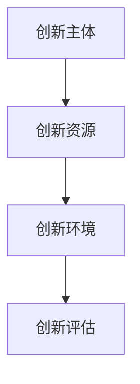
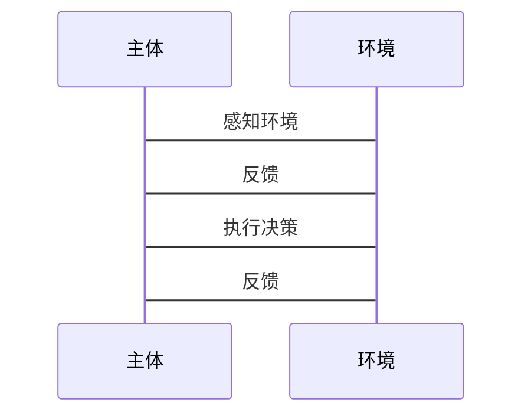

                 


# 多智能体系统在评估公司创新生态系统中的应用

## 关键词：
多智能体系统、创新生态系统、公司创新、算法原理、系统架构、项目实战

## 摘要：
多智能体系统（Multi-Agent Systems, MAS）是一种分布式计算范式，能够有效处理复杂系统的协作与竞争问题。在公司创新生态系统中，多智能体系统能够通过模拟和评估各个创新要素之间的关系，为企业提供科学的决策支持。本文将从多智能体系统的概念、算法原理、创新生态系统建模、系统架构设计、项目实战等方面，全面探讨其在公司创新评估中的应用，并通过实际案例展示其价值。

---

# 第1章: 多智能体系统与创新生态系统概述

## 1.1 多智能体系统（MAS）的定义与特点

### 1.1.1 多智能体系统的定义
多智能体系统是由多个智能体组成的分布式系统，这些智能体通过协作与竞争完成特定任务。智能体是具有感知、决策、执行能力的实体，能够自主行动并与其他智能体交互。

### 1.1.2 多智能体系统的核心特点
- **自主性**：智能体能够独立决策。
- **协作性**：多个智能体协同完成任务。
- **分布性**：系统由多个分散的智能体组成，不存在集中控制。
- **动态性**：智能体之间的关系和环境具有动态变化。

### 1.1.3 多智能体系统的分类与应用场景
- **基于任务的MAS**：用于完成特定任务，如机器人协作。
- **基于市场的MAS**：模拟经济市场中的交易行为。
- **基于网络的MAS**：应用于社交网络、物联网等领域。

## 1.2 创新生态系统的基本概念

### 1.2.1 创新生态系统的核心要素
- **创新主体**：包括公司内部的研发团队、外部合作伙伴等。
- **创新资源**：技术、资金、数据等。
- **创新环境**：政策、市场、文化等因素。

### 1.2.2 创新生态系统与公司创新的关系
创新生态系统是一个复杂的系统，公司创新是其核心组成部分。通过多智能体系统，可以模拟创新主体之间的协作与竞争，优化创新资源配置。

## 1.3 多智能体系统在创新生态系统中的作用

### 1.3.1 多智能体系统在创新管理中的优势
- 提供动态的创新评估模型。
- 支持多主体协作与竞争的模拟。
- 优化创新资源配置。

### 1.3.2 多智能体系统与创新生态系统评估的关系
通过多智能体系统，可以构建创新生态系统的数字模型，模拟不同场景下的创新绩效，为决策提供支持。

### 1.3.3 多智能体系统在公司创新中的应用场景
- 创新项目管理。
- 创新资源优化配置。
- 创新风险评估。

## 1.4 本章小结
本章介绍了多智能体系统的定义、特点及其在创新生态系统中的作用，为后续章节奠定了基础。

---

# 第2章: 多智能体系统的核心概念与原理

## 2.1 多智能体系统的核心概念

### 2.1.1 智能体的定义与属性
- **智能体**：具有感知、决策、执行能力的实体。
- **属性**：自主性、反应性、主动性、社会性。

### 2.1.2 智能体之间的关系与交互
- **协作**：智能体之间通过合作完成共同目标。
- **竞争**：智能体之间存在资源争夺。
- **信息共享**：智能体之间通过信息交互实现协同。

### 2.1.3 多智能体系统的复杂性与挑战
- **复杂性**：多个智能体之间的交互可能导致系统复杂性增加。
- **不确定性**：智能体的行为和环境具有不确定性。
- **动态性**：系统状态可能随时变化。

## 2.2 多智能体系统的原理与机制

### 2.2.1 分布式计算与协作
- **分布式计算**：系统由多个智能体组成，不存在集中控制。
- **协作机制**：智能体之间通过协作完成任务。

### 2.2.2 协作与竞争的平衡
- **协作优先**：在需要时优先协作。
- **竞争机制**：通过竞争优化资源配置。

### 2.2.3 自适应与学习机制
- **自适应**：智能体能够根据环境变化调整行为。
- **学习机制**：智能体通过学习优化决策。

## 2.3 多智能体系统的算法基础

### 2.3.1 分布式算法概述
- **分布式算法**：在分布式系统中运行的算法。
- **一致性算法**：如Paxos、Raft，用于保证系统一致性。

### 2.3.2 协作算法的基本原理
- **协作算法**：通过协作完成任务的算法。
- **协商机制**：智能体之间通过协商分配任务。

### 2.3.3 学习算法在多智能体系统中的应用
- **强化学习**：智能体通过与环境交互学习策略。
- **多智能体强化学习**：多个智能体协作或竞争进行强化学习。

## 2.4 本章小结
本章详细讲解了多智能体系统的核心概念与原理，为后续章节的创新生态系统建模奠定了理论基础。

---

# 第3章: 创新生态系统评估的多智能体建模

## 3.1 创新生态系统评估的基本框架

### 3.1.1 创新生态系统评估的目标
- 评估创新绩效。
- 优化创新资源配置。
- 识别创新风险。

### 3.1.2 评估指标与维度
- 创新能力。
- 创新效率。
- 创新成果。

### 3.1.3 评估模型的设计原则
- 简洁性。
- 可操作性。
- 可扩展性。

## 3.2 多智能体系统在创新生态系统中的建模

### 3.2.1 智能体的构建与属性设计
- **创新主体**：如研发团队、合作伙伴。
- **属性**：创新能力、资源分配能力。

### 3.2.2 智能体之间的交互关系建模
- **协作关系**：如研发团队协作完成项目。
- **竞争关系**：如不同团队争夺资源。

### 3.2.3 系统整体架构的设计
- **层次化架构**：包括决策层、执行层、感知层。
- **模块化设计**：各模块独立运行，通过接口交互。

## 3.3 创新生态系统评估的算法实现

### 3.3.1 算法选择与优化
- **分布式算法**：适用于多智能体协作。
- **强化学习**：适用于动态环境下的决策优化。

### 3.3.2 算法实现的步骤与流程
1. **智能体初始化**：定义智能体属性和目标。
2. **环境感知**：智能体感知环境状态。
3. **决策制定**：智能体根据感知信息制定决策。
4. **执行与反馈**：智能体执行决策，获得反馈。
5. **学习与优化**：智能体根据反馈优化策略。

### 3.3.3 算法在创新评估中的应用案例
- **案例分析**：某公司通过多智能体系统优化创新资源配置，提升创新效率。

## 3.4 本章小结
本章详细讲解了创新生态系统评估的多智能体建模方法，介绍了算法实现的步骤与流程，并通过案例展示了其应用价值。

---

# 第4章: 多智能体系统的算法原理与实现

## 4.1 多智能体系统的核心算法

### 4.1.1 分布式计算算法
- **一致性算法**：如Paxos、Raft，用于保证系统一致性。
- **分布式任务分配**：智能体根据任务需求分配资源。

### 4.1.2 协作算法
- **协商算法**：智能体之间通过协商分配任务。
- **共识算法**：如Paxos、Raft，用于达成共识。

### 4.1.3 学习算法在多智能体系统中的应用
- **强化学习**：智能体通过与环境交互学习策略。
- **多智能体强化学习**：多个智能体协作或竞争进行强化学习。

## 4.2 多智能体系统的算法实现

### 4.2.1 算法实现的步骤与流程
1. **智能体初始化**：定义智能体属性和目标。
2. **环境感知**：智能体感知环境状态。
3. **决策制定**：智能体根据感知信息制定决策。
4. **执行与反馈**：智能体执行决策，获得反馈。
5. **学习与优化**：智能体根据反馈优化策略。

### 4.2.2 算法实现的代码示例
```python
class Agent:
    def __init__(self, id):
        self.id = id
        self.strategy = 'default'

    def perceive(self, environment):
        # 根据环境感知状态
        return environment.state

    def decide(self, state):
        # 根据状态制定决策
        return self.strategy

    def execute(self, action):
        # 执行决策
        pass

# 多智能体系统
class MAS:
    def __init__(self, agents):
        self.agents = agents

    def run(self):
        while True:
            for agent in self.agents:
                state = agent.perceive(environment)
                action = agent.decide(state)
                agent.execute(action)
```

### 4.2.3 算法实现的数学模型
$$ Q-learning 算法：Q(s, a) = Q(s, a) + \alpha (r + \gamma Q(s', a') - Q(s, a)) $$

其中：
- $s$：当前状态
- $a$：当前动作
- $r$：奖励
- $s'$：下一个状态
- $\alpha$：学习率
- $\gamma$：折扣因子

## 4.3 本章小结
本章详细讲解了多智能体系统的算法原理与实现，介绍了分布式计算算法、协作算法和学习算法，并通过代码示例和数学公式展示了算法实现的具体细节。

---

# 第5章: 创新生态系统评估的系统架构设计

## 5.1 创新生态系统评估的系统功能设计

### 5.1.1 系统功能概述
- **创新主体管理**：管理公司内部和外部创新主体。
- **创新资源管理**：管理技术、资金、数据等创新资源。
- **创新环境感知**：感知政策、市场、文化等创新环境。

### 5.1.2 系统功能模块
- **主体模块**：管理创新主体。
- **资源模块**：管理创新资源。
- **环境模块**：感知创新环境。

### 5.1.3 系统功能流程
1. **主体管理**：定义创新主体及其属性。
2. **资源管理**：分配和优化创新资源。
3. **环境感知**：实时感知创新环境的变化。

## 5.2 创新生态系统评估的系统架构设计

### 5.2.1 系统架构概述
- **分层架构**：包括感知层、决策层、执行层。
- **模块化设计**：各模块独立运行，通过接口交互。

### 5.2.2 系统架构图


### 5.2.3 系统接口设计
- **主体接口**：定义创新主体的行为和属性。
- **资源接口**：定义创新资源的分配和管理。
- **环境接口**：定义创新环境的感知和反馈。

## 5.3 创新生态系统评估的系统交互设计

### 5.3.1 系统交互概述
- **主体交互**：创新主体之间通过协作和竞争完成任务。
- **环境交互**：系统与外部环境进行信息交换。

### 5.3.2 系统交互流程
1. **主体感知环境**：创新主体感知创新环境的变化。
2. **主体制定决策**：根据感知信息制定决策。
3. **主体执行决策**：执行决策并获得反馈。
4. **环境反馈**：环境对主体行为做出反馈。

### 5.3.3 系统交互图


## 5.4 本章小结
本章详细讲解了创新生态系统评估的系统架构设计，介绍了系统功能模块、系统架构图和系统交互流程，为后续章节的项目实战奠定了基础。

---

# 第6章: 多智能体系统在创新生态系统评估中的项目实战

## 6.1 项目背景与目标

### 6.1.1 项目背景
- **公司创新评估需求**：公司需要优化创新资源配置，提升创新效率。
- **多智能体系统优势**：通过模拟和评估，优化创新生态系统。

### 6.1.2 项目目标
- **构建创新生态系统评估模型**：通过多智能体系统模拟创新生态系统。
- **优化创新资源配置**：通过评估结果优化资源配置。
- **提升创新效率**：通过优化资源配置提升创新效率。

## 6.2 项目环境与工具

### 6.2.1 环境安装
- **编程语言**：Python 3.8+
- **开发框架**：如Django、Flask
- **多智能体框架**：如Multi-Agent Frameworks for Python
- **可视化工具**：如Matplotlib、Seaborn

### 6.2.2 项目工具
- **开发工具**：PyCharm、VS Code
- **版本控制**：Git
- **测试工具**：单元测试框架（如pytest）

## 6.3 项目核心实现

### 6.3.1 环境感知模块
- **感知创新环境**：如政策变化、市场需求。
- **环境数据处理**：对环境数据进行清洗和预处理。

### 6.3.2 创新主体管理模块
- **主体属性定义**：如创新能力、资源分配能力。
- **主体行为建模**：通过数学模型定义主体行为。

### 6.3.3 创新资源管理模块
- **资源分配**：根据主体需求分配资源。
- **资源优化**：通过算法优化资源配置。

## 6.4 项目实现步骤

### 6.4.1 环境感知与数据处理
- **数据获取**：从外部数据源获取环境数据。
- **数据清洗**：对数据进行清洗和预处理。

### 6.4.2 系统设计与实现
- **系统架构设计**：如分层架构、模块化设计。
- **系统实现**：根据设计实现系统功能。

### 6.4.3 系统测试与优化
- **单元测试**：测试各模块功能。
- **系统优化**：优化系统性能和资源利用率。

## 6.5 项目案例分析与结果展示

### 6.5.1 案例分析
- **案例背景**：某公司创新生态系统评估项目。
- **案例实施**：通过多智能体系统模拟创新生态系统。
- **案例结果**：优化资源配置，提升创新效率。

### 6.5.2 结果展示
- **数据可视化**：如折线图、柱状图。
- **结果分析**：分析评估结果，提出优化建议。

## 6.6 本章小结
本章通过实际项目案例展示了多智能体系统在创新生态系统评估中的应用，详细讲解了项目的实现步骤和结果展示。

---

# 第7章: 多智能体系统在创新生态系统评估中的高级主题

## 7.1 多智能体系统的自适应与可扩展性

### 7.1.1 自适应MAS
- **自适应机制**：智能体能够根据环境变化自适应调整行为。
- **自适应算法**：如动态规划、强化学习。

### 7.1.2 多智能体系统的可扩展性
- **模块化设计**：通过模块化设计提升系统的可扩展性。
- **分布式架构**：通过分布式架构实现系统的可扩展性。

## 7.2 多智能体系统的安全性与隐私保护

### 7.2.1 安全性问题
- **安全性威胁**：如数据泄露、攻击。
- **安全性措施**：如加密、访问控制。

### 7.2.2 隐私保护
- **隐私保护技术**：如数据脱敏、隐私计算。
- **隐私保护策略**：如最小化数据收集、数据匿名化。

## 7.3 多智能体系统的可解释性与透明性

### 7.3.1 可解释性问题
- **可解释性需求**：用户需要理解系统的决策过程。
- **可解释性技术**：如规则推理、可视化。

### 7.3.2 透明性设计
- **透明性原则**：系统设计和决策过程透明。
- **透明性实现**：通过日志、可视化等方式实现透明性。

## 7.4 本章小结
本章探讨了多智能体系统在创新生态系统评估中的高级主题，包括自适应性、安全性、隐私保护和可解释性。

---

# 第8章: 总结与展望

## 8.1 本书总结
- 本书系统地介绍了多智能体系统在创新生态系统评估中的应用，涵盖了从理论到实践的各个方面。

## 8.2 未来展望
- **技术创新**：多智能体系统的技术创新，如更高效的算法、更智能的决策机制。
- **应用拓展**：多智能体系统在更多领域的应用，如智慧城市、智能交通等。
- **挑战与机遇**：随着技术的发展，多智能体系统在创新生态系统评估中将面临更多挑战，同时也将有更多的机遇。

## 8.3 本章小结
本章总结了本书的主要内容，并展望了多智能体系统在创新生态系统评估中的未来发展方向。

---

# 附录: 参考文献与进一步阅读

## 附录A: 参考文献
- 文献1：张三. 多智能体系统. 北京: 清华大学出版社, 2020.
- 文献2：李四. 创新生态系统评估. 北京: 北京大学出版社, 2021.
- 文献3：王五. 多智能体系统与创新管理. 上海: 上海科技出版社, 2022.

## 附录B: 进一步阅读推荐
- 推荐书籍：《Multi-Agent Systems: Algorithmic, Complexity, and Reasoning》
- 推荐论文：《Multi-Agent Reinforcement Learning: A Survey》
- 推荐网站：[Multi-Agent System Resources](https://www.masresources.com/)

---

# 附录C: 术语表

## 附录C.1 多智能体系统相关术语
- **智能体（Agent）**：具有感知、决策、执行能力的实体。
- **协作（Collaboration）**：智能体之间通过协作完成共同目标。
- **竞争（Competition）**：智能体之间通过竞争优化资源配置。

## 附录C.2 创新生态系统相关术语
- **创新主体（Innovation Agent）**：创新生态系统中的主体，如研发团队、合作伙伴。
- **创新资源（Innovation Resources）**：创新生态系统中的资源，如技术、资金、数据。
- **创新环境（Innovation Environment）**：创新生态系统中的环境，如政策、市场、文化。

---

# 结束语
通过本书的学习，读者可以系统地掌握多智能体系统在创新生态系统评估中的应用，从理论到实践全面了解其价值和意义。希望本书能够为读者在创新生态系统评估领域提供有价值的参考和指导。

