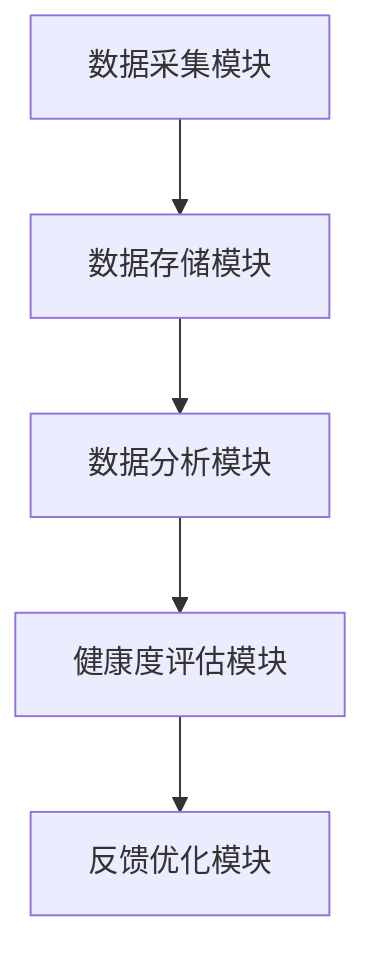

                 


# 多智能体系统在评估公司创新生态系统健康度中的应用

> 关键词：多智能体系统、创新生态系统、健康度评估、系统架构、算法原理

> 摘要：本文探讨了多智能体系统（MAS）在评估公司创新生态系统健康度中的应用。通过分析创新生态系统的核心要素，提出了基于MAS的健康度评估方法，详细讲解了算法原理和系统架构设计，结合实际案例，展示了MAS在提升创新生态系统健康度中的潜力。

---

# 第一部分: 多智能体系统与创新生态系统健康度评估背景

## 第1章: 多智能体系统概述

### 1.1 多智能体系统的基本概念

#### 1.1.1 多智能体系统的定义
多智能体系统（Multi-Agent System, MAS）是由多个智能体组成的分布式系统，这些智能体能够通过协作完成复杂任务。智能体具备感知环境、自主决策和学习的能力，能够与其他智能体或环境进行交互。

#### 1.1.2 多智能体系统的特征
- **分布性**：智能体独立运行，无中心控制。
- **协作性**：通过协调完成共同目标。
- **反应性**：能够实时感知环境变化并调整行为。
- **主动性**：智能体主动采取行动，而非被动响应。

#### 1.1.3 多智能体系统的分类
- **基于任务的MAS**：智能体协作完成特定任务。
- **基于市场的MAS**：智能体通过市场机制进行资源分配。
- **基于目标的MAS**：智能体通过合作达成共同目标。

### 1.2 公司创新生态系统概述

#### 1.2.1 创新生态系统的核心要素
- **企业**：包括研发中心、产品部门等。
- **研发团队**：负责技术创新和产品开发。
- **合作伙伴**：供应商、客户和第三方开发者。
- **市场环境**：包括行业趋势和竞争态势。
- **技术基础设施**：支持创新的技术平台和工具。

#### 1.2.2 创新生态系统与公司健康度的关系
创新生态系统的健康度反映公司的技术创新能力、市场适应能力和持续发展能力。健康的创新生态系统能够提升公司竞争力，增强市场地位。

### 1.3 创新生态系统健康度评估的意义

#### 1.3.1 评估健康度的目的
- 识别创新生态系统中的潜在问题。
- 优化资源配置，提升创新效率。
- 提前预测和应对潜在风险。

#### 1.3.2 评估健康度的挑战
- 数据获取困难：涉及多个部门和外部合作伙伴。
- 动态性：创新生态系统随市场变化不断调整。
- 复杂性：涉及多个因素的相互作用。

#### 1.3.3 评估健康度的潜在价值
- 为管理层提供决策支持。
- 优化创新流程，降低创新成本。
- 提升公司整体竞争力。

---

## 第2章: 多智能体系统在创新生态系统中的应用

### 2.1 多智能体系统与创新生态系统的关系

#### 2.1.1 多智能体系统如何影响创新生态系统
- **信息共享**：智能体之间共享知识和资源，促进创新。
- **协作创新**：通过协作完成复杂创新任务。
- **动态调整**：根据环境变化快速调整创新策略。

#### 2.1.2 创新生态系统如何促进多智能体系统的发展
- **技术创新**：推动智能体技术的不断进步。
- **应用场景**：为智能体提供丰富的应用场景。
- **协同发展**：创新生态系统为智能体提供协同发展的平台。

### 2.2 多智能体系统在健康度评估中的核心作用

#### 2.2.1 多智能体系统在健康度评估中的优势
- **分布式评估**：通过分布式智能体实时采集数据。
- **协作性评估**：智能体协作完成复杂评估任务。
- **动态性适应**：能够快速适应环境变化。

#### 2.2.2 多智能体系统在健康度评估中的具体应用
- **数据采集**：智能体实时采集创新生态系统中的数据。
- **数据分析**：智能体协作分析数据，评估健康度。
- **反馈优化**：根据评估结果优化创新策略。

### 2.3 多智能体系统与创新生态系统健康度评估的边界

#### 2.3.1 多智能体系统在健康度评估中的适用范围
- **创新过程中的实时监控**。
- **复杂创新任务的协作评估**。
- **创新生态系统动态调整的支持**。

#### 2.3.2 多智能体系统在健康度评估中的限制
- **数据隐私问题**：涉及多个部门和外部合作伙伴的数据共享。
- **系统复杂性**：需要处理大量数据和复杂关系。
- **智能体协调问题**：智能体之间的协作可能面临协调难题。

---

## 第3章: 创新生态系统健康度评估的核心概念与联系

### 3.1 多智能体系统与创新生态系统健康度评估的核心概念

#### 3.1.1 多智能体系统的健康度评估模型
- **模型定义**：通过智能体协作评估创新生态系统健康度。
- **模型结构**：包括数据采集、分析和反馈优化模块。

#### 3.1.2 创新生态系统健康度评估的指标体系
- **技术创新指标**：包括研发投入、专利数量。
- **市场适应指标**：包括市场份额、客户满意度。
- **组织活力指标**：包括团队协作效率、员工创新积极性。

#### 3.1.3 多智能体系统与创新生态系统健康度评估的关联
- **数据驱动**：智能体通过数据驱动评估健康度。
- **协作驱动**：智能体协作完成复杂评估任务。
- **反馈驱动**：根据评估结果优化创新策略。

---

## 第4章: 创新生态系统健康度评估的算法原理

### 4.1 算法概述

#### 4.1.1 算法的核心思想
- **数据采集**：智能体实时采集创新生态系统中的数据。
- **数据预处理**：清洗和标准化数据。
- **健康度计算**：基于多因素模型计算健康度得分。

#### 4.1.2 算法的主要步骤
1. 数据采集：智能体通过传感器、日志等采集数据。
2. 数据预处理：清洗数据，去除异常值。
3. 数据分析：使用机器学习算法分析数据。
4. 健康度计算：基于分析结果计算健康度得分。
5. 反馈优化：根据健康度结果优化创新策略。

### 4.2 算法的数学模型

#### 4.2.1 健康度计算模型
$$
\text{健康度} = \sum_{i=1}^{n} w_i x_i
$$
其中，$w_i$是第i个指标的权重，$x_i$是第i个指标的得分。

#### 4.2.2 优化模型
$$
\text{目标函数} = \max \sum_{i=1}^{n} w_i x_i
$$
$$
\text{约束条件} = \sum_{i=1}^{n} w_i = 1
$$

### 4.3 算法的实现

#### 4.3.1 数据采集与预处理
```python
import pandas as pd
data = pd.read_csv('创新数据.csv')
data_clean = data.dropna().astype(float)
```

#### 4.3.2 数据分析与健康度计算
```python
from sklearn.decomposition import PCA
pca = PCA(n_components=2)
principal_components = pca.fit_transform(data_clean)
```

#### 4.3.3 反馈优化
```python
def optimize_health(principal_components):
    health_score = principal_components.sum(axis=1)
    return health_score
health_score = optimize_health(principal_components)
```

---

## 第5章: 创新生态系统健康度评估的系统架构设计

### 5.1 系统功能模块

#### 5.1.1 数据采集模块
- 采集创新生态系统中的实时数据。
- 数据格式转换和存储。

#### 5.1.2 数据分析模块
- 数据清洗和预处理。
- 使用机器学习算法进行数据分析。

#### 5.1.3 健康度评估模块
- 计算健康度得分。
- 生成评估报告。

#### 5.1.4 反馈优化模块
- 根据健康度结果优化创新策略。
- 提供优化建议。

### 5.2 系统架构设计

#### 5.2.1 系统架构图


#### 5.2.2 模块之间的交互
- 数据采集模块向数据存储模块发送数据。
- 数据分析模块从数据存储模块获取数据。
- 健康度评估模块根据分析结果生成评估报告。
- 反馈优化模块根据评估报告优化创新策略。

---

## 第6章: 项目实战

### 6.1 环境安装

#### 6.1.1 安装依赖
```bash
pip install pandas sklearn mermaid matplotlib
```

### 6.2 系统核心实现

#### 6.2.1 数据采集
```python
import pandas as pd
data = pd.read_csv('创新数据.csv')
```

#### 6.2.2 数据预处理
```python
data_clean = data.dropna().astype(float)
```

#### 6.2.3 数据分析
```python
from sklearn.decomposition import PCA
pca = PCA(n_components=2)
principal_components = pca.fit_transform(data_clean)
```

#### 6.2.4 健康度计算
```python
def calculate_health(principal_components):
    health_score = principal_components.sum(axis=1)
    return health_score
health_score = calculate_health(principal_components)
```

#### 6.2.5 反馈优化
```python
def optimize_strategy(health_score):
    optimized_strategy = []
    for score in health_score:
        if score < 0.5:
            optimized_strategy.append('优化资源配置')
        elif 0.5 <= score < 0.8:
            optimized_strategy.append('加强技术创新')
        else:
            optimized_strategy.append('保持现状')
    return optimized_strategy
optimized_strategy = optimize_strategy(health_score)
```

### 6.3 实际案例分析

#### 6.3.1 案例背景
某高科技公司面临创新生态系统健康度下降的问题，需要通过MAS进行评估和优化。

#### 6.3.2 数据分析
```python
import matplotlib.pyplot as plt
plt.scatter(principal_components[:, 0], principal_components[:, 1], c=health_score)
plt.colorbar()
plt.show()
```

#### 6.3.3 优化策略
```python
for i in range(len(optimized_strategy)):
    print(f"部门{i+1}: {optimized_strategy[i]}")
```

---

## 第7章: 最佳实践、小结与拓展阅读

### 7.1 最佳实践

#### 7.1.1 数据质量
确保数据的准确性和完整性，避免错误分析。

#### 7.1.2 模型选择
根据实际情况选择合适的算法，避免过度复杂化。

#### 7.1.3 智能体协作
优化智能体协作机制，提升评估效率。

### 7.2 小结

本文详细探讨了多智能体系统在评估公司创新生态系统健康度中的应用，从核心概念到算法实现，再到系统架构设计，提供了全面的解决方案。通过实际案例分析，展示了MAS在提升创新生态系统健康度中的潜力。

### 7.3 注意事项

- 数据隐私和安全问题需要高度重视。
- 系统设计时要考虑可扩展性和可维护性。
- 模型的可解释性和透明度需要进一步提升。

### 7.4 拓展阅读

- 《Multi-Agent Systems: Complexity Decomposition and Its Applications》
- 《Innovation Management and Strategy》
- 《Health Evaluation of Corporate Innovation Ecosystems》

---

通过以上内容，我们可以看到，多智能体系统在评估公司创新生态系统健康度中具有重要的应用价值。通过MAS，公司可以更高效地采集和分析数据，评估创新生态系统的健康度，并根据评估结果优化创新策略，提升整体竞争力。未来，随着智能体技术的不断发展，MAS在创新生态系统健康度评估中的应用将更加广泛和深入。

