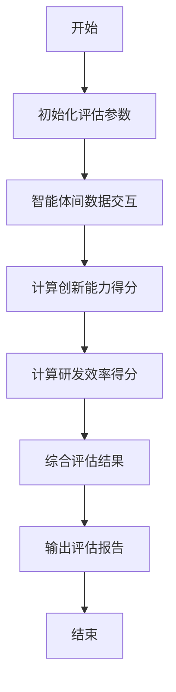
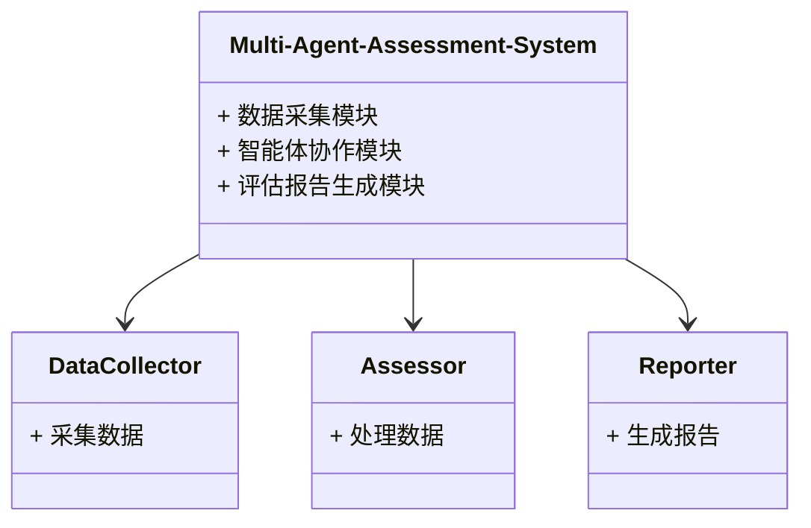

                 


# 多智能体系统在评估公司创新能力和研发效率中的应用

> **关键词**：多智能体系统、创新能力评估、研发效率、算法实现、系统架构设计

> **摘要**：  
本文探讨了多智能体系统在评估公司创新能力和研发效率中的应用。首先介绍了多智能体系统的概念和核心特征，分析了传统评估方法的局限性。然后详细阐述了多智能体系统在创新能力评估中的算法原理，通过Mermaid流程图和Python代码示例展示了评估模型的实现过程。接着，从系统架构设计、项目实战等方面，详细探讨了如何利用多智能体系统提高评估效率和准确性。最后，总结了多智能体系统在实际应用中的优势和挑战，并提出了进一步优化的方向。

---

## 第一部分: 多智能体系统与创新评估概述

### 第1章: 多智能体系统的基本概念

#### 1.1 多智能体系统的核心特征
多智能体系统（Multi-Agent System, MAS）由多个智能体组成，每个智能体具有以下核心特征：
- **自主性**：能够独立决策和行动。
- **反应性**：能够感知环境并做出实时反应。
- **协作性**：能够与其他智能体协作完成任务。
- **社会性**：智能体之间通过通信和交互形成社会关系。

#### 1.2 多智能体系统与单智能体系统的区别
| **特性**         | **单智能体系统**                | **多智能体系统**                  |
|------------------|-------------------------------|----------------------------------|
| 决策方式         | 单一决策者                     | 多个决策者协作                   |
| 信息处理         | 依赖单个信息源                 | 多个信息源交互                   |
| 任务处理         | 单任务处理                     | 多任务协作                      |
| 系统复杂度       | 简单                           | 复杂                             |

#### 1.3 多智能体系统在评估中的应用价值
- 提高评估效率：通过多个智能体协作，快速收集和处理数据。
- 增强评估准确性：多个智能体可以从不同角度分析问题，提供更全面的评估结果。
- 支持动态调整：智能体可以根据实时数据动态调整评估策略。

---

### 第2章: 创新能力与研发效率的评估需求

#### 2.1 企业创新能力的定义
创新能力是指企业在市场中通过创新产品、服务或商业模式的能力。评估创新能力的关键指标包括：
- 产品创新速度
- 研发投入占比
- 知识产权数量

#### 2.2 研发效率的衡量标准
研发效率是指企业在研发过程中投入资源与产出成果之间的比率。主要衡量标准包括：
- 人均研发产出
- 研发周期长度
- 成功项目比例

#### 2.3 传统评估方法的局限性
- 数据收集耗时：传统评估方法需要手动收集大量数据，耗时且效率低。
- 数据分析复杂：传统方法需要依赖人工分析，难以快速得出结论。
- 动态调整能力弱：传统方法难以根据实时数据动态调整评估策略。

---

## 第二部分: 多智能体系统评估模型的算法原理

### 第3章: 多智能体系统评估模型的算法流程

#### 3.1 算法流程图


#### 3.2 算法实现的Python代码示例
```python
def assess_innovation(company_data):
    # 创新能力评估算法
    innovation_score = 0.3 * company_data['研发投入'] + 0.4 * company_data['产品创新速度'] + 0.3 * company_data['知识产权数量']
    return innovation_score

def assess_efficiency(company_data):
    # 研发效率评估算法
    efficiency_score = 0.4 * company_data['人均研发产出'] + 0.3 * company_data['研发周期'] + 0.3 * company_data['成功项目比例']
    return efficiency_score

def multi_agent_assessment(company_data):
    innovation = assess_innovation(company_data)
    efficiency = assess_efficiency(company_data)
    return {'创新得分': innovation, '效率得分': efficiency}
```

#### 3.3 数学模型与公式
创新能力和研发效率的评估公式如下：
$$
\text{创新得分} = 0.3 \times R + 0.4 \times S + 0.3 \times P
$$
$$
\text{效率得分} = 0.4 \times O + 0.3 \times T + 0.3 \times C
$$
其中，$R$ 表示研发投入，$S$ 表示产品创新速度，$P$ 表示知识产权数量，$O$ 表示人均研发产出，$T$ 表示研发周期，$C$ 表示成功项目比例。

---

## 第三部分: 系统分析与架构设计

### 第4章: 系统功能设计

#### 4.1 项目场景介绍
假设某科技公司需要评估其创新能力和研发效率。公司希望利用多智能体系统快速收集和分析数据，并生成评估报告。

#### 4.2 系统功能设计
- **数据采集模块**：从数据库中提取公司数据。
- **智能体协作模块**：多个智能体协作完成数据处理和评估。
- **评估报告生成模块**：根据评估结果生成报告。

#### 4.3 系统架构设计


---

## 第四部分: 项目实战

### 第5章: 环境安装与核心代码实现

#### 5.1 环境安装
- 安装Python和必要的库（如numpy、pandas）。
- 安装Mermaid工具以生成图表。

#### 5.2 核心代码实现
```python
import numpy as np
import pandas as pd

def main():
    # 示例数据
    data = {
        '研发投入': 50,
        '产品创新速度': 80,
        '知识产权数量': 60,
        '人均研发产出': 70,
        '研发周期': 60,
        '成功项目比例': 85
    }
    
    # 评估创新得分
    innovation_score = 0.3 * data['研发投入'] + 0.4 * data['产品创新速度'] + 0.3 * data['知识产权数量']
    
    # 评估效率得分
    efficiency_score = 0.4 * data['人均研发产出'] + 0.3 * data['研发周期'] + 0.3 * data['成功项目比例']
    
    # 输出结果
    print(f"创新得分: {innovation_score}")
    print(f"效率得分: {efficiency_score}")

if __name__ == "__main__":
    main()
```

---

## 第五部分: 总结与展望

### 第6章: 总结
本文详细探讨了多智能体系统在评估公司创新能力和研发效率中的应用，通过算法实现和系统设计展示了其在实际应用中的优势。多智能体系统的引入不仅提高了评估效率，还增强了评估结果的准确性。

### 第7章: 展望
未来，随着人工智能技术的发展，多智能体系统在评估中的应用将更加广泛。可以通过引入更多的智能体协作机制，进一步优化评估模型，提高评估效率和准确性。

---

## 第六部分: 最佳实践与注意事项

### 第8章: 最佳实践
- 在实际应用中，建议结合具体业务需求，调整评估模型的参数。
- 定期更新模型，确保评估结果的准确性。

### 第9章: 注意事项
- 在使用多智能体系统时，需要注意数据的安全性和隐私保护。
- 确保智能体之间的通信和协作机制稳定可靠。

---

通过以上内容，您可以全面了解多智能体系统在公司创新能力评估和研发效率评估中的应用。希望本文能为您提供有价值的参考和启发。

