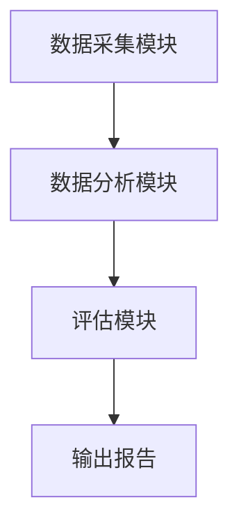
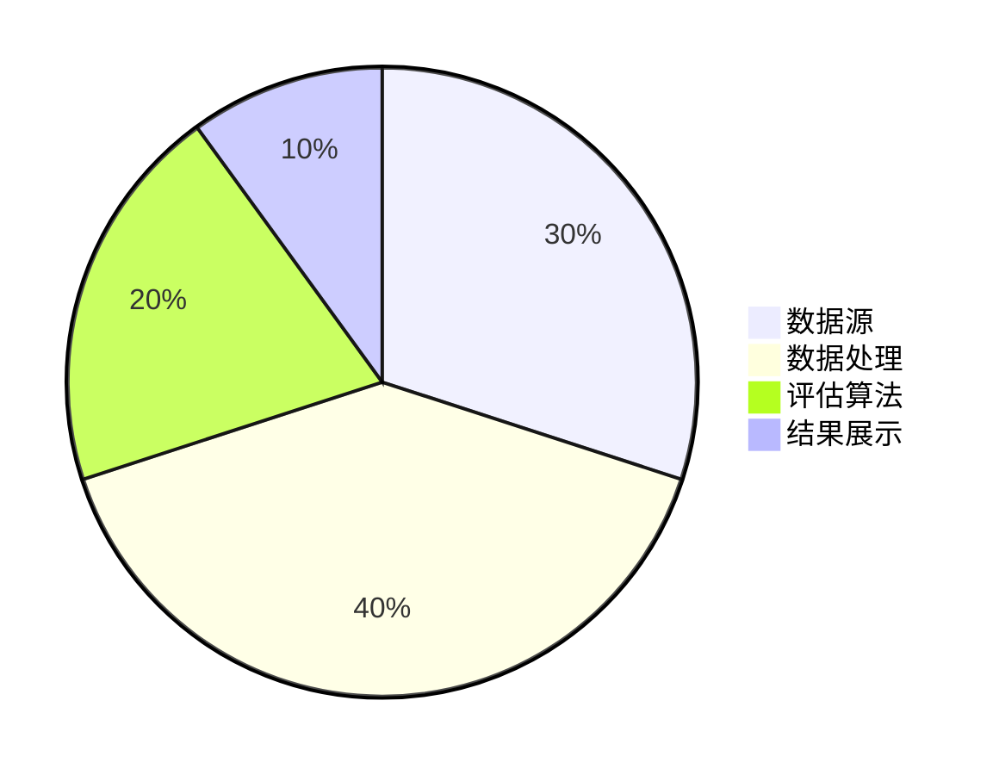
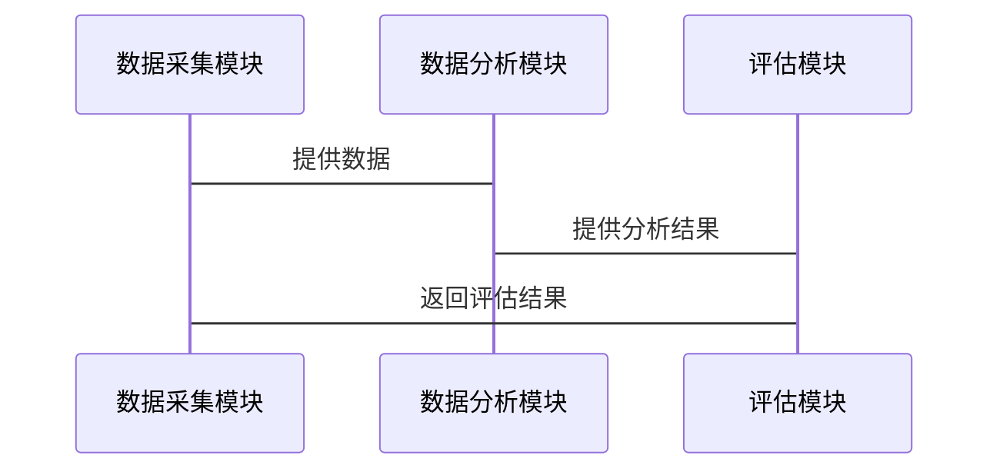

                 


# 多智能体系统在评估公司可持续发展能力中的应用

## 关键词：多智能体系统、可持续发展能力、企业评估、算法原理、系统架构

## 摘要：  
随着全球对企业可持续发展能力的关注度不断提高，如何高效、准确地评估企业的可持续发展能力成为一个重要课题。多智能体系统（Multi-Agent System, MAS）作为一种分布式、协作式的计算范式，具有天然的优势。本文将从多智能体系统的背景、核心概念、算法原理、系统架构设计、项目实战以及最佳实践等方面，详细探讨多智能体系统在企业可持续发展能力评估中的应用，为企业管理者和技术开发者提供有价值的参考。

---

## 第1章: 多智能体系统与可持续发展能力评估的背景

### 1.1 多智能体系统的定义与特点  
多智能体系统是由多个智能体组成的分布式系统，这些智能体通过协作完成复杂的任务。每个智能体都具有一定的自主性、反应性和社会性。  

**多智能体系统的三个核心特点**：  
1. **自主性**：智能体能够独立决策和行动，无需外部干预。  
2. **协作性**：多个智能体通过通信和协作完成共同目标。  
3. **分布式性**：智能体分布在不同的位置，具有局部决策能力。  

**多智能体系统的应用场景**：  
- 智能交通管理  
- 分布式计算与大数据处理  
- 智能供应链管理  

### 1.2 可持续发展能力评估的定义与标准  
企业可持续发展能力评估是对企业在经济、社会和环境三个维度上的表现进行综合评价。  

**可持续发展能力评估的主要标准**：  
1. **经济维度**：企业盈利能力、财务健康状况。  
2. **社会维度**：企业对社会的贡献，如就业机会、社会责任。  
3. **环境维度**：企业对环境的影响，如碳排放、资源消耗。  

**企业可持续发展能力评估的意义**：  
- 为企业提供改进方向。  
- 帮助投资者评估企业的长期价值。  
- 促进企业实现绿色转型。  

### 1.3 多智能体系统在可持续发展能力评估中的作用  
多智能体系统通过分布式计算和协作机制，能够高效地收集、分析和评估企业的多维度数据。  

**多智能体系统的优势**：  
1. **高效性**：通过分布式计算，提升数据处理速度。  
2. **协作性**：智能体之间的协作能够提供更全面的评估结果。  
3. **灵活性**：系统可以根据需求动态调整评估策略。  

---

## 第2章: 多智能体系统的核心概念与原理  

### 2.1 多智能体系统的组成结构  
多智能体系统由多个智能体、通信机制和协作算法组成。  

**智能体的定义与分类**：  
- **简单反射智能体**：基于当前感知做出反应。  
- **基于模型的智能体**：利用内部模型进行决策。  
- **目标驱动智能体**：根据目标采取行动。  

**多智能体系统的层次结构**：  
1. **感知层**：智能体感知环境信息。  
2. **决策层**：智能体基于感知信息做出决策。  
3. **执行层**：智能体执行决策动作。  

### 2.2 多智能体系统的通信机制  
智能体之间的通信是通过消息传递实现的。  

**通信协议与消息传递**：  
- **请求-响应模式**：智能体请求信息，接收方返回响应。  
- **发布-订阅模式**：智能体发布信息，其他智能体订阅并接收。  

**通信机制对系统性能的影响**：  
- 通信延迟可能影响系统的实时性。  
- 过多的通信开销可能降低系统的效率。  

### 2.3 多智能体系统的协作与协调  
协作机制是多智能体系统的核心。  

**协作机制的定义**：  
协作机制是指智能体之间为了共同目标而采取的协调行动。  

**协调算法的基本原理**：  
- **协商算法**：智能体通过协商确定任务分配。  
- **拍卖算法**：智能体通过拍卖机制竞争任务。  
- **承诺-协调算法**：智能体承诺完成任务，并通过协调确保任务完成。  

---

## 第3章: 多智能体系统在可持续发展能力评估中的算法原理  

### 3.1 分布式计算与多智能体协作  
分布式计算是多智能体系统的核心技术。  

**分布式计算的基本原理**：  
- 任务分解：将整体任务分解为多个子任务。  
- 子任务分配：将子任务分配给不同的智能体。  
- 子任务执行：智能体独立完成子任务。  
- 结果汇总：将子任务结果汇总，得到最终结果。  

**多智能体协作算法的实现**：  
- 基于强化学习的协作算法。  
- 基于遗传算法的协作算法。  

### 3.2 多智能体系统的优化算法  
优化算法是提升系统性能的关键。  

**基于强化学习的优化算法**：  
强化学习通过智能体与环境的交互，逐步优化策略。  

**基于遗传算法的优化方法**：  
遗传算法通过模拟生物进化，优化系统参数。  

### 3.3 算法的数学模型与公式  
**强化学习算法的数学模型**：  
$$ V(s) = \max_{a} [r + V(s') ] $$  
其中，\( V(s) \) 表示状态 \( s \) 的价值函数，\( r \) 表示奖励，\( V(s') \) 表示下一个状态的价值函数。  

**遗传算法的基本流程**：  
1. 初始化种群。  
2. 计算适应度。  
3. 选择优秀个体。  
4. 进行交叉和变异。  
5. 重复迭代。  

---

## 第4章: 可持续发展能力评估系统的架构设计  

### 4.1 问题场景介绍  
企业可持续发展能力评估需要考虑多维度的数据，包括财务数据、环境数据和社会责任数据。  

### 4.2 系统功能设计  
**系统功能设计的领域模型**：  
- 数据采集模块：采集企业的多维度数据。  
- 数据分析模块：对数据进行分析和处理。  
- 评估模块：根据分析结果生成评估报告。  

**系统架构设计的 mermaid 图**：  


### 4.3 系统架构设计  
**系统架构设计的 mermaid 图**：  


### 4.4 系统接口设计  
**系统接口设计的 mermaid 序列图**：  


---

## 第5章: 项目实战  

### 5.1 环境安装  
- 安装 Python 和相关库（如 numpy、pandas、scikit-learn）。  
- 安装多智能体系统开发框架（如 MABS）。  

### 5.2 核心代码实现  
**数据采集模块的代码示例**：  
```python
import requests

def collect_data(company_id):
    url = f"https://api.example.com/company/{company_id}/data"
    response = requests.get(url)
    return response.json()
```

**评估模块的代码示例**：  
```python
from sklearn.metrics import accuracy_score

def evaluate_performance(actual, predicted):
    return accuracy_score(actual, predicted)
```

### 5.3 案例分析  
**案例分析**：  
某公司通过多智能体系统评估其可持续发展能力，结果显示其环境维度的表现需要改进。  

### 5.4 项目小结  
通过项目实战，验证了多智能体系统在企业可持续发展能力评估中的有效性。

---

## 第6章: 最佳实践与总结  

### 6.1 最佳实践  
1. **数据质量**：确保数据的准确性和完整性。  
2. **算法选择**：根据具体需求选择合适的算法。  
3. **系统优化**：通过优化通信机制和协作算法提升系统性能。  

### 6.2 小结  
本文详细探讨了多智能体系统在企业可持续发展能力评估中的应用，从理论到实践，为相关领域提供了参考。

### 6.3 注意事项  
- 系统的安全性需要重点关注。  
- 算法的可解释性需要进一步研究。  

### 6.4 拓展阅读  
推荐阅读相关领域的书籍和论文，深入研究多智能体系统的最新进展。

---

**摘要**：  
本文系统地探讨了多智能体系统在评估公司可持续发展能力中的应用，从背景、核心概念、算法原理到系统架构设计和项目实战，为相关领域的研究和实践提供了有价值的参考。通过多智能体系统的协作与分布式计算，企业可以更高效、准确地评估其可持续发展能力，从而在竞争中占据优势。

