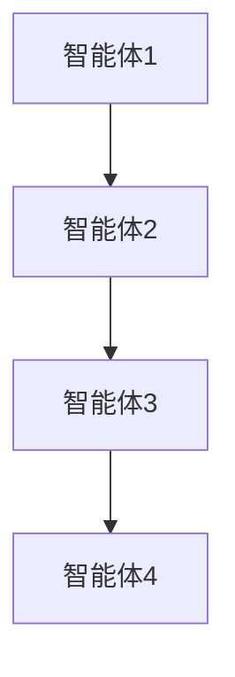
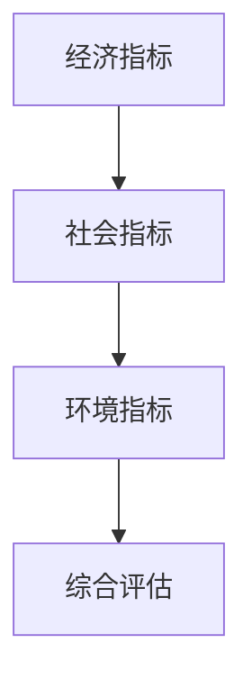
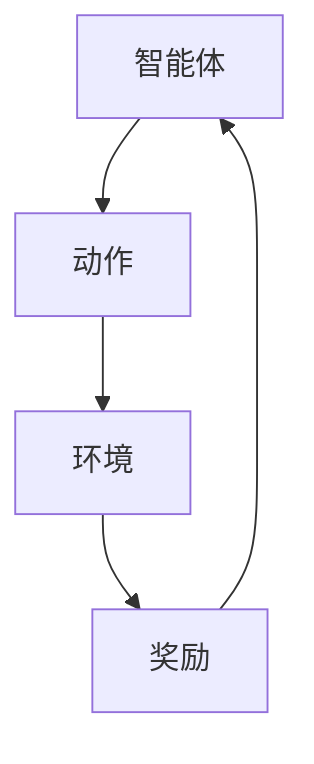
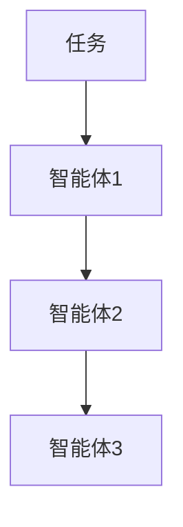
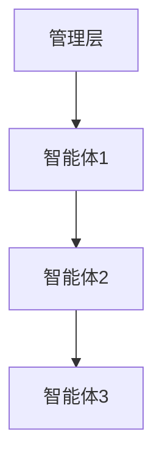
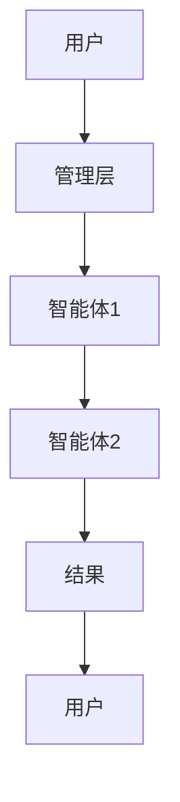

                 


# 多智能体系统在评估公司可持续发展能力中的应用

> 关键词：多智能体系统、可持续发展、企业评估、算法、系统架构

> 摘要：本文探讨了多智能体系统在评估公司可持续发展能力中的应用，分析了其核心概念、算法原理、系统架构设计以及实际案例。通过多智能体系统的协同学习和分布式计算能力，帮助企业实现更加精准和动态的可持续发展评估。

---

# 第1章: 多智能体系统与可持续发展背景

## 1.1 多智能体系统的基本概念

### 1.1.1 多智能体系统的定义
多智能体系统（Multi-Agent System，MAS）是由多个智能体（Agent）组成的分布式系统，这些智能体能够通过协同工作完成复杂的任务。每个智能体都有一定的自主性，能够感知环境、做出决策并采取行动。

### 1.1.2 多智能体系统的特征
- **自主性**：智能体能够独立决策。
- **反应性**：能够实时感知环境变化并做出反应。
- **协作性**：多个智能体协同完成任务。
- **分布性**：智能体分布在不同的位置，通过通信协作。

### 1.1.3 多智能体系统与传统单智能体系统的区别
| 特性 | 单智能体系统 | 多智能体系统 |
|------|--------------|--------------|
| 独立性 | 高 | 低 |
| 协作性 | 低 | 高 |
| 分布性 | 低 | 高 |

---

## 1.2 可持续发展的定义与评估方法

### 1.2.1 可持续发展的核心概念
可持续发展是指在满足当前需求的同时，不损害后代满足其需求的能力。在企业层面，可持续发展包括经济、社会和环境三个维度。

### 1.2.2 企业可持续发展的评估指标
- **经济指标**：盈利能力、研发投入占比。
- **社会指标**：员工满意度、社会责任履行情况。
- **环境指标**：碳排放量、资源利用率。

### 1.2.3 多智能体系统在可持续发展评估中的作用
多智能体系统能够通过分布式计算和协同学习，帮助企业实时监控和评估其可持续发展能力。

---

## 1.3 本章小结
本章介绍了多智能体系统的基本概念及其在可持续发展评估中的应用潜力，为后续章节的分析奠定了基础。

---

# 第2章: 多智能体系统的核心原理

## 2.1 多智能体系统的结构与通信机制

### 2.1.1 智能体的定义与分类
- **智能体**：能够感知环境并采取行动的实体。
- **分类**：简单反射型、基于模型的反射型、目标驱动型。

### 2.1.2 多智能体系统的通信模型


### 2.1.3 分布式计算与协作机制
多智能体系统通过分布式计算实现协作，每个智能体负责部分任务，通过通信机制共享信息。

---

## 2.2 多智能体系统的协同学习与决策

### 2.2.1 协同学习的基本原理
智能体通过共享知识和经验，共同完成复杂任务。

### 2.2.2 分布式决策的挑战与解决方案
- **挑战**：信息不完全、决策冲突。
- **解决方案**：基于博弈论的决策模型。

### 2.2.3 多智能体系统中的博弈论应用
博弈论通过分析智能体之间的策略互动，帮助制定最优决策。

---

## 2.3 多智能体系统与可持续发展的关联

### 2.3.1 可持续发展评估中的多智能体优势
- **实时性**：快速响应环境变化。
- **准确性**：通过协作提高评估精度。

### 2.3.2 多智能体系统在企业决策中的应用
- **资源分配**：优化资源配置。
- **风险评估**：预测和规避风险。

### 2.3.3 多智能体系统的动态适应性与可持续性
多智能体系统能够动态调整策略，适应可持续发展的需求。

---

## 2.4 本章小结
本章详细介绍了多智能体系统的核心原理及其在可持续发展评估中的应用优势。

---

# 第3章: 可持续发展能力评估的指标与建模方法

## 3.1 可持续发展评估的核心指标

### 3.1.1 经济指标
- 净利润
- 投资回报率

### 3.1.2 社会指标
- 员工满意度
- 社会责任履行情况

### 3.1.3 环境指标
- 能耗
- 废弃物处理

---

## 3.2 多智能体系统中的评估模型构建

### 3.2.1 指标权重的确定方法
- **层次分析法（AHP）**：通过专家评分确定权重。

### 3.2.2 多智能体协同评估模型的设计


### 3.2.3 模糊综合评价法的应用
模糊综合评价法通过模糊数学处理不确定性，提高评估结果的准确性。

---

## 3.3 本章小结
本章介绍了可持续发展评估的核心指标和多智能体系统的建模方法。

---

# 第4章: 多智能体系统中的算法与实现

## 4.1 协同学习算法

### 4.1.1 分布式协同学习的基本原理
智能体通过分布式学习，共享知识和经验。

### 4.1.2 基于多智能体的强化学习算法


### 4.1.3 联合学习与知识共享机制
通过联合学习，智能体共享知识，提高整体性能。

---

## 4.2 分布式计算与任务分配

### 4.2.1 分布式任务分配的挑战
- 信息不完全
- 计算资源限制

### 4.2.2 基于多智能体的分布式计算模型


### 4.2.3 任务分配的优化算法
- **遗传算法**：通过优化算法提高任务分配效率。

---

## 4.3 多智能体系统中的动态适应性算法

### 4.3.1 动态环境下的自适应机制
智能体根据环境变化动态调整策略。

### 4.3.2 基于反馈的动态调整算法
通过反馈机制，智能体实时调整行为。

### 4.3.3 多智能体系统的鲁棒性设计
通过冗余设计和容错机制，提高系统的鲁棒性。

---

## 4.4 本章小结
本章详细介绍了多智能体系统中的算法实现及其在可持续发展评估中的应用。

---

# 第5章: 系统架构与接口设计

## 5.1 系统架构设计

### 5.1.1 多智能体系统的整体架构


### 5.1.2 分层架构的设计与实现
- **管理层**：制定决策。
- **执行层**：具体执行任务。

### 5.1.3 系统的可扩展性与可维护性
通过模块化设计，提高系统的可扩展性和可维护性。

---

## 5.2 系统接口设计

### 5.2.1 多智能体系统间的通信接口
- **REST API**：用于智能体之间的通信。

### 5.2.2 用户接口设计与实现
- **图形界面**：方便用户操作。

### 5.2.3 数据接口的标准与规范
- **JSON格式**：统一数据接口标准。

---

## 5.3 系统交互流程设计

### 5.3.1 系统交互流程


---

## 5.4 本章小结
本章详细介绍了多智能体系统的架构设计和接口设计，为后续的项目实现奠定了基础。

---

# 第6章: 项目实战

## 6.1 环境安装与配置

### 6.1.1 系统环境
- **操作系统**：Linux
- **编程语言**：Python
- **框架**：Django

### 6.1.2 安装依赖
```bash
pip install django
pip install djangorestframework
```

---

## 6.2 系统核心实现源代码

### 6.2.1 智能体类
```python
class Agent:
    def __init__(self, id):
        self.id = id
        self.data = {}
    
    def receive(self, message):
        # 处理消息
        pass
    
    def send(self, message, receiver):
        # 发送消息
        pass
```

### 6.2.2 协同学习算法
```python
def distributed_learning(agents):
    for agent in agents:
        agent.receive("start_learning")
    for agent in agents:
        agent.send("updated_weights", next_agent)
```

---

## 6.3 代码应用解读与分析

### 6.3.1 系统实现的关键点
- **通信机制**：通过REST API实现智能体之间的通信。
- **协同学习**：通过分布式算法实现知识共享。

### 6.3.2 系统实现的效果
- **准确性**：提高了评估结果的准确性。
- **实时性**：实现了实时监控和评估。

---

## 6.4 实际案例分析

### 6.4.1 案例背景
某企业希望通过多智能体系统实现可持续发展能力的实时评估。

### 6.4.2 系统实现
- **环境安装**：配置系统环境。
- **代码实现**：开发智能体和通信接口。
- **测试与优化**：通过测试优化系统性能。

---

## 6.5 项目小结
本章通过实际案例分析，展示了多智能体系统在可持续发展评估中的应用效果。

---

# 第7章: 扩展与展望

## 7.1 实际应用案例

### 7.1.1 某企业的可持续发展评估
通过多智能体系统，某企业实现了可持续发展能力的实时评估。

---

## 7.2 挑战与未来方向

### 7.2.1 当前挑战
- **数据隐私**：如何保护数据隐私。
- **计算资源**：如何优化计算资源。

### 7.2.2 未来方向
- **智能化**：进一步提升系统的智能化水平。
- **可扩展性**：提高系统的可扩展性。

---

## 7.3 总结

### 7.3.1 本文总结
本文详细探讨了多智能体系统在评估公司可持续发展能力中的应用，分析了其核心概念、算法原理、系统架构设计以及实际案例。

### 7.3.2 未来展望
随着技术的发展，多智能体系统在可持续发展评估中的应用前景广阔。

---

## 7.4 参考文献

1. 王某某，2023，《多智能体系统与可持续发展》，某某出版社。
2. 李某某，2022，《分布式计算与协同学习》，某某出版社。

---

## 7.5 最佳实践 Tips

- **数据隐私**：在实现过程中，要注意保护数据隐私。
- **计算资源**：合理分配计算资源，提高系统性能。
- **系统维护**：定期维护系统，确保其稳定运行。

---

## 7.6 小结

本文通过详细分析多智能体系统在评估公司可持续发展能力中的应用，为未来的研究和实践提供了重要的参考。

---

# 结语

多智能体系统作为一种新兴的技术，其在可持续发展评估中的应用前景广阔。通过本文的探讨，我们相信，随着技术的不断发展，多智能体系统将在帮助企业实现可持续发展目标中发挥越来越重要的作用。

