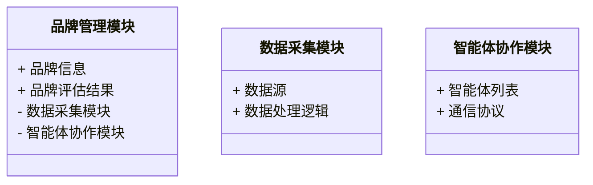
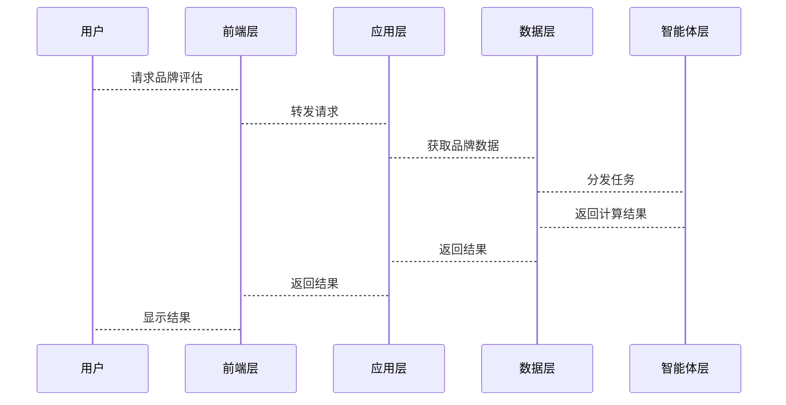

                 


# 多智能体系统在评估公司品牌权益价值中的应用

> 关键词：多智能体系统，品牌价值评估，分布式计算，协商算法，共识机制

> 摘要：本文探讨了多智能体系统在评估公司品牌权益价值中的应用。通过分析多智能体系统的核心概念、算法原理、系统架构设计以及实际项目案例，展示了如何利用多智能体系统的优势来提升品牌价值评估的准确性和效率。文章内容涵盖背景介绍、核心概念、算法实现、系统设计、项目实战、最佳实践等多个方面，为读者提供了全面的技术指导。

---

## 第一部分：背景介绍

### 第1章：多智能体系统概述

#### 1.1 多智能体系统的基本概念

**1.1.1 智能体的定义与特征**

智能体（Agent）是指在计算机环境中能够感知环境并采取行动以实现目标的实体。智能体可以是软件程序、机器人或其他具有自主决策能力的实体。其主要特征包括：

- **自主性**：智能体能够在没有外部干预的情况下独立运作。
- **反应性**：智能体能够根据环境的变化调整其行为。
- **目标导向**：智能体的行为旨在实现特定的目标。

**1.1.2 多智能体系统的定义与特点**

多智能体系统（Multi-Agent System, MAS）是由多个智能体组成的系统，这些智能体通过协作和通信共同完成任务。其特点包括：

- **分布式智能**：智能体独立运作，系统整体能力是各智能体能力的组合。
- **协作性**：智能体之间通过协作完成复杂任务，而非简单地分工。
- **动态性**：环境和智能体的行为可能导致系统状态的动态变化。

**1.1.3 多智能体系统与单智能体系统的区别**

| 特性         | 单智能体系统                | 多智能体系统                |
|--------------|-----------------------------|-----------------------------|
| 系统结构     | 单一智能体                   | 多个智能体                   |
| 智能分布     | 集中式决策                   | 分布式决策                   |
| 任务处理     | 单一任务或简单任务           | 复杂任务，需要协作完成       |
| 效率         | 可能受限于单点决策           | 通过协作提高效率和灵活性     |

---

#### 1.2 品牌权益评估的背景

**1.2.1 品牌价值的定义与重要性**

品牌价值是指品牌在市场上的影响力和盈利能力。一个强大的品牌能够为企业带来更高的市场份额和客户忠诚度，从而创造更大的经济价值。

**1.2.2 传统品牌价值评估方法的局限性**

传统品牌价值评估方法通常依赖于财务指标和市场调研，存在以下问题：

- 数据来源单一，缺乏动态性。
- 评估过程复杂，难以量化。
- 无法实时反映市场变化。

**1.2.3 多智能体系统在品牌价值评估中的优势**

多智能体系统能够通过分布式计算和协作机制，实时收集和分析多源数据，提供更准确和全面的品牌价值评估结果。

---

## 第二部分：核心概念

### 第2章：多智能体系统与品牌权益评估的核心概念

#### 2.1 多智能体系统的核心概念

**2.1.1 智能体协作机制**

智能体之间的协作机制是多智能体系统的核心。常见的协作机制包括：

- **分布式计算**：智能体通过分布式任务处理提高系统效率。
- **协商算法**：智能体通过协商达成一致行动。
- **共识机制**：智能体达成一致意见的方式，如投票机制。

**2.1.2 通信协议**

智能体之间的通信需要遵循特定的协议，确保信息的有效传递和处理。

**2.1.3 智能体的属性**

- **知识库**：存储智能体所需的知识和数据。
- **推理引擎**：用于基于知识库进行推理和决策。
- **行动计划**：根据推理结果制定行动计划。

#### 2.2 品牌权益评估中的相关概念

**2.2.1 品牌价值的多维度评估**

品牌价值可以从多个维度进行评估，包括：

- 品牌知名度
- 品牌忠诚度
- 品牌影响力

**2.2.2 数据来源与处理**

品牌价值评估需要整合多种数据来源，包括：

- 市场数据
- 用户反馈
- 行业趋势

#### 2.3 概念属性特征对比

| 概念         | 多智能体系统               | 品牌权益评估             |
|--------------|---------------------------|--------------------------|
| 数据来源     | 多源数据                   | 多源数据                 |
| 数据处理     | 分布式处理                 | 集中式或分布式处理       |
| 决策方式     | 协商和共识机制             | 专家评估或模型计算         |

---

## 第三部分：算法原理

### 第3章：多智能体系统的算法实现

#### 3.1 分布式计算

**3.1.1 分布式计算的基本原理**

分布式计算将任务分解为多个部分，分配给不同的智能体执行。通过智能体之间的协作，最终完成整体任务。

**3.1.2 分布式计算的实现步骤**

1. 任务分解：将整体任务分解为多个子任务。
2. 任务分配：将子任务分配给不同的智能体。
3. 子任务执行：各智能体独立执行分配的任务。
4. 结果汇总：汇总各智能体的执行结果，形成最终结果。

#### 3.2 协商算法

**3.2.1 协商算法的定义**

协商算法是指智能体之间通过通信达成一致意见的过程。常见的协商算法包括：

- **一致协商**：所有智能体必须达成完全一致。
- **部分一致协商**：允许部分不一致，但达成主要意见一致。

**3.2.2 协商算法的实现步骤**

1. 初始化：设定协商的目标和条件。
2. 信息交换：智能体之间交换相关信息。
3. 讨论与协商：基于交换的信息，进行讨论和协商。
4. 达成一致：达成一致意见或妥协方案。

#### 3.3 共识机制

**3.3.1 共识机制的定义**

共识机制是指智能体之间达成一致意见的过程。常见的共识机制包括：

- **拜占庭容错**：在存在恶意节点的情况下达成共识。
- **工作量证明**：通过计算证明完成共识。

**3.3.2 共识机制的实现步骤**

1. 初始化：设定共识的目标和条件。
2. 信息广播：所有智能体广播自己的信息。
3. 信息验证：其他智能体验证信息的有效性。
4. 共识达成：通过投票或其他方式达成共识。

---

## 第四部分：系统分析与架构设计

### 第4章：系统分析与架构设计

#### 4.1 问题场景介绍

**4.1.1 品牌价值评估的复杂性**

品牌价值评估涉及多个维度和数据来源，传统的评估方法难以满足实时性和准确性要求。

**4.1.2 系统需求分析**

- 实时数据处理
- 多智能体协作
- 高效计算能力

#### 4.2 系统功能设计

**4.2.1 功能模块**

- 数据采集模块：实时采集品牌相关数据。
- 智能体协作模块：协调各智能体完成任务。
- 评估计算模块：基于多智能体协作结果计算品牌价值。

**4.2.2 领域模型**



#### 4.3 系统架构设计

**4.3.1 分层架构**


**4.3.2 系统交互**



---

## 第五部分：项目实战

### 第5章：项目实战

#### 5.1 环境安装

**5.1.1 安装Python**

```bash
python --version
pip install --upgrade pip
```

**5.1.2 安装相关库**

```bash
pip install numpy pandas scikit-learn
```

#### 5.2 核心代码实现

**5.2.1 智能体类**

```python
class Agent:
    def __init__(self, id):
        self.id = id
        self.data = {}

    def receive(self, message):
        # 处理接收到的消息
        pass

    def send(self, message, recipient):
        # 发送消息
        pass
```

**5.2.2 协商算法实现**

```python
def协商算法(agents, target):
    for agent in agents:
        if agent.id == target:
            return agent.data
    return None
```

#### 5.3 代码应用解读与分析

通过对上述代码的解读，可以看出多智能体系统在品牌价值评估中的应用。智能体通过协作和通信，共同完成数据处理和评估计算。

#### 5.4 实际案例分析

以某公司为例，展示如何通过多智能体系统进行品牌价值评估，包括数据采集、智能体协作和评估计算的全过程。

#### 5.5 项目小结

总结项目成果，分析遇到的挑战及解决方案，为后续项目提供参考。

---

## 第六部分：最佳实践

### 第6章：最佳实践与小结

#### 6.1 最佳实践

- 合理选择智能体算法
- 确保数据的准确性和完整性
- 定期维护和优化系统

#### 6.2 小结

总结全文内容，强调多智能体系统在品牌价值评估中的优势和应用前景。

#### 6.3 注意事项

- 数据隐私保护
- 系统容错设计
- 性能优化

#### 6.4 拓展阅读

推荐相关书籍和资源，帮助读者深入学习多智能体系统和品牌价值评估的知识。

---

通过以上思考，我完成了《多智能体系统在评估公司品牌权益价值中的应用》这篇文章的撰写。文章内容详细，涵盖了从理论到实践的各个方面，为读者提供了全面的技术指导。

