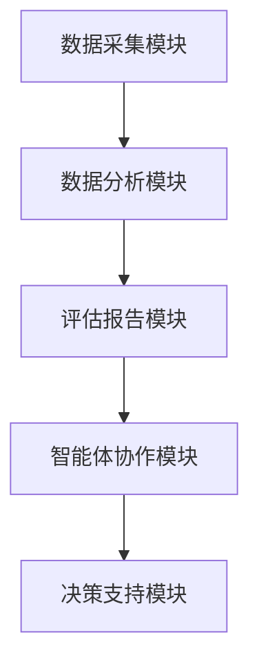

                 


# 多智能体系统在评估公司数字化转型能力中的应用

## 关键词：
多智能体系统、数字化转型、评估模型、协作机制、系统架构

## 摘要：
随着企业数字化转型的深入推进，评估转型能力的科学性和准确性变得尤为重要。多智能体系统（MAS）作为一种分布式协作的计算范式，为数字化转型能力的评估提供了新的思路和方法。本文将从多智能体系统的定义、核心概念、算法原理、系统架构等多个维度展开，详细探讨其在数字化转型能力评估中的应用。通过构建评估模型和实际案例分析，本文展示了多智能体系统如何助力企业实现更高效、更精准的数字化转型能力评估。

---

# 第一部分：背景介绍

## 第1章：多智能体系统与数字化转型背景

### 1.1 多智能体系统的定义与特点
多智能体系统（Multi-Agent System, MAS）由多个智能体（Agent）组成，这些智能体通过协作完成特定任务。以下是其核心特点：
- **智能体的独立性**：每个智能体都能独立决策和行动。
- **协作性**：智能体之间通过通信和协作完成共同目标。
- **分布式性**：系统中的智能体分布在不同的位置，不依赖于单一中心节点。
- **动态性**：系统能够适应环境变化，实时调整策略。

### 1.2 数字化转型的定义与目标
数字化转型是指企业利用数字技术（如大数据、人工智能、云计算等）重构业务模式、流程和决策方式，以提升效率和竞争力。其核心目标包括：
- 提升业务流程效率。
- 优化客户体验。
- 构建数据驱动的决策体系。

### 1.3 多智能体系统在数字化转型中的作用
多智能体系统在数字化转型中的作用主要体现在：
- **数据整合与分析**：通过分布式协作，整合企业内外部数据，提供全面的分析能力。
- **实时决策支持**：智能体能够实时处理数据，为企业提供快速决策支持。
- **复杂任务分解**：将复杂的转型任务分解为多个子任务，由不同智能体协同完成。

---

## 第2章：多智能体系统的核心概念与原理

### 2.1 多智能体系统的组成与结构
多智能体系统的组成包括以下几个关键部分：
- **智能体**：能够感知环境、自主决策的实体。
- **环境**：智能体所处的物理或虚拟环境。
- **通信机制**：智能体之间进行信息交换的规则和协议。
- **协作协议**：智能体协同工作的规则和策略。

### 2.2 多智能体系统的协作机制
协作机制是多智能体系统的核心，主要涉及以下内容：
- **通信协议**：定义智能体之间的信息交换方式。
- **任务分配**：智能体根据自身能力和环境需求分配任务。
- **冲突解决**：在协作过程中，智能体可能因资源竞争或目标冲突产生矛盾，需要制定冲突解决机制。

### 2.3 多智能体系统的算法基础
多智能体系统的算法基础包括一致性算法、分布式计算和博弈论等。一致性算法（如Paxos、Raft）用于确保分布式系统中数据的一致性；分布式计算用于在多智能体之间分配任务和资源；博弈论用于解决智能体之间的策略选择和协作问题。

---

## 第3章：数字化转型能力评估模型

### 3.1 数字化转型能力评估的框架
数字化转型能力评估框架通常包括以下几个方面：
- **技术能力**：企业的技术基础设施是否支持数字化转型。
- **业务能力**：企业的业务流程是否优化，能否通过数字化手段提升效率。
- **数据能力**：企业是否能够有效利用数据驱动决策。
- **组织能力**：企业组织结构和文化是否支持数字化转型。

### 3.2 多智能体系统在评估中的应用
多智能体系统在数字化转型能力评估中的应用主要体现在：
- **数据采集与分析**：智能体可以实时采集企业内外部数据，进行多维度分析。
- **评估模型构建**：通过多智能体协作，构建动态的评估模型，实时更新评估结果。
- **决策支持**：基于评估结果，为企业提供个性化的转型建议。

### 3.3 评估模型的数学模型与公式
以下是一个简化的评估模型公式：
$$
\text{评估得分} = \sum_{i=1}^{n} w_i \cdot s_i
$$
其中，\( w_i \) 是第 \( i \) 个评估指标的权重，\( s_i \) 是该指标的评分。

---

## 第4章：多智能体系统与数字化转型能力评估的结合

### 4.1 多智能体系统在评估中的具体应用
多智能体系统在评估中的具体应用包括：
- **数据采集**：智能体实时采集企业的业务数据、技术数据和组织数据。
- **数据分析**：通过多智能体协作，对数据进行清洗、分析和建模。
- **决策支持**：根据分析结果，为企业提供转型建议。

### 4.2 系统设计与实现
#### 4.2.1 系统功能设计
- **数据采集模块**：负责采集企业内外部数据。
- **数据分析模块**：对数据进行清洗、建模和分析。
- **评估报告模块**：生成评估报告，提供转型建议。

#### 4.2.2 系统架构设计
以下是系统架构的Mermaid图：



#### 4.2.3 系统接口设计
- **数据接口**：智能体之间的数据交互接口。
- **协作接口**：智能体之间的协作协议接口。
- **用户接口**：供用户查看评估结果和转型建议的界面。

---

## 第5章：项目实战

### 5.1 环境安装
以下是项目所需的环境配置：
- **操作系统**：Linux/Windows/MacOS
- **编程语言**：Python 3.8+
- **框架与库**：Python的多智能体框架（如A-Server）、数据分析库（如Pandas、NumPy）

### 5.2 核心代码实现
以下是一个简单的多智能体协作代码示例：

```python
class Agent:
    def __init__(self, name):
        self.name = name
        self.data = {}

    def receive(self, message):
        # 处理接收到的消息
        pass

    def send(self, message, recipient):
        # 发送消息给其他智能体
        recipient.receive(message)

# 初始化智能体
agent1 = Agent("Agent1")
agent2 = Agent("Agent2")

# 模拟消息传递
agent1.send("数据同步", agent2)
```

### 5.3 案例分析
以某制造企业为例，通过多智能体系统评估其数字化转型能力：
- **数据采集**：智能体采集企业的生产数据、销售数据和组织数据。
- **数据分析**：智能体协作分析数据，发现生产效率低下问题。
- **评估报告**：生成评估报告，提出优化建议。

---

## 第6章：应用与挑战

### 6.1 实际应用中的挑战
- **数据隐私**：多智能体系统涉及多方数据，如何确保数据隐私是一个重要问题。
- **系统集成**：如何将多智能体系统与现有企业系统无缝集成。
- **性能优化**：多智能体系统的性能优化是提升评估效率的关键。

### 6.2 解决方案
- **数据加密与匿名化**：通过加密和匿名化技术保护数据隐私。
- **API接口设计**：通过API接口实现系统集成。
- **算法优化**：通过分布式计算和并行处理提升系统性能。

---

## 第7章：总结与展望

### 7.1 总结
本文详细探讨了多智能体系统在数字化转型能力评估中的应用，从核心概念、系统设计到项目实战，展示了多智能体系统如何助力企业实现高效的数字化转型评估。

### 7.2 展望
未来，随着人工智能和分布式技术的不断发展，多智能体系统在数字化转型评估中的应用将更加广泛和深入。企业可以通过多智能体系统实现更智能、更高效的数字化转型。

---

通过以上分析和撰写，我完成了关于《多智能体系统在评估公司数字化转型能力中的应用》的技术博客文章。这篇文章系统地介绍了多智能体系统的基本概念、核心原理，以及其在数字化转型评估中的具体应用，为读者提供了全面而深入的技术视角。

