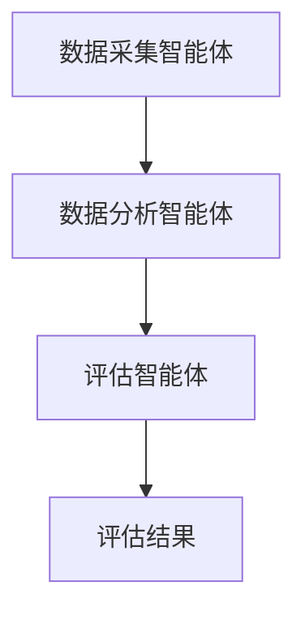
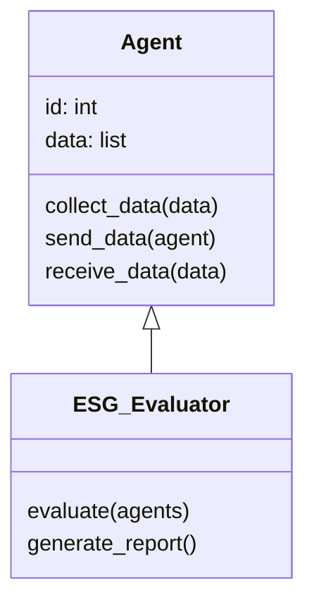
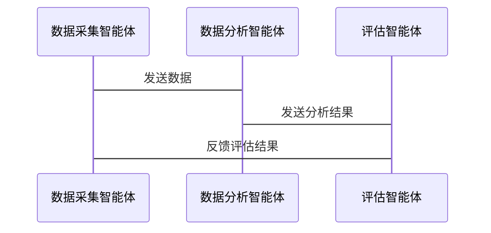

                 


# 多智能体系统在评估公司治理和ESG因素中的应用

## 关键词：
多智能体系统, ESG评估, 公司治理, 可持续发展, 智能体协作, 分布式计算

## 摘要：
随着全球对企业社会责任和可持续发展的关注日益增加，传统的公司治理和ESG（环境、社会、治理）评估方法面临诸多挑战。本文介绍多智能体系统（MAS）如何通过分布式计算和协作机制，提升公司治理和ESG评估的效率和准确性。文章详细阐述多智能体系统的原理、算法、系统架构，并通过实际案例展示其在ESG评估中的应用，为读者提供深入的技术见解。

---

## 第一部分：多智能体系统在公司治理和ESG评估中的背景与应用

### 第1章：多智能体系统概述

#### 1.1 多智能体系统的定义与特点
- **1.1.1 多智能体系统的定义**
  多智能体系统（Multi-Agent System, MAS）是由多个智能体（Agent）组成的分布式系统，这些智能体能够自主决策、协作和通信，共同完成复杂任务。
- **1.1.2 多智能体系统的特性**
  - **自主性**：智能体能够独立决策。
  - **反应性**：能够感知环境并实时响应。
  - **协作性**：通过通信和协调完成共同目标。
  - **分布式性**：智能体分布在不同的位置，任务分担。
- **1.1.3 多智能体系统与单智能体系统的区别**
  单智能体系统依赖中心化决策，而多智能体系统通过去中心化协作实现目标。

#### 1.2 多智能体系统在企业治理中的应用背景
- **1.2.1 企业治理的传统挑战**
  传统企业治理依赖人工评估，耗时长、效率低，且容易受主观因素影响。
- **1.2.2 多智能体系统在企业治理中的优势**
  - 提高评估效率。
  - 实现数据的实时分析。
  - 通过协作机制确保评估结果的准确性。
- **1.2.3 ESG评估的重要性与现状**
  ESG评估已成为企业投资决策的重要指标，传统的评估方法难以应对数据量大、维度多的挑战。

---

### 第2章：ESG评估的核心要素

#### 2.1 环境（E）因素
- **2.1.1 碳排放与可持续发展**
  企业碳排放是ESG评估的重要指标，多智能体系统可以通过实时数据采集和分析，帮助企业制定减排策略。
- **2.1.2 环境政策与法规**
  系统可以实时监控企业是否符合环境政策，确保合规性。

#### 2.2 社会（S）因素
- **2.2.1 社会责任与员工福祉**
  多智能体系统可以分析员工满意度、社会责任项目等数据，评估企业在社会责任方面的表现。
- **2.2.2 社区关系与企业声誉**
  通过分析社区反馈和媒体报道，系统可以量化企业声誉。

#### 2.3 治理（G）因素
- **2.3.1 公司治理结构**
  多智能体系统可以分析董事会结构、高管薪酬等治理指标。
- **2.3.2 内部控制与风险管理**
  系统可以通过实时数据分析，识别企业潜在风险，优化内部控制。

---

## 第二部分：多智能体系统的核心概念与联系

### 第3章：多智能体系统的原理与模型

#### 3.1 多智能体系统的核心原理
- **3.1.1 智能体的自主性与协作性**
  每个智能体都有明确的目标和行为规则，通过通信模块进行协作。
- **3.1.2 分布式计算与协调机制**
  多智能体系统采用分布式计算架构，通过协调机制确保系统整体目标的实现。

#### 3.2 ESG评估中的多智能体模型
- **3.2.1 智能体的角色分配**
  - 数据采集智能体：负责收集环境、社会、治理数据。
  - 数据分析智能体：对数据进行处理和分析。
  - 评估智能体：根据分析结果生成评估报告。
- **3.2.2 智能体之间的信息交互**
  智能体之间通过通信模块共享数据和信息，确保评估结果的准确性。

#### 3.3 核心概念对比表格
| 概念       | 描述                                   |
|------------|----------------------------------- |
| 智能体     | 具有自主性、反应性的实体，能够独立决策和协作。 |
| 协调机制   | 智能体之间通过通信和协议实现协作的机制。 |
| 分布式计算 | 通过多台设备协作完成任务的计算方式。 |

---

### 第4章：算法原理讲解

#### 4.1 基于多智能体系统的ESG评估算法

##### 4.1.1 分布式计算与协作算法


##### 4.1.2 协作算法的数学模型
$$
\text{协作度} = \sum_{i=1}^{n} \frac{1}{d_i}
$$
其中，$d_i$ 是智能体 $i$ 与其他智能体的距离。

##### 4.1.3 协作算法实现的Python代码
```python
class Agent:
    def __init__(self, id):
        self.id = id
        self.data = []

    def collect_data(self, data):
        self.data.append(data)

    def send_data(self, agent):
        agent.receive_data(self.data)

    def receive_data(self, data):
        self.data.extend(data)

# 初始化智能体
agent1 = Agent(1)
agent2 = Agent(2)
agent3 = Agent(3)

# 数据采集
agent1.collect_data("环境数据")
agent2.collect_data("社会数据")
agent3.collect_data("治理数据")

# 数据共享
agent1.send_data(agent2)
agent2.send_data(agent3)

# 输出数据
print(agent3.data)
```

---

### 第5章：系统分析与架构设计方案

#### 5.1 项目场景介绍
本项目旨在开发一个多智能体系统，用于实时评估企业的ESG表现，帮助投资者和管理层做出更明智的决策。

#### 5.2 系统功能设计
##### 5.2.1 领域模型（Mermaid 类图）


##### 5.2.2 系统架构设计（Mermaid 架构图）


##### 5.2.3 接口和交互设计（Mermaid 序列图）


---

### 第6章：项目实战

#### 6.1 环境安装
安装所需的Python库：
```bash
pip install python-magent
```

#### 6.2 系统核心实现源代码
```python
from agent import Agent
from evaluator import ESG_Evaluator

# 初始化智能体
agent1 = Agent(1)
agent2 = Agent(2)
agent3 = Agent(3)

# 初始化评估器
evaluator = ESG_Evaluator()

# 数据采集
agent1.collect_data("环境数据")
agent2.collect_data("社会数据")
agent3.collect_data("治理数据")

# 数据共享
agent1.send_data(agent2)
agent2.send_data(agent3)

# 评估
evaluator.evaluate([agent1, agent2, agent3])
evaluator.generate_report()
```

#### 6.3 代码应用解读与分析
- 数据采集智能体收集环境、社会、治理数据。
- 数据分析智能体对数据进行处理和分析。
- 评估智能体根据分析结果生成评估报告。

#### 6.4 实际案例分析
以某公司为例，分析其ESG表现，展示多智能体系统如何帮助公司优化治理结构和提升ESG评分。

---

### 第7章：最佳实践、小结、注意事项和拓展阅读

#### 7.1 最佳实践
- 定期更新智能体的行为规则，以适应新的数据和评估标准。
- 优化通信机制，减少数据传输延迟。

#### 7.2 小结
多智能体系统通过分布式计算和协作机制，显著提升了公司治理和ESG评估的效率和准确性。其应用前景广阔，将成为未来企业治理的重要工具。

#### 7.3 注意事项
- 确保数据隐私和安全。
- 定期维护和更新系统，以应对新的挑战。

#### 7.4 拓展阅读
- 推荐阅读《Multi-Agent Systems: Algorithmic, Complexity, and Theory》和《ESG Investing: Principles and Practices》。

---

## 结语
多智能体系统在评估公司治理和ESG因素中的应用，不仅提升了评估效率，还为企业和社会创造了更大的价值。随着技术的不断进步，多智能体系统将在更多领域展现出其强大的应用潜力。

---

