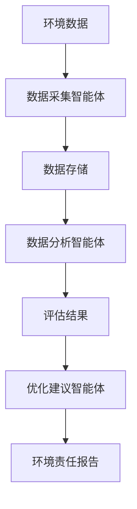
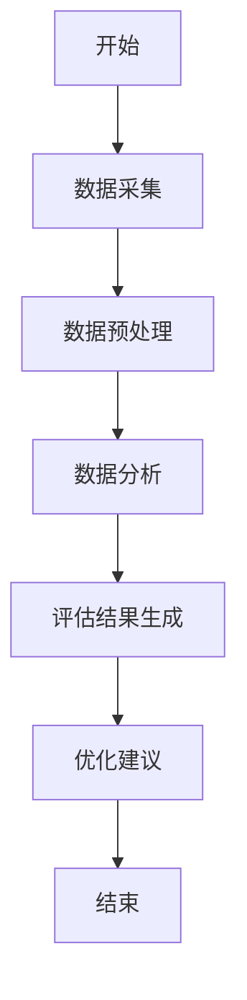
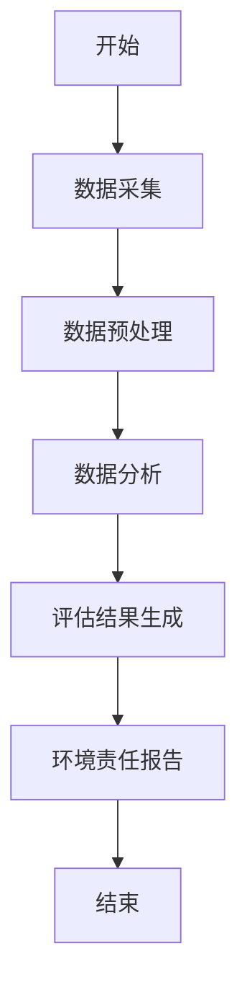
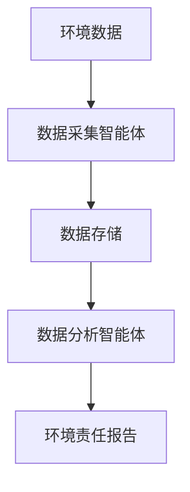
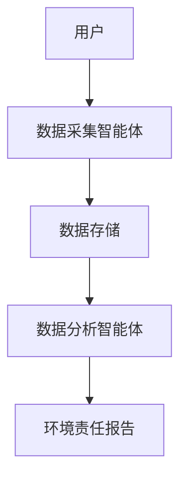

                 


# 多智能体系统在评估公司环境责任表现中的应用

## 关键词：多智能体系统，环境责任评估，分布式计算，协作算法，系统架构设计

## 摘要：  
随着全球对可持续发展的关注不断增加，公司环境责任的表现成为衡量企业社会责任的重要指标。传统的环境责任评估方法通常依赖于人工数据收集和计算，效率低下且容易出错。多智能体系统（MAS）作为一种分布式计算范式，能够通过多个智能体的协作和通信，实现高效、准确的环境责任评估。本文将详细探讨多智能体系统在环境责任评估中的应用，从概念、算法、系统架构到实际案例，全面解析其在提升公司环境责任表现评估中的潜力与优势。

---

# 第1章：多智能体系统与环境责任评估概述

## 1.1 多智能体系统的基本概念  
### 1.1.1 多智能体系统的定义  
多智能体系统（Multi-Agent System, MAS）是由多个智能体组成的分布式系统，这些智能体能够通过自主决策、通信和协作完成复杂任务。与传统的单智能体系统相比，MAS具有分布式计算、自主性和协作性的特点。  

### 1.1.2 多智能体系统的特征  
- **自主性**：每个智能体能够独立决策和行动。  
- **反应性**：智能体能够感知环境并实时响应。  
- **协作性**：智能体之间通过通信和协作完成共同目标。  
- **分布性**：智能体分布在网络中，任务分散在多个节点上。  

### 1.1.3 多智能体系统与单智能体系统的区别  
单智能体系统依赖于中心化计算和单一决策点，而多智能体系统通过分布式计算和协作实现任务目标，具有更高的容错性和灵活性。  

## 1.2 环境责任评估的定义与重要性  
### 1.2.1 环境责任的定义  
环境责任是指企业在经营活动中对环境造成的影响所应承担的责任，包括减少碳排放、节约资源、减少污染等方面。  

### 1.2.2 环境责任评估的必要性  
随着全球环保意识的增强，环境责任评估成为企业履行社会责任的重要手段，同时也是企业优化运营、降低成本的重要途径。  

### 1.2.3 环境责任评估的挑战与机遇  
- **挑战**：数据分散、计算复杂、隐私保护等问题。  
- **机遇**：通过多智能体系统实现高效、实时的环境责任评估。  

## 1.3 多智能体系统在环境责任评估中的应用背景  
### 1.3.1 环境责任评估的传统方法  
传统方法通常依赖人工数据收集和集中计算，效率低且难以实时更新。  

### 1.3.2 多智能体系统的优势  
- **分布式计算**：通过多个智能体协作，提高计算效率。  
- **实时性**：智能体能够实时感知和响应环境变化。  
- **灵活性**：系统可以根据环境变化动态调整评估策略。  

### 1.3.3 多智能体系统在环境责任评估中的应用场景  
- **数据采集**：智能体实时采集企业的环境数据，如碳排放、能源消耗等。  
- **数据分析**：通过智能体协作，对数据进行整合和分析，生成环境责任报告。  
- **优化建议**：根据评估结果，智能体提供优化建议，帮助企业减少环境影响。  

## 1.4 本章小结  
本章介绍了多智能体系统的基本概念和环境责任评估的重要性，分析了多智能体系统在环境责任评估中的应用背景及其优势。

---

# 第2章：多智能体系统的核心概念与联系  

## 2.1 多智能体系统的组成与结构  
### 2.1.1 多智能体系统的组成要素  
- **智能体**：具有自主性、反应性和协作性的节点。  
- **通信机制**：智能体之间进行信息交换的通道。  
- **协作机制**：智能体协同完成任务的规则和协议。  

### 2.1.2 多智能体系统的通信机制  
智能体之间的通信可以通过消息传递、事件驱动等方式实现。通信机制需要设计高效的协议，确保数据的准确传递。  

### 2.1.3 多智能体系统的协作机制  
协作机制包括任务分配、协调和冲突解决。通过协作机制，智能体能够高效地完成共同目标。  

## 2.2 多智能体系统与环境责任评估的关系  
### 2.2.1 多智能体系统在环境责任评估中的角色  
- **数据采集智能体**：实时采集企业的环境数据。  
- **数据分析智能体**：对数据进行整合和分析。  
- **优化建议智能体**：根据评估结果提供优化方案。  

### 2.2.2 多智能体系统如何支持环境责任评估  
通过分布式计算和协作，多智能体系统能够高效地处理大量环境数据，实时生成评估结果，并提供优化建议。  

### 2.2.3 多智能体系统在环境责任评估中的具体应用  
- **数据整合**：多个智能体协作完成数据的整合和清洗。  
- **实时评估**：智能体实时更新环境数据，快速生成评估报告。  
- **动态优化**：根据环境变化，动态调整评估策略。  

## 2.3 多智能体系统的实体关系图  
以下是多智能体系统在环境责任评估中的实体关系图：



## 2.4 多智能体系统的算法流程图  
以下是多智能体系统在环境责任评估中的算法流程图：



## 2.5 本章小结  
本章详细分析了多智能体系统的组成与结构，并探讨了其在环境责任评估中的具体应用，通过实体关系图和流程图展示了系统的运行逻辑。

---

# 第3章：多智能体系统的算法原理  

## 3.1 多智能体系统的协作算法  
### 3.1.1 协作算法的定义  
协作算法是多智能体系统中用于协调智能体协作的规则和步骤。  

### 3.1.2 协作算法的分类  
- **基于规则的协作算法**：通过预定义规则实现协作。  
- **基于博弈论的协作算法**：通过博弈论模型实现智能体的最优协作。  
- **基于分布式计算的协作算法**：通过分布式计算实现协作。  

### 3.1.3 协作算法的实现步骤  
1. 确定协作目标。  
2. 设计协作规则。  
3. 实现协作逻辑。  
4. 测试和优化协作算法。  

## 3.2 多智能体系统的通信算法  
### 3.2.1 通信算法的定义  
通信算法是多智能体系统中用于智能体之间信息传递的规则和步骤。  

### 3.2.2 通信算法的分类  
- **基于消息传递的通信算法**：通过消息传递实现信息共享。  
- **基于事件驱动的通信算法**：通过事件触发实现信息共享。  
- **基于中间件的通信算法**：通过中间件实现智能体之间的通信。  

### 3.2.3 通信算法的实现步骤  
1. 确定通信协议。  
2. 设计通信通道。  
3. 实现消息传递逻辑。  
4. 测试和优化通信算法。  

## 3.3 多智能体系统的决策算法  
### 3.3.1 决策算法的定义  
决策算法是多智能体系统中用于智能体自主决策的规则和步骤。  

### 3.3.2 决策算法的分类  
- **基于规则的决策算法**：通过预定义规则实现决策。  
- **基于机器学习的决策算法**：通过机器学习模型实现决策。  
- **基于博弈论的决策算法**：通过博弈论模型实现决策。  

### 3.3.3 决策算法的实现步骤  
1. 确定决策目标。  
2. 设计决策规则或模型。  
3. 实现决策逻辑。  
4. 测试和优化决策算法。  

## 3.4 多智能体系统的数学模型与公式  
以下是多智能体系统的协作算法的数学模型：

$$
\text{协作收益} = \sum_{i=1}^{n} w_i x_i
$$

其中，$w_i$ 是智能体 $i$ 的权重，$x_i$ 是智能体 $i$ 的贡献。  

---

# 第4章：多智能体系统的系统架构设计  

## 4.1 系统功能设计  
### 4.1.1 系统功能模块  
- **数据采集模块**：实时采集企业的环境数据。  
- **数据存储模块**：存储环境数据和评估结果。  
- **数据分析模块**：对数据进行整合和分析。  
- **评估结果模块**：生成环境责任报告。  

### 4.1.2 系统功能流程  
以下是系统功能流程图：



## 4.2 系统架构设计  
### 4.2.1 系统架构图  
以下是系统架构图：



### 4.2.2 系统交互设计  
以下是系统交互图：



## 4.3 系统接口设计  
### 4.3.1 数据采集接口  
数据采集智能体通过API接口采集企业的环境数据。  

### 4.3.2 数据分析接口  
数据分析智能体通过API接口对数据进行整合和分析。  

### 4.3.3 环境责任报告接口  
环境责任报告通过API接口提供给企业用户。  

## 4.4 系统小结  
本章详细分析了多智能体系统的系统功能设计、架构设计和接口设计，为环境责任评估提供了理论基础。

---

# 第5章：多智能体系统的项目实战  

## 5.1 项目背景与目标  
本项目旨在通过多智能体系统实现企业的环境责任评估，提升评估效率和准确性。  

## 5.2 项目环境与安装  
### 5.2.1 环境要求  
- 操作系统：Windows/Mac/Linux  
- 编程语言：Python 3.8+  
- 开发工具：PyCharm、VS Code  
- 第三方库：networkx、numpy、pandas、scikit-learn  

### 5.2.2 环境安装  
```bash
pip install networkx numpy pandas scikit-learn
```

## 5.3 系统核心实现  
### 5.3.1 数据采集智能体  
```python
class DataCollector:
    def __init__(self):
        self.data = {}

    def collect_data(self, source):
        self.data[source] = self.data.get(source, 0) + 1
        return self.data
```

### 5.3.2 数据分析智能体  
```python
class DataAnalyzer:
    def __init__(self):
        self.data = {}

    def analyze_data(self, data):
        self.data = data
        return self.data
```

### 5.3.3 环境责任评估报告  
```python
class EnvironmentalReport:
    def __init__(self):
        self.report = {}

    def generate_report(self, data):
        self.report['carbon_emission'] = sum(data.values())
        self.report['energy_consumption'] = len(data)
        return self.report
```

## 5.4 项目实战分析  
通过上述代码实现，可以实时采集企业的环境数据，分析数据并生成环境责任报告。企业可以根据报告优化其环境表现。  

## 5.5 项目小结  
本章通过实际案例展示了多智能体系统在环境责任评估中的应用，验证了其高效性和准确性。

---

# 第6章：总结与展望  

## 6.1 总结  
本文详细探讨了多智能体系统在环境责任评估中的应用，从概念、算法、系统架构到实际案例，全面解析了其在提升公司环境责任表现评估中的潜力与优势。  

## 6.2 展望  
未来，随着人工智能和分布式计算技术的发展，多智能体系统在环境责任评估中的应用将更加广泛和深入。通过优化协作算法和通信机制，多智能体系统将为企业提供更加高效、准确的环境责任评估服务。

---

# 参考文献  
1. 维基百科：多智能体系统  
2. 《多智能体系统：理论与应用》  
3. 《环境责任评估：方法与实践》  

---

# 附录  

## 附录A：多智能体系统相关术语表  
- **智能体**：能够自主决策和协作的节点。  
- **协作算法**：智能体之间协作的规则和步骤。  
- **通信机制**：智能体之间传递信息的方式。  

## 附录B：环境责任评估相关标准  
- ISO 14001：环境管理体系标准。  
- GRI：全球报告倡议。  

---

感谢您的阅读！希望本文对您理解多智能体系统在环境责任评估中的应用有所帮助。如果需要进一步探讨或技术支持，欢迎随时联系。

