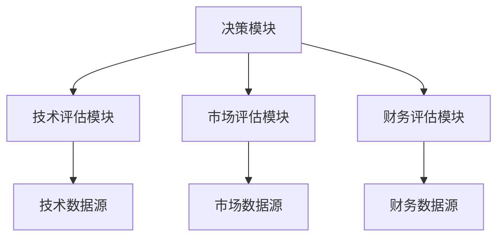

                 


# 多智能体系统在评估公司研发投资回报率中的应用

> 关键词：多智能体系统、研发投资回报率、分布式决策、强化学习、系统架构

> 摘要：本文探讨了多智能体系统在评估公司研发投资回报率中的应用。通过分析多智能体系统的原理、算法、系统架构以及实际案例，展示了如何利用MAS进行高效的项目评估、资源配置和风险预测，从而优化投资回报。

---

## 第一部分: 多智能体系统与研发投资回报率评估的背景介绍

### 1. 多智能体系统（MAS）的定义与核心概念

#### 1.1 多智能体系统的定义
多智能体系统是由多个相互作用的智能体组成的分布式系统，每个智能体能够感知环境、自主决策并协同完成复杂任务。

#### 1.2 多智能体系统的组成要素
- **智能体（Agents）**：具备感知、决策、执行能力的实体。
- **环境（Environment）**：智能体所处的外部世界，包括其他智能体和任务目标。
- **通信协议（Communication Protocol）**：智能体之间的信息交换规则。
- **协作机制（Collaboration Mechanism）**：智能体协同工作的策略和方法。

#### 1.3 多智能体系统的核心属性
- **分布式性**：智能体独立运行，无中央控制。
- **自主性**：智能体能够自主决策。
- **社会性**：智能体通过协作完成任务。
- **动态性**：环境和任务目标可能动态变化。

### 2. 研发投资回报率评估的背景与问题描述

#### 2.1 研发投资回报率评估的定义
研发投资回报率（ROI）是衡量研发项目经济效益的关键指标，通常通过公式：ROI = （净收益 / 投资额）× 100% 来计算。

#### 2.2 研发投资回报率评估的挑战
- **复杂性**：研发项目涉及技术、市场、成本等多个因素。
- **不确定性**：市场需求和技术可行性存在不确定性。
- **动态性**：外部环境（如政策、竞争）变化快。

#### 2.3 多智能体系统在评估中的应用价值
- **高效性**：MAS能够快速分析大量数据，提高评估效率。
- **分布式决策**：多个智能体分别评估不同因素，提升决策的全面性。
- **多目标优化**：MAS能够在多个目标之间找到平衡点。

---

## 第二部分: 多智能体系统的原理与核心概念

### 3. 多智能体系统的体系结构

#### 3.1 分层式结构
- **感知层**：智能体感知环境信息。
- **决策层**：智能体基于感知信息做出决策。
- **执行层**：智能体执行决策。

#### 3.2 分布式结构
- 智能体之间通过通信协议直接交互，无需中央控制。

#### 3.3 混合式结构
- 结合分层式和分布式结构，适用于复杂任务。

### 4. 多智能体系统的通信与协作机制

#### 4.1 通信协议
- **直接通信**：智能体之间直接交换信息。
- **间接通信**：通过中介传递信息。

#### 4.2 协作协议
- **协商机制**：智能体通过协商确定任务分配。
- **承诺机制**：智能体承诺完成特定任务。

#### 4.3 冲突解决机制
- **协商解决**：通过协商解决冲突。
- **仲裁机制**：由仲裁者解决冲突。

### 5. 多智能体系统的决策模型

#### 5.1 基于规则的决策
- 使用预定义规则进行决策，简单但缺乏灵活性。

#### 5.2 基于强化学习的决策
- 智能体通过试错学习，选择最优动作，适用于动态环境。

#### 5.3 基于博弈论的决策
- 智能体之间通过博弈论模型进行竞争或合作，优化整体收益。

---

## 第三部分: 多智能体系统在研发投资回报率评估中的应用

### 6. 多智能体系统在研发项目评估中的应用

#### 6.1 项目可行性分析
- 智能体分别评估技术、市场、财务可行性，综合结果得出整体可行性。

#### 6.2 项目风险预测
- 智能体通过分析历史数据和当前市场趋势，预测项目风险。

#### 6.3 项目收益预测
- 智能体基于历史数据和市场趋势，预测项目收益。

### 7. 多智能体系统在资源配置中的应用

#### 7.1 资源分配优化
- 智能体根据项目需求和资源限制，优化资源分配。

#### 7.2 成本控制
- 智能体实时监控项目成本，调整资源分配以控制成本。

### 8. 多智能体系统在风险预测中的应用

#### 8.1 市场风险预测
- 智能体分析市场趋势，预测项目市场风险。

#### 8.2 技术风险预测
- 智能体分析技术可行性，预测技术风险。

---

## 第四部分: 系统架构与实现

### 9. 系统架构设计

#### 9.1 系统功能设计
- **数据采集模块**：采集项目数据。
- **智能体模块**：分别负责技术、市场、财务评估。
- **决策模块**：综合各模块评估结果，生成最终决策。

#### 9.2 系统架构图


### 10. 系统实现

#### 10.1 环境安装
- 安装Python、TensorFlow、Kafka等工具。

#### 10.2 核心代码实现
```python
# 强化学习算法实现
class Agent:
    def __init__(self, state_space, action_space):
        self.state_space = state_space
        self.action_space = action_space
        # 初始化策略网络
        self.policy = PolicyNetwork(state_space, action_space)

    def act(self, state):
        # 根据策略网络输出动作
        action = self.policy.act(state)
        return action
```

#### 10.3 案例分析
- 以某科技公司为例，分析智能体如何评估一个新项目的投资回报率。

---

## 第五部分: 最佳实践与未来展望

### 11. 最佳实践

#### 11.1 小结
- 多智能体系统在研发投资回报率评估中具有显著优势。
- 各个智能体协同工作，能够全面、高效地评估项目。

#### 11.2 注意事项
- 确保智能体之间的通信效率。
- 定期更新智能体的知识库，以适应变化的环境。

#### 11.3 未来展望
- 结合区块链技术，提高系统的透明度和安全性。
- 进一步优化智能体的决策算法，提高评估的准确性。

---

通过以上目录结构，文章将详细讲解多智能体系统在研发投资回报率评估中的应用，从理论到实践，帮助读者全面理解并掌握相关知识。

