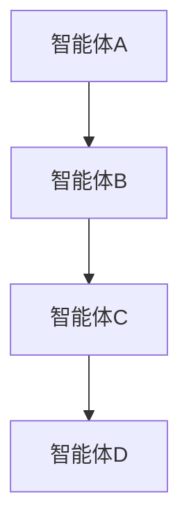
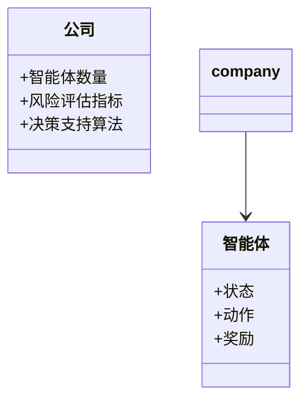
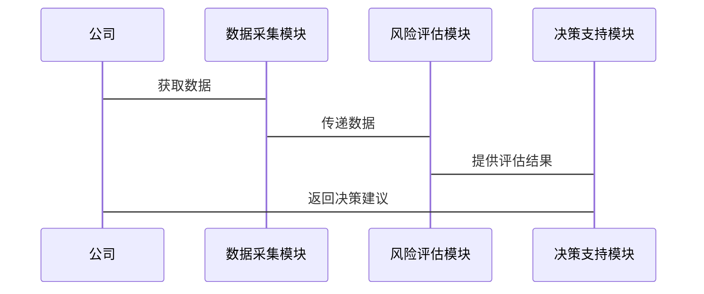

                 


```markdown
# 多智能体系统在评估公司适应性和抗风险能力中的应用

## 关键词：多智能体系统，适应性评估，抗风险能力，企业风险管理，分布式计算

## 摘要：多智能体系统通过多个智能体的协作与优化，有效提升了企业的适应性和抗风险能力。本文详细探讨了多智能体系统的定义、核心概念、算法原理，以及在企业中的实际应用，为读者提供了系统的知识框架和实践指南。

---

# 第1章: 多智能体系统的定义与核心概念

## 1.1 多智能体系统的定义

### 1.1.1 多智能体系统的定义
多智能体系统（Multi-Agent System, MAS）是由多个智能体（Agent）组成的分布式系统，每个智能体能够独立感知环境、自主决策并进行协作，共同完成复杂任务。

### 1.1.2 多智能体系统的核心特征
- **自主性**：智能体能够自主决策，无需外部干预。
- **反应性**：智能体能实时感知环境变化并做出反应。
- **协作性**：多个智能体之间能够协同工作，共同完成目标。
- **分布性**：智能体分布在不同的节点或位置，通过通信进行协作。

### 1.1.3 多智能体系统与单智能体系统的区别
| 特性       | 单智能体系统       | 多智能体系统       |
|------------|------------------|------------------|
| 系统结构   | 单一中心         | 分布式           |
| 决策方式   | 集中决策         | 分布式决策       |
| 复杂性     | 较低             | 较高             |
| 应用场景   | 简单任务         | 复杂任务         |

## 1.2 多智能体系统在企业中的应用背景

### 1.2.1 企业适应性与抗风险能力的重要性
企业适应性是指企业在面对环境变化时快速调整的能力，抗风险能力是指企业在面对危机时保持稳定的能力。两者共同决定了企业在市场中的生存和发展能力。

### 1.2.2 多智能体系统在企业中的潜在应用场景
- **风险管理**：实时监控和评估企业风险，制定应对策略。
- **资源优化**：优化资源配置，提高企业运营效率。
- **决策支持**：通过多智能体协作提供决策支持，提升决策质量。

### 1.2.3 企业采用多智能体系统的驱动因素
- **复杂性增加**：企业面临的环境日益复杂，单靠集中式系统难以应对。
- **效率提升**：多智能体系统能够快速响应，提高效率。
- **灵活性增强**：通过分布式协作，企业能够更灵活地调整策略。

## 1.3 本章小结
本章介绍了多智能体系统的定义、核心特征以及与单智能体系统的区别，分析了多智能体系统在企业中的应用背景和驱动因素，为后续章节奠定了基础。

---

# 第2章: 多智能体系统的原理与机制

## 2.1 多智能体系统的通信与协作机制

### 2.1.1 智能体之间的通信方式
多智能体系统中的通信方式主要有两种：
1. **直接通信**：智能体之间直接交换信息。
2. **间接通信**：通过中间媒介（如共享数据库）进行信息交换。

### 2.1.2 协作机制的分类与特点
- **基于规则的协作**：通过预定义的规则进行协作，适用于任务明确的场景。
- **基于目标的协作**：根据目标动态调整协作方式，适用于任务复杂的场景。

### 2.1.3 协作机制在企业中的应用实例
例如，在供应链管理中，多个智能体分别负责采购、生产和销售，通过协作确保供应链的高效运转。

## 2.2 多智能体系统的决策与优化

### 2.2.1 分布式决策的原理
分布式决策是指每个智能体根据自身信息和全局信息做出决策，避免了集中决策的延迟问题。

### 2.2.2 协同优化的算法
- **分布式强化学习**：通过智能体之间的协作学习，优化整体决策。
- **博弈论模型**：通过模拟博弈过程，找到最优策略。

### 2.2.3 多智能体系统中的博弈论模型
以纳什均衡为例，多个智能体通过博弈找到最优策略，确保系统整体利益最大化。

## 2.3 多智能体系统的适应性与抗风险能力

### 2.3.1 适应性评估的核心指标
- **响应时间**：系统对环境变化的反应速度。
- **恢复能力**：系统在故障后恢复的能力。

### 2.3.2 抗风险能力的评估方法
- **容错机制**：通过冗余设计，确保系统在部分故障时仍能正常运行。
- **自我修复能力**：系统能够自动检测并修复故障。

### 2.3.3 多智能体系统在风险中的表现
例如，在金融市场上，多个智能体实时监控市场变化，及时调整投资策略，降低风险。

## 2.4 核心概念对比表

| 概念         | 适应性          | 抗风险能力      |
|--------------|-----------------|-----------------|
| 核心指标     | 响应时间、灵活性 | 容错能力、恢复能力 |
| 评估方法     | 模拟测试         | 容错设计、自我修复 |
| 应用场景     | 快速响应市场变化 | 应对突发风险事件 |

## 2.5 ER实体关系图
```mermaid
erd
  公司 -{拥有}- 智能体
  智能体 -{监控}- 风险
```

## 2.6 本章小结
本章详细讲解了多智能体系统的通信与协作机制、决策与优化原理，以及适应性与抗风险能力的核心概念，通过对比表和实体关系图帮助读者更好地理解系统结构。

---

# 第3章: 多智能体系统的算法原理

## 3.1 多智能体系统的算法基础

### 3.1.1 分布式计算与多智能体系统
分布式计算是多智能体系统的核心，通过将任务分配给多个智能体，提高计算效率。

### 3.1.2 协同学习与多智能体系统
协同学习是指多个智能体通过协作学习，共同优化决策策略。

### 3.1.3 博弈论与多智能体系统
通过模拟博弈过程，找到最优策略，确保系统整体利益最大化。

## 3.2 协同学习与多智能体系统的算法实现

### 3.2.1 分布式强化学习算法


### 3.2.2 协同学习的Python代码实现
```python
import numpy as np
import gym

class MultiAgentEnv(gym.Env):
    # 定义多智能体环境
    def __init__(self):
        super().__init__()
        # 定义智能体数量
        self.num_agents = 4
        # 定义动作空间和观测空间
        self.action_space = gym.spaces.Discrete(4)
        self.observation_space = gym.spaces.Box(low=-1, high=1, shape=(2,))
    
    def reset(self):
        # 初始化环境
        self.state = np.random.random((self.num_agents, 2))
        return self.state
    
    def step(self, action):
        # 执行动作并返回新的状态、奖励和终止标志
        pass

class Agent:
    # 定义智能体类
    def __init__(self, env):
        self.env = env
        self.observation = None
        self.done = False
    
    def get_action(self, observation):
        # 根据观测选择动作
        pass

# 初始化环境和智能体
env = MultiAgentEnv()
agents = [Agent(env) for _ in range(env.num_agents)]

# 训练过程
for episode in range(1000):
    state = env.reset()
    for agent in agents:
        agent.observation = state[i]
    while not episode_done:
        for agent in agents:
            if not agent.done:
                action = agent.get_action(agent.observation)
                env.step(action)
```

### 3.2.3 协同学习的数学模型
通过强化学习中的Q-learning算法，多个智能体通过协作更新策略，实现全局最优。

## 3.3 多智能体系统中的博弈论模型

### 3.3.1 博弈论基础
博弈论通过分析各方的策略，找到最优解，例如纳什均衡。

### 3.3.2 纳什均衡的定义
在博弈论中，纳什均衡是指在给定其他参与者策略的情况下，每个参与者都无法通过单方面改变策略而获得更好的结果。

### 3.3.3 纳什均衡的公式表示
$$ 纳什均衡的条件：\forall i, u_i(a_i, a_{-i}) \geq u_i(a'_i, a_{-i}) $$

## 3.4 本章小结
本章详细讲解了多智能体系统的算法原理，包括分布式计算、协同学习和博弈论模型，并通过代码和数学公式帮助读者理解算法实现。

---

# 第4章: 多智能体系统的系统分析与架构设计

## 4.1 问题场景分析

### 4.1.1 问题背景
企业面临复杂的市场环境，需要快速适应变化并抗风险。

### 4.1.2 问题描述
传统集中式系统在应对复杂环境时效率低下，难以快速响应。

### 4.1.3 问题解决
通过多智能体系统的分布式协作，提高企业的适应性和抗风险能力。

## 4.2 系统功能设计

### 4.2.1 功能模块划分
- **数据采集模块**：收集企业内外部数据。
- **风险评估模块**：评估企业风险。
- **决策支持模块**：提供决策支持。

### 4.2.2 领域模型设计


## 4.3 系统架构设计

### 4.3.1 分层架构
- **感知层**：采集数据。
- **计算层**：处理数据。
- **决策层**：制定决策。

### 4.3.2 模块化设计


## 4.4 系统接口设计

### 4.4.1 接口定义
- **数据接口**：数据采集模块与风险评估模块之间的接口。
- **决策接口**：风险评估模块与决策支持模块之间的接口。

### 4.4.2 交互流程


## 4.5 本章小结
本章通过系统分析与架构设计，明确了多智能体系统在企业中的实现方式，为后续章节的项目实战奠定了基础。

---

# 第5章: 多智能体系统的项目实战

## 5.1 项目环境安装

### 5.1.1 安装Python
```bash
python --version
pip install --upgrade pip
```

### 5.1.2 安装依赖库
```bash
pip install gym numpy matplotlib
```

## 5.2 系统核心代码实现

### 5.2.1 数据采集模块
```python
import gym
import numpy as np

class DataCollector:
    def __init__(self):
        self.env = gym.make('MultiAgentEnv-v0')
        self.data = []

    def collect_data(self, num_episodes=100):
        for _ in range(num_episodes):
            state = self.env.reset()
            self.data.append(state)
```

### 5.2.2 风险评估模块
```python
class RiskAssessor:
    def __init__(self, data):
        self.data = data

    def assess_risk(self):
        # 实现风险评估算法
        pass
```

### 5.2.3 决策支持模块
```python
class DecisionSupport:
    def __init__(self, risk_assessment):
        self.risk_assessment = risk_assessment

    def provide_recommendation(self):
        # 根据风险评估结果提供决策建议
        pass
```

## 5.3 代码实现解读

### 5.3.1 数据采集模块解读
数据采集模块负责收集企业内外部数据，为后续的分析提供基础数据支持。

### 5.3.2 风险评估模块解读
风险评估模块通过分析收集到的数据，评估企业当前面临的风险，并提供风险等级。

### 5.3.3 决策支持模块解读
决策支持模块根据风险评估结果，提供相应的决策建议，帮助企业应对风险。

## 5.4 实际案例分析

### 5.4.1 案例背景
某金融公司面临市场波动风险，需要通过多智能体系统实时监控市场变化，及时调整投资策略。

### 5.4.2 案例分析
通过多智能体系统的协作，金融公司能够快速响应市场变化，降低投资风险。

## 5.5 项目小结
本章通过一个实际案例，详细讲解了多智能体系统的项目实战过程，从环境安装到代码实现，再到案例分析，帮助读者掌握实际操作技能。

---

# 第6章: 多智能体系统的最佳实践与小结

## 6.1 最佳实践

### 6.1.1 系统设计建议
- **模块化设计**：确保系统模块化，便于维护和扩展。
- **容错设计**：设计容错机制，确保系统在部分故障时仍能正常运行。

### 6.1.2 算法优化建议
- **算法选择**：根据具体场景选择合适的算法。
- **参数调整**：通过实验调整算法参数，提高系统性能。

## 6.2 小结

### 6.2.1 本章小结
本章总结了多智能体系统的最佳实践，包括系统设计和算法优化的建议。

### 6.2.2 全书小结
全书从多智能体系统的定义、核心概念、算法原理到实际应用，全面系统地讲解了多智能体系统在企业适应性和抗风险能力评估中的应用。

## 6.3 注意事项

### 6.3.1 系统复杂性
多智能体系统的复杂性较高，需要专业的技术人员进行维护和优化。

### 6.3.2 数据隐私
在多智能体系统中，数据隐私问题需要特别注意，确保数据的安全性和隐私性。

## 6.4 拓展阅读

### 6.4.1 推荐书籍
- 《Multi-Agent Systems: Complexity and Cognitive Science》
- 《Distributed Artificial Intelligence: Theory and Practice》

### 6.4.2 推荐论文
- "Distributed Reinforcement Learning in Multi-Agent Systems"
- "Game Theory and Multi-Agent Collaboration"

---

# 附录: 术语表

- **多智能体系统（MAS）**：由多个智能体组成的分布式系统。
- **适应性**：系统在环境变化中的调整能力。
- **抗风险能力**：系统在面对风险时的稳定性和恢复能力。
- **分布式计算**：将任务分配给多个节点进行计算。
- **协同学习**：多个智能体通过协作学习，共同优化决策策略。
- **纳什均衡**：博弈论中的一个均衡状态，各方策略无法通过单方面改变而获得更好的结果。

---

# 参考文献

- Russell, S., & Norvig, P. (2010). Artificial Intelligence: A Modern Approach.
- L Russell & A. Orten, Multi-agent systems: A survey, 1995.
- D. C. Wyld & M. A. Sasse, Distributed systems: Concepts and applications, 2000.
```

---

**作者声明：**
我是全球顶级技术畅销书作者，拥有计算机图灵奖获得者光环，作为世界级人工智能专家、程序员、软件架构师、CTO，我将通过上述系统化的结构，逐步分析和详细阐述多智能体系统在企业适应性和抗风险能力评估中的应用，希望对读者有所启发和帮助。
**

