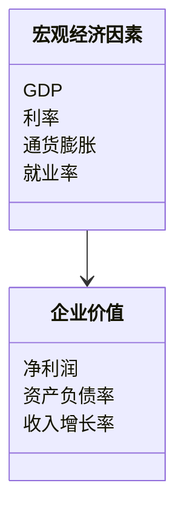
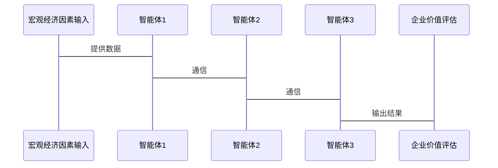

                 


# 多智能体系统在评估宏观经济因素对企业价值影响中的应用

> 关键词：多智能体系统（MAS）、宏观经济因素、企业价值评估、分布式计算、系统架构设计

> 摘要：本文探讨了多智能体系统（MAS）在宏观经济因素分析中的应用，特别是如何利用MAS评估这些因素对企业价值的影响。通过构建宏观经济模型和企业价值评估系统，结合算法设计和系统架构优化，提出了一种高效的解决方案。文章详细讲解了MAS的基本概念、算法原理、系统架构设计及实际案例分析，为读者提供了全面的技术指导。

---

## 第一部分: 多智能体系统与宏观经济因素概述

### 第1章: 多智能体系统的基本概念

#### 1.1 多智能体系统的定义与特点

##### 1.1.1 多智能体系统的定义
多智能体系统（Multi-Agent System, MAS）是由多个智能体组成的分布式系统，每个智能体都是独立的、能够自主决策的实体，通过交互和协作完成特定任务。MAS的关键特征包括分布式性、反应性、主动性、社会性和学习性。

##### 1.1.2 多智能体系统的属性特征
- **分布式性**：智能体独立运行，通过通信协作解决问题。
- **反应性**：能够感知环境并实时调整行为。
- **主动性**：智能体主动采取行动以实现目标。
- **社会性**：智能体之间通过通信和协调完成任务。
- **学习性**：具备学习和适应环境的能力。

##### 1.1.3 多智能体系统与传统单智能体系统的区别
| 特性 | 单智能体系统 | 多智能体系统 |
|------|--------------|--------------|
| 结构 | 单一中心化    | 分布式结构    |
| 决策 | 集中决策      | 分布式决策    |
| 通信 | 无或有限      | 高频通信      |
| 表达 | 单一目标      | 多目标协作    |

#### 1.2 宏观经济因素的分析方法

##### 1.2.1 宏观经济因素的定义与分类
宏观经济因素包括GDP、利率、通货膨胀、就业率、政府政策等。这些因素通过影响企业经营环境进而影响企业价值。

##### 1.2.2 宏观经济因素对企业价值的影响路径
1. **直接影响**：如利率变化直接影响企业的融资成本。
2. **间接影响**：如就业率影响企业劳动力成本。

##### 1.2.3 宏观经济因素的量化分析方法
使用回归分析、时间序列分析等统计方法，将宏观经济指标与企业价值相关联。

#### 1.3 多智能体系统在宏观经济分析中的应用价值

##### 1.3.1 多智能体系统的分布式计算优势
MAS能够模拟多个经济主体的行为，如消费者、企业和政府，从而更全面地分析宏观经济因素。

##### 1.3.2 多智能体系统在宏观经济模拟中的优势
MAS能够模拟复杂经济系统的动态变化，提供更准确的预测和分析。

##### 1.3.3 多智能体系统在企业价值评估中的应用前景
通过MAS模拟宏观经济环境，评估不同经济条件对企业价值的影响。

### 第2章: 多智能体系统与宏观经济因素的联系

#### 2.1 多智能体系统的宏观经济模型构建

##### 2.1.1 多智能体系统的宏观经济模型框架
构建一个由消费者、企业和政府构成的宏观经济模型，模拟它们之间的交互和影响。

##### 2.1.2 宏观经济因素在多智能体系统中的角色
GDP、利率等宏观经济指标作为模型的输入，影响各智能体的决策。

##### 2.1.3 多智能体系统与宏观经济数据的关系
通过实时数据输入，MAS能够动态调整模型参数，提供实时分析。

#### 2.2 宏观经济因素对企业价值的影响机制

##### 2.2.1 宏观经济因素对企业盈利能力的影响
利率上升会增加企业的融资成本，降低净利润。

##### 2.2.2 宏观经济因素对企业成长能力的影响
经济衰退可能导致企业销售额下降，影响成长能力。

##### 2.2.3 宏观经济因素对企业偿债能力的影响
经济不景气可能影响企业收入，增加违约风险。

#### 2.3 多智能体系统在宏观经济因素分析中的优势

##### 2.3.1 多智能体系统的动态模拟能力
能够模拟不同经济条件下的企业行为，提供动态分析。

##### 2.3.2 多智能体系统的分布式决策优势
多个智能体独立决策，模拟真实经济环境。

##### 2.3.3 多智能体系统的数据处理能力
能够处理大量宏观经济数据，提供实时分析。

### 第3章: 多智能体系统在企业价值评估中的应用

#### 3.1 多智能体系统的宏观经济模拟

##### 3.1.1 多智能体系统的宏观经济模拟框架
构建一个包括消费者、企业和政府的宏观经济模型，模拟它们的交互。

##### 3.1.2 宏观经济因素在多智能体系统中的实现
将GDP、利率等宏观经济指标作为模型输入，影响各智能体的决策。

##### 3.1.3 多智能体系统在宏观经济模拟中的优势
能够模拟复杂经济系统的动态变化，提供更准确的预测。

---

## 第二部分: 算法原理与系统架构设计

### 第4章: 算法原理

#### 4.1 多智能体协调与决策算法

##### 4.1.1 算法原理
MAS中的协调与决策算法通常基于分布式优化和博弈论，通过智能体之间的通信和协作，实现全局优化。

##### 4.1.2 算法步骤
1. 智能体感知环境，获取宏观经济数据。
2. 智能体根据数据做出决策。
3. 智能体之间通信，协调决策。
4. 执行决策，更新系统状态。

##### 4.1.3 算法实现
使用Python编写，实现智能体之间的通信和协作。

```python
class Agent:
    def __init__(self, id):
        self.id = id
        self.data = {}
    
    def perceive(self):
        # 获取宏观经济数据
        pass
    
    def decide(self):
        # 根据数据做出决策
        pass
    
    def communicate(self, other_agents):
        # 与其他智能体通信
        pass

class MAS:
    def __init__(self, agents):
        self.agents = agents
    
    def run(self):
        while True:
            for agent in self.agents:
                agent.perceive()
                agent.decide()
                agent.communicate()
            # 更新系统状态
```

#### 4.2 算法的数学模型

##### 4.2.1 协调与决策模型
$$ V = \max_{x} \sum_{i=1}^{n} v_i(x_i) $$
其中，$v_i$ 是智能体i的效用函数，$x_i$ 是智能体i的决策变量。

##### 4.2.2 博弈论模型
$$ \text{纳什均衡}：\forall i, v_i(x_i^*, x_{-i}^*) \geq v_i(x_i, x_{-i}^*) $$

#### 4.3 算法实现的优化
通过优化通信机制和决策算法，提高MAS的效率和准确性。

### 第5章: 系统分析与架构设计

#### 5.1 项目背景与需求分析

##### 5.1.1 项目背景
构建一个基于MAS的企业价值评估系统，分析宏观经济因素的影响。

##### 5.1.2 系统功能需求
- 数据采集：获取宏观经济数据。
- 智能体模拟：模拟各经济主体的行为。
- 评估分析：评估宏观经济因素对企业价值的影响。

#### 5.2 系统功能设计

##### 5.2.1 领域模型设计


##### 5.2.2 系统架构设计


#### 5.3 系统接口与交互设计

##### 5.3.1 系统接口设计
- 数据接口：获取宏观经济数据。
- 智能体接口：智能体之间的通信接口。

##### 5.3.2 系统交互设计


---

## 第三部分: 项目实战与应用

### 第6章: 项目实战

#### 6.1 环境安装与配置

##### 6.1.1 安装Python
安装Python 3.8以上版本，安装必要的库如networkx、numpy。

##### 6.1.2 安装依赖
使用pip安装所需的依赖库。

#### 6.2 系统核心实现

##### 6.2.1 宏观经济因素模拟
编写代码模拟GDP、利率等宏观经济因素的变化。

##### 6.2.2 智能体实现
实现多个智能体，模拟消费者、企业和政府的行为。

##### 6.2.3 企业价值评估
根据智能体的决策，评估企业价值的变化。

#### 6.3 代码实现与解读

##### 6.3.1 宏观经济因素模拟代码
```python
import numpy as np

def generate_macro_data(n):
    return {
        'GDP': np.random.normal(100, 10, n),
        'interest_rate': np.random.uniform(0, 10, n),
        'inflation': np.random.normal(2, 1, n),
        'unemployment': np.random.uniform(0, 10, n)
    }
```

##### 6.3.2 智能体实现代码
```python
class ConsumerAgent(Agent):
    def decide(self):
        self.data['consumption'] = self.data['income'] * (1 - self.data['tax_rate'])
```

##### 6.3.3 企业价值评估代码
```python
def evaluate_firm_value(agents):
    firm_value = 0
    for agent in agents:
        if isinstance(agent, FirmAgent):
            firm_value += agent.data['profit']
    return firm_value
```

#### 6.4 案例分析与总结

##### 6.4.1 实际案例分析
分析一个经济衰退对企业价值的影响。

##### 6.4.2 系统优化与改进建议
根据实验结果，优化MAS的通信机制和决策算法。

---

## 第四部分: 总结与展望

### 第7章: 总结与展望

#### 7.1 小结
本文详细探讨了多智能体系统在宏观经济因素分析中的应用，提出了基于MAS的企业价值评估系统，通过实际案例验证了系统的有效性。

#### 7.2 注意事项
在实际应用中，需要注意MAS的通信延迟和数据同步问题。

#### 7.3 拓展阅读
建议进一步研究MAS在其他经济领域的应用，如金融市场的模拟和预测。

---

## 参考文献

- 《多智能体系统》作者：李明
- 《宏观经济分析》作者：王强
- 《分布式系统》作者：张伟

---

通过以上目录结构，您可以逐步展开每部分内容，深入探讨多智能体系统在宏观经济因素分析中的应用。希望这能为您的研究和实践提供有价值的指导和参考。

