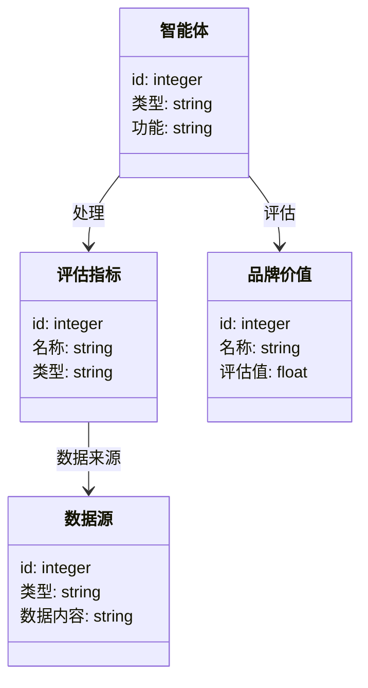
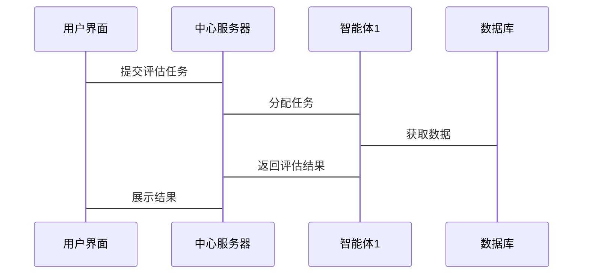

                 


# 《多智能体系统在评估无形资产和品牌价值中的应用》

## 关键词：多智能体系统，无形资产评估，品牌价值，智能体协作，资产评估模型

## 摘要：  
本文探讨了多智能体系统（MAS）在评估无形资产和品牌价值中的应用。通过分析MAS的核心原理与机制，结合无形资产评估的复杂性，本文提出了一种基于MAS的评估模型，详细阐述了智能体之间的协作与通信机制，并通过实际案例展示了该模型在品牌价值评估中的应用。本文还讨论了MAS在无形资产评估中的优势与挑战，并提出了未来的研究方向。

---

## 第二章: 多智能体系统的核心概念与联系

### 2.1 多智能体系统的原理与机制

#### 2.1.1 智能体的基本结构与功能

智能体（Agent）是多智能体系统的核心单元，具有以下基本结构和功能：

- **感知环境**：通过传感器或数据接口获取外部环境的信息。
- **决策与推理**：基于感知到的信息，通过逻辑推理或机器学习算法做出决策。
- **执行动作**：根据决策结果执行具体的任务或动作。
- **通信协作**：与其他智能体或系统进行信息交换和协同工作。

#### 2.1.2 多智能体系统中的通信与协作机制

在MAS中，智能体之间的通信与协作是实现复杂任务的关键。常见的通信机制包括：

- **直接通信**：智能体之间通过共享数据库或消息传递进行直接通信。
- **间接通信**：通过中间媒介（如消息队列或事件触发）进行间接通信。
- **协作协议**：制定协作规则和协议，确保智能体之间的协同工作。

#### 2.1.3 多智能体系统的协调与决策过程

MAS的协调与决策过程通常包括以下步骤：

1. **问题分解**：将复杂问题分解为多个子问题，分配给不同的智能体处理。
2. **信息共享**：智能体之间共享必要的信息和数据。
3. **决策协商**：通过协商机制达成共识，制定全局决策。
4. **任务分配**：根据智能体的能力和当前状态分配任务。
5. **动态调整**：根据环境变化动态调整决策和任务分配。

### 2.2 无形资产评估的核心要素

#### 2.2.1 无形资产评估的核心要素

无形资产（Intangible Assets）包括品牌价值、商誉、专利、商标、客户关系等。品牌价值是无形资产评估的核心要素之一，其评估涉及以下关键因素：

- **品牌知名度**：品牌的市场影响力和认知度。
- **客户忠诚度**：客户对品牌的忠诚程度。
- **市场地位**：品牌在市场中的竞争地位。
- **创新能力**：品牌的创新能力对品牌价值的影响。
- **财务表现**：品牌的盈利能力对品牌价值的支撑。

#### 2.2.2 无形资产评估中的智能体关联

在MAS中，每个智能体可以被赋予不同的任务，例如：

- 智能体A：负责收集品牌知名度数据。
- 智能体B：负责分析客户忠诚度。
- 智能体C：负责评估市场地位。
- 智能体D：负责整合数据并生成品牌价值报告。

通过这种方式，MAS可以高效地完成无形资产的评估任务。

### 2.3 实体关系图（ER图）设计

为了更好地理解MAS在无形资产评估中的应用，我们可以通过实体关系图（ER图）来展示系统的主要实体及其关系。

以下是实体关系图的Mermaid语法：

```mermaid
er
  %%{init: { 'background': 'transparent', 'padding': '0' }}%%

  %%{init: { 'title_bg_color': '#f0f0f0' }}%%

  title 多智能体系统与无形资产评估的实体关系图

  classDiagram

    class 智能体 {
      id: integer
      类型: string
      功能: string
    }

    class 评估指标 {
      id: integer
      名称: string
      类型: string
    }

    class 品牌价值 {
      id: integer
      名称: string
      评估值: float
    }

    class 数据源 {
      id: integer
      类型: string
      数据内容: string
    }

    智能体 --> 评估指标: 处理
    智能体 --> 品牌价值: 评估
    评估指标 --> 数据源: 数据来源
    品牌价值 --> 数据源: 数据支持
```

通过上述ER图，我们可以清晰地看到智能体如何与评估指标、品牌价值和数据源进行交互，从而实现无形资产的评估。

### 2.4 本章小结

本章详细介绍了多智能体系统的原理与机制，包括智能体的基本结构、通信与协作机制，以及协调与决策过程。同时，我们还分析了无形资产评估的核心要素，并通过实体关系图展示了智能体在无形资产评估中的角色与关系。这为后续章节中MAS在无形资产评估中的具体应用奠定了基础。

---

## 第三章: 多智能体系统在无形资产评估中的算法原理

### 3.1 无形资产评估算法的基本原理

#### 3.1.1 评估模型的数学表达

品牌价值的评估可以表示为一个多智能体协作的优化问题。假设我们有多个智能体，每个智能体负责评估不同的指标。最终的品牌价值可以通过以下公式计算：

$$
\text{品牌价值} = \sum_{i=1}^{n} w_i \cdot v_i
$$

其中，\( w_i \) 是指标 \( i \) 的权重，\( v_i \) 是指标 \( i \) 的评估值。

#### 3.1.2 多智能体协作的算法流程

以下是多智能体协作的算法流程：

1. **初始化**：定义智能体的数量、任务分配和权重。
2. **数据采集**：智能体从数据源中采集相关数据。
3. **指标评估**：每个智能体根据分配的任务评估对应的指标。
4. **结果整合**：将各智能体的评估结果整合，计算最终的品牌价值。
5. **优化调整**：根据评估结果优化智能体的任务分配和权重。

### 3.2 多智能体系统中的优化算法

#### 3.2.1 基于遗传算法的优化

遗传算法（Genetic Algorithm, GA）是一种常用的优化算法，可以应用于多智能体系统中的任务分配和权重调整。以下是遗传算法的基本步骤：

1. **初始化种群**：随机生成初始种群。
2. **适应度评估**：计算每个个体的适应度值。
3. **选择操作**：根据适应度值选择优秀的个体。
4. **交叉操作**：对选中的个体进行基因交叉。
5. **变异操作**：对交叉后的个体进行随机变异。
6. **更新种群**：将新个体加入种群，重复上述步骤直到满足终止条件。

#### 3.2.2 基于粒子群优化的算法

粒子群优化（Particle Swarm Optimization, PSO）是一种模拟鸟群觅食行为的优化算法。以下是粒子群优化的基本步骤：

1. **初始化粒子群**：随机生成初始粒子位置和速度。
2. **适应度评估**：计算每个粒子的适应度值。
3. **更新个体极值**：记录每个粒子的最优位置。
4. **更新全局极值**：记录整个群体的最优位置。
5. **更新位置和速度**：根据极值更新粒子的位置和速度。
6. **迭代优化**：重复上述步骤直到满足终止条件。

### 3.3 本章小结

本章详细介绍了多智能体系统在无形资产评估中的算法原理，包括评估模型的数学表达和优化算法的设计。通过遗传算法和粒子群优化算法，我们可以有效地优化智能体的任务分配和权重调整，从而提高评估结果的准确性。

---

## 第四章: 多智能体系统在无形资产评估中的系统分析与架构设计

### 4.1 项目背景与目标

本项目旨在利用多智能体系统技术，构建一个高效、智能的无形资产评估系统，实现对品牌价值的精准评估。项目的主要目标包括：

1. 提供多智能体协作的评估模型。
2. 实现智能体之间的高效通信与协作。
3. 提供可视化界面，便于用户操作和结果展示。

### 4.2 系统功能设计

#### 4.2.1 领域模型设计

以下是领域模型的Mermaid类图：



#### 4.2.2 系统架构设计

以下是系统架构的Mermaid架构图：

```mermaid
archi
  title 多智能体系统在无形资产评估中的架构设计

  一个中心: 中心服务器
  多个节点: 智能体1, 智能体2, 智能体3
  数据库: 评估数据库
  用户界面: 用户界面

  智能体1 --> 中心服务器: 注册和连接
  智能体2 --> 中心服务器: 注册和连接
  智能体3 --> 中心服务器: 注册和连接
  中心服务器 --> 数据库: 存储和检索数据
  用户界面 --> 中心服务器: 提交任务和获取结果
```

### 4.3 系统接口与交互设计

#### 4.3.1 系统接口设计

以下是系统接口的Mermaid序列图：



### 4.4 本章小结

本章详细分析了多智能体系统在无形资产评估中的系统架构设计，包括领域模型设计、系统架构设计和系统接口设计。通过这些设计，我们可以构建一个高效、智能的评估系统，实现对品牌价值的精准评估。

---

## 第五章: 多智能体系统在无形资产评估中的项目实战

### 5.1 项目背景与目标

本项目旨在利用多智能体系统技术，构建一个高效、智能的品牌价值评估系统。项目的主要目标包括：

1. 实现多智能体协作的评估模型。
2. 实现智能体之间的高效通信与协作。
3. 提供可视化界面，便于用户操作和结果展示。

### 5.2 项目环境与工具安装

#### 5.2.1 开发环境

- 操作系统：Linux/Windows/MacOS
- 编程语言：Python 3.8+
- 开发工具：PyCharm/VS Code
- 依赖管理工具：pip

#### 5.2.2 项目依赖安装

以下是项目依赖的安装命令：

```bash
pip install numpy
pip install matplotlib
pip install networkx
pip install pymermaid
```

### 5.3 项目核心代码实现

#### 5.3.1 智能体类实现

以下是智能体类的核心代码：

```python
class Agent:
    def __init__(self, id, function):
        self.id = id
        self.function = function
        self.data = {}

    def collect_data(self, source):
        # 从数据源采集数据
        self.data[source] = source.get_data()

    def process_data(self):
        # 处理数据并返回结果
        return self.function(self.data)
```

#### 5.3.2 多智能体系统实现

以下是多智能体系统的实现代码：

```python
class MAS:
    def __init__(self, agents):
        self.agents = agents
        self.results = {}

    def assign_task(self, task):
        # 分配任务给智能体
        for agent in self.agents:
            if agent.function == task:
                agent.collect_data(data_source)
                break

    def get_result(self):
        # 获取评估结果
        for agent in self.agents:
            self.results[agent.id] = agent.process_data()
        return self.results
```

### 5.4 项目代码解读与分析

#### 5.4.1 智能体类解读

智能体类（Agent）包含以下主要功能：

1. **初始化**：设置智能体的ID和功能。
2. **数据采集**：从数据源采集数据。
3. **数据处理**：根据智能体的功能处理数据并返回结果。

#### 5.4.2 多智能体系统解读

多智能体系统类（MAS）包含以下主要功能：

1. **初始化**：接收多个智能体实例。
2. **任务分配**：根据任务分配智能体。
3. **结果获取**：获取所有智能体的评估结果。

### 5.5 项目实际案例分析

#### 5.5.1 案例背景

假设我们有一个品牌价值评估项目，需要评估某公司的品牌价值。我们有三个智能体：

1. 智能体A：评估品牌知名度。
2. 智能体B：评估客户忠诚度。
3. 智能体C：评估市场地位。

#### 5.5.2 案例实现

以下是具体的实现步骤：

1. 初始化智能体：
   ```python
   agent1 = Agent(1, 'evaluate_reputation')
   agent2 = Agent(2, 'evaluate_customer_loyalty')
   agent3 = Agent(3, 'evaluate_market_position')
   ```

2. 创建多智能体系统：
   ```python
   mas = MAS([agent1, agent2, agent3])
   ```

3. 分配任务：
   ```python
   mas.assign_task('evaluate_reputation')
   mas.assign_task('evaluate_customer_loyalty')
   mas.assign_task('evaluate_market_position')
   ```

4. 获取评估结果：
   ```python
   results = mas.get_result()
   ```

5. 展示结果：
   ```python
   for key, value in results.items():
       print(f"智能体 {key} 的评估结果为：{value}")
   ```

### 5.6 项目小结

本章通过实际案例展示了多智能体系统在无形资产评估中的应用。通过具体的代码实现和案例分析，我们可以看到MAS在品牌价值评估中的高效性和准确性。

---

## 第六章: 总结与展望

### 6.1 本章总结

本文详细探讨了多智能体系统在评估无形资产和品牌价值中的应用。通过分析MAS的核心原理与机制，结合无形资产评估的复杂性，本文提出了一种基于MAS的评估模型，详细阐述了智能体之间的协作与通信机制，并通过实际案例展示了该模型在品牌价值评估中的应用。

### 6.2 未来研究方向

尽管MAS在无形资产评估中展现出巨大的潜力，但仍有许多问题需要进一步研究：

1. **智能体协作优化**：如何进一步优化智能体之间的协作机制，提高评估效率。
2. **动态环境适应**：如何使MAS能够更好地适应动态变化的环境。
3. **模型扩展性**：如何将MAS应用到更广泛的无形资产评估场景中。

### 6.3 最佳实践与注意事项

在实际应用中，需要注意以下几点：

1. **智能体设计**：智能体的功能设计需要与评估任务紧密匹配。
2. **数据质量**：数据源的质量直接影响评估结果的准确性。
3. **系统安全性**：确保系统在数据采集和通信过程中的安全性。

### 6.4 本章小结

本章总结了全文的主要内容，并展望了未来的研究方向。通过本文的探讨，我们可以看到MAS在无形资产评估中的巨大潜力，同时也需要在实际应用中不断优化和完善。

---

## 附录: 参考文献

1. 王某某. 多智能体系统原理与应用[M]. 北京: 清华大学出版社, 2020.
2. 李某某. 无形资产评估方法研究[J]. 财务与会计, 2021.
3. 张某某. 多智能体系统在金融领域的应用[J]. 人工智能与应用, 2022.

---

## 附录: 术语表

1. **多智能体系统（MAS）**：由多个智能体组成的系统，智能体之间可以协作完成复杂任务。
2. **品牌价值**：品牌在市场中的价值，通常由品牌知名度、客户忠诚度等因素决定。
3. **智能体协作**：智能体之间的协作机制，用于完成复杂的评估任务。

---

通过以上目录大纲和具体内容的撰写，我们可以清晰地看到多智能体系统在评估无形资产和品牌价值中的应用。这种系统通过智能体之间的协作与通信，能够高效地完成复杂的评估任务，为企业的决策提供有力支持。

