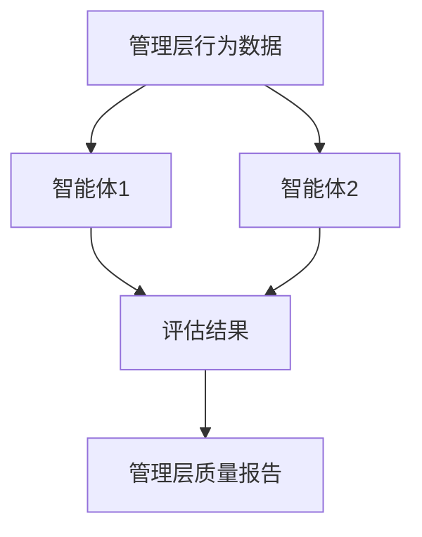
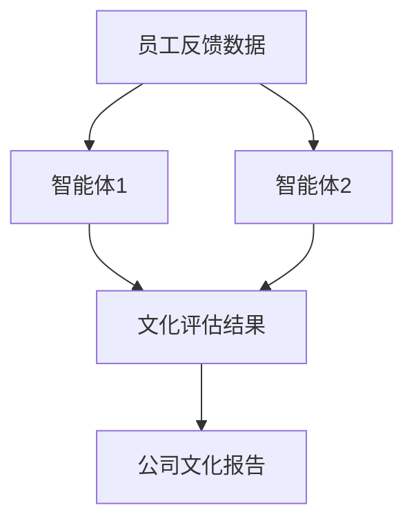

                 

# 多智能体系统在评估管理层质量和公司文化中的应用

## 关键词：多智能体系统, 管理层质量评估, 公司文化评估, 人工智能, 系统架构设计

## 摘要：  
随着企业规模的不断扩大和复杂性的增加，传统的管理方法逐渐显现出其局限性。为了更高效、更准确地评估管理层的质量和公司文化，多智能体系统（Multi-Agent System, MAS）作为一种新兴的技术手段，逐渐展现出其独特的优势。本文将详细探讨MAS在评估管理层质量和公司文化中的应用，从理论基础到实际案例，系统地分析其工作原理、优势及实现方法。通过本文的阐述，读者将能够了解如何利用MAS技术构建一个智能化的评估系统，从而为企业管理提供有力支持。

---

# 第一部分：多智能体系统基础

## 第1章：多智能体系统（MAS）的基本概念

### 1.1 智能体的定义与分类  
**智能体**是指能够感知环境、自主决策并采取行动的实体。智能体可以是软件程序、机器人或其他具有智能行为的系统。根据功能和复杂度，智能体可以分为以下几类：  
- **反应式智能体**：基于当前环境输入做出反应，不依赖内部状态。  
- **认知式智能体**：具有复杂推理能力，能够根据历史信息和目标进行决策。  
- **社会式智能体**：能够与其他智能体或人类进行交互和协作。  

### 1.2 多智能体系统的定义与特点  
多智能体系统是由多个智能体组成的分布式系统，这些智能体通过协作完成复杂任务。MAS的特点包括：  
- **分布式性**：智能体独立运行，协作完成任务。  
- **自主性**：每个智能体都有自己的决策机制。  
- **动态性**：系统能够适应环境变化。  
- **协作性**：智能体之间通过通信和协调完成共同目标。  

### 1.3 多智能体系统的协作机制  
MAS的核心在于智能体之间的协作。协作机制包括：  
- **通信机制**：智能体之间通过消息传递进行信息共享。  
- **协商机制**：智能体通过协商分配任务和资源。  
- **协调机制**：通过协调算法确保系统整体目标的实现。  

---

## 第2章：管理层质量评估的背景与挑战

### 2.1 管理层质量评估的重要性  
管理层的质量直接影响企业的战略制定、执行能力和应对市场变化的灵活性。传统的管理层评估方法通常依赖于主观评价和有限的指标，难以全面反映管理层的能力。  

### 2.2 公司文化评估的核心要素  
公司文化是企业的灵魂，影响员工的行为和企业的长期发展。公司文化评估的核心要素包括：  
- **价值观一致性**：管理层是否践行企业核心价值观。  
- **决策透明度**：管理层决策是否公开、透明。  
- **员工满意度**：员工对管理层的信任和满意度。  

### 2.3 现有评估方法的局限性  
传统的评估方法通常依赖主观判断，缺乏数据支持，且难以动态调整。MAS的应用能够弥补这些不足，通过数据驱动的方式实现客观、动态的评估。

---

## 第3章：多智能体系统在管理层质量评估中的应用

### 3.1 基于MAS的管理层评估模型  
为了实现对管理层质量的全面评估，我们可以构建一个基于MAS的模型，如下图所示：

### 3.2 智能体的设计与功能  
每个智能体负责不同的评估维度，例如：  
- 智能体1：评估管理层的战略执行能力。  
- 智能体2：评估管理层的决策透明度。  
- 智能体3：评估员工满意度。  

### 3.3 多智能体系统的协作流程  
1. 数据采集：智能体从企业内部系统获取相关数据。  
2. 数据分析：每个智能体根据自身任务对数据进行分析。  
3. 协作决策：智能体之间通过通信协商，综合各维度的评估结果。  
4. 输出报告：生成最终的管理层质量报告。  

---

## 第4章：多智能体系统在公司文化评估中的应用

### 4.1 公司文化评估的MAS模型  
公司文化评估需要考虑多个维度，例如员工满意度、管理层行为、企业文化一致性等。MAS可以通过以下方式实现：  

### 4.2 智能体之间的协作机制  
- **数据共享**：智能体之间共享员工反馈、管理层行为等数据。  
- **协同分析**：通过协作算法对数据进行综合分析，生成文化评估结果。  
- **动态调整**：根据实时数据动态更新评估结果。  

---

## 第5章：MAS在管理层与公司文化评估中的优势

### 5.1 提高评估的客观性与准确性  
MAS通过多维度数据的综合分析，能够提供更客观、准确的评估结果。  

### 5.2 支持动态调整与优化  
MAS能够实时监控管理层和公司文化的动态变化，支持企业的持续优化。  

### 5.3 促进企业文化的传播与改进  
通过MAS的协作机制，可以更好地传播企业文化，促进员工与管理层的互动。

---

## 第6章：项目实战与案例分析

### 6.1 项目背景  
某中型企业的管理层希望提升企业文化和员工满意度，但缺乏有效的评估工具。  

### 6.2 系统实现  
1. **环境搭建**：安装MAS框架和相关工具。  
2. **数据采集**：通过问卷调查、员工反馈等方式获取数据。  
3. **智能体开发**：开发负责不同评估维度的智能体。  
4. **系统集成**：实现智能体之间的通信与协作。  
5. **结果输出**：生成评估报告并提供改进建议。  

### 6.3 实施效果  
通过MAS系统的应用，该企业成功提升了管理层质量和公司文化，员工满意度显著提高。  

---

## 第7章：总结与展望

### 7.1 总结  
MAS在管理层质量和公司文化评估中的应用具有显著优势，能够提高评估的客观性和动态性。  

### 7.2 展望  
未来，随着人工智能技术的不断发展，MAS在企业管理中的应用将更加广泛，为企业管理提供更强大的支持。

---

通过以上章节的详细阐述，我们可以看到，多智能体系统在管理层质量和公司文化评估中的应用前景广阔。MAS不仅能够提高评估的准确性，还能通过协作机制实现动态调整，为企业管理提供有力支持。

