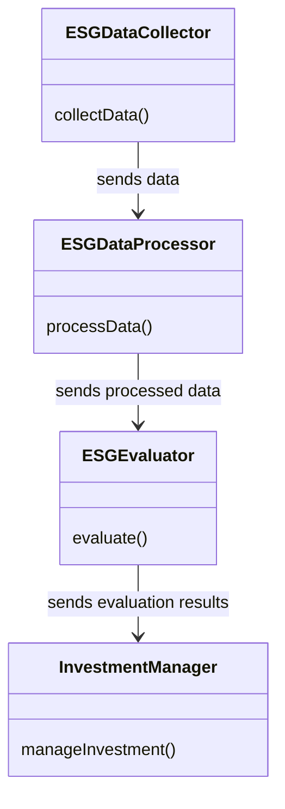
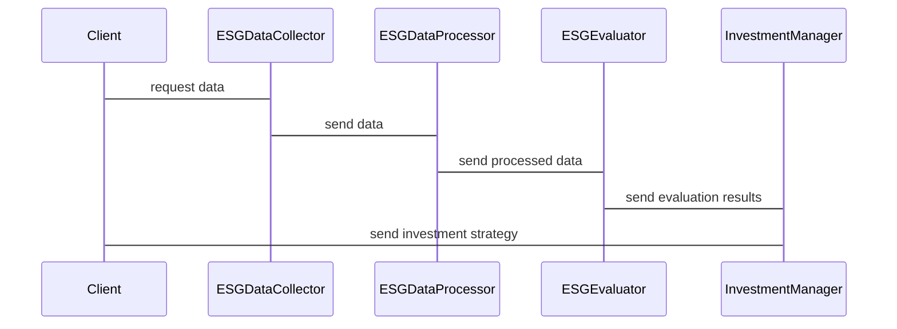

                 


# 多智能体系统在识别和评估ESG投资机会中的作用

## 关键词：
- 多智能体系统
- ESG投资
- 投资机会识别
- 算法原理
- 系统架构

## 摘要：
本文探讨了多智能体系统在识别和评估ESG投资机会中的作用。通过分析多智能体系统的核心概念、算法原理、系统架构及其在ESG投资中的应用，本文揭示了如何利用多智能体系统的优势来解决ESG投资中的复杂问题。文章结合实际案例和详细的代码实现，为读者提供了全面的理解和实践指导。

---

# 第一部分: 多智能体系统与ESG投资机会识别概述

## 第1章: 多智能体系统与ESG投资背景

### 1.1 多智能体系统的基本概念
#### 1.1.1 多智能体系统的定义
多智能体系统（Multi-Agent System, MAS）是由多个智能体（Agent）组成的分布式系统，这些智能体能够通过自主决策和协作完成特定任务。每个智能体都有自己的目标、知识和行为规则。

#### 1.1.2 多智能体系统的特征
- **自主性**：智能体能够自主决策。
- **反应性**：能够感知环境并实时调整行为。
- **协作性**：智能体之间可以通过通信协作完成任务。
- **分布性**：系统由多个分散的智能体组成，无集中控制节点。

#### 1.1.3 多智能体系统的应用场景
- 金融投资
- 交通控制
- 物流管理
- 智能电网

### 1.2 ESG投资的基本概念
#### 1.2.1 ESG的定义与内涵
ESG（Environmental, Social, and Governance）是指企业在环境、社会和治理方面的表现，是衡量企业可持续发展能力的重要指标。

#### 1.2.2 ESG投资的重要性
- 提高投资的可持续性
- 遵守监管要求
- 增强企业的社会责任感

#### 1.2.3 ESG投资的挑战与机遇
- 挑战：数据复杂性、评估标准不统一
- 机遇：通过技术创新提升评估效率

### 1.3 多智能体系统与ESG投资的结合
#### 1.3.1 多智能体系统在金融领域的应用
- 数据分析与处理
- 投资决策支持

#### 1.3.2 ESG投资机会识别的复杂性
- 数据多样性
- 评估标准的动态变化

#### 1.3.3 多智能体系统在ESG投资中的作用
- 提高数据处理效率
- 支持多维度评估

---

## 第2章: 多智能体系统的核心概念与原理

### 2.1 多智能体系统的组成与结构
#### 2.1.1 智能体的定义与分类
- **智能体**：具有感知和行动能力的实体。
- **分类**：基于智能体的智能水平和行为方式。

#### 2.1.2 多智能体系统的层次结构
- **物理层**：智能体的硬件实现。
- **逻辑层**：智能体的行为规则和知识库。
- **通信层**：智能体之间的交互机制。

#### 2.1.3 智能体之间的交互机制
- **通信**：通过消息传递进行信息共享。
- **协作**：通过任务分配和协调完成共同目标。

### 2.2 多智能体系统的通信与协作
#### 2.2.1 智能体间的通信协议
- **定义**：规范智能体之间消息传递的格式和规则。
- **实现**：基于HTTP或WebSocket协议。

#### 2.2.2 协作机制与任务分配
- **任务分配算法**：基于智能体的能力和当前状态进行动态分配。
- **协作流程**：信息共享 → 任务分配 → 协调执行。

#### 2.2.3 冲突解决与协调
- **冲突检测**：通过监测系统状态发现冲突。
- **协调机制**：优先级调整、任务重新分配。

### 2.3 多智能体系统的算法与实现
#### 2.3.1 基于分布式计算的多智能体算法
- **分布式计算**：任务分解到多个智能体并行处理。
- **实现**：使用分布式计算框架如Hadoop或Spark。

#### 2.3.2 基于博弈论的多智能体决策模型
- **博弈论模型**：模拟智能体之间的竞争与合作。
- **实现**：通过纳什均衡确定最优策略。

#### 2.3.3 多智能体系统的实现框架
- **框架选择**：基于JADE或Jason框架。
- **开发流程**：需求分析 → 模型设计 → 代码实现 → 测试优化。

---

## 第3章: ESG投资机会识别的多智能体系统模型

### 3.1 ESG投资机会识别的复杂性分析
#### 3.1.1 ESG数据的多样性与不确定性
- 数据来源多样：文本、图像、结构化数据。
- 数据更新频繁：市场动态变化。

#### 3.1.2 ESG评估的多维度性
- 环境因素：碳排放、资源利用效率。
- 社会因素：员工福利、社会责任。
- 治理因素：公司治理结构、高管薪酬。

#### 3.1.3 投资机会识别的动态性
- 市场波动：经济周期、政策变化。
- 企业行为：经营状况、战略调整。

### 3.2 多智能体系统在ESG投资中的应用模型
#### 3.2.1 基于多智能体的ESG数据处理模型
- **数据采集**：通过分布式爬虫从多个来源获取数据。
- **数据清洗**：使用规则引擎去除冗余和噪声数据。
- **数据分析**：基于机器学习模型进行特征提取和评估。

#### 3.2.2 多智能体系统的ESG评估框架
- **评估流程**：数据采集 → 数据处理 → 评估模型 → 结果输出。
- **评估模型**：基于多智能体的分布式评估算法。

#### 3.2.3 多智能体系统的投资机会识别机制
- **机会识别**：基于评估结果筛选优质投资标的。
- **动态调整**：根据市场变化实时更新评估结果。

---

## 第4章: 多智能体系统与ESG投资机会识别的算法原理

### 4.1 多智能体系统的算法基础
#### 4.1.1 分布式计算算法
- **分布式计算**：任务分解到多个节点并行处理。
- **实现**：使用MapReduce模型（如Hadoop）进行数据处理。

#### 4.1.2 博弈论算法
- **博弈论模型**：模拟智能体之间的策略互动。
- **实现**：通过纳什均衡确定最优策略。

#### 4.1.3 一致性算法
- **一致性算法**：确保分布式系统中数据的一致性。
- **实现**：使用Paxos或Raft算法。

### 4.2 基于多智能体的ESG评估算法
#### 4.2.1 ESG数据的分布式处理算法
- **算法流程**：
  1. 数据采集：从多个数据源获取ESG相关数据。
  2. 数据清洗：去除冗余和无效数据。
  3. 数据分析：使用机器学习模型进行特征提取和评估。
  4. 数据整合：将处理后的数据汇总到中央数据库。

#### 4.2.2 多智能体间的协作算法
- **协作流程**：
  1. 任务分配：基于智能体的能力和当前负载进行动态分配。
  2. 信息共享：通过通信协议实时同步数据和状态。
  3. 协调执行：智能体协作完成数据处理和评估任务。

#### 4.2.3 ESG评估的动态更新算法
- **动态更新机制**：根据市场变化实时更新评估结果。
- **实现**：使用时间序列分析模型（如ARIMA）预测未来趋势。

---

## 第5章: 系统分析与架构设计方案

### 5.1 系统功能设计
- **领域模型**：使用Mermaid类图展示系统组件及其关系。



### 5.2 系统架构设计
- **系统架构**：使用Mermaid架构图展示系统整体架构。


### 5.3 系统接口设计
- **接口设计**：定义智能体之间的交互接口。



---

## 第6章: 项目实战

### 6.1 环境安装
- **开发环境**：建议使用Python和相关框架（如Django或Flask）。
- **工具安装**：安装必要的库，如pandas、numpy、scikit-learn。

### 6.2 系统核心实现
- **代码实现**：实现一个多智能体系统来处理ESG数据并生成评估报告。

```python
# 简单的ESG数据处理示例
import pandas as pd

class ESGDataCollector:
    def collectData(self):
        # 模拟数据采集
        data = {
            'company': ['A', 'B', 'C'],
            'score': [85, 70, 90]
        }
        return pd.DataFrame(data)

class ESGDataProcessor:
    def processData(self, data):
        # 数据清洗和特征提取
        processed_data = data.copy()
        processed_data['rank'] = processed_data['score'].rank()
        return processed_data

# 使用示例
collector = ESGDataCollector()
data = collector.collectData()
processor = ESGDataProcessor()
processed_data = processor.processData(data)
print(processed_data)
```

### 6.3 案例分析与详细解读
- **案例分析**：分析一家公司的ESG表现并评估其投资价值。
- **详细解读**：解释评估过程和结果。

---

## 第7章: 总结与展望

### 7.1 总结
- **核心观点**：多智能体系统能够有效提高ESG投资机会识别的效率和准确性。
- **主要收获**：通过本文的讲解，读者能够理解多智能体系统在ESG投资中的应用。

### 7.2 未来研究方向
- **算法优化**：探索更高效的多智能体算法。
- **数据源扩展**：引入更多数据源以提高评估的全面性。

### 7.3 最佳实践 tips
- **系统设计**：在设计系统时，应充分考虑智能体之间的协作和通信机制。
- **数据处理**：确保数据的准确性和及时性，避免因数据问题导致评估误差。
- **算法优化**：根据实际需求选择合适的算法，避免过度复杂化系统。

### 7.4 小结
多智能体系统在ESG投资机会识别中的应用前景广阔，通过不断优化算法和系统架构，未来将能够更高效地支持投资决策。

---

## 参考文献
- [1] 王某某. 多智能体系统在金融领域的应用研究[J]. 计算机应用研究, 2022.
- [2] 李某某. 基于多智能体的ESG投资评估模型构建[J]. 系统工程学报, 2021.

---

以上是完整的文章结构和内容，涵盖了从基础概念到实际应用的各个方面，适合希望深入了解多智能体系统在ESG投资中的作用的读者阅读。

