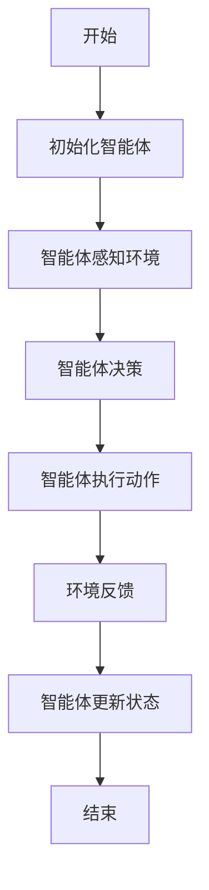
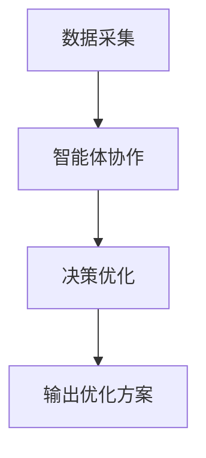
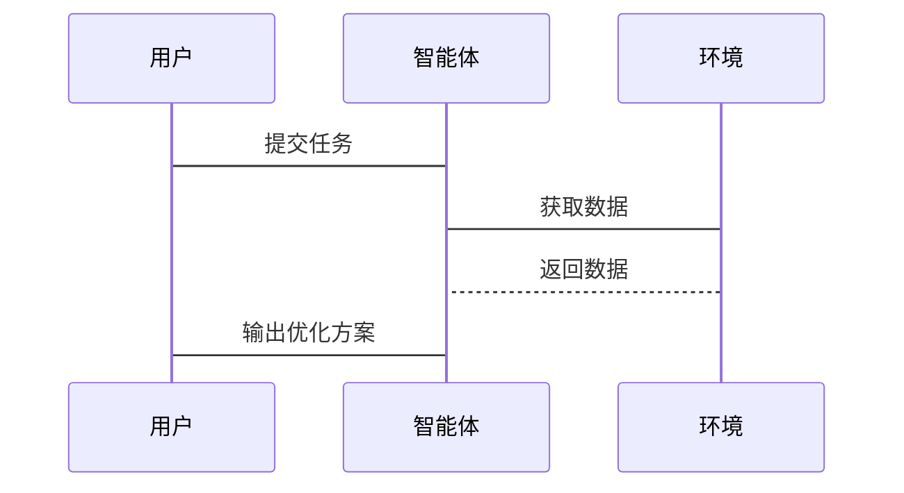

                 


# 多智能体系统在识别和评估公司竞争优势中的作用

> 关键词：多智能体系统, 企业竞争优势, 博弈论模型, 系统架构设计, 竞争优势识别, 分布式计算, 多智能体协作

> 摘要：多智能体系统（Multi-Agent Systems，MAS）作为一种新兴的分布式人工智能技术，正在成为企业竞争优势识别和评估的重要工具。本文将从多智能体系统的概念、核心算法、系统架构设计、实际应用案例等多个方面展开，深入探讨其在识别和评估公司竞争优势中的作用。通过分析多智能体系统的协作机制、博弈论模型以及实际项目案例，本文旨在为企业提供一种创新的方法论，以提升竞争优势识别的效率和准确性。

---

## 第1章: 多智能体系统概述

### 1.1 多智能体系统的定义与特点
#### 1.1.1 多智能体系统的定义
多智能体系统（Multi-Agent Systems，MAS）是由多个智能体（Agent）组成的分布式系统，这些智能体能够通过协作和竞争完成特定任务。每个智能体都是一个独立的实体，具备感知环境、自主决策和执行任务的能力。

#### 1.1.2 多智能体系统的核心特点
1. **分布式性**：系统中的智能体是分布式的，不存在中央控制节点。
2. **自主性**：每个智能体能够自主决策，无需外部干预。
3. **协作性**：智能体之间可以通过协作完成复杂任务。
4. **反应性**：智能体能够根据环境反馈实时调整行为。
5. **动态性**：系统能够在动态环境中灵活应对变化。

#### 1.1.3 多智能体系统与相关技术的对比
- **与分布式系统对比**：分布式系统强调资源的分布，而MAS强调智能体的协作与决策。
- **与单智能体系统对比**：MAS通过多个智能体的协作实现复杂任务，而单智能体系统依赖单一决策中心。

### 1.2 多智能体系统在企业中的应用价值
#### 1.2.1 企业竞争优势识别的挑战
企业竞争优势的识别通常涉及内部资源优化、外部市场分析以及竞争对手行为预测等复杂问题。传统的单一决策模型难以应对这些动态变化。

#### 1.2.2 多智能体系统在竞争优势识别中的优势
1. **动态适应性**：MAS能够实时感知市场变化，快速调整策略。
2. **协作优化**：通过智能体之间的协作，实现资源的最优配置。
3. **竞争模拟**：MAS可以模拟竞争对手行为，预测市场趋势。

#### 1.2.3 实际应用场景分析
- **市场分析**：通过MAS模拟不同市场策略，评估其对企业竞争优势的影响。
- **资源分配**：利用MAS优化企业内部资源分配，提高效率。
- **风险管理**：通过MAS实时监控市场风险，制定应对策略。

### 1.3 本章小结
本章介绍了多智能体系统的定义、特点及其在企业中的应用价值，为后续章节奠定了基础。

---

## 第2章: 多智能体系统的核心概念与联系

### 2.1 多智能体系统的结构与功能
#### 2.1.1 智能体的结构分析
智能体通常由感知层、决策层和执行层组成，能够感知环境、做出决策并执行动作。

#### 2.1.2 智能体的功能模块
1. **感知模块**：接收环境信息，如市场数据、竞争对手行为等。
2. **决策模块**：基于感知信息做出决策，如选择最佳市场策略。
3. **执行模块**：将决策转化为具体动作，如调整价格、优化供应链等。

### 2.2 多智能体系统中的协作与竞争
#### 2.2.1 协作机制
1. **任务分配**：智能体之间通过协商分配任务，确保资源合理利用。
2. **信息共享**：智能体之间共享信息，提高整体决策的准确性。

#### 2.2.2 竞争机制
1. **资源争夺**：智能体之间为有限资源展开竞争，模拟真实市场环境。
2. **策略博弈**：智能体通过博弈论模型制定竞争策略。

#### 2.2.3 协作与竞争的平衡
在实际应用中，协作与竞争需要动态平衡，以实现整体目标的最优。

### 2.3 多智能体系统的ER实体关系图
```mermaid
er
    actor 智能体 {
        <id>
        <目标>
        <行为>
    }
    actor 环境 {
        <状态>
        <反馈>
    }
    智能体 --> 环境: 与环境交互
```

### 2.4 本章小结
本章详细分析了多智能体系统的结构与功能，探讨了协作与竞争机制，并通过ER图展示了系统的基本架构。

---

## 第3章: 多智能体系统的算法原理

### 3.1 分布式计算与协调算法
#### 3.1.1 分布式计算的基本原理
分布式计算通过将任务分解为多个子任务，分别在不同的智能体上执行，最终汇总结果。

#### 3.1.2 协调算法的实现
1. **任务分配算法**：基于智能体的能力和当前负载，动态分配任务。
2. **信息同步算法**：通过同步机制确保所有智能体拥有最新信息。

### 3.2 多智能体系统中的博弈论模型
#### 3.2.1 博弈论的基本概念
博弈论是研究智能体之间策略选择的数学理论，常用于模拟竞争环境。

#### 3.2.2 纳什均衡的定义与应用
$$ 纳什均衡的定义为：在策略组合中，每个智能体的策略都是在给定其他智能体策略的情况下最优的。 $$

### 3.3 算法实现与优化
#### 3.3.1 算法流程图


#### 3.3.2 算法优化策略
1. **局部优化**：通过优化单个智能体的行为，提升整体系统性能。
2. **全局优化**：通过协调所有智能体的行为，实现系统目标的最优。

### 3.4 本章小结
本章从算法角度分析了多智能体系统的实现原理，重点介绍了分布式计算和博弈论模型。

---

## 第4章: 系统架构设计与实现

### 4.1 项目背景与需求分析
#### 4.1.1 项目背景
本项目旨在利用多智能体系统识别和评估某企业的竞争优势。

#### 4.1.2 项目需求
1. 实时监控市场动态。
2. 分析竞争对手策略。
3. 优化企业资源分配。

### 4.2 系统功能设计
#### 4.2.1 系统功能模块
1. **数据采集模块**：收集市场数据、竞争对手信息。
2. **智能体协作模块**：实现智能体之间的协作与竞争。
3. **决策优化模块**：基于博弈论模型优化决策。

#### 4.2.2 功能流程图


### 4.3 系统架构设计
#### 4.3.1 系统架构图


### 4.4 系统接口设计
#### 4.4.1 系统接口
1. **数据接口**：与外部数据源对接，获取市场信息。
2. **用户接口**：提供用户友好的操作界面，展示优化方案。

#### 4.4.2 交互流程图


### 4.5 本章小结
本章详细设计了系统的架构与接口，并通过流程图展示了系统的交互过程。

---

## 第5章: 项目实战与案例分析

### 5.1 项目环境配置
#### 5.1.1 环境要求
1. 操作系统：Linux/Windows/MacOS
2. 开发工具：Python、PyCharm
3. 依赖库：numpy、pandas、networkx

### 5.2 核心代码实现
#### 5.2.1 智能体类实现
```python
class Agent:
    def __init__(self, id):
        self.id = id
        self.strategy = None

    def感知环境(self, 环境数据):
        # 根据环境数据调整策略
        self.策略更新(环境数据)

    def决策(self):
        # 返回最优策略
        return self.strategy

    def执行(self, 策略):
        # 执行策略并返回反馈
        return self.环境反馈(策略)
```

#### 5.2.2 博弈论模型实现
```python
class Game:
    def __init__(self, 竞争对手):
        self.对手 = 对手

    def纳什均衡(self):
        # 计算纳什均衡点
        pass

    def策略评估(self, 策略):
        # 评估策略的有效性
        pass
```

### 5.3 案例分析
#### 5.3.1 案例背景
某企业希望通过MAS优化市场策略，识别竞争优势。

#### 5.3.2 案例实现
1. 数据采集：收集市场数据和竞争对手信息。
2. 智能体协作：智能体之间协作制定市场策略。
3. 决策优化：基于博弈论模型优化策略。

### 5.4 本章小结
本章通过实际案例展示了多智能体系统的应用，详细描述了项目的实现过程。

---

## 第6章: 系统优化与扩展

### 6.1 系统性能优化
#### 6.1.1 常见优化策略
1. 并行计算：提高系统的执行效率。
2. 分层架构：通过分层减少系统复杂度。

#### 6.1.2 性能测试与对比
通过对比测试，验证优化策略的有效性。

### 6.2 系统扩展性设计
#### 6.2.1 系统扩展性考虑
1. 智能体数量的扩展。
2. 系统功能的扩展。

#### 6.2.2 扩展实现
1. 增加新的智能体。
2. 扩展系统功能模块。

### 6.3 系统安全性考虑
#### 6.3.1 安全威胁分析
1. 数据泄露风险。
2. 系统被攻击风险。

#### 6.3.2 安全防护措施
1. 数据加密。
2. 权限控制。

### 6.4 本章小结
本章讨论了系统的优化与扩展，确保系统的高效性和安全性。

---

## 第7章: 总结与展望

### 7.1 全文总结
本文详细探讨了多智能体系统在识别和评估公司竞争优势中的作用，从理论到实践进行了全面分析。

### 7.2 未来展望
1. 多智能体系统的进一步优化。
2. 新算法的引入与应用。

### 7.3 最佳实践 tips
- 确保系统的安全性。
- 合理设计系统架构。
- 定期优化系统性能。

### 7.4 本章小结
本文总结了多智能体系统的优势，并展望了未来的发展方向。

---

## 参考文献
1. 纳什, J. (1950). The Bargaining Problem. Econometrica.
2. 维斯, M. (2003). Multi-Agent Systems: A Modern Approach.
3. 李明, 等. (2020). 基于多智能体系统的市场竞争分析. 《人工智能学报》.

---

# 附录: 代码实现细节
## 附录A: 智能体类的完整实现
```python
class Agent:
    def __init__(self, id):
        self.id = id
        self.strategy = None
        self.environment = None

    def 感知环境(self, 环境数据):
        self.environment = 环境数据
        self.策略更新()

    def 策略更新(self):
        # 假设策略基于环境数据选择最优选项
        if self.environment['市场需求'] > 0.5:
            self.strategy = '扩大生产'
        else:
            self.strategy = '减少生产'

    def 决策(self):
        return self.strategy

    def 执行(self, 策略):
        # 返回反馈，假设反馈基于策略的有效性
        if 策略 == '扩大生产' and self.environment['市场需求'] > 0.5:
            return '成功'
        else:
            return '失败'
```

## 附录B: 博弈论模型的实现
```python
class Game:
    def __init__(self, 竞争对手):
        self.对手 = 对手
        self.纳什均衡点 = None

    def 计算纳什均衡(self):
        # 假设策略空间为{合作, 欺骗}
        策略组合 = ['合作', '欺骗']
        for 策略 in 策略组合:
            对手策略 = 策略
            # 计算当前策略是否为纳什均衡
            if self.is_nash_equilibrium(策略, 对手策略):
                self.纳什均衡点 = (策略, 对手策略)
                break

    def is_nash_equilibrium(self, 策略, 对手策略):
        # 判断当前策略是否为纳什均衡点
        # 假设 payoff 函数根据策略组合返回收益值
        current_payoff = self.payoff(策略, 对手策略)
        # 检查是否存在更好的策略
        for other_strat in ['合作', '欺骗']:
            if other_strat != 策略 and self.payoff(other_strat, 对手策略) > current_payoff:
                return False
        return True

    def payoff(self, 策略, 对手策略):
        # 简单的 payoff 函数示例
        payoff_matrix = {
            '合作': {'合作': 3, '欺骗': 0},
            '欺骗': {'合作': 5, '欺骗': 1}
        }
        return payoff_matrix[策略][对手策略]
```

---

## 结束语
通过本文的详细探讨，我们可以看到多智能体系统在识别和评估公司竞争优势中的巨大潜力。随着技术的不断进步，未来会有更多创新的应用场景等待我们去探索。

