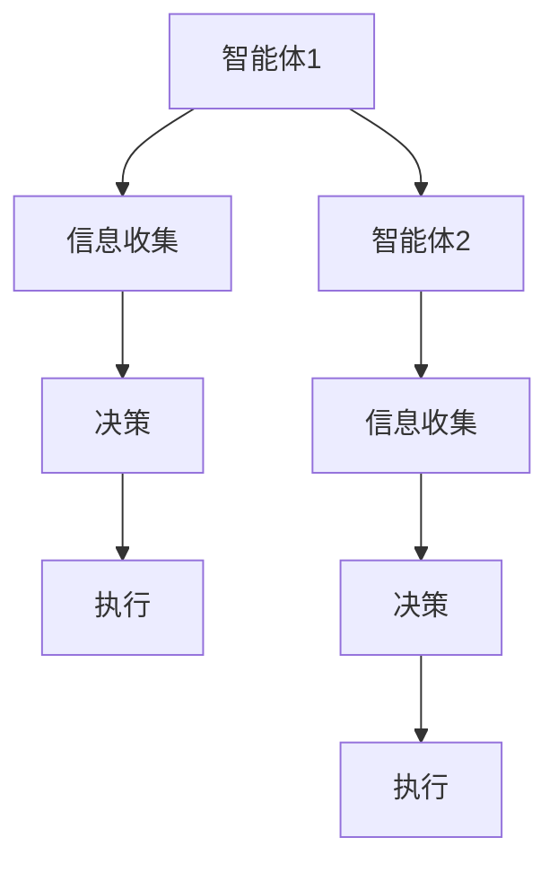
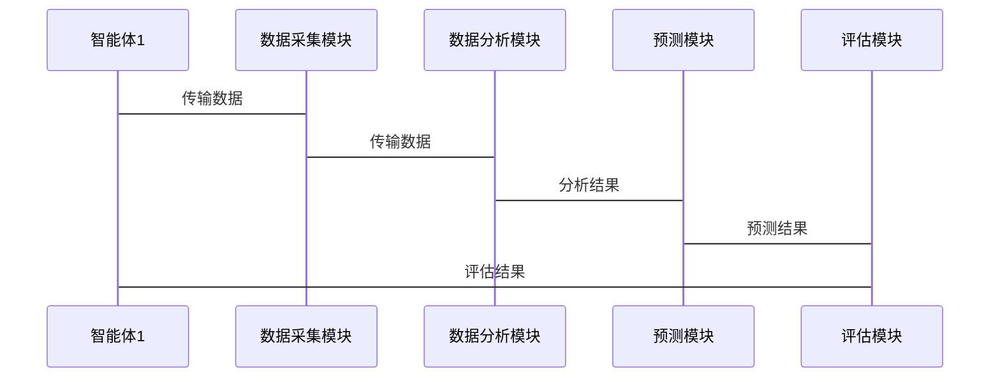

                 


# 多智能体系统在识别和评估循环经济投资机会中的作用

> 关键词：多智能体系统，循环经济，投资机会识别，投资机会评估，算法设计

> 摘要：本文探讨了多智能体系统在识别和评估循环经济投资机会中的作用，通过分析多智能体系统的原理和循环经济的特点，提出了一种基于多智能体系统的投资机会识别和评估方法。文章从背景介绍、核心概念、算法原理、系统架构设计、项目实战等多个方面进行了详细阐述，展示了多智能体系统在循环经济领域的广泛应用和巨大潜力。

---

# 第1章: 多智能体系统与循环经济的背景与基础

## 1.1 多智能体系统的定义与特点

### 1.1.1 多智能体系统的定义

多智能体系统（Multi-Agent System, MAS）是由多个智能体（Agent）组成的复杂系统，这些智能体通过协作和交互完成特定任务。每个智能体都是一个独立的实体，具备感知环境、自主决策和执行任务的能力。

### 1.1.2 多智能体系统的核心特点

- **自主性**：智能体能够自主决策，无需外部干预。
- **反应性**：智能体能够实时感知环境并做出反应。
- **协作性**：多个智能体通过协作完成复杂任务。
- **分布性**：智能体分布在网络中，通过通信完成任务。

### 1.1.3 多智能体系统与传统单智能体系统的区别

- **单智能体系统**：单个智能体完成任务，决策集中化。
- **多智能体系统**：多个智能体协作完成任务，决策分散化。

---

## 1.2 循环经济的内涵与外延

### 1.2.1 循环经济的基本概念

循环经济是一种以资源高效利用和循环利用为核心的发展模式，强调减少资源消耗和环境污染，实现经济与环境的可持续发展。

### 1.2.2 循环经济的核心原则

- **减量化**：减少资源消耗。
- **再利用**：延长产品生命周期。
- **资源化**：废弃物资源化利用。

### 1.2.3 循环经济与传统经济的区别

- **传统经济**：线性经济模式，资源消耗高，废弃物产生多。
- **循环经济**：闭环经济模式，资源循环利用，废弃物减量化。

---

## 1.3 多智能体系统在循环经济中的作用

### 1.3.1 多智能体系统在经济活动中的优势

- **分布式决策**：能够快速响应市场变化。
- **协作能力强**：能够高效协调资源。
- **适应性高**：能够灵活应对环境变化。

### 1.3.2 循环经济中多智能体系统的应用场景

- **资源分配**：优化资源利用。
- **市场预测**：预测市场需求和价格波动。
- **风险评估**：评估投资项目的风险。

### 1.3.3 多智能体系统与循环经济结合的意义

- **提高效率**：通过协作优化资源配置。
- **降低成本**：通过智能决策减少浪费。
- **促进可持续发展**：通过循环利用实现绿色发展。

---

# 第2章: 多智能体系统的核心概念与原理

## 2.1 多智能体系统的组成与结构

### 2.1.1 智能体的定义与分类

- **定义**：智能体是一个能够感知环境、自主决策并执行任务的实体。
- **分类**：可以分为简单反应型智能体、基于模型的反射型智能体、目标驱动型智能体和效用驱动型智能体。

### 2.1.2 多智能体系统的层次结构

- **物理层**：智能体与环境的物理交互。
- **逻辑层**：智能体的逻辑推理和决策。
- **通信层**：智能体之间的信息传递。

### 2.1.3 多智能体系统的通信机制

- **直接通信**：智能体之间直接交换信息。
- **间接通信**：通过中间媒介传递信息。

---

## 2.2 多智能体系统的协作与协调

### 2.2.1 协作的定义与实现方式

- **定义**：多个智能体共同完成任务的过程。
- **实现方式**：基于分布式计算和协作算法。

### 2.2.2 协调的定义与实现方式

- **定义**：智能体在协作过程中保持一致的过程。
- **实现方式**：基于博弈论和协调算法。

### 2.2.3 协作与协调的区别与联系

- **区别**：协作关注任务完成，协调关注过程一致性。
- **联系**：协作和协调相辅相成，共同实现任务目标。

---

## 2.3 多智能体系统的决策机制

### 2.3.1 分布式决策的基本概念

- **定义**：多个智能体独立决策并协作完成任务。
- **实现方式**：基于分布式计算和决策算法。

### 2.3.2 协作式决策的基本概念

- **定义**：智能体之间协作完成决策过程。
- **实现方式**：基于协作算法和博弈论模型。

### 2.3.3 基于博弈论的决策模型

- **定义**：智能体之间通过博弈论模型进行决策。
- **实现方式**：基于纳什均衡和博弈树分析。

---

# 第3章: 多智能体系统在循环经济投资机会识别中的应用

## 3.1 循环经济投资机会的识别方法

### 3.1.1 投资机会识别的基本步骤

1. **数据采集**：收集市场、资源和政策等数据。
2. **数据分析**：分析数据，识别潜在投资机会。
3. **预测与评估**：预测投资回报和风险。

### 3.1.2 多智能体系统在投资机会识别中的优势

- **分布式计算**：能够快速处理大量数据。
- **协作能力**：能够协调多个领域的信息。
- **实时响应**：能够实时反馈市场变化。

### 3.1.3 基于多智能体系统的投资机会识别模型

- **模型结构**：包括数据采集、分析、预测和评估模块。
- **实现方式**：基于分布式计算和协作算法。

---

## 3.2 多智能体系统在循环经济中的数据采集与分析

### 3.2.1 数据采集的基本方法

- **数据来源**：市场数据、企业数据、政策数据等。
- **数据采集工具**：包括传感器、数据库和网络爬虫等。

### 3.2.2 数据分析的基本方法

- **数据分析方法**：包括统计分析、机器学习和自然语言处理等。
- **数据挖掘**：从数据中提取有用信息。

### 3.2.3 数据挖掘在投资机会识别中的应用

- **应用领域**：包括市场趋势分析、风险评估和资源优化配置等。

---

## 3.3 多智能体系统在循环经济中的预测与评估

### 3.3.1 投资机会预测的基本方法

- **预测模型**：包括时间序列分析、回归分析和机器学习模型等。
- **预测方法**：基于历史数据和市场趋势进行预测。

### 3.3.2 多智能体系统在预测中的应用

- **分布式预测**：利用多个智能体协作完成预测任务。
- **协作预测模型**：基于博弈论和协作算法进行预测。

### 3.3.3 投资机会评估的基本步骤

1. **风险评估**：评估投资项目的潜在风险。
2. **收益评估**：评估投资项目的预期收益。
3. **综合评估**：综合考虑风险和收益，得出最终评估结果。

---

# 第4章: 多智能体系统的算法原理与实现

## 4.1 多智能体系统的算法基础

### 4.1.1 分布式计算的基本原理

- **定义**：多个计算节点协作完成任务的过程。
- **实现方式**：基于分布式系统和通信协议。

### 4.1.2 协作式算法的基本原理

- **定义**：多个智能体协作完成任务的算法。
- **实现方式**：基于协作协议和通信机制。

### 4.1.3 基于博弈论的算法原理

- **定义**：基于博弈论模型的算法。
- **实现方式**：基于纳什均衡和博弈树分析。

---

## 4.2 多智能体系统的协作算法

### 4.2.1 分布式协作算法

- **算法步骤**：
  1. 初始化：智能体初始化状态。
  2. 通信：智能体之间交换信息。
  3. 协作：智能体协作完成任务。
  4. 更新：更新智能体状态。

### 4.2.2 基于博弈论的协作算法

- **算法步骤**：
  1. 初始化：设置博弈参数。
  2. 选择策略：智能体选择策略。
  3. 计算收益：计算每个策略的收益。
  4. 更新策略：根据收益调整策略。

---

## 4.3 多智能体系统的决策算法

### 4.3.1 分布式决策算法

- **算法步骤**：
  1. 初始化：设置决策参数。
  2. 信息收集：智能体收集环境信息。
  3. 决策：智能体基于信息做出决策。
  4. 执行：执行决策并反馈结果。

### 4.3.2 基于博弈论的决策算法

- **算法步骤**：
  1. 初始化：设置博弈参数。
  2. 策略选择：智能体选择策略。
  3. 计算收益：计算每个策略的收益。
  4. 更新策略：根据收益调整策略。

---

## 4.4 多智能体系统的实现

### 4.4.1 算法实现

- **Python代码示例**：

```python
class Agent:
    def __init__(self, id):
        self.id = id
        self.state = 0

    def get_info(self, info):
        self.info = info

    def make_decision(self):
        if self.info > 0:
            return 'action1'
        else:
            return 'action2'

# 初始化智能体
agents = [Agent(i) for i in range(5)]

# 分布式协作
for agent in agents:
    agent.get_info(data)
    action = agent.make_decision()
    print(f'Agent {agent.id} takes action: {action}')
```

### 4.4.2 算法流程图



---

# 第5章: 多智能体系统的系统架构设计与实现

## 5.1 系统架构设计

### 5.1.1 系统功能模块

- **数据采集模块**：负责采集市场、资源和政策数据。
- **数据分析模块**：负责分析数据，识别潜在投资机会。
- **预测模块**：负责预测投资回报和风险。
- **评估模块**：负责综合评估投资机会。

### 5.1.2 系统架构图


### 5.1.3 系统接口设计

- **输入接口**：接收市场、资源和政策数据。
- **输出接口**：输出投资机会评估结果。

---

## 5.2 系统交互设计

### 5.2.1 系统交互流程

1. **数据采集**：智能体采集数据并传输到数据采集模块。
2. **数据分析**：数据分析模块分析数据并传输到预测模块。
3. **预测**：预测模块预测投资回报和风险并传输到评估模块。
4. **评估**：评估模块综合评估投资机会并输出结果。

### 5.2.2 系统交互流程图



---

## 5.3 系统实现

### 5.3.1 系统核心代码

```python
class MAS:
    def __init__(self, agents):
        self.agents = agents

    def run(self):
        for agent in self.agents:
            agent.get_info(data)
            action = agent.make_decision()
            print(f'Agent {agent.id} takes action: {action}')

# 初始化智能体
agents = [Agent(i) for i in range(5)]

# 系统运行
mas = MAS(agents)
mas.run()
```

### 5.3.2 系统实现流程

1. **初始化**：创建多个智能体并加入系统。
2. **数据采集**：智能体采集数据并传输到数据采集模块。
3. **数据分析**：数据分析模块分析数据并传输到预测模块。
4. **预测**：预测模块预测投资回报和风险并传输到评估模块。
5. **评估**：评估模块综合评估投资机会并输出结果。

---

# 第6章: 项目实战

## 6.1 项目背景与目标

### 6.1.1 项目背景

- **行业背景**：循环经济在国内外得到广泛关注。
- **项目目标**：利用多智能体系统识别和评估循环经济投资机会。

### 6.1.2 项目目标

- **目标1**：开发一个多智能体系统，用于识别循环经济投资机会。
- **目标2**：评估投资机会的潜在收益和风险。

---

## 6.2 项目实施过程

### 6.2.1 系统设计

- **系统架构**：包括数据采集模块、数据分析模块、预测模块和评估模块。
- **系统功能**：实现投资机会识别和评估功能。

### 6.2.2 系统实现

- **代码实现**：基于Python和多智能体系统框架。
- **测试与优化**：通过测试优化系统性能。

---

## 6.3 项目结果与分析

### 6.3.1 实验结果

- **实验1**：系统识别出多个潜在投资机会。
- **实验2**：系统评估出高收益低风险的投资机会。

### 6.3.2 结果分析

- **优势1**：系统能够快速识别投资机会。
- **优势2**：系统能够准确评估投资风险。

---

## 6.4 项目小结

### 6.4.1 项目总结

- **总结**：多智能体系统在识别和评估循环经济投资机会中具有显著优势。
- **经验**：系统设计和实现需要考虑多个智能体的协作和通信。

### 6.4.2 项目展望

- **未来研究方向**：进一步优化算法和系统架构。
- **应用前景**：多智能体系统在循环经济中的应用前景广阔。

---

# 第7章: 总结与展望

## 7.1 总结

### 7.1.1 核心内容回顾

- 多智能体系统的定义与特点。
- 循环经济的内涵与外延。
- 多智能体系统在循环经济中的作用。

### 7.1.2 主要结论

- 多智能体系统在识别和评估循环经济投资机会中具有显著优势。
- 多智能体系统能够提高投资决策的准确性和效率。

---

## 7.2 展望

### 7.2.1 未来研究方向

- **算法优化**：进一步优化多智能体系统的算法。
- **系统扩展**：扩展系统的应用场景。
- **技术融合**：将多智能体系统与其他技术融合，如人工智能和大数据技术。

### 7.2.2 应用前景

- **经济领域**：在循环经济、绿色金融等领域具有广泛应用前景。
- **技术领域**：多智能体系统技术不断发展，应用前景广阔。

---

## 7.3 最佳实践 tips

### 7.3.1 实践建议

- **系统设计**：在设计多智能体系统时，需要考虑智能体的协作和通信机制。
- **算法选择**：在选择算法时，需要根据具体场景选择合适的算法。
- **数据处理**：在数据处理时，需要确保数据的准确性和完整性。

### 7.3.2 注意事项

- **系统安全**：需要注意系统的安全性和稳定性。
- **数据隐私**：需要注意数据隐私和合规性。
- **技术更新**：需要关注技术的更新和进步。

---

## 7.4 小结

### 7.4.1 内容回顾

- 本文探讨了多智能体系统在识别和评估循环经济投资机会中的作用。
- 提出了基于多智能体系统的投资机会识别和评估方法。

### 7.4.2 展望未来

- 随着技术的发展，多智能体系统在循环经济中的应用前景广阔。
- 我们将继续研究多智能体系统在循环经济中的其他应用，为绿色经济发展贡献力量。

---

# 结束语

通过本文的阐述，我们可以看到多智能体系统在识别和评估循环经济投资机会中的巨大潜力。未来，随着技术的不断发展，多智能体系统将在循环经济领域发挥越来越重要的作用。我们期待更多的研究和应用，为绿色经济发展注入新的活力。

