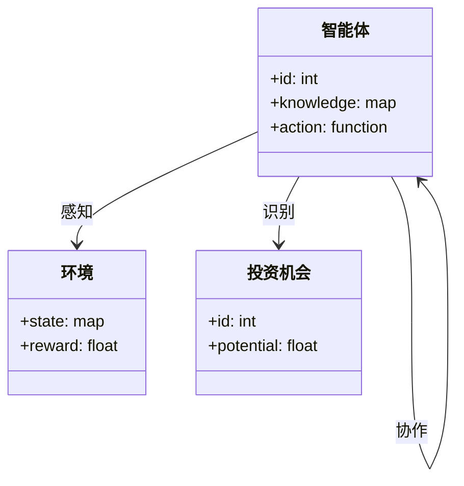

                 


# 多智能体系统在识别和评估新兴行业投资机会中的作用

## 关键词：
- 多智能体系统 (Multi-Agent System)
- 投资机会识别
- 新兴行业
- 智能体协作
- 投资评估

## 摘要：
多智能体系统（MAS）通过多个智能体的协作与竞争，有效识别和评估新兴行业的投资机会。本文从MAS的核心概念、算法原理到系统架构，详细探讨其在投资领域的应用，提供实际案例和代码实现，帮助读者理解MAS的优势和应用价值。

---

## 第1章: 多智能体系统概述

### 1.1 多智能体系统的定义与特点
#### 1.1.1 多智能体系统的定义
多智能体系统是由多个智能体组成的复杂系统，智能体通过协作与竞争完成特定目标。

#### 1.1.2 多智能体系统的核心特点
- **分布式**：多个智能体独立运行。
- **协作性**：智能体之间协同工作。
- **动态性**：系统状态随环境变化。

#### 1.1.3 多智能体系统与单智能体系统的区别
| 特性 | 单智能体系统 | 多智能体系统 |
|------|--------------|--------------|
| 独立性 | 高           | 高           |
| 协作性 | 低           | 高           |
| 复杂性 | 低           | 高           |

### 1.2 多智能体系统的组成与结构
#### 1.2.1 智能体的定义与分类
- **定义**：智能体是具有感知和行动能力的实体。
- **分类**：基于行为、智能水平等分类。

#### 1.2.2 多智能体系统的组成结构
- **环境**：系统运行的背景。
- **智能体**：独立决策的个体。
- **通信机制**：智能体间信息交互的方式。

#### 1.2.3 智能体之间的交互与协作
- **协作机制**：通过协商完成任务。
- **竞争机制**：通过竞争优化决策。

### 1.3 多智能体系统在投资领域的应用背景
#### 1.3.1 投资机会识别的传统方法
- **基于经验**：依赖专家判断。
- **基于数据**：依赖数据分析。

#### 1.3.2 多智能体系统在投资机会识别中的优势
- **多维度分析**：多个智能体提供不同视角。
- **实时反馈**：快速响应市场变化。

#### 1.3.3 新兴行业投资机会的特点
- **不确定性高**：市场波动大。
- **信息不对称**：信息分布不均。

---

## 第2章: 多智能体系统的核心概念与联系

### 2.1 多智能体系统的核心概念
#### 2.1.1 智能体的属性与行为
- **属性**：智能体的特征，如知识、能力。
- **行为**：智能体的决策和行动。

#### 2.1.2 多智能体系统的协作机制
- **协作协议**：定义协作规则。
- **通信协议**：信息交互方式。

#### 2.1.3 智能体的决策过程
- **感知**：获取环境信息。
- **推理**：分析信息，做出决策。
- **行动**：执行决策。

### 2.2 多智能体系统的属性特征对比
| 特性 | 独立性 | 协作性 | 复杂性 |
|------|--------|--------|--------|
| 单智能体系统 | 高      | 低      | 低      |
| 多智能体系统 | 高      | 高      | 高      |

### 2.3 ER实体关系图架构
```mermaid
erDiagram
    customer[客户] {
        <属性>
        id : integer
        name : string
        investment : float
    }
    industry[新兴行业] {
        <属性>
        id : integer
        name : string
        growth_rate : float
    }
    opportunity[投资机会] {
        <属性>
        id : integer
        industry_id : integer
        potential : float
    }
    customer机会 <---| opportunity
    industry机会 <---| opportunity
```

---

## 第3章: 多智能体系统的算法原理

### 3.1 多智能体系统中的分布式计算
#### 3.1.1 分布式计算的基本原理
- 分布式计算：任务分解到多个节点并行处理。

#### 3.1.2 分布式计算在多智能体系统中的应用
- **任务分配**：智能体根据能力分配任务。
- **负载均衡**：动态调整任务分配。

#### 3.1.3 分布式计算的优缺点分析
- **优点**：高效率、高容错性。
- **缺点**：复杂性高、通信开销大。

### 3.2 多智能体系统的博弈论模型
#### 3.2.1 博弈论的基本概念
- **博弈论**：研究理性决策的数学理论。

#### 3.2.2 博弈论在多智能体系统中的应用
- **纳什均衡**：多个智能体策略稳定状态。

#### 3.2.3 博弈论模型的优缺点分析
- **优点**：适用于竞争性场景。
- **缺点**：难以处理动态变化。

### 3.3 多智能体系统的数学模型与公式
#### 3.3.1 纳什均衡的定义与公式
- **纳什均衡**：每个智能体策略最优。

$$ \text{纳什均衡定义为} (s_1^*, s_2^*, \dots, s_n^*) \text{，其中每个} s_i^* \text{是最佳反应} $$

#### 3.3.2 纳什均衡在多智能体系统中的应用
- **投资决策**：多个智能体在市场中的均衡策略。

---

## 第4章: 多智能体系统的系统分析与架构设计

### 4.1 投资机会识别的场景介绍
#### 4.1.1 新兴行业的定义与特点
- **新兴行业**：快速发展的新领域。

#### 4.1.2 投资机会识别的挑战与机遇
- **挑战**：信息不全、市场波动。
- **机遇**：高增长潜力。

#### 4.1.3 多智能体系统在投资机会识别中的应用
- **多维度分析**：多个智能体提供不同视角。

### 4.2 系统功能设计
#### 4.2.1 领域模型的M
- **领域模型**：描述系统的功能结构。



---

## 第5章: 项目实战

### 5.1 环境安装
- **Python**：安装Anaconda。
- **依赖库**：安装numpy、pandas、matplotlib。

### 5.2 系统核心实现源代码
```python
import numpy as np
import pandas as pd

class Agent:
    def __init__(self, id):
        self.id = id
        self.knowledge = {}
    
    def感知(self, 环境):
        self.knowledge = 环境.获取状态()
    
    def 决策(self):
        # 简单策略：随机选择
        return np.random.choice(['投资', '不投资'])
    
    def 行动(self, 机会):
        if self.决策() == '投资':
            机会.潜在 += 1

class 环境:
    def __init__(self):
        self.状态 = {}
    
    def 获取状态(self):
        return self.状态

# 创建多个智能体
智能体列表 = [Agent(i) for i in range(5)]

# 初始化环境
环境实例 = 环境()

# 智能体感知环境
for agent in 智能体列表:
    agent.感知(环境实例)

# 智能体决策和行动
投资机会 = []
for agent in 智能体列表:
    机会 = {'id': len(投资机会)+1, 'potential': 0}
    agent.行动(机会)
    投资机会.append(机会)

# 输出结果
print("投资机会数量：", len(投资机会))
```

### 5.3 代码应用解读与分析
- **智能体类**：定义智能体的行为。
- **环境类**：模拟市场环境。
- **投资机会识别**：通过智能体协作完成。

### 5.4 实际案例分析
- **案例背景**：新兴行业市场分析。
- **数据分析**：使用Python进行数据处理。
- **结果解读**：智能体协作识别投资机会。

### 5.5 项目小结
- **项目总结**：MAS的优势和局限性。
- **经验教训**：协作机制设计的重要性。

---

## 第6章: 总结与展望

### 6.1 最佳实践 tips
- **智能体设计**：明确智能体角色和责任。
- **通信机制**：确保有效信息交互。
- **博弈模型**：选择合适的博弈论模型。

### 6.2 小结
多智能体系统通过协作与竞争，有效识别和评估新兴行业的投资机会。

### 6.3 注意事项
- **复杂性**：MAS设计复杂，需谨慎处理。
- **动态性**：系统需适应市场变化。

### 6.4 拓展阅读
- 推荐书籍：《多智能体系统入门》。
- 在线资源：相关论文和博客。

---

通过以上内容，我们详细探讨了多智能体系统在识别和评估新兴行业投资机会中的作用，从理论到实践，为读者提供了全面的指导。

