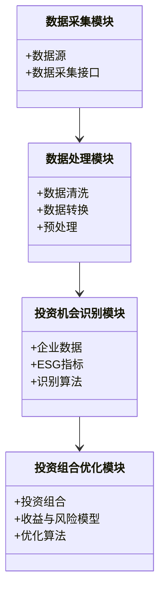
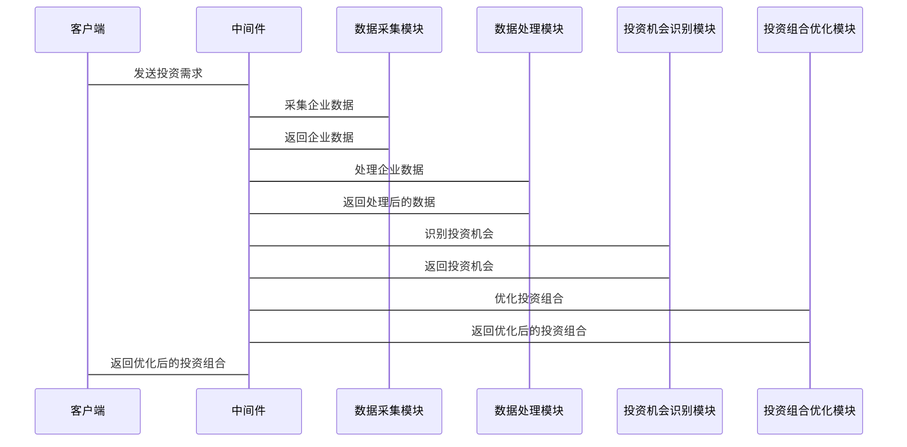

                 


# 多智能体系统在识别和评估社会责任投资机会中的作用

> **关键词**: 多智能体系统, 社会责任投资, 投资机会识别, 评估模型, 优化算法

> **摘要**: 本文探讨了多智能体系统在识别和评估社会责任投资机会中的应用。通过分析多智能体系统的原理、社会责任投资的标准，以及两者结合的优化算法，展示了如何利用多智能体系统提升社会责任投资的效率和准确性。文章结合实际案例，详细讲解了算法实现和系统架构设计，为读者提供了全面的技术视角。

---

# 第一部分: 多智能体系统与社会责任投资概述

## 第1章: 多智能体系统与社会责任投资的背景介绍

### 1.1 多智能体系统的定义与特点

#### 1.1.1 多智能体系统的定义
多智能体系统（Multi-Agent Systems, MAS）是由多个相互作用的智能体组成的系统，这些智能体能够通过协作完成复杂的任务。每个智能体都有自己的目标、知识和行为规则，能够自主决策并与其他智能体进行通信。

#### 1.1.2 多智能体系统的核心特点
- **分布式性**: 每个智能体独立运行，任务分解为多个子任务。
- **协作性**: 智能体之间通过协作完成整体目标。
- **动态性**: 系统环境和任务需求可能动态变化。
- **自治性**: 智能体能够自主决策和行动。

#### 1.1.3 多智能体系统与传统单智能体系统的区别
| 特性 | 多智能体系统 | 单智能体系统 |
|------|--------------|--------------|
| 结构  | 分布式结构   | 集中式结构   |
| 决策  | 去中心化决策 | 中心化决策   |
| 灵活性 | 高            | 较低          |

### 1.2 社会责任投资的定义与标准

#### 1.2.1 社会责任投资的定义
社会责任投资（Socially Responsible Investment, SRI）是一种投资策略，旨在在追求财务回报的同时，考虑环境、社会和治理（ESG）因素，选择符合可持续发展的企业进行投资。

#### 1.2.2 社会责任投资的核心标准
- **环境因素**: 包括碳排放、能源使用效率等。
- **社会因素**: 包括员工权益、公平劳动条件等。
- **治理因素**: 包括公司治理结构、透明度等。

#### 1.2.3 社会责任投资的分类与应用场景
社会责任投资可以分为绿色投资、道德投资和社会投资。应用场景包括能源、科技、金融等多个行业。

### 1.3 多智能体系统在社会责任投资中的作用

#### 1.3.1 多智能体系统在社会责任投资中的优势
- **高效性**: 多智能体系统能够快速处理大量数据，提高决策效率。
- **协作性**: 智能体之间的协作能够优化投资组合，降低风险。
- **动态适应性**: 系统能够实时适应市场变化，调整投资策略。

#### 1.3.2 多智能体系统如何提升社会责任投资的效率
通过分布式计算和协作机制，多智能体系统能够在短时间内分析大量企业数据，筛选出符合社会责任标准的企业。

#### 1.3.3 多智能体系统在社会责任投资中的潜在挑战
- **信息过载**: 数据量大可能导致计算复杂度高。
- **协作协调**: 智能体之间的协作需要高效的通信机制。
- **安全性**: 数据隐私和系统安全性问题需要解决。

## 第2章: 多智能体系统与社会责任投资的核心概念与联系

### 2.1 多智能体系统的原理

#### 2.1.1 多智能体系统的组成与结构
- **智能体**: 每个智能体都有独立的目标和行为规则。
- **通信机制**: 智能体之间通过通信协议进行信息交换。
- **协作机制**: 通过协作算法实现任务分配和协调。

#### 2.1.2 多智能体系统的协作机制
- **任务分配**: 根据智能体的能力分配任务。
- **信息共享**: 智能体之间共享信息，提高决策准确性。
- **冲突解决**: 处理智能体之间的冲突，确保协作顺利进行。

#### 2.1.3 多智能体系统的通信协议
- **消息传递**: 智能体之间通过消息传递信息。
- **状态共享**: 通过共享状态实现信息同步。
- **共识机制**: 通过共识算法达成一致。

### 2.2 社会责任投资的评估标准

#### 2.2.1 环境、社会和治理（ESG）指标
- **环境指标**: 包括碳排放、能源使用效率等。
- **社会指标**: 包括员工权益、公平劳动条件等。
- **治理指标**: 包括公司治理结构、透明度等。

#### 2.2.2 社会责任投资的评分方法
- **评分模型**: 根据ESG指标对目标企业进行评分。
- **权重分配**: 根据重要性分配各个指标的权重。
- **动态调整**: 根据市场变化动态调整评分标准。

#### 2.2.3 社会责任投资的动态调整机制
- **实时监控**: 实时监控企业的ESG表现。
- **反馈机制**: 根据反馈调整评分模型。
- **动态优化**: 动态优化投资组合。

### 2.3 多智能体系统与社会责任投资的联系

#### 2.3.1 多智能体系统如何优化社会责任投资的决策过程
- **分布式计算**: 多智能体系统能够快速处理大量数据，提高决策效率。
- **协作优化**: 智能体之间的协作能够优化投资组合，降低风险。
- **动态适应**: 系统能够实时适应市场变化，调整投资策略。

#### 2.3.2 多智能体系统如何提高社会责任投资的效率
- **并行处理**: 多智能体系统能够并行处理多个任务，提高处理速度。
- **信息共享**: 智能体之间共享信息，提高决策准确性。
- **资源分配**: 系统能够高效分配资源，优化投资组合。

#### 2.3.3 多智能体系统如何增强社会责任投资的透明度
- **信息透明**: 多智能体系统能够实时共享信息，提高透明度。
- **决策透明**: 系统的决策过程公开透明，便于监管和审查。
- **数据透明**: 系统的数据来源和处理过程透明，提高可信度。

---

# 第二部分: 多智能体系统在社会责任投资中的算法与数学模型

## 第3章: 多智能体系统的算法原理

### 3.1 多智能体协作算法

#### 3.1.1 分布式协作算法
- **任务分配**: 根据智能体的能力分配任务。
- **协作机制**: 通过协作算法实现任务分配和协调。
- **通信协议**: 智能体之间通过通信协议进行信息交换。

#### 3.1.2 基于博弈论的协作算法
- **博弈模型**: 建立博弈模型，分析智能体之间的策略选择。
- **纳什均衡**: 通过纳什均衡找到最优策略。
- **协作机制**: 基于博弈论的协作机制实现任务分配和协调。

#### 3.1.3 基于强化学习的协作算法
- **强化学习模型**: 建立强化学习模型，训练智能体的决策策略。
- **奖励机制**: 设定奖励机制，引导智能体做出最优决策。
- **协作机制**: 基于强化学习的协作机制实现任务分配和协调。

### 3.2 多智能体系统中的通信与协调算法

#### 3.2.1 基于消息传递的协调算法
- **消息传递机制**: 智能体之间通过消息传递信息。
- **信息同步**: 通过消息传递实现信息同步。
- **协作协调**: 通过消息传递实现协作协调。

#### 3.2.2 基于状态共享的协调算法
- **状态共享机制**: 智能体之间共享状态信息。
- **信息同步**: 通过状态共享实现信息同步。
- **协作协调**: 通过状态共享实现协作协调。

#### 3.2.3 基于共识机制的协调算法
- **共识机制**: 智能体之间通过共识机制达成一致。
- **信息同步**: 通过共识机制实现信息同步。
- **协作协调**: 通过共识机制实现协作协调。

### 3.3 多智能体系统中的决策算法

#### 3.3.1 基于规则的决策算法
- **规则库**: 建立规则库，定义智能体的决策规则。
- **决策过程**: 根据输入信息匹配规则库，得出决策结果。
- **规则优化**: 根据反馈优化规则库，提高决策准确率。

#### 3.3.2 基于逻辑推理的决策算法
- **知识库**: 建立知识库，定义智能体的知识和推理规则。
- **推理过程**: 根据知识库进行推理，得出决策结果。
- **知识优化**: 根据反馈优化知识库，提高决策准确率。

#### 3.3.3 基于机器学习的决策算法
- **机器学习模型**: 建立机器学习模型，训练智能体的决策策略。
- **训练数据**: 使用历史数据训练模型，提高决策准确率。
- **模型优化**: 根据反馈优化模型，提高决策准确率。

## 第4章: 社会责任投资的数学模型与公式

### 4.1 社会责任投资的收益与风险模型

#### 4.1.1 收益与风险的权衡公式
$$ \text{收益} = \sum_{i=1}^{n} w_i \times r_i $$
$$ \text{风险} = \sum_{i=1}^{n} w_i \times v_i $$
其中，$w_i$ 是第$i$个资产的权重，$r_i$ 是第$i$个资产的收益，$v_i$ 是第$i$个资产的风险。

#### 4.1.2 基于ESG指标的收益预测公式
$$ \text{收益预测} = \alpha \times ESG + \beta \times 市场风险 + \gamma \times 公司特有风险 $$
其中，$\alpha$, $\beta$, $\gamma$ 是系数，$ESG$ 是企业的环境、社会和治理指标。

#### 4.1.3 基于多智能体系统的风险评估公式
$$ \text{风险评估} = \sum_{j=1}^{m} \sum_{i=1}^{n} w_{ij} \times r_{ij} $$
其中，$w_{ij}$ 是第$j$个智能体对第$i$个资产的权重，$r_{ij}$ 是第$j$个智能体对第$i$个资产的评估结果。

### 4.2 多智能体系统中的优化模型

#### 4.2.1 基于多目标优化的数学模型
$$ \text{最大化} \sum_{i=1}^{n} w_i \times r_i $$
$$ \text{最小化} \sum_{i=1}^{n} w_i \times v_i $$
其中，$w_i$ 是第$i$个资产的权重，$r_i$ 是第$i$个资产的收益，$v_i$ 是第$i$个资产的风险。

#### 4.2.2 基于强化学习的优化模型
$$ \text{奖励} = \sum_{t=1}^{T} r_t $$
其中，$r_t$ 是第$t$个时间步的奖励。

#### 4.2.3 基于博弈论的优化模型
$$ \text{纳什均衡} = \{策略组合，满足每个策略都是最优反应} \} $$

---

# 第三部分: 系统分析与架构设计

## 第5章: 系统分析与架构设计方案

### 5.1 问题场景介绍

#### 5.1.1 系统目标
- 实现多智能体系统在社会责任投资中的应用。
- 提供高效、准确的投资机会识别和评估服务。

#### 5.1.2 问题描述
- 如何利用多智能体系统快速处理大量企业数据，识别符合社会责任标准的投资机会。
- 如何优化投资组合，降低风险，提高收益。

#### 5.1.3 问题解决
- 通过多智能体系统的协作机制，实现高效的数据处理和投资决策。
- 基于ESG指标，建立数学模型，优化投资组合。

### 5.2 系统功能设计

#### 5.2.1 功能模块划分
- 数据采集模块: 采集企业数据，包括财务数据、ESG指标等。
- 数据处理模块: 对采集到的数据进行清洗、转换和预处理。
- 投资机会识别模块: 基于多智能体系统的协作算法，识别符合社会责任标准的投资机会。
- 投资组合优化模块: 基于数学模型，优化投资组合，降低风险，提高收益。

#### 5.2.2 领域模型（mermaid 类图）



### 5.3 系统架构设计

#### 5.3.1 系统架构（mermaid 架构图）


#### 5.3.2 系统接口设计
- 数据采集接口: 用于采集企业数据。
- 数据处理接口: 用于处理数据。
- 投资机会识别接口: 用于识别投资机会。
- 投资组合优化接口: 用于优化投资组合。

#### 5.3.3 系统交互（mermaid 序列图）



---

# 第四部分: 项目实战

## 第6章: 项目实战

### 6.1 环境安装与配置

#### 6.1.1 环境要求
- Python 3.8 或更高版本
- 安装必要的Python库：numpy, pandas, matplotlib, scikit-learn, gym

#### 6.1.2 安装步骤
```bash
pip install numpy pandas matplotlib scikit-learn gym
```

### 6.2 核心功能实现

#### 6.2.1 多智能体协作算法实现

```python
import numpy as np
import gym
from gym import spaces

class MultiAgentEnv(gym.Env):
    def __init__(self, n_agents=3):
        super().__init__()
        self.n_agents = n_agents
        self.observation_space = spaces.Tuple([spaces.Box(low=-1, high=1, shape=(2,))]*self.n_agents)
        self.action_space = spaces.Tuple([spaces.Box(low=-1, high=1, shape=(1,))]*self.n_agents)

    def reset(self):
        self.state = np.random.random((2, self.n_agents))
        return self.state

    def step(self, action):
        # 计算奖励
        reward = np.mean(action) * np.sum(self.state)
        done = np.random.random() > 0.9
        return self.state, reward, done, {}

    def render(self):
        pass
```

#### 6.2.2 基于ESG指标的投资机会识别

```python
import pandas as pd

def load_esg_data():
    # 加载ESG数据
    data = pd.read_csv('esg_data.csv')
    return data

def identify_investment_opportunity(data):
    # 基于ESG指标识别投资机会
    for index, row in data.iterrows():
        if row['环境'] > 0.8 and row['社会'] > 0.8 and row['治理'] > 0.8:
            print(f"投资机会：{row['公司名称']}")
```

#### 6.2.3 投资组合优化

```python
import numpy as np
import pandas as pd

def optimize_portfolio(returns, risks):
    # 基于多目标优化的投资组合优化
    n_assets = len(returns)
    w = np.ones(n_assets) / n_assets
    while True:
        new_w = np.zeros(n_assets)
        for i in range(n_assets):
            new_w[i] = (returns[i] - np.dot(w, returns)) / np.dot(w, w)
        w = new_w / np.sum(new_w)
        if np.max(abs(new_w - w)) < 1e-5:
            break
    return w
```

### 6.3 项目小结

#### 6.3.1 代码实现的关键点
- 多智能体协作算法的实现：通过Gym环境实现多智能体协作。
- 投资机会识别：基于ESG指标，筛选出符合社会责任标准的企业。
- 投资组合优化：基于数学模型，优化投资组合，降低风险，提高收益。

#### 6.3.2 实际案例分析
- 数据来源：假设我们有50家企业的ESG数据，包括环境、社会和治理三个指标。
- 实施步骤：
  1. 采集企业数据。
  2. 数据处理和清洗。
  3. 识别符合社会责任标准的投资机会。
  4. 优化投资组合，降低风险，提高收益。

---

# 第五部分: 最佳实践与总结

## 第7章: 最佳实践与总结

### 7.1 最佳实践 tips

#### 7.1.1 系统设计
- 确保系统的可扩展性，以便未来增加更多的智能体。
- 采用高效的通信机制，减少信息传递的延迟。
- 建立完善的安全机制，保护系统的数据安全。

#### 7.1.2 算法优化
- 定期更新模型参数，提高系统的适应性。
- 采用分布式计算技术，提高系统的计算效率。
- 优化协作算法，减少智能体之间的冲突。

#### 7.1.3 系统维护
- 定期监控系统的运行状态，及时发现和解决问题。
- 定期备份系统数据，防止数据丢失。
- 定期更新系统软件，确保系统的安全性和稳定性。

### 7.2 小结

通过本文的探讨，我们了解到多智能体系统在识别和评估社会责任投资机会中的重要作用。多智能体系统的分布式计算和协作机制，能够高效处理大量数据，识别投资机会，优化投资组合，降低风险，提高收益。同时，基于ESG指标的数学模型，能够帮助投资者更好地评估企业，做出更科学的投资决策。

### 7.3 注意事项

- 数据质量：确保数据的准确性和完整性。
- 算法选择：根据具体需求选择合适的算法。
- 系统安全性：确保系统的数据安全和运行安全。

### 7.4 拓展阅读

- 多智能体系统的相关书籍：《Multi-Agent Systems: Algorithmic, Game-Theoretic, and Logical Foundations》。
- 社会责任投资的书籍：《Socially Responsible Investment: A Comprehensive Guide》。
- 机器学习在投资中的应用：《Machine Learning for Asset Managers》。

---

# 结语

多智能体系统在识别和评估社会责任投资机会中的应用，不仅提高了投资效率，还增强了投资的可持续性和透明度。随着技术的不断发展，多智能体系统将在社会责任投资中发挥越来越重要的作用，为投资者提供更优质的服务。

