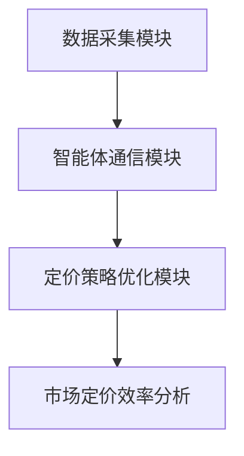

                 


# 《多智能体系统在识别市场定价效率中的应用》

> 关键词：多智能体系统, 市场定价效率, 分布式计算, 博弈论, 算法原理, 系统架构设计, 实际案例分析

> 摘要：本文系统地探讨了多智能体系统在识别市场定价效率中的应用。通过分析多智能体系统的核心概念、定价效率的数学模型、算法原理、系统架构设计以及实际项目案例，本文旨在揭示如何利用多智能体技术提高市场定价的效率和准确性。文章结构清晰，内容详实，结合理论与实践，为读者提供全面的指导。

---

# 第1章 多智能体系统与市场定价效率概述

## 1.1 多智能体系统的基本概念

### 1.1.1 多智能体系统的定义
多智能体系统（Multi-Agent System, MAS）是由多个智能体（Agent）组成的分布式系统，每个智能体能够感知环境、自主决策并与其他智能体协作完成任务。智能体可以是软件程序、机器人或其他能够执行特定任务的实体。

### 1.1.2 多智能体系统的类型
- 分布式多智能体系统：智能体分布在不同的地理位置，通过通信进行协作。
- 集中式多智能体系统：所有智能体通过中央控制器进行协调。
- 混合式多智能体系统：结合分布式和集中式的特点。

### 1.1.3 多智能体系统的核心特征
- 分布式计算：任务分布在多个智能体中。
- 自主性：智能体能够自主决策。
- 协作性：智能体之间通过通信协作完成任务。
- 反应性：智能体能够感知环境并做出实时反应。

### 1.1.4 多智能体系统的应用场景
- 电子商务
- 物流管理
- 金融市场

## 1.2 市场定价效率的定义与分析

### 1.2.1 市场定价效率的定义
市场定价效率是指市场价格能够迅速反映市场供需变化的能力。高效的价格机制能够减少市场摩擦，提高资源配置效率。

### 1.2.2 市场定价效率的影响因素
- 信息不对称
- 市场参与者的理性行为
- 市场结构

### 1.2.3 市场定价效率的衡量标准
- 价格的波动性
- 市场深度
- 市场流动性

## 1.3 多智能体系统在市场定价中的应用背景

### 1.3.1 当前市场定价的主要挑战
- 信息不对称问题
- 市场参与者的博弈行为
- 市场波动的复杂性

### 1.3.2 多智能体系统在定价中的优势
- 分布式计算能力
- 自适应性
- 协作能力

### 1.3.3 多智能体系统与市场定价效率的结合
- 通过多智能体系统实现市场信息的实时共享
- 利用博弈论模型优化定价策略
- 提高市场的透明度和效率

## 1.4 本章小结
本章介绍了多智能体系统的基本概念、类型及其在市场定价效率中的应用背景，为后续章节奠定了基础。

---

# 第2章 多智能体系统的理论基础

## 2.1 多智能体系统的通信与协调

### 2.1.1 智能体之间的通信方式
- 直接通信：智能体之间直接交换信息
- 间接通信：通过中间媒介进行信息传递

### 2.1.2 协调机制的分类与特点
- 基于规则的协调机制
- 基于博弈论的协调机制
- 基于分布式算法的协调机制

### 2.1.3 通信与协调对定价效率的影响
- 提高信息传递效率
- 优化定价策略
- 减少市场摩擦

## 2.2 多智能体系统的决策机制

### 2.2.1 分布式决策的基本概念
分布式决策是指多个智能体在没有中央控制的情况下，通过协作完成决策过程。

### 2.2.2 博弈论在多智能体决策中的应用
- 纯策略博弈
- 混合策略博弈
- 常态式博弈

### 2.2.3 基于多智能体的定价决策模型
通过构建博弈论模型，分析多个智能体在市场定价中的决策行为。

## 2.3 多智能体系统的协作机制

### 2.3.1 协作机制的分类
- 基于任务分解的协作机制
- 基于角色分配的协作机制
- 基于规则的协作机制

### 2.3.2 协作机制对市场定价效率的提升
- 提高市场参与者的协作效率
- 减少信息不对称
- 优化市场资源配置

## 2.4 本章小结
本章详细探讨了多智能体系统的通信、决策和协作机制，分析了其对市场定价效率的提升作用。

---

# 第3章 市场定价效率的数学模型与算法原理

## 3.1 定价效率的基本模型

### 3.1.1 供需模型的数学表达
供需模型描述了市场价格与供需量之间的关系。基本公式为：
$$ Q = a - bP $$
其中，Q为供需量，P为价格，a和b为常数。

### 3.1.2 市场均衡的数学条件
市场均衡是指供给等于需求时的价格。均衡价格公式为：
$$ P^* = \frac{a}{b} $$

### 3.1.3 定价效率的评价指标
- 均衡价格偏差
- 市场波动幅度
- 市场收敛速度

## 3.2 多智能体系统中的定价模型

### 3.2.1 分布式定价模型的构建
通过构建分布式定价模型，分析多个智能体在定价过程中的互动。

### 3.2.2 基于博弈论的定价模型
假设多个智能体在定价时遵循博弈论策略，构建博弈模型并求解纳什均衡。

### 3.2.3 多智能体定价模型的数学表达
假设n个智能体参与定价，每个智能体的定价策略为：
$$ P_i = \alpha + \beta x_i $$
其中，x_i为智能体i的策略变量。

## 3.3 定价效率的优化算法

### 3.3.1 基于遗传算法的优化
通过遗传算法优化定价策略，提高市场定价效率。

### 3.3.2 基于粒子群优化的定价策略
利用粒子群优化算法，寻找最优定价点。

### 3.3.3 算法的收敛性分析
通过数学分析，证明算法的收敛性及其对定价效率的提升作用。

## 3.4 本章小结
本章构建了定价效率的基本模型，并通过博弈论和优化算法，提出了多智能体系统中的定价模型和优化策略。

---

# 第4章 多智能体系统在市场定价中的实际应用

## 4.1 项目背景与目标
本项目旨在通过多智能体系统优化市场定价效率，解决传统定价方法中存在的问题。

## 4.2 系统架构设计

### 4.2.1 系统功能设计
- 数据采集模块
- 智能体通信模块
- 定价策略优化模块

### 4.2.2 系统架构图


### 4.2.3 接口设计
- 数据接口：采集市场数据
- 通信接口：智能体之间通信
- 输出接口：定价策略结果

## 4.3 系统实现与代码示例

### 4.3.1 环境安装
需要安装Python、numpy、scipy等库。

### 4.3.2 核心代码实现
```python
import numpy as np

def pricing_algorithm(data):
    # 数据预处理
    processed_data = data preprocessing
    # 定价策略优化
    optimized_price = optimize(processed_data)
    return optimized_price

def optimize(data):
    # 使用遗传算法优化定价策略
    pass
```

### 4.3.3 代码解读与分析
通过代码实现多智能体系统中的定价策略优化，分析其对市场定价效率的提升作用。

## 4.4 实际案例分析

### 4.4.1 案例背景
某电商平台希望通过多智能体系统优化商品定价策略。

### 4.4.2 案例分析
通过实际数据验证多智能体系统的定价策略，分析其效果。

## 4.5 本章小结
本章通过实际项目案例，展示了多智能体系统在市场定价效率中的应用，并验证了其有效性。

---

# 第5章 总结与展望

## 5.1 本章总结
本文系统地探讨了多智能体系统在识别市场定价效率中的应用，构建了定价效率的数学模型，并通过实际案例验证了其有效性。

## 5.2 研究展望
未来的研究方向包括：
- 更复杂的多智能体系统架构设计
- 更高效的定价优化算法
- 多智能体系统在其他领域的应用

## 5.3 小结
多智能体系统在市场定价效率中的应用具有广阔前景，值得进一步研究和探索。

---

# 参考文献
（此处列出相关的参考文献）

---

通过以上目录结构，文章系统地探讨了多智能体系统在识别市场定价效率中的应用，从理论到实践，结合数学模型和实际案例，为读者提供全面的指导。

