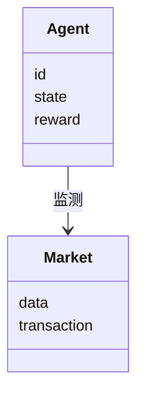
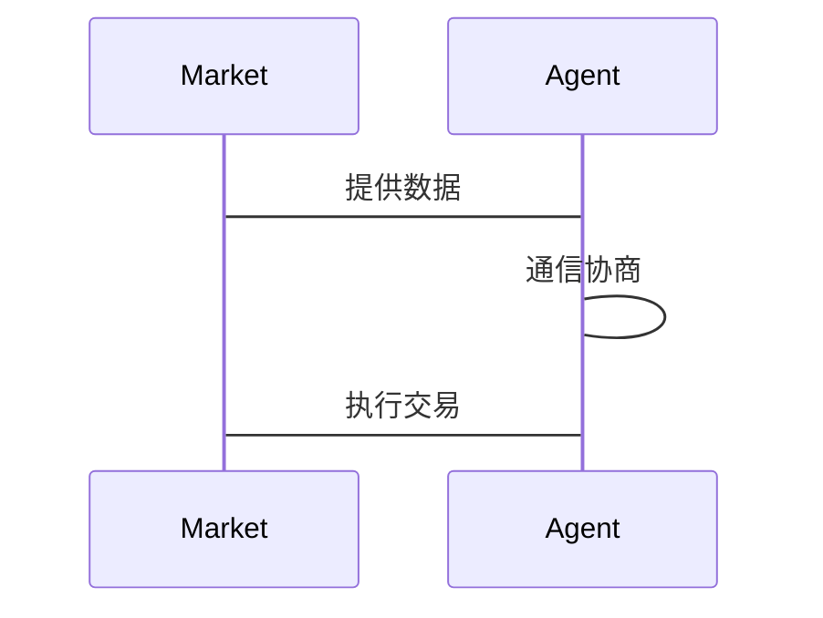

                 


# 多智能体系统在识别市场异常机会中的应用

> 关键词：多智能体系统（MAS）、市场异常机会、分布式计算、协作机制、算法原理、系统架构、案例分析

> 摘要：本文探讨了多智能体系统（MAS）在识别市场异常机会中的应用。通过分析MAS的核心概念、算法原理和系统架构，结合实际案例，展示了MAS如何通过分布式计算和协作机制提升市场机会识别的效率和准确性。

---

# 第一部分: 多智能体系统与市场异常机会概述

## 第1章: 多智能体系统与市场异常机会的背景介绍

### 1.1 多智能体系统的定义与特点
#### 1.1.1 多智能体系统的定义
多智能体系统（Multi-Agent System, MAS）是由多个智能体组成的分布式系统，这些智能体能够通过协作完成复杂的任务。智能体是具有感知、决策和行动能力的实体。

#### 1.1.2 多智能体系统的核心特点
- **分布式计算**：智能体独立运行，通过通信协作解决问题。
- **协作性**：智能体之间通过协商和信息共享实现协同。
- **自主性**：每个智能体都能自主决策和行动。
- **适应性**：系统能够自适应环境变化。

#### 1.1.3 多智能体系统在市场中的应用
- 市场分析
- 风险评估
- 机会挖掘

### 1.2 市场异常机会的定义与分类
#### 1.2.1 市场异常机会的定义
市场异常机会是指在市场中出现的非正常波动或模式，通常由市场参与者的行为或外部因素引起，可能带来超额收益。

#### 1.2.2 市场异常机会的分类
- **短期波动**：如市场闪崩或暴涨。
- **长期趋势**：如结构性变化。
- **突发事件**：如政策变化或自然灾害。

#### 1.2.3 市场异常机会的识别挑战
- 数据复杂性
- 时间敏感性
- 不确定性

### 1.3 多智能体系统在市场异常机会识别中的优势
#### 1.3.1 分布式计算能力
- 并行处理能力
- 多任务处理能力

#### 1.3.2 协作能力
- 信息共享
- 协商决策

#### 1.3.3 自适应能力
- 实时响应
- 自我修复

### 1.4 本章小结
本章介绍了多智能体系统的定义、特点和在市场中的应用，强调了MAS在识别市场异常机会中的优势。

---

## 第2章: 多智能体系统的核心概念与联系

### 2.1 多智能体系统的原理
#### 2.1.1 智能体的结构与功能
- **感知**：通过传感器或数据源获取信息。
- **决策**：基于感知信息进行推理和决策。
- **行动**：执行决策，影响环境。

#### 2.1.2 智能体的通信机制
- **直接通信**：智能体之间直接交换信息。
- **间接通信**：通过中间媒介传递信息。

#### 2.1.3 智能体的协作机制
- **协商**：通过协商达成一致。
- **任务分配**：智能体之间分配任务。

### 2.2 多智能体系统与市场机会识别的关系
#### 2.2.1 多智能体系统在市场数据处理中的应用
- **数据采集**：实时采集市场数据。
- **数据分析**：分析数据中的异常模式。

#### 2.2.2 多智能体系统在市场趋势预测中的应用
- **预测模型**：利用MAS进行预测。
- **预测优化**：通过协作优化预测结果。

#### 2.2.3 多智能体系统在市场机会挖掘中的应用
- **机会识别**：识别潜在的市场机会。
- **机会评估**：评估机会的价值和风险。

### 2.3 多智能体系统的核心要素对比
#### 2.3.1 不同多智能体系统的对比分析
| 特性       | 分布式MAS    | 集中式MAS    |
|------------|-------------|-------------|
| 决策中心    | 分散        | 集中        |
| 通信机制    | 直接         | 间接         |

#### 2.3.2 多智能体系统与单智能体系统的对比
- **性能**：MAS在处理复杂任务时表现更优。
- **灵活性**：MAS更具灵活性和适应性。

### 2.4 多智能体系统的ER实体关系图
```mermaid
erDiagram
    customer[客户]
    market[市场]
    agent[智能体]
    transaction[交易]
    customer -> transaction : 参与
    market -> transaction : 影响
    agent -> transaction : 执行
```

---

## 第3章: 多智能体系统的算法原理

### 3.1 多智能体系统的算法概述
- **分布式计算**： MAS中的智能体独立计算，通过通信共享结果。
- **协商算法**： 智能体之间通过协商达成一致。
- **强化学习**： 基于奖励机制优化决策。

### 3.2 多智能体系统中的协商算法
#### 3.2.1 协商算法的流程
1. **初始化**： 设置协商目标。
2. **信息交换**： 智能体共享信息。
3. **决策制定**： 基于信息达成一致。
4. **执行**： 执行协商结果。

#### 3.2.2 协商算法的实现


### 3.3 多智能体系统的强化学习算法
#### 3.3.1 强化学习的基本原理
智能体通过与环境互动，获得奖励，优化策略。

#### 3.3.2 强化学习的数学模型
状态空间 \( S \)，动作空间 \( A \)，奖励函数 \( R(s, a) \)。

### 3.4 多智能体系统的实现代码
```python
class Agent:
    def __init__(self, id):
        self.id = id
        self.state = None
        self.reward = 0

    def receive(self, message):
        # 处理消息
        pass

    def act(self):
        # 执行动作
        pass
```

---

## 第4章: 多智能体系统的系统分析与架构设计

### 4.1 项目背景
- **目标**：识别市场异常机会。
- **范围**：金融市场数据。

### 4.2 系统功能设计
#### 4.2.1 领域模型


#### 4.2.2 系统架构


### 4.3 系统接口设计
- **输入接口**：接收市场数据。
- **输出接口**：输出异常机会。

### 4.4 系统交互流程图


---

## 第5章: 项目实战

### 5.1 环境安装
- **工具**：Python、NumPy、Pandas。
- **依赖**：安装相关库。

### 5.2 核心代码实现
```python
import numpy as np
import pandas as pd

class MarketAnalyzer:
    def __init__(self, data):
        self.data = data

    def detect_anomalies(self):
        # 使用MAS进行异常检测
        pass

# 示例数据
data = pd.DataFrame({'price': [100, 101, 98, 102, 100]})
analyzer = MarketAnalyzer(data)
analyzer.detect_anomalies()
```

### 5.3 案例分析
- **案例背景**：某次市场闪崩。
- **数据处理**：分析价格波动。
- **结果分析**：识别异常交易。

### 5.4 项目总结
MAS在识别市场异常机会中的有效性。

---

## 第6章: 最佳实践与总结

### 6.1 最佳实践
- **数据质量**：确保数据准确。
- **系统维护**：定期更新模型。

### 6.2 本章小结
总结MAS在识别市场异常机会中的应用，强调其重要性。

---

# 结语

通过本文的探讨，我们可以看到多智能体系统在识别市场异常机会中的巨大潜力。随着技术的发展，MAS的应用将更加广泛和深入。

---

感谢您的阅读！

