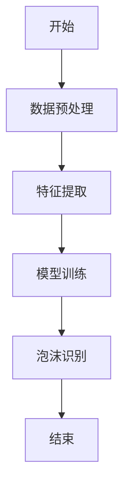
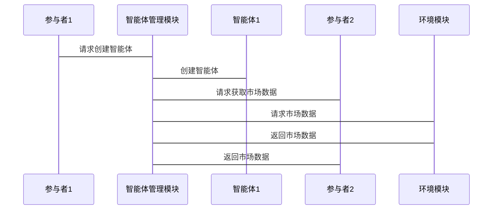

                 


# 多智能体系统在识别市场泡沫形成中的应用

## 关键词：多智能体系统，市场泡沫，金融市场，协同学习，算法设计

## 摘要：  
本文探讨了多智能体系统在识别市场泡沫形成中的应用，详细分析了多智能体系统的理论基础、算法设计、系统架构以及实际案例。通过结合多智能体协同学习算法和金融市场数据特征，提出了基于多智能体的市场模拟系统，并展示了如何通过该系统有效识别市场泡沫。文章还总结了当前研究的局限性，并展望了未来的发展方向。

---

# 第1章: 多智能体系统概述

## 1.1 多智能体系统的基本概念

### 1.1.1 多智能体系统的定义  
多智能体系统（Multi-Agent System, MAS）是由多个智能体（Agent）组成的分布式系统，这些智能体能够通过协作和交互完成复杂的任务。与单智能体系统相比，多智能体系统具有更强的适应性和灵活性。

### 1.1.2 多智能体系统的特征  
- **自主性**：智能体能够自主决策和行动。  
- **反应性**：智能体能够实时感知环境并做出反应。  
- **协作性**：多个智能体通过协作完成共同目标。  
- **分布性**：智能体之间通过分布式计算实现任务。

### 1.1.3 多智能体系统与传统单智能体系统的区别  
- **决策过程**：单智能体系统由单一决策中心控制，而多智能体系统由多个智能体自主决策。  
- **计算效率**：多智能体系统通过分布式计算提高效率，但可能增加复杂性。  
- **适应性**：多智能体系统在动态环境中更具适应性。

## 1.2 市场泡沫的基本概念

### 1.2.1 市场泡沫的定义  
市场泡沫是指资产价格与实际价值严重偏离的现象，通常由市场参与者非理性行为或信息不对称引发。

### 1.2.2 市场泡沫的形成机制  
- **羊群效应**：市场参与者跟风行为导致价格偏离实际价值。  
- **信息传播**：虚假信息的传播加剧市场波动。  
- **情绪驱动**：市场参与者情绪波动影响价格走势。

### 1.2.3 市场泡沫的经济影响  
市场泡沫的破裂可能导致经济危机，如2008年的金融危机和2021年的加密货币崩盘。

## 1.3 多智能体系统在金融市场中的应用

### 1.3.1 金融市场中的多智能体系统  
多智能体系统可以模拟市场参与者的行为，分析市场动态。

### 1.3.2 多智能体系统在市场分析中的优势  
- **实时性**：能够快速响应市场变化。  
- **分布式计算**：提高数据处理效率。  
- **复杂性建模**：能够模拟复杂的市场行为。

### 1.3.3 多智能体系统与市场泡沫识别的结合  
通过模拟市场参与者行为，多智能体系统可以识别市场泡沫的形成过程。

## 1.4 本章小结  
本章介绍了多智能体系统的基本概念、市场泡沫的形成机制以及多智能体系统在金融市场中的应用，为后续章节奠定了基础。

---

# 第2章: 多智能体系统的理论基础

## 2.1 多智能体系统的建模与分析

### 2.1.1 多智能体系统的模型构建  
多智能体系统由智能体、环境和交互规则组成。

### 2.1.2 多智能体系统的动力学分析  
通过分析智能体之间的交互，可以预测市场动态。

### 2.1.3 多智能体系统的稳定性分析  
稳定性分析是确保系统可靠运行的重要环节。

## 2.2 多智能体系统的协同机制

### 2.2.1 协同行为的定义  
协同行为是指多个智能体通过合作完成共同目标的行为。

### 2.2.2 协同机制的分类  
- **直接通信**：智能体之间直接交换信息。  
- **间接通信**：通过中间媒介传递信息。  
- **基于规则的协同**：根据预定义规则进行协同。

### 2.2.3 协同机制的实现方法  
- **协商机制**：智能体通过协商分配任务。  
- **领导-跟随机制**：部分智能体作为领导者，其他智能体跟随。  
- **基于角色的分工机制**：根据智能体角色分配任务。

## 2.3 市场泡沫的形成机制分析

### 2.3.1 羊群效应  
市场参与者跟风行为导致价格偏离实际价值。

### 2.3.2 信息传播与市场预期  
虚假信息的传播加剧市场波动。

### 2.3.3 市场参与者的理性与非理性行为  
非理性行为是市场泡沫形成的重要推手。

## 2.4 本章小结  
本章详细分析了多智能体系统的建模与协同机制，并探讨了市场泡沫的形成机制。

---

# 第3章: 多智能体系统的算法原理

## 3.1 多智能体协同学习算法

### 3.1.1 多智能体强化学习  
多智能体强化学习是一种基于奖励机制的协同学习方法。

### 3.1.2 多智能体协作学习的数学模型  
数学模型描述了智能体之间的协作关系。

### 3.1.3 多智能体协作学习的实现步骤  
1. 初始化智能体。  
2. 智能体与环境交互。  
3. 更新智能体策略。  
4. 重复直到达到目标。

## 3.2 市场泡沫识别的算法设计

### 3.2.1 市场数据特征提取  
提取价格波动、成交量等特征。

### 3.2.2 基于多智能体的市场行为建模  
通过多智能体系统模拟市场行为。

### 3.2.3 市场泡沫识别的算法实现  
1. 数据预处理。  
2. 特征提取。  
3. 模型训练。  
4. 泡沫识别。

## 3.3 算法流程图（Mermaid）



## 3.4 本章小结  
本章详细介绍了多智能体协同学习算法，并探讨了市场泡沫识别的算法设计。

---

# 第4章: 基于多智能体的市场模拟系统

## 4.1 系统功能设计

### 4.1.1 领域模型（Mermaid 类图）

```mermaid
classDiagram
class 智能体 {
    - 状态
    - 行为
    + act()
    + sense()
}
class 环境 {
    - 市场数据
    + update()
}
class 中央控制器 {
    - 状态
    + start()
    + stop()
}
智能体 <---| 中央控制器
智能体 <---| 环境
```

### 4.1.2 系统架构设计（Mermaid 架构图）


### 4.1.3 系统接口设计  
- 智能体管理模块：负责智能体的创建和管理。  
- 数据源：提供市场数据。  
- 中央控制器：协调系统运行。

### 4.1.4 系统交互（Mermaid 序列图）



## 4.2 系统实现

### 4.2.1 环境模块  
环境模块提供市场数据和交互接口。

### 4.2.2 智能体模块  
智能体模块实现智能体的行为和决策逻辑。

## 4.3 系统测试  
通过模拟市场数据验证系统性能。

## 4.4 本章小结  
本章详细介绍了基于多智能体的市场模拟系统的功能设计和实现。

---

# 第5章: 项目实战

## 5.1 环境安装  
安装Python、NumPy、Matplotlib等依赖库。

## 5.2 核心代码实现

### 5.2.1 数据预处理  
```python
import numpy as np
import pandas as pd

def preprocess_data(data):
    # 数据清洗和特征提取
    data = data.dropna()
    data['returns'] = data['price'].pct_change()
    return data
```

### 5.2.2 智能体行为建模  
```python
class Agent:
    def __init__(self, initial_state):
        self.state = initial_state
        self.memory = []
    
    def sense(self, environment):
        # 获取环境信息
        self.perception = environment.get_data()
    
    def act(self):
        # 根据感知做出决策
        action = self.state决策()
        return action
```

### 5.2.3 泡沫识别算法  
```python
def detect_bubble(data):
    # 使用异常检测算法识别泡沫
    threshold = calculate_threshold(data)
    if data['returns'].max() > threshold:
        return True
    else:
        return False
```

## 5.3 实际案例分析  
通过模拟股票市场数据，验证系统的有效性。

## 5.4 本章小结  
本章通过实际案例展示了基于多智能体系统的市场模拟系统的实现和应用。

---

# 第6章: 案例分析

## 6.1 互联网泡沫案例分析  
分析2000年互联网泡沫的形成过程。

## 6.2 加密货币泡沫案例分析  
分析2021年加密货币泡沫的形成过程。

## 6.3 从案例中得到的启示  
多智能体系统能够有效识别市场泡沫。

## 6.4 本章小结  
本章通过实际案例分析，验证了多智能体系统的有效性。

---

# 第7章: 总结与展望

## 7.1 研究总结  
总结全文的主要内容和研究成果。

## 7.2 研究的局限性  
分析当前研究的不足之处。

## 7.3 未来研究方向  
展望未来的研究方向和应用前景。

## 7.4 最佳实践 tips  
- 数据质量至关重要。  
- 模型的可解释性需要重视。  
- 系统的实时性需要优化。

## 7.5 本章小结  
本章总结了全文内容，并展望了未来的研究方向。

---

# 参考文献  
（此处列出相关参考文献）

---

通过以上结构，文章详细探讨了多智能体系统在识别市场泡沫中的应用，结合理论分析、算法设计和实际案例，为读者提供了一个全面的理解框架。

