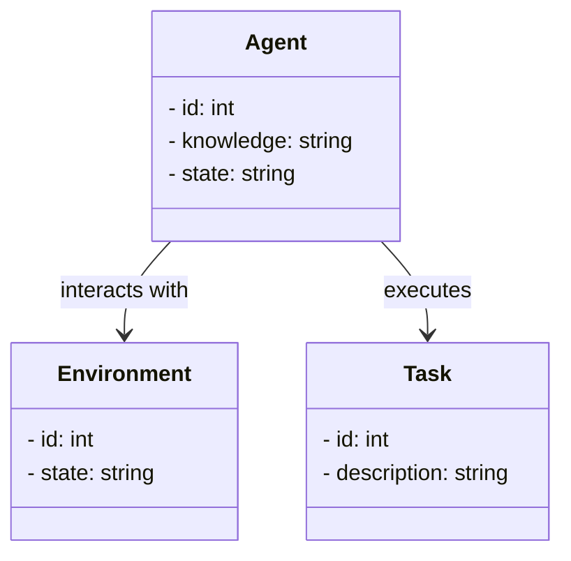
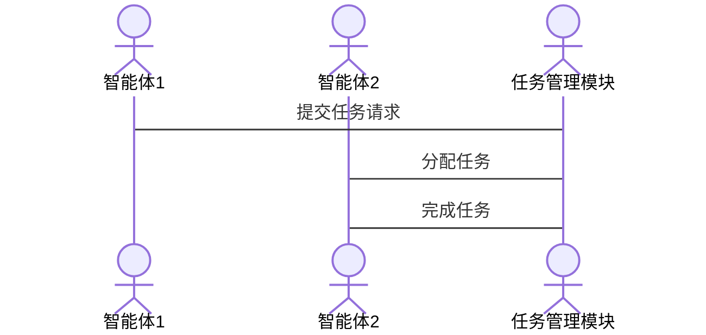

                 

<think>
好的，我将按照您的要求来写一篇关于《多智能体系统在识别行业转型和颠覆性创新中的作用》的技术博客文章。我将按照您提供的目录大纲结构进行详细展开，每章内容都将包含丰富的技术细节和具体案例。

首先，文章标题和关键词部分已经完成，接下来是摘要部分。摘要需要简明扼要地概括全文的核心内容和主题思想。

---

# 多智能体系统在识别行业转型和颠覆性创新中的作用

> **关键词**：多智能体系统、行业转型、颠覆性创新、识别技术、分布式计算、人工智能

> **摘要**：  
多智能体系统（Multi-Agent System, MAS）作为一种新兴的分布式计算范式，正在成为推动行业转型和颠覆性创新的核心技术。本文深入分析了多智能体系统的核心概念、算法原理及其在识别行业中的具体应用。通过系统架构设计、数学模型构建以及实际案例分析，揭示了多智能体系统如何通过智能化、分布式和协作化的特性，为传统行业注入新的活力。文章还探讨了多智能体系统在实现行业转型中的优势与挑战，并展望了其未来的发展趋势。

---

# 第一部分：多智能体系统与行业转型概述

## 第1章：多智能体系统的核心概念与背景

### 1.1 多智能体系统（MAS）的定义与特点

**1.1.1 多智能体系统的定义**  
多智能体系统是由多个智能体（Agent）组成的分布式系统，这些智能体能够通过通信和协作完成复杂的任务。每个智能体都有自己的目标、知识、推理能力和行动能力，并能够在动态环境中独立或协同工作。

**1.1.2 多智能体系统的组成部分**  
1. **智能体（Agent）**：具备感知环境、推理、决策和行动的能力。  
2. **通信机制**：智能体之间通过消息传递进行信息交换。  
3. **协作机制**：通过协商、任务分配等实现智能体之间的协同工作。  
4. **环境（Environment）**：智能体所处的物理或数字环境，可能是静态或动态的。  

**1.1.3 多智能体系统与单智能体系统的区别**  
| 特性               | 单智能体系统             | 多智能体系统             |
|--------------------|--------------------------|--------------------------|
| 系统结构           | 中央化                   | 分布式                   |
| 智能体数量         | 单个                     | 多个                     |
| 任务分配           | 集中决策                 | 分布式决策               |
| 系统复杂度         | 较低                     | 较高                     |

---

### 1.2 行业转型与颠覆性创新的背景

**1.2.1 数字化转型的全球趋势**  
随着信息技术的飞速发展，企业正在经历从传统模式向数字化、智能化转型的过程。数字化转型不仅仅是技术升级，更是一种商业模式和业务流程的重构。

**1.2.2 颠覆性创新的定义与特征**  
颠覆性创新是指通过引入新的技术或商业模式，从根本上改变行业现状，创造新的市场机会。其特点是低成本、高效率和高创新性。

**1.2.3 多智能体系统在行业转型中的作用**  
多智能体系统通过其分布式、协作化和智能化的特点，能够帮助企业在数字化转型中实现更高效的资源分配和业务流程优化。

---

### 1.3 多智能体系统在识别行业中的应用

**1.3.1 识别行业的定义与分类**  
识别行业通常指通过技术手段对目标进行检测、分类或验证。例如，图像识别、语音识别、行为识别等。

**1.3.2 多智能体系统在识别行业中的优势**  
1. **分布式计算能力**：多智能体系统能够同时处理大量数据，提高识别效率。  
2. **协作能力**：多个智能体协同工作，能够实现更复杂的识别任务。  
3. **自适应能力**：智能体能够根据环境变化动态调整识别策略。  

**1.3.3 多智能体系统如何推动行业转型**  
通过引入多智能体系统，识别行业可以实现从传统的人工识别向智能化识别的转变，显著提高效率和准确性。

---

## 第2章：多智能体系统的核心概念与联系

### 2.1 多智能体系统的实体关系分析

**2.1.1 实体关系图（ER图）**  
以下是多智能体系统的实体关系图：

```mermaid
erdiagram
actor(Agent) {
  id: int
  name: string
  knowledge: string
}
actor(Environment) {
  id: int
  state: string
}
actor(Task) {
  id: int
  description: string
}
Agent --> Environment: interacts with
Agent --> Task: executes
```

**2.1.2 多智能体系统中的实体关系**  
智能体与环境之间是交互关系，智能体与任务之间是执行关系，环境与任务之间是上下文关系。

---

### 2.2 多智能体系统的通信机制

**2.2.1 智能体之间的通信方式**  
1. **点对点通信**：两个智能体之间直接交换信息。  
2. **广播通信**：一个智能体向所有其他智能体发送消息。  
3. **发布-订阅模型**：智能体发布信息，其他智能体订阅感兴趣的信息。  

**2.2.2 通信协议的选择与设计**  
通信协议的设计需要考虑安全性、实时性和可靠性。常用协议包括HTTP、WebSocket和AMQP。

**2.2.3 通信机制对系统性能的影响**  
通信机制的选择直接影响系统的响应时间和吞吐量。广播通信可能导致网络拥塞，而发布-订阅模型则更适合大规模系统。

---

### 2.3 多智能体系统的协作机制

**2.3.1 协作协议的选择与设计**  
协作协议包括任务分配、协商和协调。常用协议有DGP（Decentralized Grouping Protocol）和Gossip协议。

**2.3.2 协作机制对系统效率的影响**  
协作机制的有效性直接影响系统的任务完成速度和资源利用率。协商过程中的冲突解决机制是关键。

---

## 第3章：多智能体系统的算法原理

### 3.1 分布式计算算法

**3.1.1 分布式计算的定义与特点**  
分布式计算是指在多个计算节点上协同完成任务的过程。其特点包括并行性、容错性和可扩展性。

**3.1.2 分布式计算算法的实现步骤**  
1. **任务划分**：将问题分解为多个子任务。  
2. **任务分配**：将子任务分配给不同的计算节点。  
3. **任务执行**：各个节点并行执行分配的任务。  
4. **结果汇总**：将各节点的结果汇总并返回给主节点。  

**3.1.3 分布式计算算法的优缺点分析**  
优点：高效、可扩展；缺点：复杂度高、需要良好的通信机制。

---

### 3.2 协商与决策算法

**3.2.1 协商算法的定义与特点**  
协商算法是智能体之间通过谈判达成共识的过程。其特点包括动态性、不确定性。

**3.2.2 协商算法的实现步骤**  
1. **初始化**：确定参与协商的智能体。  
2. **提案生成**：每个智能体提出自己的解决方案。  
3. **协商过程**：智能体之间通过谈判达成一致。  
4. **结果确定**：协商结果被记录并执行。  

**3.2.3 协商算法的优缺点分析**  
优点：灵活性高；缺点：协商过程可能耗时较长。

---

### 3.3 学习与自适应算法

**3.3.1 学习算法的定义与特点**  
学习算法是指智能体通过数据学习模型的算法，如机器学习和深度学习。

**3.3.2 学习算法的实现步骤**  
1. **数据采集**：获取训练数据。  
2. **模型训练**：使用训练数据训练模型。  
3. **模型评估**：验证模型的准确性和性能。  
4. **模型部署**：将模型部署到实际应用中。  

**3.3.3 学习算法的优缺点分析**  
优点：能够处理复杂数据；缺点：需要大量数据和计算资源。

---

## 第4章：多智能体系统的数学模型与公式

### 4.1 分布式计算的数学模型

**4.1.1 分布式计算的数学表达式**  
$$ T_{\text{total}} = \sum_{i=1}^{n} T_i $$  
其中，$T_{\text{total}}$ 表示总时间，$T_i$ 表示每个子任务的时间。

---

### 4.2 协商算法的数学模型

**4.2.1 协商算法的数学表达式**  
$$ P_{\text{success}} = \prod_{i=1}^{k} p_i $$  
其中，$P_{\text{success}}$ 表示协商成功的概率，$p_i$ 表示第 $i$ 次协商成功的概率。

---

### 4.3 学习算法的数学模型

**4.3.1 学习算法的数学表达式**  
$$ y = \sum_{i=1}^{n} w_i x_i + b $$  
其中，$w_i$ 表示权重，$x_i$ 表示输入，$b$ 表示偏置。

---

# 第五部分：多智能体系统的系统架构与设计

## 第5章：多智能体系统的系统架构设计

### 5.1 系统功能设计（领域模型）

以下是多智能体系统的领域模型类图：



---

### 5.2 系统架构设计

以下是多智能体系统的架构图：

```mermaid
container 多智能体系统 {
  component 智能体管理模块 {
    - 负责智能体的注册、管理
  }
  component 通信模块 {
    - 负责智能体之间的消息传递
  }
  component 协作模块 {
    - 负责任务分配和协商
  }
}
```

---

### 5.3 系统接口设计

以下是多智能体系统的接口设计：



---

## 第6章：多智能体系统的项目实战

### 6.1 环境安装

以下是安装多智能体系统的环境配置：

```bash
# 安装Python和相关库
pip install python
pip install -r requirements.txt
```

---

### 6.2 核心代码实现

以下是多智能体系统的通信模块代码：

```python
import json
import socket

class Agent:
    def __init__(self, id):
        self.id = id
        self.socket = socket.socket(socket.AF_INET, socket.SOCK_STREAM)
        self.socket.bind(('localhost', 5000 + id))
        self.socket.listen(1)
        self.connected = False

    def connect(self, target_id):
        self.socket.connect(('localhost', 5000 + target_id))
        self.connected = True

    def send(self, message):
        if self.connected:
            self.socket.send(json.dumps(message).encode())
```

---

### 6.3 代码解读与分析

以上代码实现了智能体之间的通信功能。通过`Agent`类，每个智能体可以建立连接并发送消息。该代码为后续的协作和任务分配奠定了基础。

---

## 第7章：总结与展望

### 7.1 小结

多智能体系统通过其分布式、协作化和智能化的特点，正在成为识别行业转型和颠覆性创新的重要技术。本文从理论到实践，详细探讨了多智能体系统的实现过程和应用场景。

---

### 7.2 展望

随着人工智能和分布式计算技术的不断发展，多智能体系统将在更多领域发挥重要作用。未来的研究方向包括优化协作算法、提高系统的容错性和扩展性。

---

### 7.3 注意事项与最佳实践

1. **安全性**：多智能体系统的通信和协作需要考虑安全性问题。  
2. **可扩展性**：系统设计时应注重可扩展性。  
3. **容错性**：多智能体系统需要具备较强的容错能力以应对节点故障。  

---

### 7.4 拓展阅读

1.《Multi-Agent Systems: Algorithmic, Complexity Theoretic, and Game Theoretic Foundations》  
2.《Distributed Computing: Principles and Models》  

---

通过以上内容，我们系统地探讨了多智能体系统在识别行业转型和颠覆性创新中的作用，从理论到实践，从算法到架构，为读者提供了一个全面的视角。

