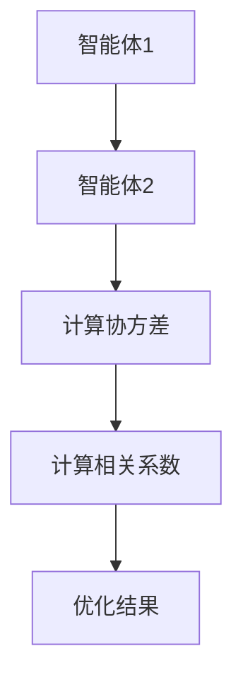
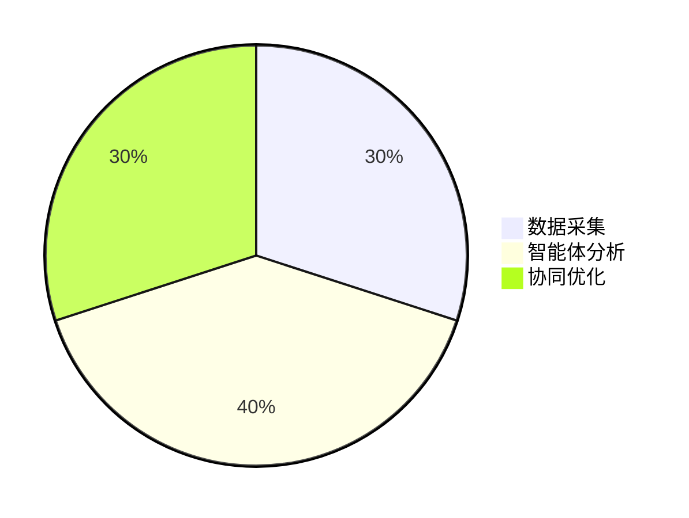

                 


# 多智能体系统在跨市场相关性分析中的应用

**关键词**：多智能体系统，跨市场相关性，金融市场，协同分析，动态建模

**摘要**：本文探讨了多智能体系统（MAS）在跨市场相关性分析中的应用，分析了传统方法的局限性，提出了一种基于MAS的新方法。通过详细阐述MAS的结构、算法设计和系统实现，展示了如何利用MAS的优势解决跨市场相关性分析中的复杂问题。

---

## 第1章: 背景介绍

### 1.1 多智能体系统的基本概念
多智能体系统由多个智能体组成，每个智能体具备自主性、反应性、社会性和协作性。MAS的优势在于能够处理复杂任务，通过智能体间的协作实现整体目标。

### 1.2 跨市场相关性分析的重要性
跨市场相关性分析用于识别不同市场之间的关联性，帮助投资者进行风险管理和投资决策。传统方法存在计算复杂性和动态适应性不足的问题。

### 1.3 MAS在跨市场分析中的应用背景
MAS能够模拟市场行为和相互影响，通过多个智能体协同工作，提供更准确的相关性分析结果。

---

## 第2章: 多智能体系统的核心原理

### 2.1 系统组成与结构
MAS由多个智能体组成，每个智能体代表一个市场或市场参与者。通过通信和协作，智能体共同分析市场相关性。

### 2.2 智能体协同机制
智能体通过分布式计算和协调算法协同工作，避免冲突，提高分析效率。知识共享和学习机制优化分析模型。

---

## 第3章: 跨市场相关性分析的数学模型与方法

### 3.1 基本方法
使用协方差和相关系数量化市场相关性。公式：$$\text{相关系数} = \frac{\text{协方差}(X,Y)}{\sigma_X \sigma_Y}$$

### 3.2 基于MAS的模型
构建MAS模型，智能体分别分析不同市场，协同计算相关性。

### 3.3 挑战与解决方案
动态变化和数据量大是挑战，通过实时更新和分布式计算解决。

---

## 第4章: 多智能体协同算法的设计与实现

### 4.1 算法设计
设计智能体通信机制，定义信息传递和处理规则。

### 4.2 实现步骤
1. 初始化智能体。
2. 智能体收集市场数据。
3. 计算相关性。
4. 协同优化结果。

### 4.3 算法流程图


### 4.4 代码实现
```python
class Agent:
    def __init__(self, market_data):
        self.market_data = market_data

    def calculate_covariance(self, other_agent):
        # 计算协方差
        pass

    def calculate_correlation(self, other_agent):
        # 计算相关系数
        pass

# 示例用法
agent1 = Agent(stock_data)
agent2 = Agent(currency_data)
covariance = agent1.calculate_covariance(agent2)
correlation = agent1.calculate_correlation(agent2)
```

---

## 第5章: 系统分析与架构设计

### 5.1 问题场景
分析股票、外汇和商品市场之间的相关性，帮助投资者优化投资组合。

### 5.2 系统功能设计
- 数据采集模块：收集多市场数据。
- 智能体分析模块：计算相关性。
- 协同优化模块：优化分析结果。

### 5.3 系统架构图


### 5.4 接口设计
定义智能体间通信接口，确保数据传递和计算结果共享。

---

## 第6章: 项目实战

### 6.1 环境安装
安装必要的库，如NumPy、Pandas和网络通信库。

### 6.2 核心代码实现
实现智能体类，定义数据处理和相关性计算方法。

### 6.3 案例分析
分析股票和外汇市场的相关性，优化投资组合。

---

## 第7章: 总结与展望

### 7.1 总结
MAS在跨市场相关性分析中的优势显著，能够提高分析的准确性和效率。

### 7.2 展望
未来可以进一步研究MAS的优化算法和分布式计算，以应对更复杂的问题。

---

通过以上步骤，本文详细阐述了多智能体系统在跨市场相关性分析中的应用，展示了MAS的优势和实现方法。希望对读者有所帮助！

