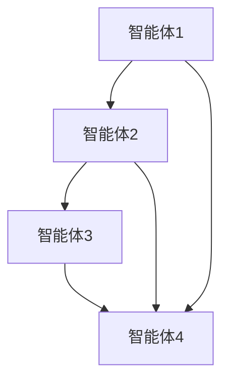
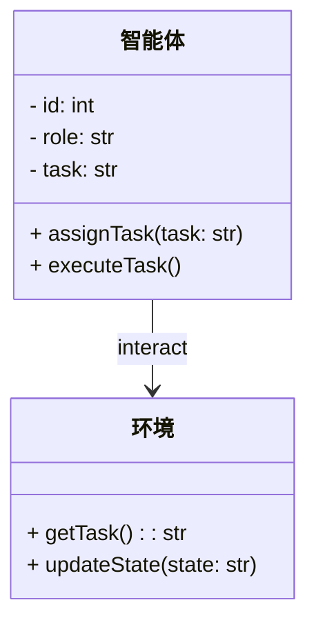
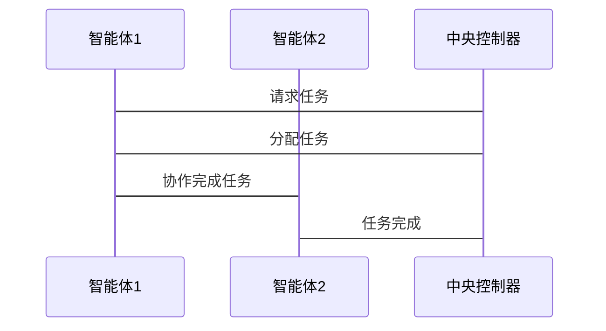

                 


# 多智能体系统在长期价值创造分析中的应用

**关键词：** 多智能体系统（MAS）、长期价值创造、分布式计算、智能体协作、系统架构设计、价值分析方法

**摘要：**  
随着人工智能技术的快速发展，多智能体系统（Multi-Agent System, MAS）在多个领域的应用日益广泛。本文将探讨多智能体系统在长期价值创造分析中的应用，结合理论与实践，详细解析多智能体系统的原理、算法、系统架构设计以及实际案例分析。通过系统的讲解和详细的代码示例，帮助读者理解如何利用多智能体系统来优化资源分配、提高效率，并在长期价值创造中实现共赢。

---

# 目录

## 第一部分: 多智能体系统基础

## # 第1章: 多智能体系统概述

### ## 1.1 多智能体系统的基本概念

#### ### 1.1.1 多智能体系统的定义  
多智能体系统是由多个具有自治性、反应性、主动性、协作性和社会性的智能体组成的分布式系统，这些智能体能够通过交互和协作共同完成复杂任务。

#### ### 1.1.2 多智能体系统的特征  
- **自治性**：每个智能体能够独立决策和行动。  
- **反应性**：智能体能够感知环境并实时响应。  
- **协作性**：多个智能体通过协作完成共同目标。  
- **分布式性**：系统由多个智能体分布在不同的物理或逻辑位置组成。  

#### ### 1.1.3 多智能体系统的分类  
- **基于任务的分类**：根据智能体的任务类型，分为信息处理型、决策型和执行型。  
- **基于智能体结构的分类**：分为集中式、分布式和混合式结构。  

### ## 1.2 长期价值创造分析的基本概念

#### ### 1.2.1 价值创造的定义  
价值创造是指通过优化资源配置、提高效率、降低成本等方式，为组织或系统创造更大的经济和社会效益。

#### ### 1.2.2 长期价值创造的特征  
- **可持续性**：长期价值创造注重长期效益，而非短期利益。  
- **协同性**：通过各智能体的协同合作，实现整体效益的最大化。  
- **动态性**：面对复杂多变的环境，智能体需要动态调整策略以实现持续价值创造。  

#### ### 1.2.3 长期价值创造的分析方法  
- **目标分析法**：明确长期价值创造的目标和关键成功因素。  
- **路径分析法**：分析实现目标的路径和可能的障碍。  
- **情景分析法**：通过情景分析，评估不同策略下的价值创造潜力。  

### ## 1.3 多智能体系统与长期价值创造的关系

#### ### 1.3.1 多智能体系统在价值创造中的作用  
- **优化资源配置**：通过智能体的协作，实现资源的高效利用。  
- **提高决策效率**：智能体能够快速响应环境变化，优化决策过程。  
- **增强系统鲁棒性**：通过分布式的结构，提高系统的容错能力和适应性。  

#### ### 1.3.2 长期价值创造对多智能体系统的需求  
- **智能体的协作能力**：需要智能体能够高效协作，共同完成复杂任务。  
- **动态适应性**：系统需要能够快速适应环境变化，持续创造价值。  
- **可扩展性**：系统需要能够扩展智能体数量和功能，适应不同规模的应用场景。  

#### ### 1.3.3 多智能体系统在长期价值创造中的优势  
- **高效性**：通过智能体的协作，实现资源的最优配置。  
- **灵活性**：系统能够快速调整策略，适应环境变化。  
- **创新性**：通过智能体的协同创新，推动长期价值的实现。  

---

## 第二部分: 多智能体系统的原理与核心概念

## # 第2章: 多智能体系统的原理与核心概念

### ## 2.1 多智能体系统的原理

#### ### 2.1.1 智能体的定义与特征  
智能体是一种能够感知环境、自主决策并采取行动的实体，具备以下特征：  
- **自主性**：智能体能够独立决策和行动。  
- **反应性**：智能体能够感知环境并实时响应。  
- **目标导向性**：智能体的行为以实现特定目标为导向。  

#### ### 2.1.2 智能体的分类与层次结构  
智能体可以根据功能和结构进行分类，常见的分类包括：  
- **简单反射型智能体**：基于当前感知做出反应。  
- **基于模型的反应型智能体**：利用内部模型进行决策。  
- **目标驱动型智能体**：以实现特定目标为导向。  
- **实用驱动型智能体**：以效用最大化为目标。  

#### ### 2.1.3 智能体的协作机制  
智能体的协作机制包括以下几种：  
- **直接通信**：智能体之间通过直接通信进行信息交换。  
- **间接通信**：通过共享数据库或消息队列进行间接通信。  
- **分布式协调**：通过分布式算法实现协调。  

### ## 2.2 多智能体系统的核心概念

#### ### 2.2.1 问题背景与边界  
在多智能体系统中，需要明确以下问题：  
- **问题背景**：明确系统的应用场景和目标。  
- **问题边界**：确定系统的范围和智能体的职责划分。  
- **问题外延**：分析系统可能面临的风险和挑战。  

#### ### 2.2.2 核心要素与概念结构  
多智能体系统的核心要素包括：  
- **智能体**：系统的主体，负责完成特定任务。  
- **环境**：智能体所处的外部环境，包括物理环境和虚拟环境。  
- **交互**：智能体之间的通信与协作方式。  
- **目标**：智能体需要实现的具体目标。  

#### ### 2.2.3 智能体之间的关系与依赖  
智能体之间的关系可以通过以下几种方式展示：  
- **层次结构**：上级智能体对下级智能体进行管理和协调。  
- **网状结构**：智能体之间形成复杂的交互网络。  
- **协作关系**：智能体之间通过协作完成共同目标。  

### ## 2.3 多智能体系统的属性特征对比

#### ### 2.3.1 表格对比分析  
以下是多智能体系统与其他系统在核心属性上的对比：

| 属性         | 集中式系统       | 分布式系统       | 多智能体系统       |
|--------------|------------------|------------------|--------------------|
| 结构         | 单点控制         | 分散控制         | 去中心化           |
| 可扩展性     | 较低             | 较高             | 高                 |
| 故障容错性   | 低               | 中               | 高                 |
| 协作能力     | 有限             | 较强             | 强                 |

#### ### 2.3.2 图形化展示（使用Mermaid）



---

## 第三部分: 多智能体系统的算法原理

## # 第3章: 多智能体系统的算法原理

### ## 3.1 分布式计算

#### ### 3.1.1 分布式计算的基本概念  
分布式计算是指在多个计算节点上进行计算任务的分配和协调，以实现计算资源的优化利用。

#### ### 3.1.2 分布式计算的算法原理  
- **任务分配算法**：根据计算节点的负载情况，动态分配任务。  
- **负载均衡算法**：通过负载均衡技术，确保计算节点的负载均衡。  

#### ### 3.1.3 分布式计算的实现步骤  
1. **任务分解**：将整体任务分解为多个子任务。  
2. **任务分配**：将子任务分配给不同的计算节点。  
3. **任务执行**：各计算节点并行执行分配的任务。  
4. **结果汇总**：将各节点的结果汇总，得到最终结果。  

#### ### 3.1.4 分布式计算的代码示例  

```python
import threading

def distributed_task():
    # 模拟分布式计算任务
    print(f"Thread {threading.get_ident()} is executing task")

# 创建多个线程
threads = []
for i in range(4):
    thread = threading.Thread(target=distributed_task)
    threads.append(thread)
    thread.start()

# 等待所有线程完成
for thread in threads:
    thread.join()
```

---

## 第四部分: 系统分析与架构设计

## # 第4章: 系统分析与架构设计

### ## 4.1 问题场景介绍

#### ### 4.1.1 项目背景介绍  
假设我们正在开发一个供应链管理系统的多智能体优化方案，目标是通过智能体的协作，实现供应链的高效运作。

#### ### 4.1.2 项目需求分析  
- **需求分析**：分析供应链管理中的关键问题，如库存管理、物流优化等。  
- **目标设定**：设定智能体的目标，如最小化成本、提高效率等。  

### ## 4.2 系统功能设计

#### ### 4.2.1 领域模型设计  
以下是供应链管理系统的领域模型图：



#### ### 4.2.2 系统架构设计  
以下是系统的架构图：

```mermaid
architecturalDiagram
    contains 系统边界
    component 智能体管理模块
    component 任务分配模块
    component 执行模块
    component 监控模块
    智能体管理模块 --> 任务分配模块
    任务分配模块 --> 执行模块
    执行模块 --> 监控模块
```

#### ### 4.2.3 接口设计与交互流程图  



---

## 第五部分: 项目实战

## # 第5章: 项目实战

### ## 5.1 环境安装与配置

#### ### 5.1.1 环境安装  
安装所需的开发环境和工具，如Python、Jupyter Notebook、Mermaid工具等。

#### ### 5.1.2 核心代码实现  

```python
class Agent:
    def __init__(self, id):
        self.id = id
        self.task = None

    def assign_task(self, task):
        self.task = task
        print(f"Agent {self.id} assigned task: {task}")

    def execute_task(self):
        print(f"Agent {self.id} executing task: {self.task}")

# 创建多个智能体
agents = [Agent(i) for i in range(4)]

# 分配任务
for agent in agents:
    agent.assign_task(f"Task_{agent.id}")

# 执行任务
for agent in agents:
    agent.execute_task()
```

### ## 5.2 实际案例分析

#### ### 5.2.1 案例背景介绍  
以供应链管理为例，分析多智能体系统如何优化库存管理。

#### ### 5.2.2 案例分析与解读  
通过智能体的协作，实现库存的动态优化，降低库存成本，提高供应链效率。

#### ### 5.2.3 项目小结  
总结项目的关键点和收获，为后续的优化提供参考。

---

## 第六部分: 最佳实践

## # 第6章: 最佳实践

### ## 6.1 小结与总结

#### ### 6.1.1 小结  
总结本文的主要内容，强调多智能体系统在长期价值创造中的重要作用。

#### ### 6.1.2 总结  
通过系统的讲解和实际案例分析，帮助读者理解多智能体系统的核心原理和应用方法。

### ## 6.2 注意事项与建议

#### ### 6.2.1 注意事项  
- **智能体的协作机制**：需要合理设计智能体之间的协作机制，避免出现冲突和资源浪费。  
- **系统的可扩展性**：系统设计需要考虑扩展性，以适应不同的应用场景。  
- **系统的安全性**：确保系统的安全性，防止智能体之间的通信被恶意攻击。  

#### ### 6.2.2 建议  
- **持续优化**：根据实际应用情况，持续优化系统的性能和智能体的协作策略。  
- **多领域应用**：探索多智能体系统在更多领域的应用，如智慧城市、智能家居等。  

### ## 6.3 拓展阅读与学习方向

#### ### 6.3.1 拓展阅读  
建议读者阅读以下书籍和论文，以深入理解多智能体系统的理论与应用：  
- 《Multi-Agent Systems: Algorithmic, Complexity, and Synthesis》  
- 《Multi-Agent Machine Learning: A Guide for Engineers and Researchers》  

#### ### 6.3.2 学习方向  
- **高级算法研究**：深入研究多智能体系统的高级算法，如强化学习和博弈论。  
- **实际应用开发**：参与实际项目，积累开发经验。  
- **前沿技术探索**：关注多智能体系统的前沿技术，如人机协作和自适应系统。  

---

## 第七部分: 结语

通过本文的系统讲解和实际案例分析，我们深入探讨了多智能体系统在长期价值创造分析中的应用。从理论到实践，从核心概念到算法实现，我们全面解析了多智能体系统的原理和应用方法。希望本文能够为读者提供有价值的参考，帮助他们在实际工作中更好地利用多智能体系统来创造长期价值。未来，我们将继续探索多智能体系统在更多领域的应用，推动技术的不断发展与进步。

---

**结语**：多智能体系统的应用前景广阔，随着技术的不断进步，其在长期价值创造中的作用将更加重要。通过本文的系统讲解，我们相信读者能够更好地理解和应用多智能体系统，为实际问题的解决提供新的思路和方法。

