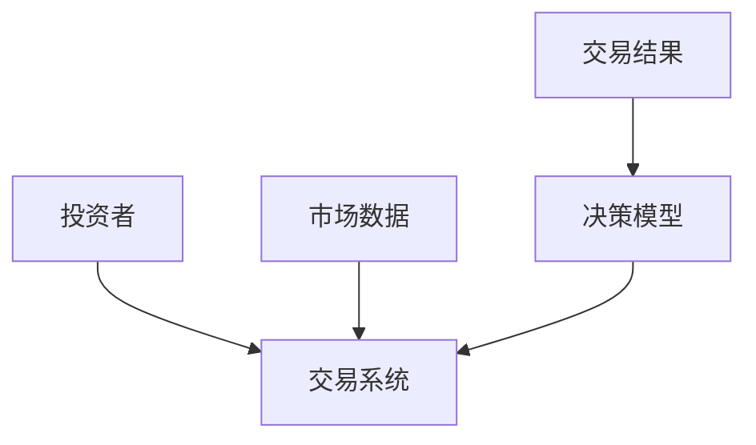

                 

<think>
好的，现在我需要根据用户提供的要求，逐步构建一篇关于《多智能体系统增强价值投资的市场微观结构变化检测》的技术博客文章。文章需要包含背景介绍、核心概念、算法原理、系统分析、项目实战、最佳实践和小结等多个部分。

### 第一部分：背景介绍

#### 1. 背景介绍
金融市场的复杂性使得传统的单智能体分析方法难以满足需求。多智能体系统能够通过多个智能体的协同工作，更准确地模拟市场行为，检测市场微观结构的变化。

#### 2. 问题背景
价值投资依赖于对市场微观结构的深入理解。传统的市场分析方法在面对高频交易和复杂市场行为时显得力不从心，而多智能体系统能够实时捕捉这些变化。

#### 3. 问题描述
如何利用多智能体系统检测市场微观结构的变化，从而增强价值投资的决策能力。

#### 4. 问题解决
通过多智能体系统模拟市场参与者的交互，分析市场微观结构的变化，为价值投资提供更精准的决策支持。

#### 5. 边界与外延
本研究仅关注股票市场，不涉及外汇和衍生品市场。多智能体系统的规模和复杂度需要根据实际市场情况调整。

#### 6. 核心概念与对比
- 多智能体系统：多个智能体协同工作的系统，能够模拟复杂市场行为。
- 价值投资：通过分析公司基本面，寻找被低估的投资标的。
- 市场微观结构：市场的参与者、交易机制和信息流动等细节。

### 第二部分：核心概念与联系

#### 1. 核心概念原理
- 多智能体系统通过强化学习和博弈论，模拟市场参与者的决策过程。
- 价值投资依赖于对公司基本面的深入分析，而多智能体系统能够提供实时的市场动态支持。

#### 2. 概念属性对比
| 概念       | 属性           |
|------------|----------------|
| 多智能体系统 | 分布式、协同、动态 |
| 价值投资   | 长期、基本面、稳定性 |
| 微观结构   | 参与者、交易量、信息流动 |

#### 3. 实体关系图


### 第三部分：算法原理与数学模型

#### 1. 算法框架
多智能体系统采用基于强化学习的框架，通过智能体之间的博弈，模拟市场参与者的行为。

#### 2. 算法实现
- 状态表示：市场中的价格、成交量、订单簿等信息。
- 动作选择：智能体根据当前状态选择买卖策略。
- 奖励机制：根据交易结果给予奖励或惩罚。

#### 3. 数学模型
- 状态空间：$S = \{s_1, s_2, ..., s_n\}$
- 动作空间：$A = \{a_1, a_2, ..., a_m\}$
- 奖励函数：$R: S \times A \rightarrow \mathbb{R}$

### 第四部分：系统分析与架构设计

#### 1. 项目介绍
本项目旨在开发一个多智能体系统，用于检测市场微观结构的变化，从而辅助价值投资决策。

#### 2. 系统功能设计
- 数据采集模块：实时采集市场数据。
- 分析模块：分析市场微观结构的变化。
- 决策模块：根据分析结果生成投资建议。

#### 3. 系统架构图


#### 4. 接口设计
- 数据接口：与数据源连接，获取实时数据。
- 分析接口：与决策模块交互，提供分析结果。

### 第五部分：项目实战

#### 1. 环境安装
- 安装Python和相关库（如TensorFlow、Keras）。
- 配置数据源，如连接股票市场API。

#### 2. 核心代码实现
```python
import numpy as np
import tensorflow as tf

class Agent:
    def __init__(self, state_size, action_size):
        self.model = self.build_model(state_size, action_size)
    
    def build_model(self, state_size, action_size):
        model = tf.keras.Sequential([
            tf.keras.layers.Dense(32, activation='relu', input_dim=state_size),
            tf.keras.layers.Dense(action_size, activation='linear')
        ])
        model.compile(optimizer='adam', loss='mse')
        return model
    
    def act(self, state):
        prediction = self.model.predict(np.array([state]))
        return np.argmax(prediction[0])
```

#### 3. 案例分析
通过实际市场数据，展示多智能体系统如何检测市场微观结构的变化，并生成相应的投资建议。

### 第六部分：最佳实践与小结

#### 1. 小结
多智能体系统在价值投资中的应用，能够显著提升市场微观结构变化的检测能力，为投资者提供更精准的决策支持。

#### 2. 注意事项
- 数据质量对系统性能影响重大，需确保数据源的可靠性和实时性。
- 系统的复杂度需根据实际市场情况调整，避免过度复杂导致性能下降。

#### 3. 拓展阅读
推荐相关书籍和论文，进一步深入学习多智能体系统和价值投资的结合应用。

---

通过以上步骤，我们可以系统地构建一个多智能体系统，用于增强价值投资的市场微观结构变化检测。这种方法不仅能够实时捕捉市场动态，还能为投资者提供更精准的决策支持。

