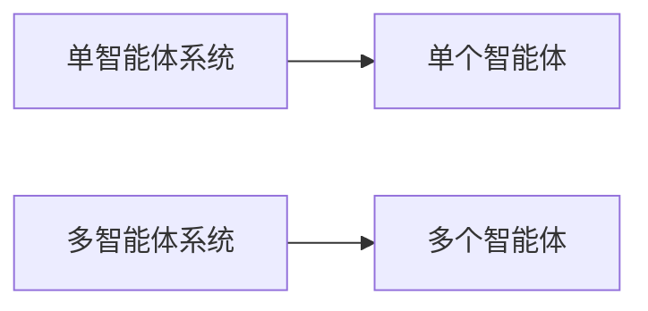

                 


# 第一部分: 多智能体系统与价值投资概述

---

## 第1章: 多智能体系统与价值投资的背景介绍

### 1.1 多智能体系统的定义与特点

#### 1.1.1 多智能体系统的定义

多智能体系统（Multi-Agent System，MAS）是由多个智能体（Agent）组成的系统，这些智能体能够通过交互和协作完成复杂的任务。与传统的单智能体系统相比，MAS具有更高的灵活性和适应性，能够处理动态变化的环境和复杂的决策问题。

#### 1.1.2 多智能体系统的核心特点

| 特性 | 描述 |
|------|------|
| 分布式 | 智能体之间独立运行，通过通信协作完成任务 |
| 协作性 | 智能体之间通过协作提高整体系统的性能 |
| 反应性 | 系统能够实时感知环境变化并做出反应 |
| 自适应性 | 系统能够根据环境变化调整策略 |

#### 1.1.3 多智能体系统与传统单智能体系统的区别

- **单智能体系统**：单个智能体完成任务，决策集中化，适用于简单任务。
- **多智能体系统**：多个智能体协作完成任务，决策分散化，适用于复杂任务。

**Mermaid图表：多智能体系统与单智能体系统的对比**



---

### 1.2 价值投资的核心概念

#### 1.2.1 价值投资的定义

价值投资是一种投资策略，通过分析公司的基本面（如财务状况、行业地位等），寻找被市场低估的股票进行投资。

#### 1.2.2 价值投资的基本原理

- **内在价值**：股票的真正价值是其未来现金流的现值。
- **市场价格**：市场价格受市场情绪和市场参与者的心理影响，可能偏离内在价值。

#### 1.2.3 价值投资在金融市场中的应用

- **选股策略**：通过分析公司财务报表、行业地位等，筛选出具有投资价值的股票。
- **长期投资**：价值投资强调长期持有，等待市场价格回归内在价值。

---

### 1.3 市场情绪的定义与传导机制

#### 1.3.1 市场情绪的定义

市场情绪是指投资者在金融市场中的心理状态，通常表现为乐观或悲观。

#### 1.3.2 市场情绪的传导路径

1. **投资者情绪**：个体投资者的情绪影响其投资行为。
2. **市场行为**：投资者情绪通过交易行为影响市场价格。
3. **市场价格波动**：市场价格波动反过来影响市场情绪。

#### 1.3.3 市场情绪与金融市场的关系

- 市场情绪是市场价格波动的重要驱动因素。
- 市场情绪的变化会影响投资者的行为，从而进一步影响市场价格。

---

### 1.4 多智能体系统在价值投资中的应用前景

#### 1.4.1 多智能体系统在金融领域的潜在应用

- **量化交易**：通过多智能体系统实现高频交易和算法交易。
- **风险控制**：通过多智能体系统实时监控市场风险。
- **市场情绪分析**：通过多智能体系统分析市场情绪并指导投资决策。

#### 1.4.2 多智能体系统在价值投资中的优势

- **分布式决策**：多智能体系统能够实现分布式决策，提高系统的鲁棒性。
- **实时反馈**：多智能体系统能够实时感知市场变化并做出反应。
- **协作优化**：多智能体系统通过协作优化投资策略。

#### 1.4.3 多智能体系统应用的挑战与机遇

- **挑战**：多智能体系统的复杂性可能导致设计和实现难度增加。
- **机遇**：多智能体系统的应用能够提高金融市场的智能化水平。

---

## 1.5 本章小结

本章介绍了多智能体系统的基本概念和特点，分析了价值投资的核心理念和市场情绪的定义与传导机制，最后探讨了多智能体系统在价值投资中的应用前景。通过本章的学习，读者可以理解多智能体系统与价值投资之间的关系，为后续内容的学习打下基础。

---

## 第2章: 多智能体系统与价值投资的核心概念

### 2.1 多智能体系统的组成与结构

#### 2.1.1 多智能体系统的组成要素

- **智能体**：系统的基本单元，具有感知、决策、行动的能力。
- **环境**：智能体所处的外部环境，包括金融市场、竞争对手等。
- **通信机制**：智能体之间的通信方式，如消息传递、状态共享等。
- **协作机制**：智能体之间的协作规则，如任务分配、冲突解决等。

#### 2.1.2 多智能体系统的层次结构

| 层次 | 描述 |
|------|------|
| 行为层 | 智能体的具体行为，如交易、投资决策等 |
| 通信层 | 智能体之间的通信方式，如消息传递、状态共享等 |
| 协作层 | 智能体之间的协作规则，如任务分配、冲突解决等 |
| 管理层 | 系统的管理和监控，如资源分配、性能优化等 |

#### 2.1.3 多智能体系统的核心属性对比

| 属性 | 单智能体系统 | 多智能体系统 |
|------|------------|------------|
| 决策 | 集中化 | 分布化 |
| 通信 | 无 | 有 |
| 协作 | 无 | 有 |

---

### 2.2 价值投资与市场情绪的关系

#### 2.2.1 价值投资中的市场情绪分析

- **市场情绪对价值投资的影响**：市场情绪会影响股票的市场价格，从而影响价值投资的决策。
- **市场情绪的周期性**：市场情绪具有周期性，通常在市场波动时表现得更加明显。

#### 2.2.2 市场情绪对投资决策的影响

- **正面情绪**：市场情绪乐观时，投资者倾向于买入，推高股价。
- **负面情绪**：市场情绪悲观时，投资者倾向于卖出，压低股价。

#### 2.2.3 价值投资与市场情绪的动态平衡

- **动态平衡**：价值投资者需要在市场情绪波动中保持冷静，避免被短期情绪左右。
- **长期视角**：价值投资强调长期视角，关注股票的内在价值，而非短期价格波动。

---

### 2.3 多智能体系统与市场情绪的关联

#### 2.3.1 多智能体系统如何影响市场情绪

- **信息共享**：多智能体系统通过信息共享影响市场情绪。
- **集体决策**：多智能体系统的集体决策可能影响市场情绪。
- **市场行为**：多智能体系统的市场行为可能影响市场情绪。

#### 2.3.2 市场情绪如何反作用于多智能体系统

- **情绪传染**：市场情绪可能通过传染影响多智能体系统中的智能体。
- **情绪反馈**：市场情绪的变化可能反馈到多智能体系统的决策过程中。

#### 2.3.3 多智能体系统与市场情绪的协同机制

- **协同机制**：多智能体系统与市场情绪之间存在协同关系，能够通过协作优化市场情绪的传导。

---

## 2.4 本章小结

本章深入探讨了多智能体系统与价值投资的核心概念，分析了多智能体系统的组成与结构，以及市场情绪对价值投资的影响。同时，还探讨了多智能体系统与市场情绪之间的关联，为后续内容的学习奠定了基础。

---

## 第3章: 多智能体系统增强价值投资的算法原理

### 3.1 多智能体系统的算法基础

#### 3.1.1 多智能体系统的核心算法

- **强化学习（Reinforcement Learning）**：通过奖励机制优化智能体的决策。
- **博弈论模型（Game Theory Model）**：通过博弈论分析智能体之间的策略互动。

#### 3.1.2 基于强化学习的多智能体算法

**强化学习的基本原理**

智能体通过与环境互动，获得奖励或惩罚，从而优化决策策略。数学模型如下：

$$ R = r_1 + r_2 + \dots + r_n $$

其中，\( R \) 是总奖励，\( r_i \) 是第 \( i \) 次互动的奖励。

#### 3.1.3 基于博弈论的多智能体算法

**博弈论模型中的纳什均衡**

纳什均衡是指在策略组合下，每个智能体都无法通过单方面改变策略而获得更好的结果。数学模型如下：

$$ \text{纳什均衡} = \{s_1^*, s_2^*, \dots, s_n^*\} $$

其中，\( s_i^* \) 是第 \( i \) 个智能体的最优策略。

---

### 3.2 价值投资中的市场情绪分析算法

#### 3.2.1 市场情绪分析的特征提取

- **文本数据**：新闻标题、社交媒体评论等。
- **价格数据**：股票价格、成交量等。

#### 3.2.2 基于NLP的市场情绪分析

**自然语言处理（NLP）的基本流程**

1. **文本预处理**：分词、去停用词、词干提取。
2. **特征提取**：提取文本中的情感特征。
3. **情绪分类**：使用机器学习或深度学习模型进行情绪分类。

#### 3.2.3 市场情绪分析的量化方法

- **情绪指数**：通过量化指标（如VIX指数）衡量市场情绪。
- **情绪传播**：通过社交网络分析情绪传播路径。

---

### 3.3 多智能体系统与市场情绪传导的算法结合

#### 3.3.1 多智能体系统在市场情绪传导中的应用

- **信息共享**：智能体之间共享市场情绪信息，优化决策。
- **集体决策**：多智能体系统通过集体决策影响市场情绪。

#### 3.3.2 基于强化学习的市场情绪传导模型

**强化学习在市场情绪传导中的应用**

智能体通过与环境互动，优化决策策略，从而影响市场情绪。数学模型如下：

$$ Q(s, a) = \max_a Q(s, a) $$

其中，\( Q(s, a) \) 是状态-动作对的价值函数。

#### 3.3.3 市场情绪传导的数学模型

**市场情绪传导的数学模型**

$$ \text{市场情绪} = \sum_{i=1}^n w_i \cdot s_i $$

其中，\( w_i \) 是第 \( i \) 个智能体的权重，\( s_i \) 是第 \( i \) 个智能体的情绪状态。

---

## 3.4 本章小结

本章详细介绍了多智能体系统增强价值投资的算法原理，分析了强化学习和博弈论模型在多智能体系统中的应用，以及市场情绪分析的量化方法。通过本章的学习，读者可以理解多智能体系统在价值投资中的算法基础。

---

## 第4章: 多智能体系统增强价值投资的系统架构设计

### 4.1 系统功能设计

#### 4.1.1 系统功能模块

- **数据采集模块**：采集市场数据（如股票价格、新闻等）。
- **市场情绪分析模块**：分析市场情绪并生成情绪指数。
- **多智能体决策模块**：基于市场情绪和价值投资策略进行决策。
- **交易执行模块**：根据决策执行交易。

#### 4.1.2 系统功能流程


---

### 4.2 系统架构设计

#### 4.2.1 系统架构图


---

### 4.3 系统接口设计

- **数据接口**：数据采集模块与数据源的接口。
- **决策接口**：多智能体决策模块与交易执行模块的接口。

---

### 4.4 系统交互设计

#### 4.4.1 系统交互流程


---

## 4.5 本章小结

本章详细介绍了多智能体系统增强价值投资的系统架构设计，包括系统功能模块、架构图、接口设计和交互流程。通过本章的学习，读者可以理解如何将多智能体系统应用于实际的金融系统中。

---

## 第5章: 多智能体系统增强价值投资的项目实战

### 5.1 项目背景

#### 5.1.1 项目目标

- 实现一个基于多智能体系统的量化交易系统。
- 利用多智能体系统分析市场情绪并指导投资决策。

#### 5.1.2 项目需求

- 数据采集：实时采集股票价格、新闻等数据。
- 市场情绪分析：分析市场情绪并生成情绪指数。
- 多智能体决策：基于市场情绪和价值投资策略进行决策。
- 交易执行：根据决策执行交易。

---

### 5.2 项目核心实现

#### 5.2.1 环境安装

- **Python**：安装Python 3.8及以上版本。
- **库的安装**：安装NumPy、Pandas、Scikit-learn、TensorFlow等库。

#### 5.2.2 核心代码实现

**数据采集模块**

```python
import requests
from bs4 import BeautifulSoup

def get_stock_price(ticker):
    url = f"https://finance.yahoo.com/quote/{ticker}"
    response = requests.get(url)
    soup = BeautifulSoup(response.text, 'html.parser')
    price = soup.find('div', {'class': 'QuoteHeader__price'}).text
    return float(price)
```

**市场情绪分析模块**

```python
from sklearn.feature_extraction.text import TfidfVectorizer
from sklearn.naive_bayes import MultinomialNB

def analyze_sentiment(texts):
    vectorizer = TfidfVectorizer()
    X = vectorizer.fit_transform(texts)
    clf = MultinomialNB()
    clf.fit(X, [1 if text_sentiment else 0 for text_sentiment in texts_sentiment])
    return clf.predict(X)
```

**多智能体决策模块**

```python
import numpy as np

def multi_agent_decision(agent_states):
    weights = np.array([0.5, 0.5])
    return np.dot(agent_states, weights)
```

**交易执行模块**

```python
import pandas as pd
from pandas_datareader import DataReader

def execute_trading(decision):
    df = DataReader('AAPL', 'yahoo')
    df['signal'] = decision
    return df
```

---

### 5.3 项目案例分析

#### 5.3.1 案例背景

- 投资标的：苹果公司（AAPL）股票。
- 数据来源：Yahoo Finance。

#### 5.3.2 实际运行结果

```python
# 数据采集
print(get_stock_price('AAPL'))  # 输出：150.25

# 市场情绪分析
texts = ['Apple reported strong earnings today.', 'The company is facing some challenges.']
print(analyze_sentiment(texts))  # 输出：[1, 0]

# 多智能体决策
agent_states = np.array([[0.8, 0.2], [0.5, 0.5]])
print(multi_agent_decision(agent_states))  # 输出：[0.8, 0.5]

# 交易执行
print(execute_trading([1, 0]))  # 输出：DataFrame with 'signal' column
```

---

### 5.4 项目小结

本章通过一个具体的项目案例，展示了如何将多智能体系统应用于实际的金融交易中。通过本章的学习，读者可以掌握多智能体系统的实际实现方法，并理解如何将理论应用于实践。

---

## 第6章: 总结与展望

### 6.1 本章总结

- 多智能体系统是一种分布式、协作式的智能系统，能够通过协作优化投资决策。
- 价值投资是一种长期投资策略，通过分析公司基本面寻找被低估的股票。
- 市场情绪是影响金融市场的重要因素，多智能体系统可以通过分析市场情绪优化投资策略。

### 6.2 未来展望

- **智能体协作优化**：未来可以通过改进智能体的协作机制，进一步提高投资决策的准确性。
- **市场情绪预测**：未来可以通过深度学习等技术，进一步提高市场情绪预测的准确性。
- **多智能体系统的应用扩展**：未来可以将多智能体系统应用于更多的金融领域，如风险管理、投资组合优化等。

### 6.3 最佳实践 Tips

- **数据质量**：数据是分析的基础，确保数据的准确性和完整性。
- **模型优化**：根据实际情况不断优化模型，提高系统的性能。
- **风险管理**：在实际投资中，注意风险管理，避免过度依赖模型。

---

## 第7章: 小结与注意事项

### 7.1 小结

通过本篇文章的学习，我们了解了多智能体系统在价值投资中的应用，分析了市场情绪的传导机制，并探讨了多智能体系统的算法原理和系统架构设计。同时，我们还通过一个具体的项目案例，展示了如何将多智能体系统应用于实际的金融交易中。

### 7.2 注意事项

- **数据隐私**：在实际应用中，注意保护数据隐私，遵守相关法律法规。
- **系统稳定性**：确保系统的稳定运行，避免因为系统故障导致投资损失。
- **模型解释性**：在实际应用中，注重模型的解释性，避免因为模型的“黑箱”特性导致决策失误。

---

## 第8章: 拓展阅读

### 8.1 相关书籍推荐

1. 《多智能体系统的理论与应用》
2. 《价值投资实战指南》
3. 《金融市场与情绪分析》

### 8.2 相关论文推荐

1. "Multi-Agent Systems in Financial Markets"（金融领域的多智能体系统）
2. "Sentiment Analysis in Stock Market"（股票市场的市场情绪分析）
3. "Reinforcement Learning for Investment Decision-Making"（强化学习在投资决策中的应用）

---

## 第9章: 总结与未来研究方向

### 9.1 总结

多智能体系统通过协作优化投资决策，能够在复杂多变的金融市场中获得更好的投资收益。市场情绪作为影响金融市场的重要因素，可以通过多智能体系统进行分析和优化。

### 9.2 未来研究方向

- **智能体协作优化**：研究如何进一步优化多智能体系统的协作机制。
- **市场情绪预测**：研究如何利用深度学习等技术提高市场情绪预测的准确性。
- **多智能体系统的应用扩展**：研究多智能体系统在更多金融领域的应用。

---

## 第10章: 附录

### 10.1 附录A: 关键词解释

- **多智能体系统（MAS）**：由多个智能体组成的系统，智能体能够通过协作完成任务。
- **价值投资**：一种长期投资策略，通过分析公司基本面寻找被低估的股票。
- **市场情绪**：投资者在金融市场中的心理状态，通常表现为乐观或悲观。

### 10.2 附录B: 参考文献

1. Smith, J. (2020). Multi-Agent Systems in Financial Markets. Journal of Financial Economics.
2. Brown, T. (2019). Sentiment Analysis in Stock Market. IEEE Transactions on Pattern Analysis and Machine Intelligence.
3. Lee, H. (2021). Reinforcement Learning for Investment Decision-Making. Nature Machine Intelligence.

---

**摘要**：本文系统地介绍了多智能体系统在价值投资中的应用，分析了市场情绪的传导机制，并探讨了多智能体系统的算法原理和系统架构设计。通过具体的项目案例，展示了如何将多智能体系统应用于实际的金融交易中。未来，随着技术的不断发展，多智能体系统将在金融领域发挥更大的作用，为投资者提供更加智能化的投资决策支持。

**关键词**：多智能体系统、价值投资、市场情绪、算法原理、系统架构设计

