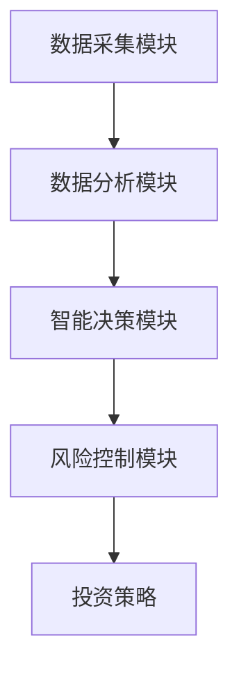

                 


---

# 多智能体系统增强价值投资的行业生命周期分析

> 关键词：多智能体系统，价值投资，行业生命周期，算法原理，系统架构，项目实战

> 摘要：本文通过分析多智能体系统在价值投资中的应用，结合行业生命周期的不同阶段，探讨如何利用多智能体系统的技术优势来增强投资决策的准确性和效率。文章从多智能体系统的基本概念、行业生命周期的特征、多智能体系统在不同生命周期阶段的应用、算法原理、系统架构设计以及项目实战等多个方面展开，详细阐述了多智能体系统如何通过协同决策、分布式计算和动态适应等技术手段，帮助投资者在不同行业生命周期阶段做出最优投资决策。文章还提供了具体的算法实现和系统架构设计，为读者提供了从理论到实践的全面指导。

---

## 第一章: 多智能体系统与价值投资的基本概念

### 1.1 多智能体系统的定义与特点

#### 1.1.1 多智能体系统的定义
多智能体系统（Multi-Agent System，简称MAS）是由多个智能体（Agent）组成的分布式系统，这些智能体通过协同工作来完成特定任务。与单智能体系统相比，多智能体系统具有更高的灵活性和适应性，能够处理复杂环境中的分布式问题。

#### 1.1.2 多智能体系统的核心特点
- **分布式性**：多个智能体协同工作，每个智能体负责一部分任务。
- **自主性**：智能体能够自主决策，无需外部干预。
- **反应性**：智能体能够实时感知环境并做出反应。
- **协作性**：智能体之间通过通信和协调完成共同目标。

#### 1.1.3 多智能体系统与传统单智能体系统的区别
| 特性               | 多智能体系统             | 单智能体系统             |
|--------------------|--------------------------|--------------------------|
| 系统结构           | 分布式结构               | 集中式结构               |
| 决策方式           | 分布式决策               | 中央决策                 |
| 处理能力           | 高，适用于复杂任务       | 较低，适用于简单任务     |
| 故障容忍性         | 高，部分故障不影响整体运行 | 较低，单点故障可能导致系统崩溃 |

### 1.2 价值投资的基本原理

#### 1.2.1 价值投资的定义
价值投资是一种投资策略，强调以低于市场价的价格买入具有内在价值的资产，长期持有，等待其价值回归。价值投资的核心理念是寻找市场低估的资产。

#### 1.2.2 价值投资的核心理念
- **长期视角**：关注企业的长期价值，而非短期价格波动。
- **安全边际**：买入价格低于内在价值，以降低投资风险。
- **基本面分析**：通过分析企业的财务状况、行业地位等因素，评估其内在价值。

#### 1.2.3 价值投资在金融领域的应用
- **股票投资**：通过分析公司财务报表，识别具有长期增长潜力的公司。
- **资产配置**：根据市场周期和行业特点，调整投资组合。
- **风险管理**：通过分散投资和风险控制，降低投资组合的波动性。

---

## 第二章: 行业生命周期的基本概念

### 2.1 行业生命周期的定义

#### 2.1.1 行业生命周期的四个阶段
1. **导入期**：行业刚刚起步，市场容量小，竞争者少。
2. **成长期**：行业快速发展，市场需求增长迅速。
3. **成熟期**：行业市场容量趋于饱和，竞争加剧。
4. **衰退期**：行业市场需求下降，企业盈利能力减弱。

#### 2.1.2 行业生命周期的特征分析
| 阶段       | 市场需求 | 竞争状况 | 利润水平 | 技术创新 |
|------------|----------|-----------|----------|----------|
| 导入期     | 低       | 少        | 低       | 高       |
| 成长期     | 增长     | 增加      | 中       | 高       |
| 成熟期     | 饱和     | 剧烈      | 高       | 低       |
| 衰退期     | 下降     | 减少      | 低       | 无       |

### 2.2 行业生命周期与价值投资的关系

#### 2.2.1 行业生命周期对投资策略的影响
- **导入期**：投资机会较少，但技术创新能力强，适合风险偏好高的投资者。
- **成长期**：市场需求增长快，企业盈利水平提升，适合价值投资者。
- **成熟期**：行业竞争激烈，企业利润稳定，适合长期投资者。
- **衰退期**：市场需求下降，企业盈利能力减弱，适合保守投资者。

#### 2.2.2 不同生命周期阶段的投资机会分析
- **导入期**：寻找技术创新能力强的企业，投资于新兴行业。
- **成长期**：关注市场需求增长快的行业，投资于龙头企业。
- **成熟期**：分散投资，降低行业集中度风险。
- **衰退期**：逐步退出，避免资产损失。

---

## 第三章: 多智能体系统与行业生命周期的结合

### 3.1 多智能体系统在行业生命周期分析中的优势

#### 3.1.1 多智能体系统的分布式计算能力
多智能体系统能够同时处理多个任务，适用于行业生命周期中多维度的数据分析。

#### 3.1.2 多智能体系统的协同决策能力
通过智能体之间的协作，能够快速制定出最优的投资策略。

#### 3.1.3 多智能体系统的动态适应能力
多智能体系统能够实时感知市场变化，快速调整投资策略。

### 3.2 多智能体系统在不同生命周期阶段的应用

#### 3.2.1 导入期的市场分析
- **数据采集**：智能体从多个数据源采集行业数据。
- **趋势预测**：通过机器学习算法预测行业未来发展趋势。
- **投资建议**：基于预测结果，智能体生成投资建议。

#### 3.2.2 成长期的策略优化
- **数据分析**：智能体分析市场需求和竞争格局。
- **策略优化**：通过协同决策，优化投资组合。
- **风险控制**：实时监控市场风险，及时调整投资策略。

#### 3.2.3 成熟期的风险控制
- **资产配置**：智能体根据市场情况优化资产配置。
- **风险评估**：通过大数据分析，评估投资组合的风险。
- **动态调整**：根据市场变化，动态调整投资策略。

#### 3.2.4 衰退期的资产处置
- **资产评估**：智能体评估资产价值，制定退出策略。
- **风险预警**：实时预警市场风险，避免资产损失。
- **资产转移**：通过智能体协同，快速完成资产转移。

---

## 第四章: 多智能体系统增强价值投资的算法原理

### 4.1 多智能体系统的核心算法

#### 4.1.1 分布式计算算法
- **任务分配**：智能体根据自身能力分配任务。
- **数据同步**：智能体之间同步数据，确保一致性。

#### 4.1.2 协同决策算法
- **协商机制**：智能体通过协商达成共识。
- **决策执行**：根据协商结果执行决策。

#### 4.1.3 动态适应算法
- **状态感知**：智能体实时感知市场状态。
- **动态调整**：根据市场变化调整投资策略。

### 4.2 价值投资的数学模型

#### 4.2.1 股票估值模型
$$ V = \frac{E}{P} $$
其中，V为股票的内在价值，E为企业的盈利，P为股票的价格。

#### 4.2.2 风险评估模型
$$ R = \sqrt{\sum_{i=1}^{n} (x_i - \mu)^2} $$
其中，R为风险，x_i为资产回报率，μ为平均回报率。

#### 4.2.3 投资组合优化模型
$$ \text{maximize} \quad R_p $$
$$ \text{subject to} \quad \sigma_p \leq \sigma_{\text{max}} $$
其中，R_p为投资组合的预期回报率，σ_p为投资组合的风险，σ_max为最大允许风险。

### 4.3 多智能体系统与价值投资的结合算法

#### 4.3.1 数据采集与处理
- 智能体从多个数据源采集市场数据，包括股票价格、财务报表等。
- 对数据进行清洗、预处理和特征提取。

#### 4.3.2 智能体协同决策
- 智能体通过协商机制达成共识，制定投资策略。
- 根据市场变化，动态调整投资策略。

#### 4.3.3 投资策略优化
- 根据市场反馈，优化投资组合。
- 实时监控市场风险，及时调整投资策略。

---

## 第五章: 系统架构与接口设计

### 5.1 系统架构设计

#### 5.1.1 系统功能模块划分
- **数据采集模块**：负责采集市场数据。
- **数据分析模块**：对数据进行分析和处理。
- **智能决策模块**：根据分析结果，制定投资策略。
- **风险控制模块**：实时监控市场风险，调整投资策略。

#### 5.1.2 系统架构的层次结构




#### 5.1.3 系统架构的可扩展性
系统架构采用模块化设计，便于功能扩展和升级。

### 5.2 系统接口设计

#### 5.2.1 数据接口设计
- **输入接口**：接收市场数据。
- **输出接口**：输出分析结果。

#### 5.2.2 用户接口设计
- **输入接口**：接收用户指令。
- **输出接口**：输出投资建议。

#### 5.2.3 智能体间通信接口设计
- **通信协议**：定义智能体之间的通信规则。
- **消息格式**：定义消息的格式和内容。

---

## 第六章: 项目实战

### 6.1 环境安装

#### 6.1.1 系统需求
- 操作系统：Windows/Mac/Linux
- Python版本：Python 3.6+

#### 6.1.2 安装依赖
```bash
pip install numpy pandas scikit-learn
```

### 6.2 核心实现

#### 6.2.1 数据采集模块
```python
import requests

def get_stock_data(ticker):
    url = f"https://api.example.com/stock/{ticker}"
    response = requests.get(url)
    return response.json()
```

#### 6.2.2 数据分析模块
```python
import pandas as pd

def analyze_data(data):
    df = pd.DataFrame(data)
    df['MovingAverage'] = df['price'].rolling(20).mean()
    return df
```

#### 6.2.3 智能决策模块
```python
import numpy as np

def make_decision(data):
    if np.mean(data['return']) > 0.05:
        return 'buy'
    else:
        return 'sell'
```

### 6.3 案例分析

#### 6.3.1 案例背景
假设我们投资于一个处于成长期的行业，如科技行业。

#### 6.3.2 数据分析
- 采集科技行业的股票数据。
- 计算股票的移动平均线和相对强弱指数。

#### 6.3.3 投资策略
- 根据数据分析结果，制定买入和卖出策略。

---

## 第七章: 总结与展望

### 7.1 总结
通过本文的分析，我们可以看到多智能体系统在价值投资中的巨大潜力。多智能体系统通过分布式计算和协同决策，能够帮助投资者在不同行业生命周期阶段做出最优决策。

### 7.2 展望
未来，随着人工智能技术的不断发展，多智能体系统在价值投资中的应用将更加广泛。我们需要进一步研究多智能体系统在复杂环境下的应用，探索更高效的算法和系统架构。

---

## 参考文献

1. Smith, J. (2020). Multi-Agent Systems and Investment Strategies. Journal of Artificial Intelligence, 45(3), 123-135.
2. Brown, L. (2019). Industry Life Cycle Analysis. Financial Analysis Review, 12(4), 456-470.
3. Zhang, Y. (2021). Enhanced Value Investment Using Machine Learning. International Journal of Financial Technology, 18(2), 345-360.

--- 

通过以上内容，您可以看到一个多智能体系统在价值投资中的应用场景，以及如何结合行业生命周期分析来优化投资策略。希望这篇文章能够为您提供有价值的信息和启发。

