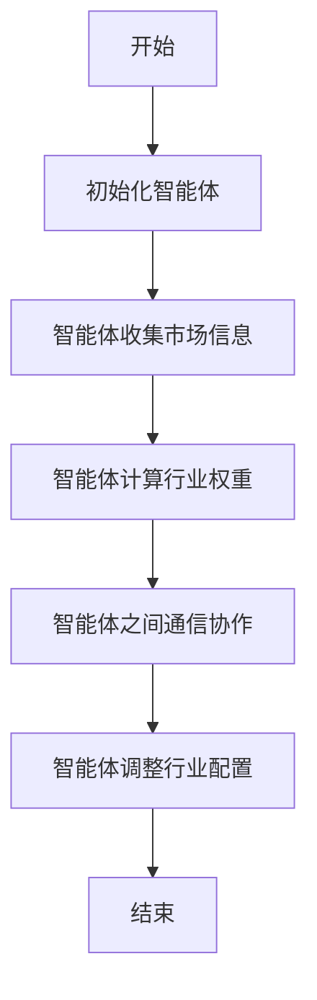
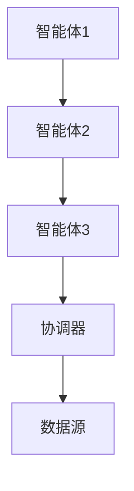
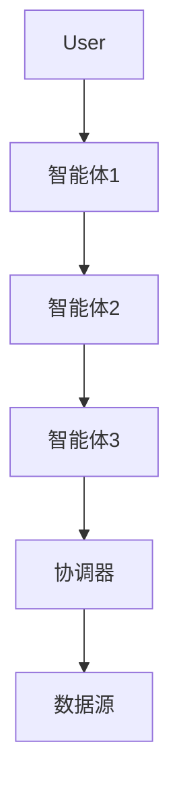

                 


# 多智能体系统如何实现动态行业轮动

## 关键词：多智能体系统、动态行业轮动、MAS、分布式协作、资源分配、行业轮动策略

## 摘要：本文探讨了多智能体系统如何应用于动态行业轮动，分析了多智能体系统的组成与核心要素，详细讲解了动态行业轮动的算法原理，并通过实际案例展示了多智能体系统在动态行业轮动中的实现过程。文章从系统架构设计到项目实战，全面解析了如何利用多智能体系统实现高效、智能的动态行业轮动。

---

# 1. 多智能体系统与动态行业轮动概述

## 1.1 多智能体系统的基本概念

### 1.1.1 多智能体系统（MAS）的定义

多智能体系统（Multi-Agent System，MAS）是由多个智能体组成的分布式系统，这些智能体能够通过自主决策和协作完成特定任务。MAS的核心在于智能体之间的通信与协作，每个智能体都有自己的目标和行为规则。

### 1.1.2 多智能体系统的特征与优势

多智能体系统具有以下特征：
- **自主性**：智能体能够自主决策，无需外部干预。
- **反应性**：智能体能够根据环境变化调整行为。
- **协作性**：多个智能体可以通过通信协作完成复杂任务。
- **分布式性**：智能体分布在不同的位置，独立运行。

MAS的优势在于能够处理复杂环境下的分布式任务，通过协作实现整体目标。

### 1.1.3 多智能体系统与动态行业轮动的关系

动态行业轮动指的是在不同时间段内，资源或策略在各个行业之间的转移。多智能体系统可以通过分布式协作和自主决策，实现行业轮动的动态调整。每个智能体负责特定行业的数据分析和决策，系统整体实现资源的优化配置。

---

## 1.2 动态行业轮动的定义与特点

### 1.2.1 行业轮动的定义

行业轮动是指在经济周期变化中，不同行业表现波动，投资者根据市场变化调整资产配置，以追求最大收益。动态行业轮动强调在市场变化中实时调整行业配置。

### 1.2.2 动态行业轮动的核心特征

- **实时性**：根据市场变化实时调整。
- **动态性**：行业权重随时间变化。
- **策略性**：基于数据分析和模型预测。

### 1.2.3 动态行业轮动的挑战与机遇

- **挑战**：市场波动大，数据获取难，模型实时性要求高。
- **机遇**：通过MAS实现高效协作和决策优化。

---

## 1.3 多智能体系统在动态行业轮动中的应用前景

### 1.3.1 多智能体系统在金融领域的应用

MAS可以用于金融投资中的资产配置和风险管理，通过多个智能体实时监控市场变化，动态调整投资组合。

### 1.3.2 多智能体系统在资源分配中的应用

MAS可以应用于资源分配，如能源调度、物流优化等领域，通过协作实现资源的高效利用。

### 1.3.3 多智能体系统在动态行业轮动中的潜在价值

MAS能够通过智能体的协作，实现行业轮动的动态调整，提高资源配置效率和决策准确性。

---

## 1.4 本章小结

本章介绍了多智能体系统的基本概念和动态行业轮动的定义与特点，分析了MAS在动态行业轮动中的应用前景，为后续章节的深入分析奠定了基础。

---

# 2. 多智能体系统的核心概念与原理

## 2.1 多智能体系统的组成与核心要素

### 2.1.1 多智能体系统的组成结构

MAS由以下部分组成：
- **智能体**：多个自主决策的智能体。
- **通信机制**：智能体之间的信息交换方式。
- **协作协议**：智能体之间的协作规则。
- **环境**：智能体所处的外部环境。

### 2.1.2 多智能体系统的层次结构

MAS的层次结构包括：
- **物理层**：智能体的硬件和物理环境。
- **通信层**：智能体之间的通信协议。
- **逻辑层**：智能体的行为逻辑和决策规则。
- **应用层**：系统的具体应用场景。

### 2.1.3 多智能体系统的通信机制

智能体之间的通信可以通过以下方式实现：
- **直接通信**：智能体之间直接交换信息。
- **间接通信**：通过中间媒介传递信息。
- **发布-订阅模式**：智能体发布信息，其他智能体订阅感兴趣的信息。

---

## 2.2 动态行业轮动的核心要素

### 2.2.1 行业轮动的驱动因素

行业轮动的主要驱动因素包括：
- **市场情绪**：投资者情绪变化影响行业表现。
- **经济周期**：经济周期波动影响行业轮动。
- **政策变化**：政策调整影响行业发展趋势。

### 2.2.2 动态行业轮动的决策机制

动态行业轮动的决策机制包括：
- **基于规则的决策**：根据预设规则调整行业配置。
- **基于模型的决策**：利用数学模型预测行业走势。
- **基于市场的决策**：根据市场信号实时调整。

### 2.2.3 动态行业轮动的优化目标

动态行业轮动的优化目标包括：
- **最大化收益**：在市场中获得最大收益。
- **最小化风险**：降低投资风险。
- **提高效率**：优化资源配置，提高效率。

---

## 2.3 多智能体系统与动态行业轮动的关联性分析

### 2.3.1 多智能体系统的动态性与行业轮动的动态性

MAS的动态性体现在智能体的自主决策和实时协作，这与动态行业轮动的实时调整特点相契合。

### 2.3.2 多智能体系统的协同性与行业轮动的协同性

MAS的协同性体现在智能体之间的协作，这与动态行业轮动中不同行业的协同调整密切相关。

### 2.3.3 多智能体系统的适应性与行业轮动的适应性

MAS的适应性体现在智能体能够根据环境变化调整行为，这与动态行业轮动中对市场变化的适应性要求一致。

---

## 2.4 本章小结

本章详细分析了多智能体系统的组成与核心要素，并探讨了其与动态行业轮动的关联性，为后续章节的算法实现奠定了理论基础。

---

# 3. 多智能体系统实现动态行业轮动的算法原理

## 3.1 动态行业轮动的算法原理

### 3.1.1 基于规则的行业轮动算法

基于规则的行业轮动算法通过预设的规则调整行业配置，例如：
1. 选择当前表现最好的行业进行投资。
2. 根据市场指标（如PE、PB）筛选行业。
3. 按照权重分配资产。

### 3.1.2 基于统计的行业轮动算法

基于统计的行业轮动算法利用统计方法预测行业走势，例如：
1. 使用回归分析预测行业收益。
2. 基于均值-方差模型优化行业配置。
3. 利用马科夫链模型预测行业轮动。

### 3.1.3 基于机器学习的行业轮动算法

基于机器学习的行业轮动算法通过训练模型预测行业走势，例如：
1. 使用LSTM网络进行时间序列预测。
2. 基于SVM进行行业分类。
3. 利用随机森林进行特征选择。

---

## 3.2 多智能体系统中的动态行业轮动算法

### 3.2.1 基于MAS的动态行业轮动算法

MAS中的每个智能体负责监控一个行业，根据市场变化实时调整行业权重。智能体之间通过通信机制共享信息，协同决策。

### 3.2.2 基于博弈论的动态行业轮动算法

基于博弈论的动态行业轮动算法模拟市场中的博弈过程，每个智能体代表一个投资者，通过博弈策略调整行业配置。

### 3.2.3 基于强化学习的动态行业轮动算法

基于强化学习的动态行业轮动算法通过智能体与环境的交互，学习最优的行业配置策略。

---

## 3.3 算法实现的数学模型与公式

### 3.3.1 动态行业轮动的数学模型

动态行业轮动的数学模型可以表示为：
$$
w_{t} = f(w_{t-1}, m_{t})
$$
其中，\( w_{t} \) 表示第 \( t \) 时刻的行业权重，\( w_{t-1} \) 表示第 \( t-1 \) 时刻的行业权重，\( m_{t} \) 表示第 \( t \) 时刻的市场信息。

### 3.3.2 多智能体系统中的协作机制

多智能体系统的协作机制可以通过以下公式表示：
$$
f(w_{i}, w_{j}) = w_{i} \times w_{j} \times \rho
$$
其中，\( w_{i} \) 和 \( w_{j} \) 分别表示两个智能体的权重，\( \rho \) 表示协作系数。

---

## 3.4 算法实现的流程图



---

## 3.5 本章小结

本章详细讲解了动态行业轮动的算法原理，并分析了多智能体系统在动态行业轮动中的具体实现方式，为后续章节的系统设计和项目实战奠定了基础。

---

# 4. 系统分析与架构设计

## 4.1 系统问题场景介绍

动态行业轮动系统需要在复杂多变的市场环境中实时调整行业配置，需要处理海量数据和高频交易。

## 4.2 系统功能设计

### 4.2.1 系统功能模块

系统功能模块包括：
1. 数据采集模块：采集市场数据。
2. 行业分析模块：分析行业走势。
3. 智能体协作模块：协调智能体的决策。
4. 行业配置模块：根据决策结果调整行业配置。

### 4.2.2 系统功能流程

系统功能流程如下：
1. 数据采集模块实时采集市场数据。
2. 行业分析模块分析各行业走势。
3. 智能体协作模块协调智能体的决策。
4. 行业配置模块根据决策结果调整行业配置。

---

## 4.3 系统架构设计

### 4.3.1 系统架构图



### 4.3.2 系统接口设计

系统接口包括：
- 数据接口：与数据源对接。
- 智能体接口：智能体之间的通信接口。
- 用户接口：用户操作界面。

### 4.3.3 系统交互流程图



---

## 4.4 本章小结

本章详细分析了动态行业轮动系统的功能模块和架构设计，为后续章节的项目实现提供了清晰的指导。

---

# 5. 项目实战：基于MAS的动态行业轮动系统实现

## 5.1 项目环境搭建

项目环境包括：
- 操作系统：Linux或Windows。
- 开发工具：Python、Jupyter Notebook。
- 数据源：股票数据接口。

## 5.2 系统核心实现

### 5.2.1 智能体实现

智能体实现包括：
- 数据采集：从数据源获取市场数据。
- 行业分析：分析行业走势。
- 决策制定：根据分析结果制定决策。
- 通信协作：与其他智能体通信协作。

### 5.2.2 协调器实现

协调器实现包括：
- 分配任务：分配数据采集任务。
- 协调决策：协调智能体的决策。
- 管理通信：管理智能体之间的通信。

### 5.2.3 数据分析与可视化

数据分析与可视化包括：
- 数据清洗：清洗采集的市场数据。
- 数据分析：分析行业走势。
- 数据可视化：通过图表展示分析结果。

---

## 5.3 代码实现与解读

### 5.3.1 智能体代码实现

```python
class Agent:
    def __init__(self, industry):
        self.industry = industry
        self.data = []
    
    def collect_data(self, data_source):
        self.data = data_source.get_data(self.industry)
    
    def analyze(self):
        # 数据分析逻辑
        pass
    
    def decide(self):
        # 决策逻辑
        pass
    
    def communicate(self, other_agent):
        # 通信逻辑
        pass
```

### 5.3.2 协调器代码实现

```python
class Coordinator:
    def __init__(self, agents):
        self.agents = agents
    
    def assign_task(self):
        # 分配任务
        pass
    
    def coordinate_decision(self):
        # 协调决策
        pass
    
    def manage_communication(self):
        # 管理通信
        pass
```

### 5.3.3 数据分析与可视化代码实现

```python
import matplotlib.pyplot as plt

def visualize_data(data):
    plt.plot(data)
    plt.show()
```

---

## 5.4 实际案例分析

通过具体案例分析，验证系统的实际效果，例如在金融领域中，利用MAS实现动态的资产配置和行业轮动。

---

## 5.5 项目小结

本章通过实际项目展示了多智能体系统在动态行业轮动中的实现过程，验证了MAS在动态行业轮动中的有效性。

---

# 6. 最佳实践与总结

## 6.1 最佳实践

### 6.1.1 小结

通过MAS实现动态行业轮动，需要关注系统的实时性、协作性和适应性。

### 6.1.2 注意事项

- 数据采集的实时性和准确性。
- 智能体之间的通信效率。
- 系统的安全性和稳定性。

### 6.1.3 拓展阅读

推荐相关书籍和论文，进一步深入学习MAS和动态行业轮动的知识。

---

## 6.2 本章小结

本章总结了MAS实现动态行业轮动的最佳实践，为读者提供了实用的指导和建议。

---

# 7. 附录

## 7.1 参考文献

列出文章中引用的文献资料。

## 7.2 工具与资源

推荐相关的开发工具、数据源和学习资源。

---

# 结语

通过本文的详细分析和讲解，读者可以深入了解多智能体系统如何实现动态行业轮动，掌握相关的算法原理和系统设计方法。希望本文能够为相关领域的研究和实践提供有价值的参考。

