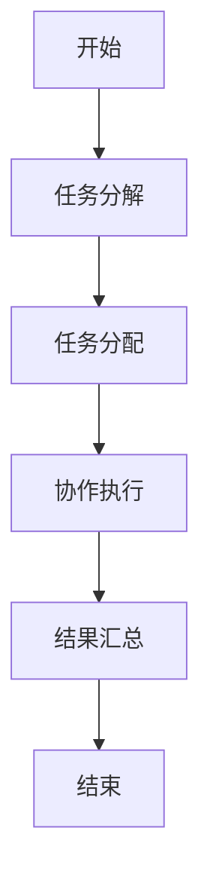
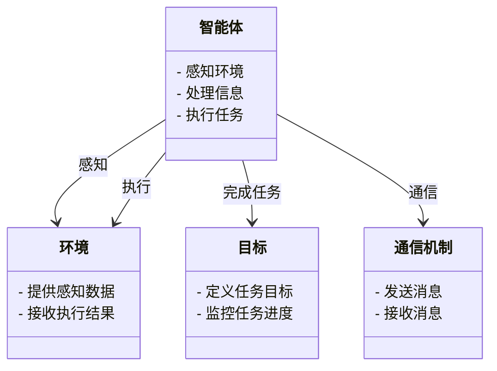

                 


# 多智能体系统如何实现智能化公司比较分析

---

## 关键词：多智能体系统、智能化公司、分布式计算、博弈论、系统架构设计、人工智能

---

## 摘要：  
多智能体系统（Multi-Agent System, MAS）是一种由多个智能体组成的分布式系统，通过智能体之间的协作与交互，共同完成复杂任务。本文通过分析多智能体系统的核心概念、算法原理、系统架构设计以及实际应用案例，深入探讨多智能体系统如何助力智能化公司实现高效协作与智能决策。文章从背景介绍、核心概念、算法原理、数学模型、系统架构、项目实战等多个维度展开，为读者提供全面的分析与见解。

---

## 第一部分: 多智能体系统与智能化公司概述

### 第1章: 多智能体系统与智能化公司的背景

#### 1.1 多智能体系统的基本概念

**1.1.1 智能体的定义与特征**  
智能体（Agent）是指具有感知环境、自主决策、执行任务能力的实体。智能体可以是软件程序、机器人或其他智能设备，具备以下特征：  
1. **自主性**：智能体能够自主决策，无需外部干预。  
2. **反应性**：能够实时感知环境并做出反应。  
3. **社交性**：能够与其他智能体或人类进行交互与协作。  
4. **学习能力**：能够通过经验或数据优化自身行为。  

**1.1.2 多智能体系统的定义**  
多智能体系统是由多个智能体组成的分布式系统，这些智能体通过通信与协作，共同完成复杂任务。与单智能体系统相比，多智能体系统具有更高的灵活性和容错性。  

**1.1.3 多智能体系统与传统单智能体系统的区别**  
| 特性 | 单智能体系统 | 多智能体系统 |  
|------|--------------|--------------|  
| 决策中心化 | 单一决策中心 | 分布式决策 |  
| 通信需求 | 无 | 需要智能体间通信 |  
| 系统复杂度 | 较低 | 较高 |  

---

#### 1.2 智能化公司的概念与特点

**1.2.1 智能化公司的定义**  
智能化公司是指通过引入人工智能、大数据、物联网等技术，将企业各个部门、系统和流程智能化，实现高效、精准、自动化的运营模式。  

**1.2.2 智能化公司的核心特征**  
1. **数据驱动**：利用数据进行决策和优化。  
2. **自动化**：通过智能化系统减少人工干预。  
3. **协作性**：各部门和系统协同工作，实现无缝对接。  
4. **动态适应性**：能够快速响应市场变化和客户需求。  

**1.2.3 智能化公司与传统公司的对比**  

| 特性 | 传统公司 | 智能化公司 |  
|------|----------|------------|  
| 运营模式 | 依赖人工，效率较低 | 数据驱动，效率高 |  
| 信息处理 | 信息孤岛，处理缓慢 | 数据共享，实时处理 |  
| 决策方式 | 依赖经验，决策滞后 | 数据驱动，实时决策 |  

---

#### 1.3 多智能体系统在智能化公司中的应用前景

**1.3.1 多智能体系统的潜在应用领域**  
1. **生产管理**：优化生产流程，实时监控设备状态。  
2. **供应链管理**：协调供应商、制造商和零售商之间的协作。  
3. **客户服务**：智能客服系统通过多智能体协作提供个性化服务。  
4. **市场营销**：通过智能体分析市场趋势，制定精准营销策略。  

**1.3.2 多智能体系统在企业中的优势**  
1. **提高效率**：通过智能体协作，减少人工干预。  
2. **增强灵活性**：多智能体系统能够快速适应变化。  
3. **提升决策质量**：通过数据共享和协作，做出更优决策。  

**1.3.3 多智能体系统应用的挑战与机遇**  
挑战：  
1. **通信延迟**：智能体间通信可能引入延迟。  
2. **协同复杂性**：多个智能体协作需要复杂的协调机制。  

机遇：  
1. **技术进步**：人工智能和分布式技术的快速发展为多智能体系统提供了更多可能性。  
2. **应用场景丰富**：多智能体系统可以在多个领域中发挥重要作用。  

---

## 第二部分: 多智能体系统的核心概念与联系

### 第2章: 多智能体系统的核心概念

#### 2.1 多智能体系统的组成要素

**2.1.1 智能体**  
智能体是多智能体系统的核心单元，负责感知环境、处理信息并执行任务。  

**2.1.2 环境**  
环境是智能体所处的外部世界，可以是物理环境（如工厂）或数字环境（如数据库）。  

**2.1.3 目标**  
目标是智能体需要完成的任务或目标，可以是单一任务（如完成订单）或复杂任务（如优化供应链）。  

**2.1.4 通信机制**  
通信机制是智能体之间进行信息交换的方式，可以是直接通信（如通过API）或间接通信（如通过中间件）。  

#### 2.2 多智能体系统的分类

**2.2.1 基于任务的分类**  
1. **简单任务**：如传感器节点采集数据。  
2. **复杂任务**：如协同完成订单处理。  

**2.2.2 基于智能体类型的分类**  
1. **反应式智能体**：基于当前感知做出反应。  
2. **规划式智能体**：基于预定义目标进行规划。  

**2.2.3 基于通信机制的分类**  
1. **直接通信**：智能体之间直接交互。  
2. **间接通信**：通过中间媒介进行通信。  

#### 2.3 多智能体系统的属性特征对比

| 特性 | 反应式智能体 | 规划式智能体 |  
|------|--------------|--------------|  
| 行为模式 | 基于当前感知 | 基于预定义目标 |  
| 决策方式 | 即时决策 | 计划性决策 |  
| 适应性 | 高 | 中 |  

---

## 第三部分: 多智能体系统的算法原理

### 第3章: 多智能体系统的核心算法

#### 3.1 分布式计算与多智能体协作

**3.1.1 分布式计算的基本原理**  
分布式计算是指将任务分解到多个节点上并行执行，通过节点之间的通信与协调完成任务。  

**3.1.2 多智能体协作的算法流程**  
1. **任务分解**：将整体任务分解为多个子任务。  
2. **任务分配**：根据智能体的能力分配子任务。  
3. **协作执行**：智能体协同完成子任务。  
4. **结果汇总**：将子任务结果汇总，形成最终结果。  

**算法流程图（Mermaid）**  


#### 3.2 博弈论与多智能体决策

**3.2.1 博弈论的基本概念**  
博弈论研究多个主体在竞争或合作环境下的决策行为，常用于分析多智能体系统中的决策问题。  

**3.2.2 多智能体决策的数学模型**  
$$u_i = \arg\max_{a_i \in A_i} \sum_{j=1}^n w_j u_j(a_i)$$  
其中，$u_i$ 是智能体 $i$ 的决策，$A_i$ 是智能体 $i$ 的可选动作，$w_j$ 是决策因子的权重，$u_j$ 是决策因子的效用函数。  

---

## 第四部分: 多智能体系统的数学模型与公式

### 第4章: 多智能体系统的数学模型

#### 4.1 多智能体系统的基本公式

**4.1.1 智能体行为模型**  
$$b_i = f(p_i, s_i)$$  
其中，$b_i$ 是智能体 $i$ 的行为，$p_i$ 是智能体 $i$ 的感知，$s_i$ 是智能体 $i$ 的内部状态。  

**4.1.2 系统状态转移方程**  
$$s_{t+1} = g(s_t, a_t)$$  
其中，$s_t$ 是时间 $t$ 的系统状态，$a_t$ 是时间 $t$ 的动作，$g$ 是状态转移函数。  

#### 4.2 博弈论与多智能体决策的数学表达

**4.2.1 纯策略与混合策略**  
- 纯策略：智能体在给定状态下选择确定的动作。  
- 混合策略：智能体以一定概率选择多个动作。  

**4.2.2 Nash均衡的数学证明**  
Nash均衡是指在给定其他智能体策略的情况下，智能体无法通过单方面改变策略而获得更好的结果。  
$$u_i(a_i^*, a_{-i}) \geq u_i(a_i, a_{-i}) \quad \forall a_i \in A_i$$  
其中，$a_i^*$ 是均衡策略，$a_{-i}$ 是其他智能体的策略。  

---

## 第五部分: 多智能体系统的系统分析与架构设计

### 第5章: 智能化公司的系统分析

#### 5.1 问题场景介绍

**5.1.1 传统公司的痛点**  
1. 部门间信息孤岛，协作效率低。  
2. 决策依赖人工经验，缺乏数据支持。  
3. 系统灵活性差，难以快速响应变化。  

**5.1.2 多智能体系统如何解决这些问题**  
通过引入多智能体系统，实现部门间高效协作，数据实时共享，快速响应客户需求。  

#### 5.2 系统功能设计

**5.2.1 领域模型 Mermaid 类图**  


---

## 第六部分: 项目实战

### 第6章: 项目实战

#### 6.1 环境安装

**6.1.1 安装依赖**  
1. 安装 Python 和 pip。  
2. 安装必要的库，如 `numpy`, `scipy`, `matplotlib`。  

#### 6.2 系统核心实现源代码

**6.2.1 多智能体协作实现代码（Python）**  
```python
import numpy as np
import matplotlib.pyplot as plt

class Agent:
    def __init__(self, id, target):
        self.id = id
        self.target = target
        self.position = np.random.rand(2) * 10

    def move(self):
        # 假设目标为一个点
        direction = self.target - self.position
        self.position += direction * 0.1

    def get_position(self):
        return self.position

def main():
    # 初始化多个智能体
    agents = [Agent(i, np.array([5, 5])) for i in range(5)]
    plt.ion()
    plt.figure(figsize=(10, 10))
    for _ in range(100):
        for agent in agents:
            agent.move()
        plt.clf()
        for agent in agents:
            plt.scatter(*agent.get_position(), c='blue', s=100)
        plt.scatter(5, 5, c='red', s=100)
        plt.pause(0.1)
    plt.ioff()
    plt.show()

if __name__ == '__main__':
    main()
```

**代码解读与分析**  
1. **Agent 类**：定义智能体，包含 ID、目标位置和当前位置。  
2. **move 方法**：根据目标位置调整当前位置。  
3. **main 函数**：初始化多个智能体，绘制动态图像，显示智能体移动过程。  

---

## 第七部分: 总结与展望

### 第7章: 总结与展望

#### 7.1 最佳实践 tips

1. 在设计多智能体系统时，需明确智能体的目标和职责。  
2. 确保智能体之间的通信机制高效可靠。  
3. 定期监控系统性能，及时优化算法和架构。  

#### 7.2 小结

多智能体系统通过智能体协作，能够显著提升智能化公司的运营效率和决策能力。通过本文的分析，读者可以深入了解多智能体系统的核心概念、算法原理和实际应用。

#### 7.3 注意事项

1. 多智能体系统设计需考虑通信延迟和计算资源分配。  
2. 系统上线前需进行全面测试，确保各智能体协同工作。  

#### 7.4 拓展阅读

1. 《Multi-Agent Systems: Algorithm and Applications》  
2. 《博弈论与经济行为》  

---

通过本文的详细分析，读者可以全面了解多智能体系统在智能化公司中的应用，掌握其实现原理和最佳实践方法。未来，随着人工智能和分布式技术的进一步发展，多智能体系统将在更多领域发挥重要作用。

