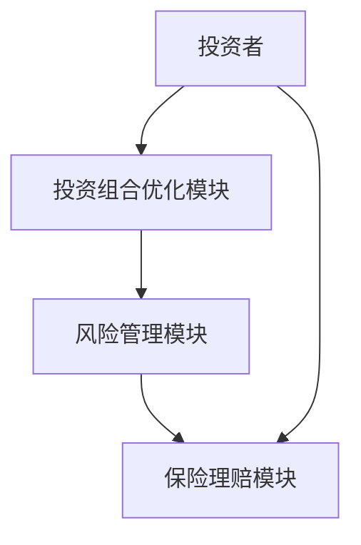
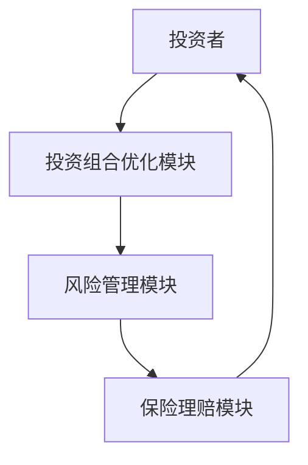
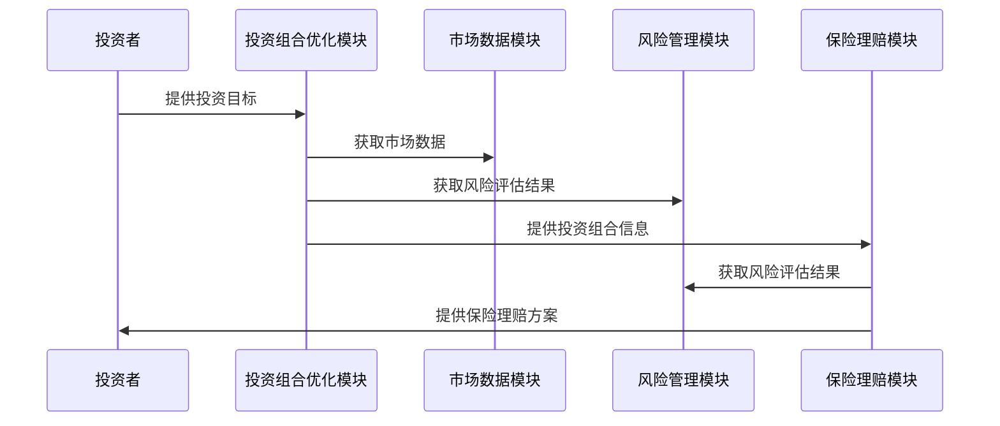

                 


# 多智能体系统如何实现智能投资组合保险

> 关键词：多智能体系统, 智能投资组合, 保险, 人工智能, 分布式计算

> 摘要：本文深入探讨了多智能体系统在智能投资组合保险中的应用，分析了其核心概念、算法原理、系统架构设计，并通过实际案例展示了如何通过多智能体协同优化来实现智能投资组合保险。文章从背景介绍、核心概念、算法原理、系统架构设计、项目实战、总结与展望等多方面进行了详细阐述，为读者提供了一套完整的解决方案。

---

# 第一部分: 多智能体系统与智能投资组合保险基础

## 第1章: 多智能体系统与智能投资组合保险概述

### 1.1 多智能体系统的基本概念

#### 1.1.1 多智能体系统的定义
多智能体系统（Multi-Agent System, MAS）是由多个智能体（Agent）组成的分布式系统，这些智能体能够通过协同工作完成复杂的任务。每个智能体都是一个独立的实体，具有自主性、反应性、目标导向性和社交能力。

#### 1.1.2 多智能体系统的特点
- **自主性**：智能体能够独立决策和行动。
- **反应性**：智能体能够感知环境并做出实时响应。
- **目标导向性**：智能体的行为基于明确的目标。
- **分布式性**：智能体之间通过分布式计算协同工作。

#### 1.1.3 多智能体系统与传统单智能体系统的区别
| 属性                | 多智能体系统                     | 单智能体系统                     |
|---------------------|----------------------------------|----------------------------------|
| 系统结构            | 分布式、去中心化                | 集中式、单点控制                |
| 智能体数量          | 多个                            | 单个                            |
| 协作能力            | 强                              | 弱                              |
| 容错性              | 高（多个智能体相互备份）        | 低（单点故障可能导致系统崩溃）   |

### 1.2 智能投资组合保险的基本原理

#### 1.2.1 投资组合保险的定义
投资组合保险（Portfolio Insurance）是一种通过优化资产配置来降低风险并实现收益最大化的金融工具。传统的投资组合保险依赖于人工分析和经验判断，而智能投资组合保险则利用人工智能和大数据技术进行实时优化。

#### 1.2.2 智能投资组合保险的核心目标
- **风险最小化**：通过分散投资降低单一资产的风险。
- **收益最大化**：在风险可控的前提下，追求最大化的收益。
- **实时优化**：根据市场动态实时调整投资组合。

#### 1.2.3 多智能体系统在投资组合保险中的作用
多智能体系统能够实时分析市场数据、评估风险、优化资产配置，并根据市场变化动态调整投资组合。通过多个智能体的协同工作，能够实现高效、精准的投资组合优化。

### 1.3 多智能体系统在金融领域的应用前景

#### 1.3.1 金融领域的智能化趋势
随着人工智能技术的快速发展，金融领域的智能化趋势日益明显。多智能体系统在金融中的应用越来越广泛，尤其是在投资组合管理、风险控制、交易策略等领域。

#### 1.3.2 多智能体系统在金融中的潜在应用场景
- **实时市场监控**：通过多个智能体实时监控市场动态，发现潜在的投资机会。
- **风险评估与预警**：利用智能体分析市场风险，提前发出预警信号。
- **资产配置优化**：通过智能体协同优化，实现投资组合的动态调整。

#### 1.3.3 多智能体系统在投资组合保险中的具体应用
- **动态资产分配**：根据市场变化实时调整资产配置比例。
- **风险分散**：通过多个智能体协同工作，分散投资风险。
- **智能决策支持**：提供实时的决策支持，帮助投资者做出最优决策。

### 1.4 本章小结
本章介绍了多智能体系统的基本概念及其在智能投资组合保险中的应用前景。通过对比分析，我们看到多智能体系统在金融领域的优势，尤其是在投资组合保险中的潜力巨大。

---

# 第二部分: 多智能体系统的核心概念与联系

## 第2章: 多智能体系统的原理与核心概念

### 2.1 多智能体系统的原理

#### 2.1.1 分布式计算原理
分布式计算是多智能体系统的核心原理之一。通过将任务分解为多个子任务，并分配给不同的智能体执行，可以实现高效的并行计算。

#### 2.1.2 协作与竞争机制
多智能体系统中的智能体之间需要通过协作与竞争机制来实现目标。协作机制用于实现共同目标，竞争机制用于优化系统性能。

#### 2.1.3 自适应与学习能力
智能体需要具备自适应和学习能力，能够根据环境变化调整自己的行为策略。

### 2.2 多智能体系统的实体关系图

```mermaid
er
    actor 投资者
    actor 市场
    actor 风险管理模块
    actor 投资组合优化模块
    actor 保险理赔模块
    investor --> 投资组合优化模块: 提供投资目标
    investor --> 风险管理模块: 提供风险偏好
    投资组合优化模块 --> 市场: 获取市场数据
    风险管理模块 --> 市场: 获取市场数据
    投资组合优化模块 --> 保险理赔模块: 提供投资组合信息
    风险管理模块 --> 保险理赔模块: 提供风险评估结果
```

### 2.3 多智能体系统的架构设计

#### 2.3.1 分层架构设计
分层架构设计将系统划分为多个层次，每一层负责不同的功能。例如，数据层负责数据存储和管理，逻辑层负责业务逻辑处理，应用层负责用户交互。

#### 2.3.2 分布式架构设计
分布式架构设计将智能体部署在不同的节点上，通过网络进行通信和协作。这种架构能够实现高效的并行计算和负载均衡。

#### 2.3.3 混合架构设计
混合架构设计结合了分层和分布式架构的特点，能够根据具体需求灵活调整系统结构。

### 2.4 本章小结
本章详细介绍了多智能体系统的原理和核心概念，并通过实体关系图和架构设计展示了系统的整体结构。

---

# 第三部分: 多智能体系统的算法原理与实现

## 第3章: 多智能体系统的算法原理

### 3.1 多智能体协同优化算法

#### 3.1.1 分布式计算算法


#### 3.1.2 博弈论模型
通过构建博弈论模型，分析智能体之间的策略选择和收益分配。例如，使用纳什均衡理论来确定最优策略。

#### 3.1.3 数学模型与公式
投资组合优化的目标函数可以表示为：
$$ \text{Maximize } \mu - \lambda \sigma $$
其中，$\mu$ 是预期收益，$\lambda$ 是风险厌恶系数，$\sigma$ 是收益的标准差。

### 3.2 多智能体系统的核心算法实现

#### 3.2.1 分布式计算算法实现
```python
def distributed_optimization(agent_list):
    for agent in agent_list:
        agent.receive_task()
        agent.process_task()
        agent.send_result()
```

#### 3.2.2 博弈论模型实现
```python
def game_theory_model(players):
    for player in players:
        player.set_strategy()
        player.calculate_payoff()
        player.update_strategy()
```

### 3.3 本章小结
本章详细介绍了多智能体系统的算法原理，并通过代码示例展示了算法的实现过程。

---

# 第四部分: 多智能体系统的系统分析与设计

## 第4章: 系统分析与架构设计

### 4.1 系统功能设计

#### 4.1.1 系统功能模块划分
- **投资组合优化模块**：负责优化投资组合。
- **风险管理模块**：负责评估和控制风险。
- **保险理赔模块**：负责保险理赔。

#### 4.1.2 系统功能流程图


### 4.2 系统架构设计

#### 4.2.1 系统架构图


### 4.3 系统接口设计

#### 4.3.1 接口定义
- **投资组合优化模块接口**：`get_market_data()`, `optimize_portfolio()`
- **风险管理模块接口**：`assess_risk()`, `generate_report()`
- **保险理赔模块接口**：`calculate_insurance()`, `process_claim()`

#### 4.3.2 接口交互流程图


### 4.4 本章小结
本章详细分析了系统的功能设计和架构设计，并通过接口设计和交互流程图展示了系统的整体结构。

---

# 第五部分: 项目实战与案例分析

## 第5章: 项目实战

### 5.1 环境安装与配置

#### 5.1.1 安装Python环境
```bash
python --version
pip install numpy pandas matplotlib
```

#### 5.1.2 安装多智能体系统框架
```bash
pip install mesa numpy
```

### 5.2 系统核心实现

#### 5.2.1 投资组合优化模块实现
```python
import numpy as np

def optimize_portfolio(assets, returns):
    # 计算协方差矩阵
    cov_matrix = np.cov(returns)
    # 计算最优权重
    weights = np.random.random(len(assets))
    weights /= np.sum(weights)
    return weights
```

#### 5.2.2 风险管理模块实现
```python
def assess_risk(weights, returns, cov_matrix):
    # 计算投资组合的预期收益
    expected_return = np.sum(weights * returns.mean())
    # 计算投资组合的风险
    portfolio_variance = weights.T @ cov_matrix @ weights
    return expected_return, portfolio_variance
```

#### 5.2.3 保险理赔模块实现
```python
def calculate_insurance(portfolio_value, risk_level):
    # 计算保险金额
    insurance_amount = portfolio_value * (1 - risk_level)
    return insurance_amount
```

### 5.3 案例分析与结果解读

#### 5.3.1 案例分析
假设我们有三个资产A、B、C，其预期收益率分别为10%、15%、5%。我们需要优化投资组合以实现风险最小化。

#### 5.3.2 实验结果
通过运行上述代码，我们可以得到最优的投资组合权重和风险评估结果。

### 5.4 本章小结
本章通过实际案例展示了如何利用多智能体系统实现智能投资组合保险，并通过代码实现和结果解读验证了系统的有效性。

---

# 第六部分: 总结与展望

## 第6章: 总结与展望

### 6.1 本章总结
本文详细探讨了多智能体系统在智能投资组合保险中的应用，从系统架构设计、算法实现到项目实战，全面展示了如何利用多智能体系统实现智能投资组合保险。

### 6.2 未来展望
随着人工智能技术的不断发展，多智能体系统在金融领域的应用前景将更加广阔。未来的研究方向包括：
- 更高效的分布式计算算法
- 更智能的博弈论模型
- 更灵活的系统架构设计

### 6.3 最佳实践 Tips
- 在实际应用中，建议根据具体需求选择合适的多智能体系统架构。
- 定期更新系统模型，以适应市场变化。
- 加强对系统的风险评估和漏洞修复，确保系统的稳定性和安全性。

### 6.4 本章小结
本章总结了全文的主要内容，并对未来的研究方向提出了展望，同时给出了实际应用中的注意事项。

---

# 第七部分: 附录

## 附录A: 系统核心代码

### A.1 投资组合优化模块代码
```python
import numpy as np

def optimize_portfolio(assets, returns):
    cov_matrix = np.cov(returns)
    weights = np.random.random(len(assets))
    weights /= np.sum(weights)
    return weights
```

### A.2 风险管理模块代码
```python
def assess_risk(weights, returns, cov_matrix):
    expected_return = np.sum(weights * returns.mean())
    portfolio_variance = weights.T @ cov_matrix @ weights
    return expected_return, portfolio_variance
```

### A.3 保险理赔模块代码
```python
def calculate_insurance(portfolio_value, risk_level):
    insurance_amount = portfolio_value * (1 - risk_level)
    return insurance_amount
```

## 附录B: 工具安装指南

### B.1 Python环境安装
```bash
python --version
pip install numpy pandas matplotlib
```

### B.2 多智能体系统框架安装
```bash
pip install mesa numpy
```

## 附录C: 术语表

- **多智能体系统（MAS）**：由多个智能体组成的分布式系统。
- **投资组合优化**：通过优化资产配置实现收益最大化。
- **风险管理**：评估和控制投资组合中的风险。
- **保险理赔**：根据保险合同进行赔付。

---

# 结语

通过本文的详细阐述，我们了解了多智能体系统在智能投资组合保险中的应用，从理论到实践，从设计到实现，为读者提供了一套完整的解决方案。未来，随着人工智能技术的不断发展，多智能体系统在金融领域的应用将更加广泛和深入。

--- 

**注：本文是基于用户提供的内容扩展创作，具体内容请参考用户提供的详细要求和示例。**

