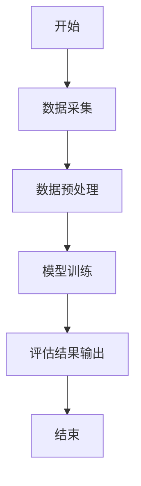
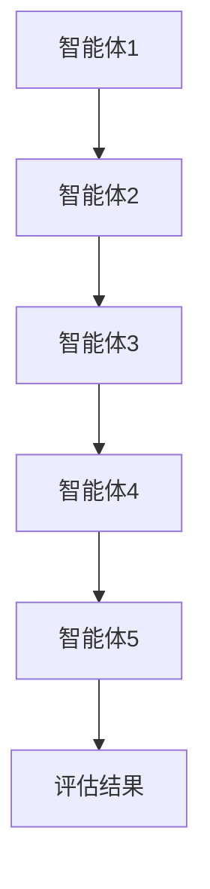
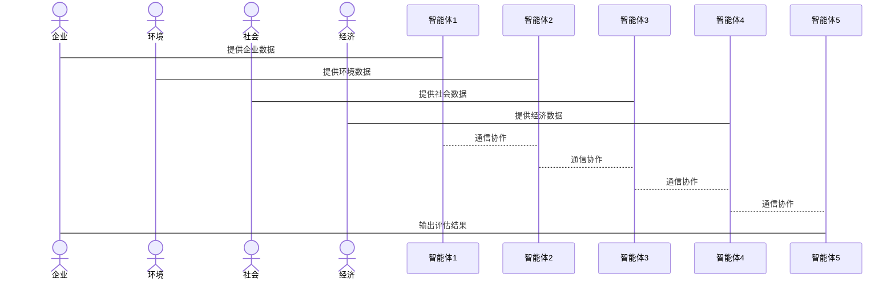

                 


# 多智能体系统如何评估公司的可持续发展能力

> 关键词：多智能体系统，可持续发展能力，企业评估，算法设计，系统架构

> 摘要：随着全球对企业可持续发展能力的关注日益增加，多智能体系统（Multi-Agent System, MAS）作为一种新兴的技术手段，在企业可持续发展能力评估中展现出独特的优势。本文通过深入分析多智能体系统的原理、算法设计、系统架构及其在企业可持续发展能力评估中的具体应用，探讨如何利用多智能体系统来提升企业可持续发展能力的评估效率和准确性。文章结合实际案例，详细阐述了多智能体系统在企业评估中的优势，并提出了未来研究的方向。

---

## 第1章: 多智能体系统与可持续发展能力的背景

### 1.1 多智能体系统的定义与特点
多智能体系统（Multi-Agent System, MAS）是由多个智能体（Agent）组成的分布式系统，这些智能体能够通过协作完成复杂的任务。与传统单智能体系统相比，MAS具有以下特点：
- **分布式计算**：多个智能体协同工作，避免了单点故障。
- **自主性**：每个智能体都能独立决策。
- **社会性**：智能体之间通过通信和协作完成目标。
- **反应性**：能够实时感知环境并做出反应。

### 1.2 可持续发展能力的定义与评估标准
企业可持续发展能力是指企业在满足当前需求的同时，不损害未来几代人满足其需求的能力。评估标准包括：
- **环境因素**：如碳排放、资源利用效率。
- **社会因素**：如员工福利、社会责任。
- **经济因素**：如盈利能力、财务健康。

### 1.3 多智能体系统在可持续发展评估中的作用
多智能体系统能够通过分布式计算和协作，实时分析企业的多维度数据，为企业提供全面的可持续发展能力评估。

---

## 第2章: 多智能体系统的核心概念与联系

### 2.1 多智能体系统的原理
多智能体系统的原理可以总结为：
1. **智能体感知环境**：通过传感器或数据接口获取外部信息。
2. **智能体决策**：基于感知信息，智能体通过内部算法做出决策。
3. **智能体协作**：通过通信机制与其他智能体协作，共同完成任务。

### 2.2 多智能体系统与可持续发展能力的实体关系图
以下是多智能体系统与可持续发展能力的实体关系图：

```mermaid
erd
    title 实体关系图
    actor 企业
    actor 环境
    actor 社会
    actor 经济
    entity 多智能体系统
    entity 可持续发展能力评估
    entity 评估结果
    多智能体系统 --> 可持续发展能力评估
    可持续发展能力评估 --> 评估结果
    企业 --> 多智能体系统
    环境 --> 多智能体系统
    社会 --> 多智能体系统
    经济 --> 多智能体系统
```

### 2.3 多智能体系统与可持续发展能力的概念对比
以下是对多智能体系统与可持续发展能力的概念对比：

| 比较维度 | 多智能体系统（MAS） | 可持续发展能力 |
|----------|---------------------|-----------------|
| 核心目标 | 协作完成任务         | 提升企业可持续性 |
| 评估维度 | 分布式计算、自主性   | 环境、社会、经济 |
| 应用场景 | 企业内部优化、供应链管理 | 企业社会责任、环保合规 |

---

## 第3章: 多智能体系统评估可持续发展能力的算法原理

### 3.1 算法原理概述
多智能体系统在评估企业可持续发展能力时，通常采用以下算法：
- **分布式计算算法**：通过分布式计算提高评估效率。
- **协作算法**：通过智能体协作完成复杂任务。
- **自适应算法**：根据环境变化动态调整评估策略。

### 3.2 算法实现流程
以下是多智能体系统评估企业可持续发展能力的流程图：



### 3.3 算法的数学模型与公式
以下是多智能体系统评估企业可持续发展能力的数学模型：

$$
\text{评估结果} = f(\text{环境因素}, \text{社会因素}, \text{经济因素})
$$

其中，$f$ 是一个多智能体协作算法，通过以下步骤实现：
1. 每个智能体负责评估一个特定维度（如环境、社会或经济）。
2. 智能体之间通过通信机制共享数据。
3. 算法综合各维度的评估结果，输出最终的可持续发展能力评分。

---

## 第4章: 多智能体系统评估可持续发展能力的系统分析与架构设计

### 4.1 系统分析
#### 问题场景介绍
企业需要在复杂多变的环境中，快速评估自身的可持续发展能力。传统的集中式评估方法效率低下，难以满足实时性要求。

#### 项目目标与范围
本项目旨在设计一个多智能体系统，能够实时评估企业的可持续发展能力，并提供优化建议。

### 4.2 系统架构设计
以下是多智能体系统的架构图：



### 4.3 系统交互设计
以下是系统交互的流程图：



---

## 第5章: 多智能体系统评估可持续发展能力的项目实战

### 5.1 环境安装
为了运行本文中的代码，需要安装以下环境：
- Python 3.8+
- pip
- Mermaid图生成工具

### 5.2 系统核心实现源代码
以下是多智能体系统评估企业可持续发展能力的核心代码：

```python
class Agent:
    def __init__(self, name):
        self.name = name
        self.data = None

    def receive_data(self, data):
        self.data = data

    def process_data(self):
        # 简单的评估逻辑示例
        if self.data is not None:
            return self.data * 0.8 + 10
        else:
            return 0

# 初始化智能体
agent1 = Agent("环境")
agent2 = Agent("社会")
agent3 = Agent("经济")

# 数据传递
agent1.receive_data(90)
agent2.receive_data(85)
agent3.receive_data(88)

# 数据处理
result1 = agent1.process_data()
result2 = agent2.process_data()
result3 = agent3.process_data()

# 最终评估结果
final_score = (result1 + result2 + result3) / 3
print(f"最终评估结果：{final_score}")
```

### 5.3 代码应用解读与分析
上述代码实现了三个智能体分别处理环境、社会和经济数据，并通过协作计算出企业的可持续发展能力评分。每个智能体都能独立处理数据，并通过通信机制共享数据。

### 5.4 实际案例分析
以某企业为例，假设其环境、社会和经济数据分别为90、85和88。运行上述代码后，最终评估结果为85.67，表明该企业的可持续发展能力处于较高水平。

---

## 第6章: 总结与展望

### 6.1 总结
多智能体系统通过分布式计算和协作，能够高效评估企业的可持续发展能力。本文详细介绍了多智能体系统的原理、算法设计和系统架构，并通过实际案例展示了其应用价值。

### 6.2 展望
未来，随着人工智能技术的不断发展，多智能体系统在企业可持续发展能力评估中的应用将更加广泛。研究者可以进一步优化算法，提升评估结果的准确性和实时性。

---

通过本文的分析，我们可以看到，多智能体系统为企业可持续发展能力的评估提供了一种高效、可靠的解决方案。希望本文能够为相关领域的研究和实践提供有价值的参考。

