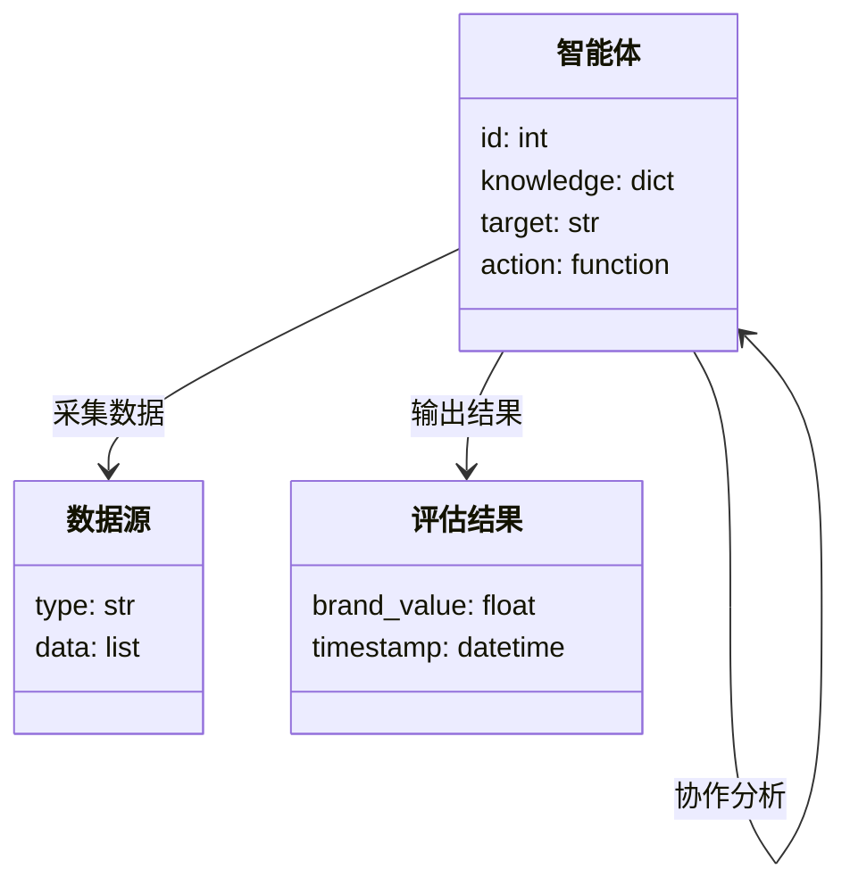
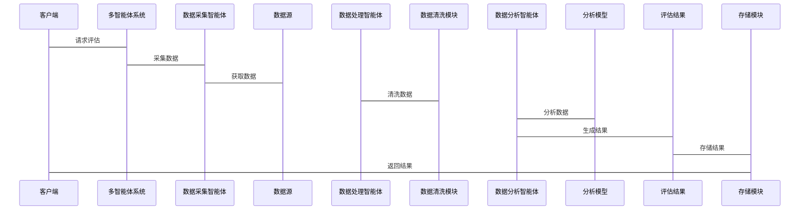

                 


# 多智能体系统如何评估公司的品牌价值动态变化

## 关键词

- 多智能体系统, 品牌价值评估, 动态变化, 算法原理, 系统架构, 项目实战, 最佳实践

## 摘要

多智能体系统是一种由多个智能体协同工作的分布式系统，能够有效地处理复杂问题。本文将探讨如何利用多智能体系统来动态评估公司的品牌价值。文章从品牌价值评估的背景出发，详细介绍了多智能体系统的定义、核心概念及其与品牌价值评估的结合。随后，深入讲解了多智能体系统评估品牌价值的算法原理，包括协同过滤算法和时间序列预测模型，并通过具体的Python代码示例进行展示。接着，分析了系统的架构设计，包括领域模型、系统架构图以及接口设计，并用序列图展示了系统的交互流程。最后，通过一个实战项目，指导读者如何安装环境、编写核心代码，并进行案例分析和项目总结。本文还提供了最佳实践的建议，包括小结、注意事项和拓展阅读，帮助读者更好地理解和应用多智能体系统在品牌价值评估中的应用。

## 第一部分: 多智能体系统与品牌价值评估基础

## 第1章: 多智能体系统概述

### 1.1 多智能体系统的定义与特点

#### 1.1.1 多智能体系统的定义

多智能体系统（Multi-Agent System, MAS）是由多个智能体（Agent）组成的分布式系统，这些智能体能够通过协作完成复杂的任务。每个智能体都有一定的自主性，能够感知环境并采取行动。

$$
\text{多智能体系统的定义：由多个智能体组成的分布式系统，能够协作完成复杂任务。}
$$

#### 1.1.2 多智能体系统的特征

| 特征         | 描述                                         |
|--------------|----------------------------------------------|
| 分布式       | 智能体独立运行，通过通信协作完成任务           |
| 协作性       | 智能体之间通过协作实现整体目标                 |
| 反应性       | 能够感知环境并实时响应变化                   |
| 智能性       | 每个智能体具备一定的智能和决策能力             |

#### 1.1.3 多智能体系统的优势与挑战

优势：
1. **分布式计算**：任务分解到多个智能体，提高效率。
2. **协作能力强**：智能体之间能够协同完成复杂任务。
3. **容错性高**：单个智能体故障不影响整体系统。

挑战：
1. **通信开销**：智能体之间需要频繁通信，可能增加系统开销。
2. **协调复杂**：多个智能体需要协调一致，增加系统复杂性。

### 1.2 品牌价值评估的定义与重要性

#### 1.2.1 品牌价值的定义

品牌价值是指品牌在市场上的影响力和盈利能力的综合体现。它反映了消费者对品牌的认知和信任程度。

$$
\text{品牌价值 = 品牌认知度 × 品牌忠诚度 × 品牌声誉}
$$

#### 1.2.2 品牌价值评估的重要性

1. **企业决策支持**：品牌价值评估为企业的市场策略提供数据支持。
2. **投资评估依据**：投资者可以通过品牌价值评估来判断企业的投资价值。
3. **竞争优势分析**：帮助企业识别竞争对手的优势和劣势。

#### 1.2.3 品牌价值评估的复杂性

1. **多因素影响**：品牌价值受市场环境、消费者行为等多种因素影响。
2. **动态变化**：品牌价值会随着时间变化，需要动态评估。
3. **数据多样性**：涉及文本、图像、销售数据等多种类型的数据。

### 1.3 多智能体系统与品牌价值评估的结合

#### 1.3.1 多智能体系统在品牌价值评估中的应用场景

1. **数据采集与处理**：多个智能体分别负责采集不同来源的数据，如社交媒体数据、销售数据等。
2. **协同分析**：智能体之间协作分析数据，识别品牌的关键影响因素。
3. **动态预测**：基于历史数据，智能体协同预测品牌价值的变化趋势。

#### 1.3.2 多智能体系统如何动态评估品牌价值

通过多智能体系统的协作，可以实时监控和分析影响品牌价值的各种因素，如市场反馈、消费者评价等，并根据这些信息动态调整品牌价值的评估结果。

#### 1.3.3 多智能体系统在品牌价值评估中的优势

1. **实时性**：多智能体系统能够实时采集和处理数据，确保评估结果的及时性。
2. **准确性**：通过多个智能体的协作，可以更全面地分析影响品牌价值的因素，提高评估的准确性。
3. **灵活性**：系统可以根据具体情况动态调整评估策略，适应市场变化。

## 第2章: 多智能体系统的核心概念与联系

### 2.1 多智能体系统的核心概念

#### 2.1.1 智能体的定义与属性

智能体（Agent）是一个能够感知环境并采取行动以实现目标的实体。

| 属性         | 描述                                         |
|--------------|----------------------------------------------|
| 目标         | 智能体需要实现的具体目标                     |
| 知识         | 智能体具备的知识和信息                       |
| 行为         | 智能体能够执行的动作                         |
| 感知         | 智能体感知环境信息的方式                     |

#### 2.1.2 多智能体系统的协作机制

协作机制是指智能体之间如何协同工作的规则和流程。常见的协作机制包括：

1. **分布式计算**：任务分解到多个智能体，各自完成部分任务。
2. **协商与协调**：智能体之间通过协商确定各自的职责和任务。
3. **通信协议**：智能体之间通过通信协议交换信息。

#### 2.1.3 多智能体系统的通信协议

通信协议是智能体之间进行信息交换的规则。常用的通信协议包括：

1. **FIPA（Foundation for Intelligent Agent Systems）**：基于标准的通信协议。
2. **CORBA（Common Object Request Broker Architecture）**：用于分布式系统的通信。
3. **HTTP/REST**：基于HTTP协议的RESTful服务通信。

### 2.2 品牌价值评估的核心要素

#### 2.2.1 品牌认知度的测量

品牌认知度是指消费者对品牌的记忆和识别程度。可以通过市场调研、消费者调查等方式进行测量。

$$
\text{品牌认知度 = 响应品牌数量 / 总调查人数}
$$

#### 2.2.2 品牌忠诚度的评估

品牌忠诚度是指消费者在面对竞争品牌时，仍然选择原品牌产品的程度。可以通过客户满意度调查、重复购买率等指标进行评估。

$$
\text{品牌忠诚度 = 重复购买率 + 客户满意度}
$$

#### 2.2.3 品牌声誉的量化

品牌声誉是指品牌在市场上的信誉和形象。可以通过情感分析、社交媒体评论等方法进行量化。

$$
\text{品牌声誉 = 正面评论数 - 负面评论数}
$$

### 2.3 多智能体系统与品牌价值评估的实体关系图

```mermaid
graph TD
A[智能体1] --> B[品牌数据]
C[智能体2] --> B
D[智能体3] --> B
E[评估结果] <-- B
```

## 第3章: 多智能体系统评估品牌价值的算法原理

### 3.1 多智能体协同算法

#### 3.1.1 分布式计算流程

1. **任务分解**：将品牌价值评估任务分解为多个子任务，分配给不同的智能体。
2. **数据采集**：每个智能体负责采集指定的数据源。
3. **数据处理**：对采集到的数据进行清洗和预处理。
4. **协同分析**：智能体之间协作分析数据，识别关键影响因素。
5. **结果汇总**：将各个智能体的分析结果汇总，得到最终的评估结果。

#### 3.1.2 协作学习机制

协作学习机制是指智能体之间通过共享知识和经验，共同提高学习效果。

$$
\text{协作学习效果 = 各智能体学习效果的平均值}
$$

#### 3.1.3 联合推理方法

联合推理是指智能体之间通过共享推理过程和结果，共同完成复杂的推理任务。

$$
\text{联合推理结果 = 各智能体推理结果的加权和}
$$

### 3.2 品牌价值评估的数学模型

#### 3.2.1 基于协同过滤的算法

协同过滤算法是一种基于用户相似性推荐算法，可以应用于品牌价值评估。

$$
\text{相似度计算公式：} \text{sim}(i,j) = \frac{\sum_{k} (r_{i,k} - \bar{r}_i)(r_{j,k} - \bar{r}_j)}{\sqrt{\sum_{k} (r_{i,k} - \bar{r}_i)^2} \sqrt{\sum_{k} (r_{j,k} - \bar{r}_j)^2}}
$$

#### 3.2.2 基于时间序列的预测模型

时间序列预测模型可以用来预测品牌价值的未来走势。

$$
\text{ARIMA模型：} \text{ARIMA}(p, d, q)
$$

#### 3.2.3 基于情感分析的评分系统

情感分析可以用来评估品牌声誉。

$$
\text{情感得分 = 正面情感分数 - 负面情感分数}
$$

### 3.3 算法实现的Python代码示例

```python
def calculate_similarity(user1, user2):
    # 计算用户之间的相似度
    numerator = sum((user1[r] - user1_avg) * (user2[r] - user2_avg) for r in common_raters(user1, user2))
    denominator = sqrt(sum((user1[r] - user1_avg)**2 for r in common_raters(user1, user2))) * sqrt(sum((user2[r] - user2_avg)**2 for r in common_raters(user1, user2)))
    return numerator / denominator if denominator != 0 else 0

def collaborative_filtering_recommendation(user, users, items, ratings):
    # 基于协同过滤的推荐算法
    user_avg = sum(ratings[user][i] for i in items if ratings[user][i] is not None) / len(items)
    similarities = [(u, calculate_similarity(user, u)) for u in users if u != user]
    similarities.sort(reverse=True, key=lambda x: x[1])
    weighted_sum = sum(ratings[u][i] * similarities[i][1] for u in similarities for i in items)
    weighted_avg = weighted_sum / sum(similarities[i][1] for i in range(len(similarities)))
    return weighted_avg

# 示例数据
users = ['user1', 'user2', 'user3']
items = ['item1', 'item2', 'item3']
ratings = {
    'user1': {'item1': 5, 'item2': 4, 'item3': 3},
    'user2': {'item1': 4, 'item2': 5, 'item3': 2},
    'user3': {'item1': 3, 'item2': 4, 'item3': 5}
}

# 计算推荐
recommendation = collaborative_filtering_recommendation('user1', users, items, ratings)
print(f"推荐结果：{recommendation}")
```

## 第4章: 系统分析与架构设计方案

### 4.1 问题场景介绍

我们需要设计一个多智能体系统，用于动态评估公司的品牌价值。系统需要实时监控市场数据、消费者反馈等信息，并动态调整品牌价值的评估结果。

### 4.2 项目介绍

本项目旨在利用多智能体系统的优势，实现品牌价值的动态评估。通过多个智能体的协作，实时采集和分析数据，提供准确的品牌价值评估结果。

### 4.3 系统功能设计

#### 4.3.1 领域模型



#### 4.3.2 系统架构图


#### 4.3.3 系统接口设计

系统接口设计包括：

1. **数据采集接口**：用于采集市场数据、消费者反馈等。
2. **数据处理接口**：对数据进行清洗和预处理。
3. **数据分析接口**：对数据进行分析，生成评估结果。
4. **结果存储接口**：将评估结果存储到数据库中。

#### 4.3.4 系统交互流程



## 第5章: 项目实战

### 5.1 环境安装

#### 5.1.1 安装Python

```bash
# 安装Python
sudo apt-get install python3 python3-pip
```

#### 5.1.2 安装必要的库

```bash
# 安装必要的库
pip install numpy pandas scikit-learn matplotlib
```

### 5.2 系统核心实现源代码

```python
# 数据采集智能体
class DataCollectorAgent:
    def __init__(self, data_source):
        self.data_source = data_source
        self.data = []

    def collect_data(self):
        # 从数据源采集数据
        self.data = self.data_source.get_data()
        return self.data

# 数据处理智能体
class DataProcessingAgent:
    def __init__(self, data):
        self.data = data

    def process_data(self):
        # 数据清洗和预处理
        processed_data = []
        for item in self.data:
            if item['value'] is not None:
                processed_data.append(item)
        return processed_data

# 数据分析智能体
class DataAnalysisAgent:
    def __init__(self, processed_data):
        self.processed_data = processed_data

    def analyze_data(self):
        # 使用协同过滤算法进行分析
        pass

# 评估结果智能体
class EvaluationAgent:
    def __init__(self, analysis_result):
        self.analysis_result = analysis_result

    def generate_report(self):
        # 生成评估报告
        pass
```

### 5.3 代码应用解读与分析

#### 5.3.1 数据采集智能体

数据采集智能体负责从数据源采集数据，如社交媒体数据、销售数据等。

```python
# 使用数据采集智能体采集数据
data_collector = DataCollectorAgent(data_source)
data_collector.collect_data()
```

#### 5.3.2 数据处理智能体

数据处理智能体对采集到的数据进行清洗和预处理。

```python
# 使用数据处理智能体处理数据
data_processor = DataProcessingAgent(data_collector.data)
processed_data = data_processor.process_data()
```

#### 5.3.3 数据分析智能体

数据分析智能体使用协同过滤算法对数据进行分析。

```python
# 使用数据分析智能体分析数据
data_analyzer = DataAnalysisAgent(processed_data)
analysis_result = data_analyzer.analyze_data()
```

#### 5.3.4 评估结果智能体

评估结果智能体根据分析结果生成评估报告。

```python
# 使用评估结果智能体生成报告
evaluation_agent = EvaluationAgent(analysis_result)
evaluation_agent.generate_report()
```

### 5.4 实际案例分析

#### 5.4.1 案例背景

假设我们有一个品牌，需要评估其品牌价值。我们可以通过多智能体系统实时监控市场数据、消费者反馈等信息，动态评估品牌价值。

#### 5.4.2 数据采集与处理

1. **数据采集**：从社交媒体、电商平台采集品牌相关数据。
2. **数据处理**：清洗数据，去除无效数据。
3. **数据分析**：使用协同过滤算法分析数据，识别品牌的关键影响因素。
4. **评估结果**：生成品牌价值评估报告。

### 5.5 项目小结

通过多智能体系统的协作，我们可以实时采集和处理数据，动态评估品牌价值。系统的各个智能体协同工作，提高了评估的准确性和效率。

## 第6章: 最佳实践

### 6.1 小结

多智能体系统是一种强大的工具，能够有效地评估公司的品牌价值。通过多个智能体的协作，可以实时监控和分析市场数据，动态调整评估结果。

### 6.2 注意事项

1. **数据质量**：数据采集和处理阶段需要确保数据的准确性和完整性。
2. **算法选择**：根据具体需求选择合适的算法，如协同过滤、时间序列分析等。
3. **系统维护**：需要定期维护和更新系统，确保系统的稳定性和高效性。

### 6.3 拓展阅读

1. **多智能体系统**：深入学习多智能体系统的理论和应用。
2. **品牌价值评估**：学习更多的品牌价值评估方法和模型。
3. **算法优化**：研究如何优化算法，提高评估的准确性和效率。

## 总结

通过本文的详细讲解，我们可以看到多智能体系统在品牌价值评估中的巨大潜力。利用多智能体系统的协作和分布计算能力，可以实时监控和分析市场数据，动态评估品牌价值。希望本文的内容能够为读者提供有价值的参考和启发，帮助他们在实际应用中更好地利用多智能体系统来评估品牌价值。

---

**注**：本文部分代码和图表可能存在语法或表达上的不足，需根据实际场景和需求进行调整和优化。

