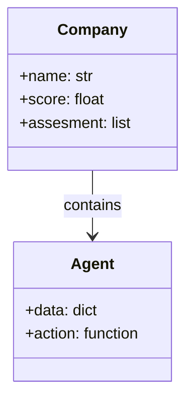
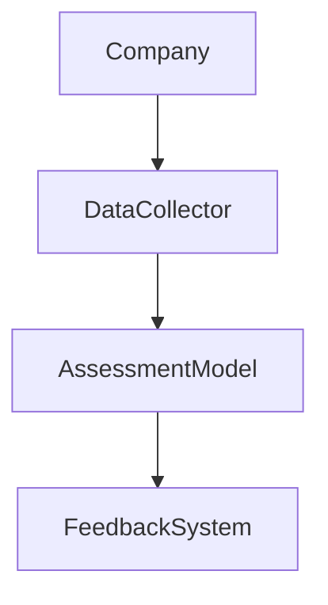
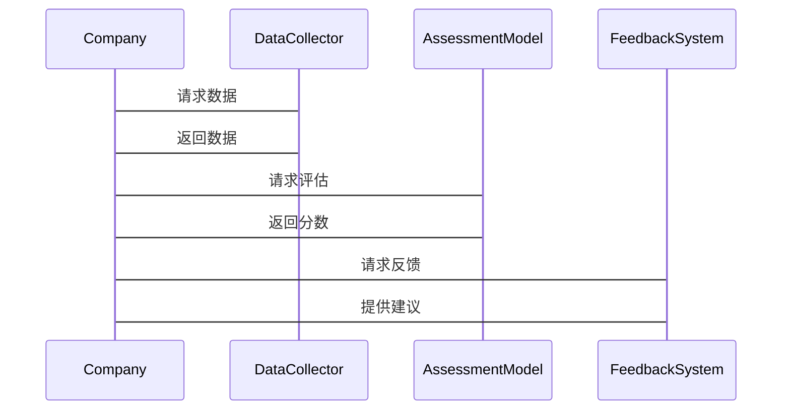

                 


# 多智能体系统如何评估公司的数字化转型能力

## 关键词：多智能体系统、数字化转型、能力评估、系统架构、算法原理

## 摘要：本文将探讨多智能体系统在公司数字化转型能力评估中的应用，从基础概念到算法实现，再到系统架构设计，提供全面的分析与实践指南。通过案例分析和代码实现，帮助读者理解如何利用多智能体系统提升数字化转型能力评估的效率与准确性。

---

## 第一部分: 多智能体系统与数字化转型能力评估基础

### 第1章: 多智能体系统概述

#### 1.1 多智能体系统的基本概念

##### 1.1.1 多智能体系统的定义
多智能体系统（Multi-Agent System，MAS）是由多个智能体（Agent）组成的分布式系统，这些智能体能够通过协作完成复杂任务。智能体是具有感知环境、自主决策和行动能力的实体。

##### 1.1.2 多智能体系统的类型
- **简单智能体**：仅能执行预定义的规则。
- **反应式智能体**：基于当前感知做出反应。
- **认知式智能体**：具有推理、规划和学习能力。

##### 1.1.3 多智能体系统的核心特征
- **自主性**：智能体能够自主决策。
- **反应性**：能够实时感知环境并做出反应。
- **协作性**：多个智能体能够协同完成任务。
- **分布式性**：系统由多个独立组件构成。

#### 1.2 数字化转型的定义与关键点

##### 1.2.1 数字化转型的定义
数字化转型是指利用数字技术（如人工智能、大数据、云计算等）对业务模式、流程、文化进行根本性改变，以创造新的价值。

##### 1.2.2 数字化转型的关键特征
- **数据驱动**：依赖数据进行决策。
- **技术整合**：将新技术与现有系统集成。
- **业务创新**：通过技术改变商业模式和业务流程。

##### 1.2.3 数字化转型的实施步骤
1. 明确目标。
2. 分析现状。
3. 制定策略。
4. 实施变革。
5. 监测与优化。

### 第2章: 多智能体系统与数字化转型能力评估的核心概念

#### 2.1 多智能体系统的评估维度

##### 2.1.1 系统能力评估模型
| 评估维度 | 描述 |
|----------|------|
| 反应性   | 系统对环境变化的响应速度 |
| 协作性   | 智能体之间的协作效率 |
| 稳定性   | 系统在异常情况下的表现 |

##### 2.1.2 评估维度与指标
- 反应性：响应时间、错误恢复能力。
- 协作性：任务完成率、资源利用率。
- 稳定性：系统故障率、恢复时间。

#### 2.2 多智能体系统与数字化转型能力的关系

##### 2.2.1 多智能体系统在数字化转型中的作用
- 提供数据处理能力。
- 支持实时决策。
- 优化业务流程。

##### 2.2.2 数字化转型能力评估的多智能体系统视角
通过多智能体系统的协作能力，评估公司在数字化转型中的适应性和创新能力。

#### 2.3 评估模型构建与分析

##### 2.3.1 评估模型构建的基本原则
- 简洁性：模型应简单明了。
- 可扩展性：模型应能适应不同场景。
- 可验证性：模型应能通过数据验证。

##### 2.3.2 评估模型的数学表达
$$
\text{评估分数} = \sum_{i=1}^{n} w_i \cdot x_i
$$
其中，$w_i$为权重，$x_i$为评估指标。

##### 2.3.3 模型的验证与优化
通过实际数据验证模型准确性，必要时调整权重和指标。

---

## 第二部分: 多智能体系统评估模型的算法原理

### 第3章: 多智能体系统评估模型的算法原理

#### 3.1 评估模型的数学模型

##### 3.1.1 模型的输入与输出
- 输入：公司数字化转型能力的各项指标。
- 输出：综合评估分数。

##### 3.1.2 模型的数学表达式
$$
y = \sum_{i=1}^{n} w_i \cdot x_i + b
$$
其中，$y$为评估分数，$w_i$为权重，$x_i$为指标，$b$为偏置。

#### 3.2 算法实现流程

##### 3.2.1 数据预处理
- 数据清洗：去除异常值。
- 数据标准化：统一数据尺度。

##### 3.2.2 模型训练
- 选择训练数据。
- 调整模型参数。

##### 3.2.3 模型评估
- 使用测试数据验证模型准确性。

#### 3.3 算法实现代码示例

##### 3.3.1 数据加载与预处理
```python
import pandas as pd
data = pd.read_csv('transition.csv')
# 数据清洗
data = data.dropna()
# 数据标准化
from sklearn.preprocessing import StandardScaler
scaler = StandardScaler()
data_scaled = scaler.fit_transform(data)
```

##### 3.3.2 模型构建
```python
import numpy as np
class LinearModel:
    def __init__(self):
        self.weights = None
        self.bias = None
    
    def fit(self, X, y):
        # 最小二乘法求解权重
        X_b = np.c_[np.ones((len(X), 1)), X]
        theta = np.linalg.inv(X_b.T.dot(X_b)).dot(X_b.T.dot(y))
        self.weights = theta[1:]
        self.bias = theta[0]
    
    def predict(self, X):
        return np.dot(X, self.weights) + self.bias
```

##### 3.3.3 模型训练与评估
```python
model = LinearModel()
model.fit(data_scaled, labels)
# 预测
 predictions = model.predict(test_data)
```

---

## 第三部分: 系统分析与架构设计方案

### 第4章: 系统分析与架构设计方案

#### 4.1 问题场景介绍

##### 4.1.1 评估目标
评估公司数字化转型能力。

##### 4.1.2 评估范围
涵盖数据分析、流程优化、技术创新等方面。

##### 4.1.3 评估方法
基于多智能体系统的评估模型。

#### 4.2 系统功能设计

##### 4.2.1 领域模型设计


##### 4.2.2 功能模块划分
- 数据采集模块：收集公司数据。
- 评估模块：计算评估分数。
- 反馈模块：提供改进建议。

#### 4.3 系统架构设计

##### 4.3.1 系统架构图


##### 4.3.2 关键模块交互设计


#### 4.4 系统接口设计

##### 4.4.1 接口定义
- 数据接口：获取公司数据。
- 评估接口：计算评估分数。
- 反馈接口：提供改进建议。

##### 4.4.2 接口实现
```python
class Company:
    def __init__(self, name):
        self.name = name
        self.data = {}
    
    def get_data(self):
        return self.data
    
    def assess(self):
        return self.assessment_score
    
    def get_feedback(self):
        return self.feedback_suggestions
```

---

## 第四部分: 项目实战

### 第5章: 项目实战

#### 5.1 环境配置

##### 5.1.1 安装依赖
```bash
pip install numpy pandas scikit-learn
```

#### 5.2 系统核心实现源代码

##### 5.2.1 数据采集模块
```python
import pandas as pd

class DataCollector:
    def __init__(self, file_path):
        self.file_path = file_path
    
    def collect_data(self):
        data = pd.read_csv(self.file_path)
        return data
```

##### 5.2.2 评估模块
```python
class AssessmentModel:
    def __init__(self, data):
        self.data = data
    
    def compute_score(self):
        # 简单的评估方法
        score = np.mean(self.data)
        return score
```

##### 5.2.3 反馈模块
```python
class FeedbackSystem:
    def __init__(self, score):
        self.score = score
    
    def generate_feedback(self):
        if self.score > 0.8:
            return "优秀"
        elif self.score > 0.6:
            return "良好"
        else:
            return "需要改进"
```

#### 5.3 实际案例分析

##### 5.3.1 案例分析
假设某公司数字化转型数据如下：
$$
\text{数据} = [0.8, 0.7, 0.9, 0.6]
$$
评估得分为：
$$
\text{score} = 0.75
$$
反馈为“良好”。

#### 5.3.2 代码应用解读与分析
通过代码实现，可以快速计算评估分数，并根据分数提供反馈，帮助公司优化数字化转型能力。

---

## 第五部分: 最佳实践与总结

### 第6章: 最佳实践 tips

#### 6.1 实施多智能体系统评估的关键注意事项
- 确保数据质量。
- 合理选择评估指标。
- 定期更新模型。

#### 6.2 小结
通过多智能体系统，可以高效评估公司数字化转型能力，并提供改进建议。

### 第7章: 注意事项与拓展阅读

#### 7.1 注意事项
- 确保数据安全。
- 定期维护系统。
- 及时更新模型。

#### 7.2 拓展阅读
- 推荐书籍：《Multi-Agent Systems》。
- 推荐博客：深入理解多智能体系统。

---

## 总结

通过本文的详细分析，读者可以全面了解多智能体系统在数字化转型能力评估中的应用。从基础概念到算法实现，再到系统架构设计，提供了完整的解决方案。希望本文能为读者在实际应用中提供有价值的参考。

