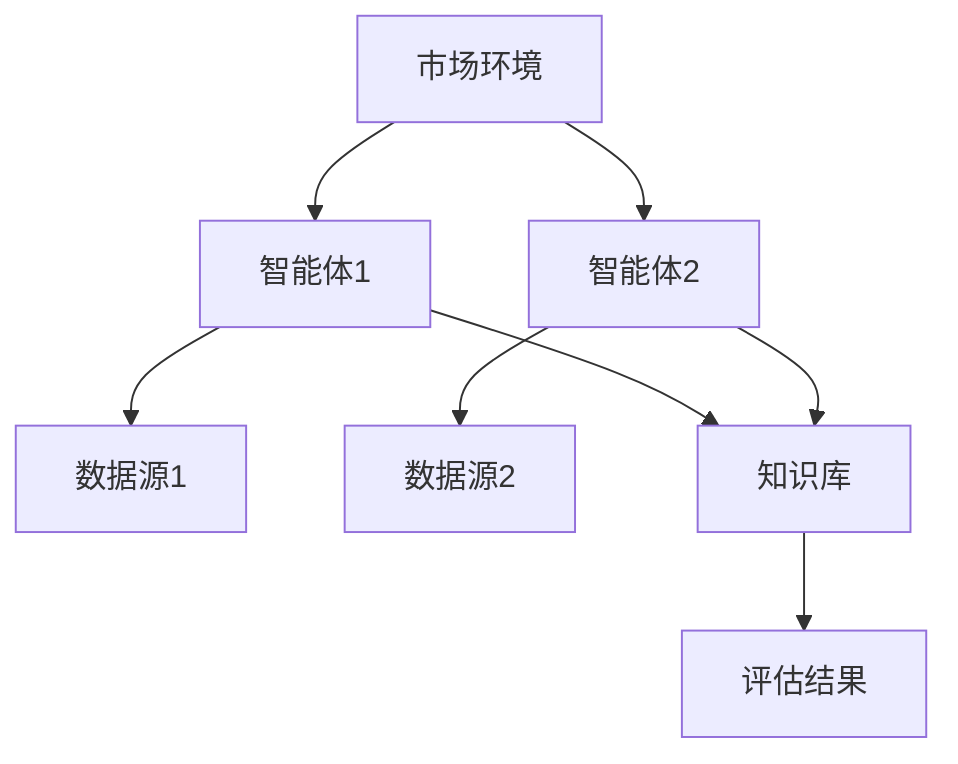
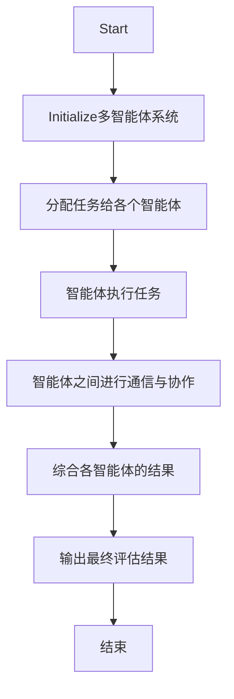
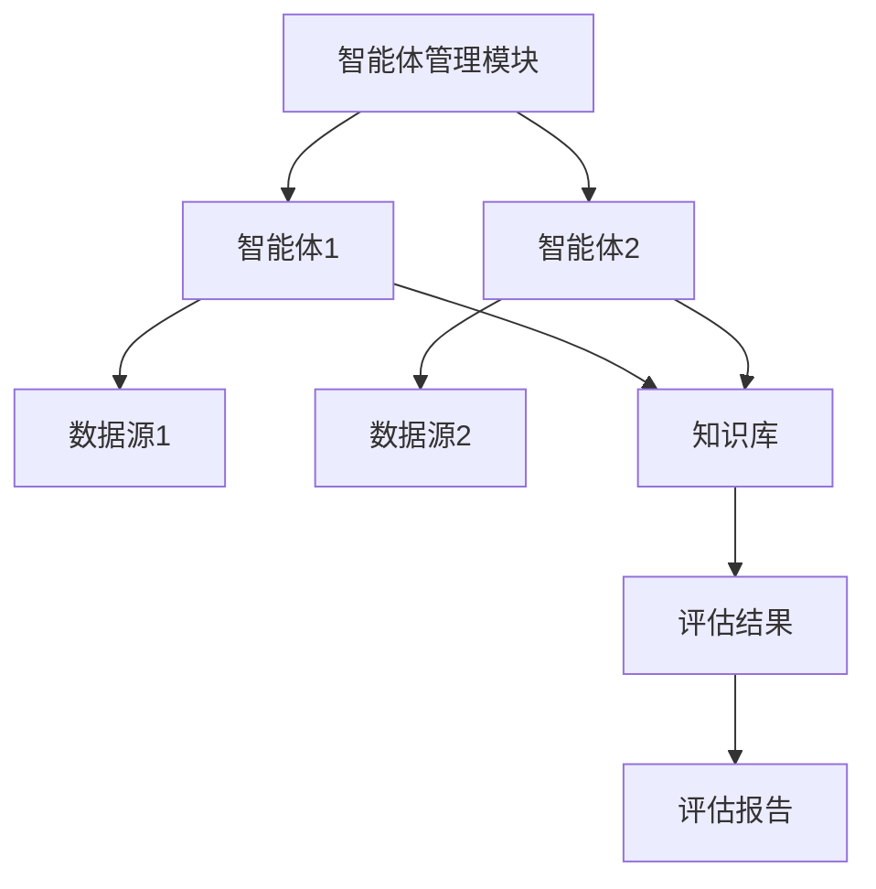
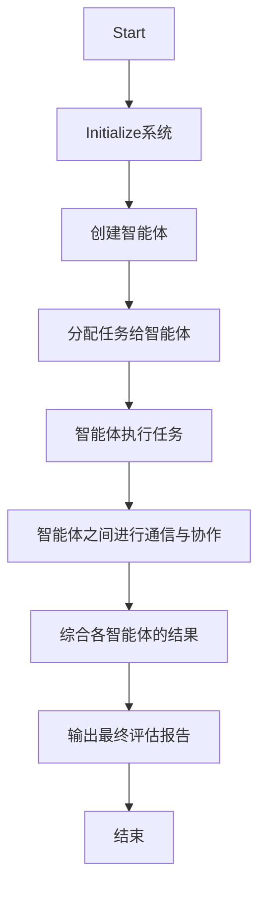

                 


# 多智能体系统如何评估公司的长期增长潜力

## 关键词：多智能体系统，公司增长潜力，人工智能，系统架构，算法原理

## 摘要：  
多智能体系统（Multi-Agent Systems, MAS）是一种新兴的分布式人工智能技术，能够通过多个智能体的协作来解决复杂的任务。本文将探讨如何利用多智能体系统评估公司的长期增长潜力，分析其核心概念、算法原理、系统架构，并结合实际案例展示其在企业中的应用。通过详细的技术分析和案例解读，本文为读者提供一个全面的理解框架，帮助企业在复杂市场环境中做出更明智的增长决策。

---

# 第一部分: 多智能体系统与公司增长潜力评估的背景

## 第1章: 多智能体系统与公司增长潜力评估的引言

### 1.1 多智能体系统的概念与特点
#### 1.1.1 多智能体系统的定义
多智能体系统（Multi-Agent Systems, MAS）是由多个智能体（Agent）组成的分布式系统，每个智能体都是能够感知环境、自主决策、主动协作的实体。与传统的集中式系统不同，MAS强调去中心化的结构，通过智能体之间的通信与协作来实现复杂任务。

#### 1.1.2 多智能体系统的核心特点
- **分布式性**：多个智能体独立运行，任务分布在整个系统中。
- **自主性**：每个智能体能够自主决策，无需外部集中控制。
- **协作性**：智能体之间通过通信与协作完成共同目标。
- **动态性**：系统能够适应环境的变化，实时调整策略。

#### 1.1.3 多智能体系统与传统评估方法的区别
传统的公司增长潜力评估方法通常依赖于集中式分析，例如财务指标、市场分析等。而多智能体系统通过分布式计算和智能体协作，能够更实时、更全面地捕捉市场动态和内部因素的变化。

### 1.2 公司长期增长潜力评估的重要性
#### 1.2.1 公司增长潜力的定义
公司增长潜力是指公司在未来一段时间内实现收入、利润或其他关键指标持续增长的可能性。它取决于多种因素，包括市场需求、竞争环境、内部资源等。

#### 1.2.2 长期增长潜力评估的挑战
- **数据复杂性**：公司增长涉及多个维度的数据，包括财务、市场、技术等。
- **动态变化**：市场环境和内部条件不断变化，静态模型难以捕捉这些变化。
- **决策滞后**：传统评估方法通常需要大量数据积累和分析，导致决策滞后。

#### 1.2.3 多智能体系统在增长潜力评估中的优势
多智能体系统能够实时分析市场动态和内部数据，通过智能体之间的协作快速调整评估模型，提供更动态和精准的增长潜力预测。

### 1.3 多智能体系统在公司增长评估中的应用前景
#### 1.3.1 多智能体系统的潜在应用领域
- **市场预测**：通过智能体实时分析市场趋势和竞争对手行为。
- **资源分配**：优化公司内部资源分配，提高效率。
- **风险管理**：实时监测潜在风险，提前制定应对策略。

#### 1.3.2 企业采用多智能体系统的优势
- **实时性**：能够快速响应市场变化，提高决策效率。
- **灵活性**：适应不同的市场环境和公司需求。
- **准确性**：通过多智能体协作，提高评估结果的准确性。

#### 1.3.3 多智能体系统应用的挑战与机遇
- **技术复杂性**：多智能体系统的开发和维护需要较高的技术投入。
- **数据隐私**：智能体之间的数据共享可能涉及隐私问题。
- **成本效益**：需要评估多智能体系统在公司中的成本效益比。

### 1.4 本章小结
本章介绍了多智能体系统的概念、特点及其在公司增长潜力评估中的应用前景。通过对比传统评估方法，展示了多智能体系统在实时性、灵活性和准确性方面的优势。

---

## 第2章: 多智能体系统的原理与核心要素

### 2.1 多智能体系统的原理
#### 2.1.1 多智能体系统的组成与功能
多智能体系统由多个智能体组成，每个智能体都有明确的目标、知识和能力。智能体之间通过通信和协作，共同完成复杂的任务。

#### 2.1.2 多智能体系统中智能体的行为模型
智能体的行为模型通常包括以下步骤：
1. **感知环境**：通过传感器或其他数据源获取环境信息。
2. **目标设定**：根据当前状态和历史数据，确定下一步目标。
3. **决策制定**：基于知识库和推理机制，制定行动方案。
4. **行动执行**：通过执行器或其他方式实现决策。
5. **反馈与学习**：根据执行结果更新知识库，改进未来决策。

#### 2.1.3 多智能体系统中的通信与协作机制
智能体之间的通信与协作是多智能体系统的核心。通信机制包括：
- **直接通信**：智能体之间直接交换信息。
- **间接通信**：通过共享数据库或中间件进行信息传递。

协作机制包括：
- **任务分配**：根据智能体的能力和当前状态分配任务。
- **协调与同步**：确保智能体之间的行动协调一致。

### 2.2 多智能体系统的实体关系图
以下是多智能体系统中主要实体及其关系的Mermaid图：



### 2.3 多智能体系统的算法流程图
以下是多智能体系统评估公司增长潜力的算法流程图：



### 2.4 本章小结
本章详细讲解了多智能体系统的原理和核心要素，包括智能体的行为模型、通信与协作机制，以及系统的整体架构。通过Mermaid图展示了实体关系和算法流程，为后续章节的分析奠定了基础。

---

## 第3章: 多智能体系统的算法原理

### 3.1 多智能体系统中的评估算法
#### 3.1.1 基于多智能体的评估模型
公司增长潜力的评估模型可以通过多智能体系统的协作来实现。每个智能体负责不同的评估维度，例如财务表现、市场趋势、技术创新等。

#### 3.1.2 多智能体系统中的数学模型
以下是公司增长潜力评估的数学模型：

$$
G(t) = \sum_{i=1}^{n} w_i \cdot S_i(t)
$$

其中：
- \( G(t) \) 表示公司在时间 \( t \) 的增长潜力。
- \( w_i \) 表示第 \( i \) 个评估维度的权重。
- \( S_i(t) \) 表示第 \( i \) 个评估维度在时间 \( t \) 的评分。

#### 3.1.3 算法的流程与步骤
1. **初始化**：定义智能体的数量和每个智能体的职责。
2. **数据收集**：智能体从不同数据源获取相关信息。
3. **评估计算**：每个智能体根据自身职责计算评估结果。
4. **协作与整合**：智能体之间共享信息，整合结果。
5. **输出最终评估**：综合所有智能体的结果，输出公司的增长潜力评估。

### 3.2 算法实现的详细步骤
#### 3.2.1 数据预处理
- 清洗数据，处理缺失值和异常值。
- 标准化数据，确保不同维度的数据具有可比性。

#### 3.2.2 智能体任务分配
- 根据智能体的能力和评估维度的复杂性进行任务分配。
- 确保每个智能体负责一个或多个评估维度。

#### 3.2.3 智能体协作与整合
- 智能体之间通过通信机制共享中间结果。
- 整合所有智能体的评估结果，计算最终的增长潜力评分。

### 3.3 本章小结
本章详细讲解了多智能体系统中评估公司增长潜力的算法原理，包括数学模型、流程步骤和实现细节。通过数学公式和流程图展示了算法的实现过程，为后续章节的系统设计提供了理论基础。

---

## 第4章: 多智能体系统的系统架构设计

### 4.1 系统功能模块设计
#### 4.1.1 智能体管理模块
- 负责智能体的创建、分配和管理。
- 确保智能体之间的通信与协作。

#### 4.1.2 数据处理模块
- 负责数据的收集、清洗和预处理。
- 确保数据的准确性和一致性。

#### 4.1.3 评估计算模块
- 根据智能体的评估结果，计算公司的增长潜力。
- 输出最终的评估报告。

### 4.2 系统架构图
以下是多智能体系统的架构图：



### 4.3 接口设计与交互流程
#### 4.3.1 系统接口设计
- **智能体管理接口**：用于创建和管理智能体。
- **数据处理接口**：用于数据的收集和预处理。
- **评估计算接口**：用于计算增长潜力并输出报告。

#### 4.3.2 系统交互流程图
以下是系统的交互流程图：



### 4.4 本章小结
本章详细讲解了多智能体系统的系统架构设计，包括功能模块、系统架构图和接口设计。通过Mermaid图展示了系统的整体结构和交互流程，为后续章节的项目实战提供了系统设计的依据。

---

## 第5章: 多智能体系统的项目实战

### 5.1 项目背景与需求分析
#### 5.1.1 项目背景
某公司希望利用多智能体系统评估其长期增长潜力，以便在复杂市场环境中做出更明智的决策。

#### 5.1.2 项目需求
- 实时监测市场动态和竞争对手行为。
- 优化公司内部资源分配，提高效率。
- 提供动态的增长潜力评估报告。

### 5.2 项目环境配置
#### 5.2.1 系统环境
- 操作系统：Linux
- 开发工具：Python、Jupyter Notebook
- 数据库：MySQL
- 通信协议：RESTful API

#### 5.2.2 依赖安装
```bash
pip install numpy pandas scikit-learn requests matplotlib
```

### 5.3 核心代码实现
#### 5.3.1 智能体类
```python
class Agent:
    def __init__(self, id, role):
        self.id = id
        self.role = role
        self.data = {}
    
    def collect_data(self):
        # 从数据源收集数据
        pass
    
    def process_data(self):
        # 处理数据并计算评估结果
        pass
    
    def communicate(self, other_agent):
        # 与其他智能体通信
        pass
```

#### 5.3.2 评估计算模块
```python
class GrowthPotentialEvaluator:
    def __init__(self):
        self.agents = []
        self.weights = {}
    
    def add_agent(self, agent):
        self.agents.append(agent)
    
    def set_weights(self, weights):
        self.weights = weights
    
    def evaluate(self):
        # 综合各智能体的评估结果，计算最终增长潜力
        pass
```

#### 5.3.3 系统主程序
```python
def main():
    # 初始化多智能体系统
    evaluator = GrowthPotentialEvaluator()
    evaluator.add_agent(Agent(1, 'market_analyzer'))
    evaluator.add_agent(Agent(2, 'financial_analyzer'))
    
    # 设置权重
    evaluator.set_weights({'market': 0.5, 'financial': 0.5})
    
    # 执行评估
    evaluator.evaluate()

if __name__ == '__main__':
    main()
```

### 5.4 代码解读与分析
#### 5.4.1 智能体类
- `Agent` 类负责智能体的基本功能，包括数据收集、处理和通信。
- 每个智能体都有唯一的 `id` 和 `role`，用于标识其职责。

#### 5.4.2 评估计算模块
- `GrowthPotentialEvaluator` 类负责管理多个智能体，并综合它们的评估结果。
- `evaluate` 方法是评估的核心，根据权重和各个智能体的评估结果，计算公司的增长潜力。

#### 5.4.3 系统主程序
- 初始化多智能体系统，创建两个智能体：`market_analyzer` 和 `financial_analyzer`。
- 设置各个评估维度的权重，并执行评估。

### 5.5 项目小结
本章通过一个具体的项目案例，展示了多智能体系统在公司增长潜力评估中的实际应用。通过Python代码实现了一个简单的多智能体系统，帮助读者理解理论在实践中的应用。

---

## 第6章: 总结与展望

### 6.1 本章总结
多智能体系统通过多个智能体的协作，能够更实时、更全面地评估公司的长期增长潜力。本文详细讲解了多智能体系统的原理、算法、系统架构，并通过项目案例展示了其在实际中的应用。

### 6.2 未来展望
随着人工智能技术的不断发展，多智能体系统在公司增长潜力评估中的应用将更加广泛。未来的研究方向包括：
- **智能体协作算法的优化**：提高智能体之间的协作效率。
- **动态环境下的适应性**：增强系统的动态适应能力。
- **数据隐私保护**：在智能体协作中保护数据隐私。

### 6.3 最佳实践 Tips
- 在实际应用中，建议根据具体需求选择合适的多智能体系统架构。
- 确保智能体之间的通信与协作机制高效可靠。
- 定期更新和优化评估模型，以适应市场变化。

### 6.4 拓展阅读
- 推荐阅读《Multi-Agent Systems: Algorithmic, Complexity Theoretic, and Game Theoretic Foundations》。
- 关注最新的多智能体系统研究成果和技术动态。

---

## 本章小结
本文从多智能体系统的原理、算法、系统架构等多个方面，详细讲解了其在公司增长潜力评估中的应用。通过理论分析和实际案例，展示了多智能体系统在复杂市场环境中的优势和潜力。希望本文能够为读者提供一个全面的理解框架，帮助他们在实际工作中更好地应用多智能体技术。

---

# 结语

通过本文的详细讲解，我们看到了多智能体系统在公司增长潜力评估中的巨大潜力。无论是从理论还是实践层面，多智能体系统都能够为企业提供更动态、更精准的评估结果。未来，随着技术的不断发展，多智能体系统将在更多领域展现出其独特的优势。

