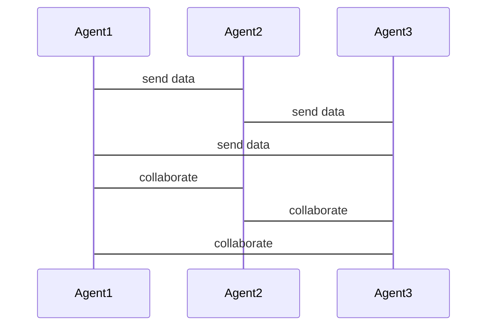

                 


# 多智能体系统如何评估公司的长期盈利能力

## 关键词：多智能体系统, 公司盈利能力, 协同学习, 博弈论, 人工智能, 企业评估

## 摘要：  
随着人工智能技术的快速发展，多智能体系统（Multi-Agent System, MAS）在企业决策中的应用日益广泛。本文将详细探讨如何利用多智能体系统评估公司的长期盈利能力，从基本概念、算法原理到系统设计和实际应用，全面分析其优势、挑战及解决方案。通过协同学习和博弈论等技术，多智能体系统能够高效地处理复杂的企业数据，为企业提供精准的盈利能力预测和优化建议。

---

## 第一部分: 多智能体系统基础

### 第1章: 多智能体系统概述

#### 1.1 多智能体系统的基本概念

##### 1.1.1 多智能体系统的定义  
多智能体系统是由多个相互作用的智能体组成的分布式系统，这些智能体通过通信和协作完成复杂的任务。每个智能体都有一定的自主性，能够感知环境、做出决策并执行动作。

##### 1.1.2 多智能体系统的特征  
- **自主性**：智能体能够自主决策，无需外部干预。  
- **反应性**：智能体能够实时感知环境并做出反应。  
- **协作性**：多个智能体通过协作完成共同目标。  
- **分布式性**：智能体分布在不同的位置，通过通信进行交互。  

##### 1.1.3 多智能体系统与单智能体系统的区别  
| 特性             | 单智能体系统             | 多智能体系统             |
|------------------|--------------------------|--------------------------|
| 系统结构         | 单一智能体               | 多个智能体               |
| 任务处理         | 独立完成                 | 协作完成                 |
| 通信需求         | 无                       | 有                       |
| 复杂性           | 较低                     | 较高                     |

#### 1.2 多智能体系统的结构与分类

##### 1.2.1 多智能体系统的结构  
多智能体系统的结构可以分为以下几种：  
1. **层次结构**：由多个层次组成，每个层次负责不同的功能。  
2. **网状结构**：智能体之间通过网络进行连接，形成网状结构。  
3. **混合结构**：结合层次结构和网状结构的特点。  

##### 1.2.2 多智能体系统的分类  
多智能体系统可以根据不同的标准进行分类：  
- **按智能体的智能水平**：分为简单智能体和复杂智能体。  
- **按智能体的协作方式**：分为协同型和竞争型。  
- **按应用场景**：分为商业、社交、游戏等。  

##### 1.2.3 多智能体系统的应用场景  
- **电子商务**：智能体可以协助用户进行购物决策。  
- **交通管理**：智能体可以优化交通流量。  
- **金融投资**：智能体可以进行股票交易和风险评估。  

### 第2章: 多智能体系统的核心原理

#### 2.1 多智能体系统的协同机制

##### 2.1.1 协同的基本概念  
协同是指多个智能体为了实现共同目标而进行的合作。协同机制包括通信、协调和协作三个部分。

##### 2.1.2 协同的实现方式  
- **基于规则的协同**：通过预定义的规则进行协同。  
- **基于意图的协同**：智能体通过意图进行协同。  
- **基于学习的协同**：智能体通过学习实现协同。  

##### 2.1.3 协同的关键技术  
- **通信协议**：智能体之间的通信需要遵循一定的协议。  
- **协调算法**：用于解决冲突和优化协作过程。  
- **分布式计算**：智能体在分布式环境中进行计算。  

#### 2.2 多智能体系统的通信协议

##### 2.2.1 通信的基本原理  
智能体之间的通信需要通过一定的协议进行数据交换。通信协议包括数据格式、消息类型和传输方式。

##### 2.2.2 通信协议的选择  
选择通信协议需要考虑系统的性能、安全性和可扩展性。常用的通信协议有HTTP、WebSocket和MQTT等。

##### 2.2.3 通信中的挑战与解决方案  
- **延迟问题**：通过优化网络传输和使用缓存技术解决。  
- **安全性问题**：通过加密技术和身份验证解决。  

---

## 第二部分: 公司长期盈利能力评估方法

### 第3章: 公司长期盈利能力的定义与评估指标

#### 3.1 公司长期盈利能力的定义

##### 3.1.1 盈利能力的内涵  
盈利能力是指公司在一定时期内通过经营活动获得的利润能力。它反映了公司的经营效率和财务健康状况。

##### 3.1.2 盈利能力的外延  
盈利能力不仅包括财务指标，还包括市场、管理和运营等多个方面。

##### 3.1.3 盈利能力的衡量标准  
常用的衡量标准包括净利润率、投资回报率和资产周转率等。

#### 3.2 传统公司盈利能力评估方法

##### 3.2.1 财务指标法  
通过分析财务报表中的数据，如利润表和资产负债表，评估公司的盈利能力。

##### 3.2.2 市场指标法  
通过股票价格、市盈率等市场指标评估公司的盈利能力。

##### 3.2.3 综合评估法  
结合财务和市场指标，进行全面的盈利能力评估。

### 第4章: 多智能体系统在公司盈利能力评估中的应用

#### 4.1 多智能体系统评估公司盈利能力的优势

##### 4.1.1 数据处理能力  
多智能体系统可以处理海量数据，提高评估的准确性和效率。

##### 4.1.2 智能决策能力  
通过协同学习和博弈论，多智能体系统可以做出更优化的决策。

##### 4.1.3 实时反馈能力  
多智能体系统可以实时监控公司运营状况，提供及时的反馈和调整建议。

#### 4.2 多智能体系统评估公司盈利能力的流程

##### 4.2.1 数据采集  
从公司内部和外部获取相关数据，如财务数据、市场数据等。

##### 4.2.2 数据分析  
通过数据挖掘和机器学习技术，分析数据并提取有用信息。

##### 4.2.3 智能决策  
基于分析结果，智能体协同决策，制定盈利能力提升的策略。

##### 4.2.4 结果反馈  
将决策结果反馈给相关部门，实施并监控效果。

---

## 第三部分: 多智能体系统的算法原理

### 第5章: 多智能体系统的协同学习算法

#### 5.1 协同学习的基本原理

##### 5.1.1 协同学习的定义  
协同学习是指多个智能体通过协作学习共同完成任务。

##### 5.1.2 协同学习的优势  
- **知识共享**：智能体可以共享知识，提高学习效率。  
- **任务分工**：智能体可以分工合作，提高学习效果。  

##### 5.1.3 协同学习的实现步骤  
1. **初始化**：设置智能体的数量和初始参数。  
2. **数据采集**：智能体采集数据并进行预处理。  
3. **模型训练**：智能体协同训练模型。  
4. **结果评估**：评估模型性能并进行优化。  

#### 5.2 协同学习算法的数学模型

##### 5.2.1 分布式学习模型  
$$ y_i = w_i^T x_i + b_i $$  
其中，$w_i$ 和 $b_i$ 是智能体i的模型参数，$x_i$ 是输入数据，$y_i$ 是输出结果。

##### 5.2.2 联合优化模型  
$$ \min_{w} \sum_{i=1}^n \frac{1}{2} \| y_i - y_{true} \|^2 $$  
其中，$n$ 是智能体的数量，$y_{true}$ 是真实输出。

#### 5.3 协同学习算法的实现

##### 5.3.1 环境安装  
安装必要的库，如Python的scikit-learn和TensorFlow。

##### 5.3.2 核心代码实现  

```python
import numpy as np
from sklearn.linear_model import LinearRegression

# 初始化智能体
class Agent:
    def __init__(self, data):
        self.data = data
        self.model = LinearRegression()

    def train(self):
        self.model.fit(self.data.X, self.data.Y)

    def predict(self, X):
        return self.model.predict(X)

# 协同学习算法
class MultiAgentSystem:
    def __init__(self, agents):
        self.agents = agents

    def train(self):
        for agent in self.agents:
            agent.train()

    def predict(self, X):
        predictions = [agent.predict(X) for agent in self.agents]
        return np.mean(predictions, axis=0)

# 数据生成
class Data:
    def __init__(self, X, Y):
        self.X = X
        self.Y = Y

# 使用示例
X = np.array([[1], [2], [3], [4]])
Y = np.array([2, 4, 6, 8])

agents = [Agent(Data(X, Y))]
mas = MultiAgentSystem(agents)
mas.train()
print(mas.predict(np.array([[5]])))  # 输出预测结果
```

##### 5.3.3 算法优化与改进  
通过分布式计算和模型融合技术，进一步提高协同学习的效率和准确性。

---

## 第四部分: 系统设计与架构

### 第6章: 系统设计与架构

#### 6.1 系统功能设计

##### 6.1.1 领域模型设计  
使用Mermaid类图描述系统的功能模块和交互关系。

```mermaid
classDiagram
    class Agent {
        +id: int
        +data: Data
        +model: Model
        -train()
        -predict()
    }
    class Data {
        +X: array
        +Y: array
    }
    class Model {
        +weights: array
        +biases: array
        -forward(x: array): array
        -backward(y: array, y_pred: array): array
    }
    Agent o- Data
    Agent o- Model
```

#### 6.2 系统架构设计

##### 6.2.1 系统架构图  
使用Mermaid架构图描述系统的整体架构。


#### 6.3 系统接口设计

##### 6.3.1 接口设计  
定义智能体之间的通信接口，如`communicate()`和`collaborate()`。

#### 6.4 系统交互设计

##### 6.4.1 交互流程  
使用Mermaid序列图描述智能体之间的交互流程。



---

## 第五部分: 项目实战

### 第7章: 项目实战

#### 7.1 环境安装

##### 7.1.1 安装必要的库  
安装Python的scikit-learn、TensorFlow和Keras库。

#### 7.2 核心实现源代码

##### 7.2.1 多智能体系统核心代码  

```python
import numpy as np
from sklearn.linear_model import LinearRegression
from sklearn.metrics import mean_squared_error

class Agent:
    def __init__(self, data):
        self.data = data
        self.model = LinearRegression()

    def train(self):
        self.model.fit(self.data.X, self.data.Y)

    def predict(self, X):
        return self.model.predict(X)

class Data:
    def __init__(self, X, Y):
        self.X = X
        self.Y = Y

class MAS:
    def __init__(self, agents):
        self.agents = agents

    def train(self):
        for agent in self.agents:
            agent.train()

    def predict(self, X):
        predictions = [agent.predict(X) for agent in self.agents]
        return np.mean(predictions, axis=0)

    def evaluate(self, X_true, Y_true):
        Y_pred = self.predict(X_true)
        return mean_squared_error(Y_true, Y_pred)

# 示例
X = np.array([[1], [2], [3], [4]])
Y = np.array([2, 4, 6, 8])

data = Data(X, Y)
agent = Agent(data)
mas = MAS([agent])

mas.train()
X_test = np.array([[5]])
Y_test_true = np.array([10])
Y_test_pred = mas.predict(X_test)
print(f"预测结果: {Y_test_pred[0]}，真实结果: {Y_test_true[0]}")
print(f"评估指标: {mas.evaluate(X_test, Y_test_true)}")
```

#### 7.3 案例分析与实际应用

##### 7.3.1 案例分析  
以某公司为例，通过多智能体系统评估其长期盈利能力，分析其优势和不足。

##### 7.3.2 实际应用  
展示多智能体系统在实际中的应用效果，如提高预测准确性、优化决策流程等。

---

## 第六部分: 优化与实践

### 第8章: 优化与实践

#### 8.1 系统优化

##### 8.1.1 性能优化  
通过分布式计算和并行处理优化系统的运行效率。

##### 8.1.2 系统安全性优化  
加强数据加密和访问控制，确保系统的安全性。

#### 8.2 最佳实践 tips

##### 8.2.1 系统设计 tips  
- **模块化设计**：提高系统的可维护性和可扩展性。  
- **容错设计**：增强系统的健壮性。  

##### 8.2.2 开发 tips  
- **版本控制**：使用Git进行代码版本管理。  
- **单元测试**：编写单元测试用例，确保代码质量。  

#### 8.3 小结

##### 8.3.1 本章小结  
总结多智能体系统在公司长期盈利能力评估中的优势和挑战。

##### 8.3.2 未来展望  
展望多智能体系统在企业决策中的未来发展和潜在应用。

---

## 第七部分: 总结

### 第9章: 总结

#### 9.1 文章核心内容回顾  
回顾文章的核心内容，强调多智能体系统在公司盈利能力评估中的重要性。

#### 9.2 未来研究方向  
提出未来的研究方向，如多智能体系统的可扩展性和智能化提升。

#### 9.3 致谢  
感谢读者的支持和关注。

---

通过以上结构，我们可以系统地探讨多智能体系统在公司长期盈利能力评估中的应用，从理论到实践，全面分析其优势、挑战及解决方案。希望本文能为相关领域的研究和实践提供有价值的参考。

