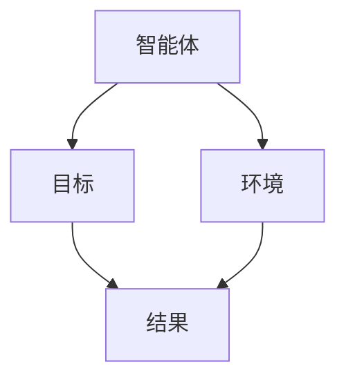
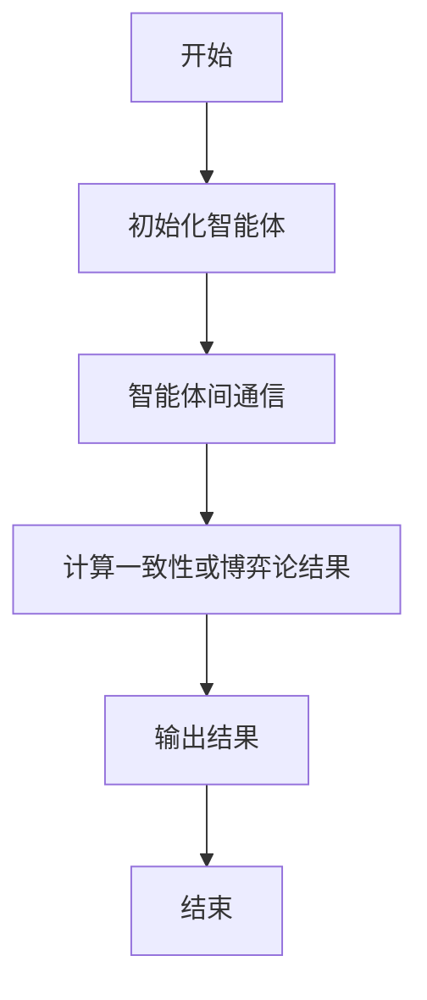
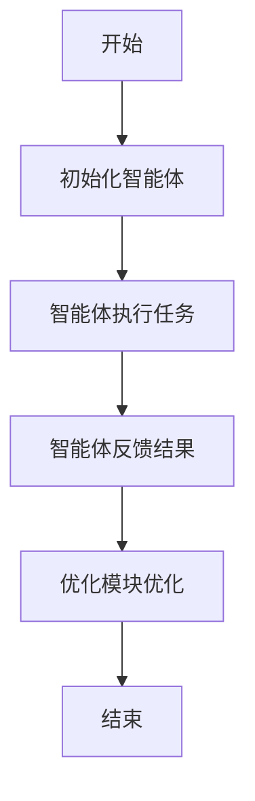

                 


# 多智能体系统如何评估公司的长期竞争优势

## 关键词：多智能体系统、长期竞争优势、公司战略、人工智能、系统架构

## 摘要：  
本文探讨了多智能体系统在评估公司长期竞争优势中的作用。通过分析多智能体系统的概念、算法原理、系统架构和实际案例，揭示了多智能体系统如何帮助公司实现动态优化、协作效率提升和战略决策优化，从而在竞争激烈的市场中建立持久的优势。

---

# 第一部分: 多智能体系统与公司竞争优势的背景介绍

## 第1章: 多智能体系统的概念与背景

### 1.1 多智能体系统的基本概念

#### 1.1.1 多智能体系统的定义  
多智能体系统（Multi-Agent System, MAS）是由多个智能体（Agent）组成的分布式系统，这些智能体能够自主感知环境、协作完成任务并做出决策。  

#### 1.1.2 多智能体系统的特征  
- **分布式性**：智能体分布在不同的位置，独立运行。  
- **协作性**：智能体之间通过通信和协作完成共同目标。  
- **动态性**：环境和任务可能动态变化，智能体需要灵活应对。  
- **自主性**：每个智能体都有自己的决策机制和目标。  

#### 1.1.3 多智能体系统的应用场景  
- 智能交通管理  
- 智能制造  
- 金融科技中的风险管理  
- 社交网络中的信息传播  

### 1.2 公司长期竞争优势的定义与重要性

#### 1.2.1 什么是公司长期竞争优势  
长期竞争优势是指公司在市场中长期保持领先地位的能力，通常来源于独特的资源、核心能力和战略定位。  

#### 1.2.2 长期竞争优势的核心要素  
- **资源**：技术、人才、资金等。  
- **能力**：研发能力、创新能力、执行能力。  
- **战略**：市场定位、产品策略、组织结构。  

#### 1.2.3 多智能体系统在竞争优势中的作用  
多智能体系统能够通过智能体的协作和优化，帮助公司在资源分配、决策效率和战略执行方面建立竞争优势。  

### 1.3 多智能体系统与公司竞争优势的关系

#### 1.3.1 多智能体系统如何影响竞争优势  
通过提高协作效率、优化资源配置和增强动态适应能力，多智能体系统能够帮助公司在竞争中占据优势。  

#### 1.3.2 多智能体系统的协同效应  
智能体之间的协作能够实现1+1>2的效果，提升整体竞争力。  

#### 1.3.3 多智能体系统的动态适应性  
多智能体系统能够快速响应市场变化，帮助公司在复杂环境中保持竞争优势。  

---

## 第2章: 多智能体系统的核心概念与联系

### 2.1 多智能体系统的原理

#### 2.1.1 多智能体系统的组成要素  
- 智能体：具有感知、决策和执行能力的主体。  
- 环境：智能体所处的外部环境，包括物理环境和任务环境。  
- 通信机制：智能体之间交换信息的渠道。  
- 协作机制：智能体协作完成任务的规则和策略。  

#### 2.1.2 多智能体系统的通信机制  
- 信息传递：智能体通过消息传递信息。  
- 信息解析：智能体解析接收到的信息并做出决策。  
- 信息同步：确保智能体之间信息一致。  

#### 2.1.3 多智能体系统的协调与协作  
- 协调机制：通过协商和共识达成协作。  
- 分层结构：将智能体划分为不同的层次，分别负责不同的任务。  
- 分工合作：根据智能体的能力分配任务。  

### 2.2 多智能体系统的属性特征对比

#### 2.2.1 智能体的独立性与协作性对比  
| 属性       | 独立性 | 协作性 |  
|------------|--------|--------|  
| 定义       | 智能体独立完成任务 | 智能体协作完成任务 |  
| 优势       | 提高效率 | 提高整体能力 |  
| 动态性     | 稳定性较低 | 稳定性较高 |  

#### 2.2.2 智能体的动态性与静态性对比  
| 属性       | 动态性 | 静态性 |  
|------------|--------|--------|  
| 适应性     | 高     | 低     |  
| 可预测性   | 低     | 高     |  
| 适用场景   | 复杂环境 | 简单环境 |  

#### 2.2.3 智能体的局部最优与全局最优对比  
| 属性       | 局部最优 | 全局最优 |  
|------------|----------|----------|  
| 定义       | 智能体在局部范围内优化 | 整个系统在全局范围内优化 |  
| 优势       | 实现简单 | 系统效率高 |  
| 动态性     | 高       | 高       |  
| 适用场景   | 任务简单 | 任务复杂 |  

### 2.3 多智能体系统的ER实体关系图



---

# 第二部分: 多智能体系统的算法原理

## 第3章: 多智能体系统的核心算法

### 3.1 多智能体系统一致性算法

#### 3.1.1 一致性算法的定义  
一致性算法用于确保分布式系统中所有节点的数据一致。  

#### 3.1.2 常见一致性算法对比  
| 算法名称 | 特点 | 适用场景 |  
|----------|------|-----------|  
| 强一致性 | 数据严格一致 | 高并发场景 |  
| 最终一致性 | 数据最终一致 | 低并发场景 |  

#### 3.1.3 一致性算法的实现流程  
1. 初始化：所有智能体初始化数据。  
2. 通信：智能体之间交换数据。  
3. 比较：智能体比较数据，找出差异。  
4. 同步：智能体同步数据，确保一致。  

### 3.2 多智能体系统的博弈论算法

#### 3.2.1 博弈论在多智能体系统中的应用  
博弈论用于分析智能体之间的竞争与合作行为。  

#### 3.2.2 Nash均衡的定义与计算  
**Nash均衡**：在博弈中，所有智能体都采取最优策略，无法通过单方面改变策略而受益。  

计算步骤：  
1. 确定所有可能的策略组合。  
2. 检查是否存在占优策略。  
3. 找出Nash均衡点。  

#### 3.2.3 博弈论算法的实现步骤  
1. 定义博弈规则。  
2. 计算Nash均衡点。  
3. 输出结果。  

### 3.3 多智能体系统的算法流程图



---

## 第4章: 多智能体系统的数学模型与公式

### 4.1 一致性算法的数学模型

#### 4.1.1 强一致性模型  
$$ \text{强一致性} = \sum_{i=1}^{n} \text{智能体}_i \text{数据一致} $$  

#### 4.1.2 最终一致性模型  
$$ \text{最终一致性} = \lim_{t \to \infty} \sum_{i=1}^{n} \text{智能体}_i \text{数据一致} $$  

### 4.2 博弈论算法的数学公式

#### 4.2.1 占优策略公式  
$$ \text{占优策略} = \arg\max_{i} \text{策略}_i $$  

#### 4.2.2 Nash均衡公式  
$$ \text{Nash均衡点} = \{s_1^*, s_2^*, \ldots, s_n^*\} $$  

---

## 第5章: 多智能体系统的系统分析与架构设计

### 5.1 问题场景介绍

#### 5.1.1 问题背景  
公司面临市场竞争加剧，需要通过多智能体系统优化资源配置和战略执行。  

#### 5.1.2 问题描述  
如何利用多智能体系统评估公司的长期竞争优势。  

#### 5.1.3 问题解决  
通过多智能体系统的协作和优化，提升公司的竞争优势。  

### 5.2 系统功能设计

#### 5.2.1 系统功能模块  
- 智能体管理模块：管理智能体的创建、配置和运行。  
- 通信模块：实现智能体之间的通信和数据交换。  
- 优化模块：根据反馈优化智能体的行为。  

#### 5.2.2 系统功能流程图



---

## 第6章: 多智能体系统的项目实战

### 6.1 环境安装

#### 6.1.1 环境要求  
- 操作系统：Windows/Mac/Linux  
- 开发工具：Python、Java  
- 第三方库：networkx、matplotlib  

#### 6.1.2 安装步骤  
1. 安装Python：`python --version`  
2. 安装依赖库：`pip install networkx matplotlib`  

### 6.2 核心代码实现

#### 6.2.1 智能体通信代码

```python
import networkx as nx

class Agent:
    def __init__(self, id):
        self.id = id
        self.data = None

    def send_message(self, target, message):
        target.receive_message(message)

    def receive_message(self, message):
        self.data = message

# 初始化智能体
agent1 = Agent(1)
agent2 = Agent(2)

# 智能体通信
agent1.send_message(agent2, "优化资源配置")
```

#### 6.2.2 一致性算法代码

```python
def consistency_algorithm(agents):
    for agent in agents:
        for neighbor in agent.neighbors:
            agent.data = max(agent.data, neighbor.data)
    return agents

# 示例
agents = [agent1, agent2]
consistency_algorithm(agents)
```

---

## 第7章: 总结与展望

### 7.1 最佳实践 tips

- **智能体设计**：确保智能体具有明确的目标和决策能力。  
- **通信机制**：选择合适的通信方式，确保高效可靠。  
- **算法优化**：根据具体场景选择合适的算法。  

### 7.2 小结

通过多智能体系统的应用，公司可以在资源分配、协作效率和战略执行方面建立长期竞争优势。  

### 7.3 注意事项

- 多智能体系统需要复杂的设计和维护。  
- 确保智能体之间的通信和协作机制高效可靠。  

### 7.4 拓展阅读

- 《多智能体系统：算法与应用》  
- 《博弈论与经济行为》  

---

以上是《多智能体系统如何评估公司的长期竞争优势》的完整目录大纲和详细内容，涵盖了从理论到实践的各个方面，帮助读者全面理解多智能体系统在公司竞争优势评估中的应用。

