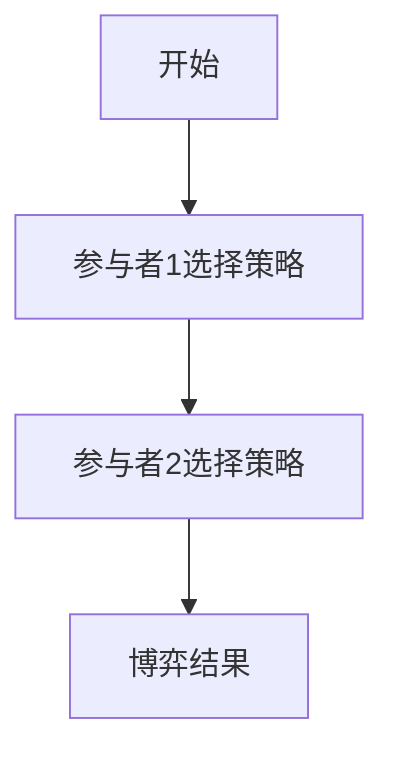

                 


# 多智能体系统模拟市场参与者行为

> 关键词：多智能体系统，市场模拟，博弈论，系统建模，算法实现

> 摘要：本文探讨了多智能体系统在模拟市场参与者行为中的应用，详细介绍了多智能体系统的定义、核心概念、博弈论基础、系统建模与仿真，以及实际项目中的算法实现和系统设计。通过理论与实践相结合的方式，帮助读者全面理解多智能体系统在市场模拟中的作用和价值。

---

# 第1章: 多智能体系统概述

## 1.1 多智能体系统的基本概念

### 1.1.1 多智能体系统的定义

多智能体系统（Multi-Agent System, MAS）是由多个智能体（Agent）组成的分布式系统，这些智能体能够通过协作或竞争完成复杂的任务。每个智能体都有自己的目标、知识和行为规则，能够感知环境并采取行动。

### 1.1.2 多智能体系统的分类

多智能体系统可以根据多个维度进行分类：

1. **智能体的智能性**：分为简单反应型、基于模型的反应型、目标驱动型和效用驱动型智能体。
2. **系统的结构**：分为松散耦合和紧耦合系统。
3. **智能体的交互方式**：分为直接交互和间接交互。

### 1.1.3 多智能体系统的特点

- **分布性**：多个智能体分布在不同的位置，独立运行。
- **自主性**：智能体能够自主决策，无需外部干预。
- **协作性**：智能体之间通过协作完成共同目标。
- **动态性**：系统环境和智能体行为具有动态变化。

## 1.2 市场模拟的背景与意义

### 1.2.1 市场模拟的基本概念

市场模拟是指通过建立数学模型和计算机程序，模拟市场中各参与者的互动行为，从而预测市场趋势和行为模式。多智能体系统为市场模拟提供了一个理想的平台，因为市场参与者（如买家、卖家、竞争者）可以被建模为多个智能体。

### 1.2.2 市场模拟的应用场景

- **经济学研究**：模拟市场均衡、价格波动等经济现象。
- **金融领域**：预测股票价格、风险评估等。
- **市场营销**：优化定价策略、推广策略等。
- **博弈论研究**：分析参与者之间的博弈关系。

### 1.2.3 市场模拟的挑战与机遇

- **挑战**：市场环境复杂多变，参与者行为具有不确定性，模型的准确性要求高。
- **机遇**：通过多智能体系统，可以实时模拟市场行为，提供动态反馈，为决策者提供支持。

## 1.3 多智能体系统在市场模拟中的应用

### 1.3.1 多智能体系统与市场行为模拟

多智能体系统通过模拟多个市场参与者的互动行为，能够捕捉市场的动态变化，为研究者和决策者提供有力工具。

### 1.3.2 市场参与者行为的建模方法

- **基于规则的建模**：定义智能体的行为规则，模拟其决策过程。
- **基于效用的建模**：通过效用函数描述智能体的偏好和决策。
- **基于学习的建模**：通过机器学习算法，让智能体从经验中学习和改进。

### 1.3.3 多智能体系统的优势与局限性

- **优势**：能够模拟复杂系统的动态行为，提供实时反馈。
- **局限性**：模型的复杂性可能导致计算成本高，难以处理大规模系统。

## 1.4 本章小结

本章介绍了多智能体系统的基本概念、市场模拟的背景与意义，以及多智能体系统在市场模拟中的应用。通过这些内容，读者可以理解多智能体系统在模拟市场参与者行为中的重要性。

---

# 第2章: 多智能体系统的核心概念与联系

## 2.1 多智能体系统的数学模型

### 2.1.1 系统的组成部分

多智能体系统由以下部分组成：

- **智能体**：具有自主性、反应性、目标性和社会性的实体。
- **环境**：智能体所处的外部世界，包括物理环境和逻辑环境。
- **通信机制**：智能体之间交换信息的渠道。
- **协调机制**：智能体之间协作或竞争的规则。

### 2.1.2 智能体的属性与行为

智能体的属性包括：

- **知识**：智能体所拥有的信息和规则。
- **目标**：智能体的行为动机。
- **行为**：智能体对外部环境的反应。

智能体的行为可以分为简单反应型和基于模型的反应型两类。

### 2.1.3 系统的动态模型

系统的动态模型描述了智能体之间以及智能体与环境之间的交互过程。常见的动态模型包括：

- **状态空间模型**：描述系统在不同时间点的状态。
- **行为模型**：描述智能体的行为规则和决策过程。

## 2.2 多智能体系统的ER实体关系图

```mermaid
er
actor: 市场参与者
agent: 智能体
market: 市场环境
```

## 2.3 多智能体系统的算法原理

### 2.3.1 分布式计算

多智能体系统中的分布式计算是指多个智能体协同完成任务的过程。分布式计算的核心是智能体之间的通信与协调。

### 2.3.2 协作与竞争机制

- **协作机制**：智能体之间通过协作完成共同目标。
- **竞争机制**：智能体之间通过竞争争夺资源。

### 2.3.3 自适应行为

智能体能够根据环境的变化自适应调整自己的行为，这需要智能体具备学习和推理能力。

## 2.4 本章小结

本章详细介绍了多智能体系统的数学模型、ER实体关系图以及算法原理。通过这些内容，读者可以理解多智能体系统的内部结构和运行机制。

---

# 第3章: 多智能体系统的博弈论基础

## 3.1 博弈论的基本概念

### 3.1.1 理解博弈论

博弈论是研究理性决策者之间战略互动的数学理论。它广泛应用于经济学、社会学、政治学等领域。

### 3.1.2 常见博弈类型

- **完全信息博弈**：参与者完全了解所有信息。
- **不完全信息博弈**：参与者不了解所有信息。
- **合作博弈**：参与者可以通过合作获得更大的收益。
- **非合作博弈**：参与者无法通过协议达成合作。

### 3.1.3 纳什均衡

纳什均衡是指在博弈中，每个参与者都在给定其他参与者策略的情况下选择最优策略，从而使得没有任何一方有动机单方面改变策略。

数学公式表示为：

$$
\text{纳什均衡} = (s_1, s_2, \ldots, s_n)
$$

其中，$s_i$ 是参与者 $i$ 的策略。

## 3.2 市场行为的博弈模型

### 3.2.1 完全信息博弈

参与者完全了解市场信息，能够基于此做出理性决策。

### 3.2.2 不完全信息博弈

参与者无法完全了解市场信息，需要基于有限信息做出决策。

### 3.2.3 合作与非合作博弈

- **合作博弈**：参与者可以通过合作实现共赢。
- **非合作博弈**：参与者无法通过合作获得更大收益。

## 3.3 多智能体系统的博弈分析

### 3.3.1 博弈树的构建

博弈树是描述博弈过程的树状结构，节点代表博弈的状态，边代表决策。



### 3.3.2 均衡点的计算

通过计算纳什均衡，可以确定市场参与者的最优策略。

### 3.3.3 博弈论在市场模拟中的应用

博弈论为多智能体系统的市场模拟提供了理论基础，能够模拟参与者之间的竞争与合作行为。

## 3.4 本章小结

本章介绍了博弈论的基本概念，分析了市场行为的博弈模型，并通过博弈树和纳什均衡展示了博弈论在多智能体系统中的应用。

---

# 第4章: 多智能体系统的建模与仿真

## 4.1 多智能体系统的建模方法

### 4.1.1 系统建模的基本步骤

1. **明确目标**：确定建模的目标和范围。
2. **收集数据**：收集市场参与者的行为数据。
3. **选择建模方法**：根据目标选择合适的建模方法。
4. **构建模型**：根据选择的建模方法构建模型。
5. **验证与调整**：验证模型的准确性并进行调整。

### 4.1.2 市场参与者的建模

市场参与者的建模需要考虑其目标、知识和行为规则。例如，可以将买家建模为追求效用最大化的智能体，卖家建模为追求利润最大化的智能体。

### 4.1.3 系统行为的建模

系统行为的建模需要考虑智能体之间的交互过程。例如，可以使用状态转移图描述智能体的状态变化。

## 4.2 多智能体系统的算法实现

### 4.2.1 分布式计算

分布式计算是多智能体系统的核心，通过智能体之间的通信与协调完成任务。

### 4.2.2 协作与竞争机制

协作机制可以通过协调器实现，竞争机制可以通过拍卖机制实现。

### 4.2.3 自适应行为

自适应行为可以通过强化学习实现，智能体根据环境反馈调整自己的行为。

## 4.3 本章小结

本章详细介绍了多智能体系统的建模方法和算法实现，为读者提供了理论和实践的指导。

---

# 第5章: 多智能体系统的项目实战

## 5.1 项目背景与目标

### 5.1.1 项目背景

本项目旨在模拟一个简单的市场环境，包括多个买家和卖家，通过多智能体系统模拟其行为。

### 5.1.2 项目目标

1. 实现多智能体系统的建模与仿真。
2. 模拟市场参与者的行为，分析市场动态。

## 5.2 项目实现

### 5.2.1 环境安装

需要安装Python、numpy、matplotlib等库。

### 5.2.2 核心代码实现

```python
class Agent:
    def __init__(self, id, strategy):
        self.id = id
        self.strategy = strategy
        self.state = 'idle'  # 可能的状态：idle, buying, selling

    def act(self, market_price):
        if self.state == 'idle':
            if self.strategy == 'buyer':
                self.buy(market_price)
            elif self.strategy == 'seller':
                self.sell(market_price)

    def buy(self, price):
        # 简单的购买逻辑
        print(f"Agent {self.id} buys at price {price}")
        self.state = 'buying'

    def sell(self, price):
        # 简单的销售逻辑
        print(f"Agent {self.id} sells at price {price}")
        self.state = 'selling'
```

### 5.2.3 代码应用解读与分析

上述代码定义了一个智能体类，每个智能体有不同的策略（买家或卖家），并在市场价达到其策略条件时采取行动。

### 5.2.4 实际案例分析

假设我们有三个买家和两个卖家，市场初始价格为100。智能体根据价格变化采取购买或卖出行动。

### 5.2.5 项目小结

通过本项目，我们实现了多智能体系统的建模与仿真，模拟了市场参与者的互动行为。

## 5.3 本章小结

本章通过一个实际项目，展示了多智能体系统的建模与仿真过程，帮助读者更好地理解理论知识。

---

# 第6章: 总结与展望

## 6.1 总结

多智能体系统为市场模拟提供了一个强大的工具，能够模拟市场参与者的互动行为，帮助研究者和决策者更好地理解市场动态。

## 6.2 展望

未来，随着人工智能技术的发展，多智能体系统在市场模拟中的应用将更加广泛和深入。研究者需要进一步优化算法，提高系统的实时性和准确性。

---

通过以上内容，读者可以全面了解多智能体系统在模拟市场参与者行为中的应用，从理论到实践，逐步掌握相关知识和技能。

