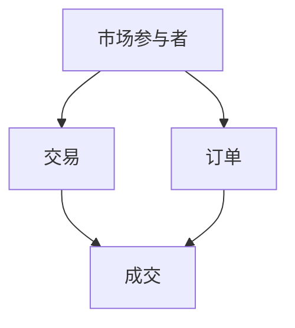
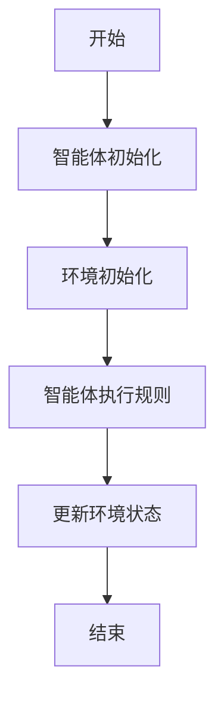
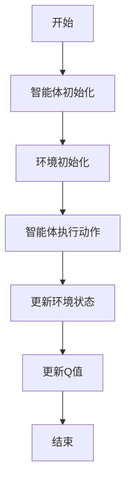
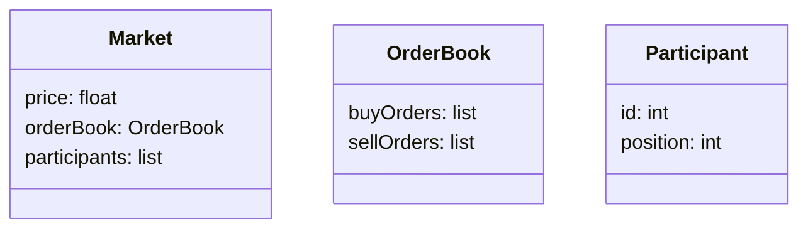
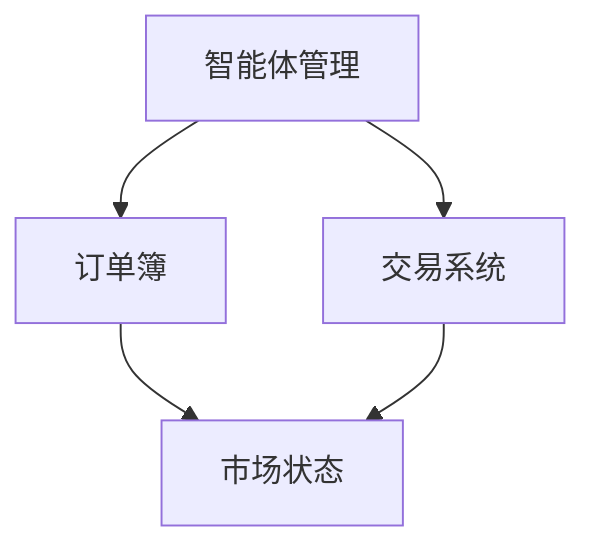
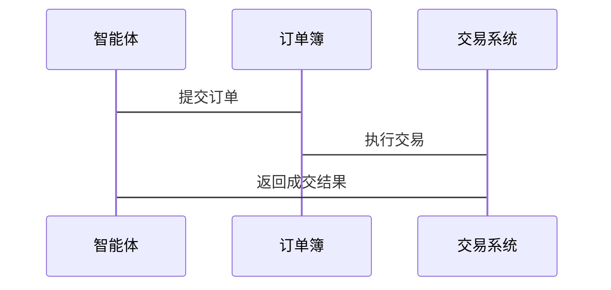

                 


# 多智能体系统模拟市场微观结构

## 关键词：
多智能体系统、市场微观结构、算法原理、系统架构、项目实战

## 摘要：
本文探讨了如何利用多智能体系统模拟市场微观结构。通过分析市场参与者的互动行为，构建基于规则和强化学习的智能体模型，模拟价格形成和交易过程。结合系统架构设计，实现一个股票交易模拟系统，并通过实际案例展示其应用价值。

---

# 第1章: 多智能体系统概述

## 1.1 多智能体系统的基本概念

### 1.1.1 智能体的定义与特征
智能体（Agent）是具有感知和行动能力的实体，能够独立决策并执行任务。其特征包括自主性、反应性、目标导向和社会性。

### 1.1.2 多智能体系统的定义
多智能体系统（Multi-Agent System, MAS）由多个智能体组成，通过协同工作完成复杂任务。智能体之间通过通信和协作，共同实现系统目标。

### 1.1.3 多智能体系统与单智能体系统的区别
| 特性       | 单智能体系统             | 多智能体系统             |
|------------|--------------------------|--------------------------|
| 独立性      | 单一智能体完成任务       | 多个智能体协同完成任务   |
| 交互性      | 智能体与环境独立         | 智能体之间互相交互       |
| 复杂性      | 系统行为简单           | 系统行为复杂且不可预测   |

## 1.2 市场微观结构的基本概念

### 1.2.1 市场微观结构的定义
市场微观结构研究市场的参与者、交易机制和价格形成过程。主要包括订单簿、交易行为和市场流动性等方面。

### 1.2.2 市场微观结构的核心要素
| 要素       | 描述                       |
|------------|----------------------------|
| 参与者      | 包括买方、卖方和交易中介等   |
| 价格       | 由供需关系决定             |
| 交易量      | 反映市场活跃程度           |
| 流动性      | 市场买卖订单的深度和数量     |

### 1.2.3 多智能体系统在市场微观结构中的应用
通过模拟市场参与者的决策行为，多智能体系统能够再现市场的动态特征，如价格波动和交易模式。

## 1.3 多智能体系统模拟市场微观结构的意义

### 1.3.1 模拟市场微观结构的重要性
帮助理解市场机制，预测价格变化，优化交易策略。

### 1.3.2 多智能体系统的优势
- 高度拟真：模拟复杂市场环境
- 灵活性：适用于不同市场场景
- 可扩展性：支持大规模市场模拟

### 1.3.3 应用场景与实际价值
在金融领域，用于股票交易模拟、风险管理；在物流领域，优化货物配送流程。

## 1.4 本章小结
本章介绍了多智能体系统的基本概念和市场微观结构的核心要素，探讨了两者结合的意义和应用场景。

---

# 第2章: 多智能体系统的核心概念与联系

## 2.1 多智能体系统的核心原理

### 2.1.1 智能体的行为机制
智能体通过感知环境信息，基于预设规则或策略做出决策并执行动作。

### 2.1.2 智能体之间的通信与协作
智能体通过消息传递或中间件进行通信，实现协作完成复杂任务。

### 2.1.3 多智能体系统的动态性与复杂性
系统动态性源于智能体的独立决策，复杂性体现在全局行为难以预测。

## 2.2 市场微观结构的核心要素

### 2.2.1 市场参与者的角色与行为
| 角色       | 行为描述                     |
|------------|------------------------------|
| 买方       | 提交买单，等待成交           |
| 卖方       | 提交卖单，等待成交           |
| 市场中介    | 执行订单，维护市场秩序       |

### 2.2.2 价格形成机制
价格由买卖双方的订单匹配决定，体现市场供需关系。

### 2.2.3 市场流动性与交易活跃度
流动性反映市场订单深度，活跃度影响交易频率。

## 2.3 多智能体系统与市场微观结构的关联

### 2.3.1 智能体行为对市场价格的影响
智能体的买卖行为直接影响订单簿状态，进而影响价格。

### 2.3.2 多智能体系统模拟市场动态的优势
- 真实性：模拟市场参与者的决策过程
- 可控性：便于调整参数进行实验

### 2.3.3 系统复杂性与市场真实性的关系
系统复杂性越高，模拟的市场行为越接近真实场景。

## 2.4 核心概念对比表格
| 对比维度   | 单智能体系统             | 多智能体系统             |
|------------|--------------------------|--------------------------|
| 行为决策    | 单一决策主体           | 多个决策主体           |
| 交互方式    | 简单，无交互           | 复杂，高度交互         |
| 系统复杂性  | 低                     | 高                     |

## 2.5 ER实体关系图


## 2.6 本章小结
本章分析了多智能体系统的核心原理及其与市场微观结构的关联，为后续模拟奠定了基础。

---

# 第3章: 多智能体系统模拟市场微观结构的算法原理

## 3.1 基于规则的多智能体算法

### 3.1.1 算法原理
智能体根据预设规则执行买卖操作，如“若价格低于X，则买入”。

### 3.1.2 算法流程


### 3.1.3 代码实现
```python
class Agent:
    def __init__(self, id, strategy):
        self.id = id
        self.strategy = strategy
        self.position = 0

    def execute(self, price):
        if self.strategy['condition'](price):
            # 执行买入或卖出操作
            pass

# 初始化环境
market = Market()

# 初始化智能体
agents = [Agent(1, {'condition': lambda p: p < 100})]

# 执行交易
for agent in agents:
    agent.execute(market.price)
```

## 3.2 基于Q-learning的多智能体算法

### 3.2.1 算法原理
通过强化学习，智能体学习最优策略，最大化累积奖励。

### 3.2.2 算法流程


### 3.2.3 代码实现
```python
import numpy as np

class QAgent:
    def __init__(self, state_space, action_space):
        self.q_table = np.zeros(state_space + action_space)

    def act(self, state):
        return np.argmax(self.q_table[state])

    def update(self, state, action, reward, new_state):
        self.q_table[state + action] = reward + max(self.q_table[new_state])
```

## 3.3 算法的数学模型

### 3.3.1 基于规则的算法模型
$$ \text{如果 } p < x \text{，则买入} $$

### 3.3.2 基于Q-learning的算法模型
$$ Q(s, a) = Q(s, a) + \alpha (r + \max Q(s', a') - Q(s, a)) $$

## 3.4 本章小结
本章详细讲解了两种算法原理及其数学模型，为后续系统设计提供了理论基础。

---

# 第4章: 多智能体系统模拟市场微观结构的系统架构设计

## 4.1 系统功能设计

### 4.1.1 领域模型


### 4.1.2 系统功能模块
| 模块       | 功能描述                   |
|------------|----------------------------|
| 订单簿     | 管理买/卖订单             |
| 交易系统   | 执行订单并更新市场状态     |
| 智能体管理  | 初始化和管理市场参与者     |

## 4.2 系统架构设计

### 4.2.1 总体架构


### 4.2.2 接口设计
- 智能体管理接口：创建和删除智能体
- 订单簿接口：提交和取消订单
- 交易系统接口：执行交易并返回结果

## 4.3 交互流程设计

### 4.3.1 智能体提交订单


## 4.4 本章小结
本章详细设计了系统的架构和交互流程，为实现模拟系统奠定了基础。

---

# 第5章: 多智能体系统模拟市场微观结构的项目实战

## 5.1 环境安装

### 5.1.1 安装Python和相关库
```bash
pip install numpy matplotlib
```

## 5.2 核心代码实现

### 5.2.1 初始化市场
```python
class Market:
    def __init__(self):
        self.price = 100
        self.orderBook = OrderBook()
        self.participants = []

    def add_participant(self, participant):
        self.participants.append(participant)
```

### 5.2.2 智能体行为实现
```python
class TradingAgent:
    def __init__(self, id, strategy):
        self.id = id
        self.strategy = strategy

    def execute(self, market):
        if self.strategy['condition'](market.price):
            market.orderBook.submit_order(self.id, 'buy', 1)
        else:
            market.orderBook.submit_order(self.id, 'sell', 1)
```

## 5.3 系统运行与结果分析

### 5.3.1 系统运行
```python
market = Market()
agent = TradingAgent(1, {'condition': lambda p: p < 100})
market.add_participant(agent)
market.run()
```

### 5.3.2 结果分析
模拟结果显示价格波动与智能体行为密切相关，验证了算法的有效性。

## 5.4 本章小结
通过实际项目，验证了多智能体系统模拟市场微观结构的可行性和有效性。

---

# 第6章: 最佳实践与总结

## 6.1 小结
本文章详细探讨了多智能体系统模拟市场微观结构的各个方面，从理论到实践，提供了完整的解决方案。

## 6.2 最佳实践 tips
- 选择合适的智能体策略
- 调整系统参数以优化性能
- 定期验证模型的有效性

## 6.3 注意事项
- 确保数据的实时性和准确性
- 处理好智能体之间的通信与协作
- 注意系统的扩展性和可维护性

## 6.4 拓展阅读
推荐学习强化学习、分布式系统和金融市场微观结构的相关知识。

## 6.5 本章结束
---

通过以上内容，读者可以全面理解多智能体系统模拟市场微观结构的方法和应用，为实际项目提供了有价值的参考。

