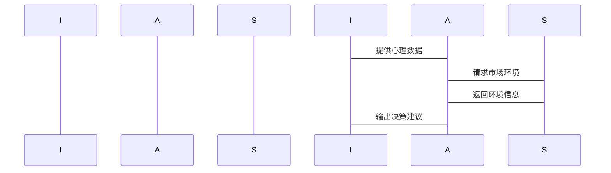

                 


# 多智能体系统模拟投资者心理

> 关键词：多智能体系统，投资者心理，行为建模，金融模拟，人工智能，系统架构

> 摘要：本文探讨了如何利用多智能体系统来模拟投资者心理行为，通过构建多智能体模型，分析投资者心理特征，设计行为决策算法，并实现金融市场的模拟与分析。

---

# 第一部分：多智能体系统与投资者心理概述

## 第1章：问题背景与核心概念

### 1.1 问题背景
#### 1.1.1 投资者行为的复杂性
投资者行为受到理性分析、情感因素和市场环境的共同影响，传统模型难以捕捉个体差异。

#### 1.1.2 多智能体系统的应用潜力
通过模拟多个智能体的行为，可以更真实地反映金融市场中的复杂互动。

### 1.2 核心概念
#### 1.2.1 多智能体系统（MAS）
- 定义：由多个相互作用的智能体组成的系统。
- 特性：分布式、自治性、反应性、协作性。

#### 1.2.2 投资者心理模型
- 层次结构：认知层、情感层、决策层。
- 核心属性：风险偏好、情绪波动、信息处理能力。

---

# 第二部分：多智能体系统的核心原理

## 第2章：智能体行为模型

### 2.1 智能体的行为规则
#### 2.1.1 基于博弈论的决策规则
- 理性决策：最大化收益。
- 情感决策：基于情绪的非理性选择。

#### 2.1.2 智能体的交互机制
- 信息共享：智能体之间的信息传递。
- 竞争与合作：系统中的协同与对抗。

### 2.2 心理模型的构建

#### 2.2.1 情绪指数计算
$$情绪指数 = \alpha \times 理性分析 + \beta \times 情感因素$$

#### 2.2.2 决策树模型
通过决策树分析投资者在不同情境下的选择路径。

---

# 第三部分：算法实现与系统架构

## 第3章：算法实现

### 3.1 行为决策算法
#### 3.1.1 强化学习应用
- 状态空间：市场环境、资产价格。
- 动作空间：买入、卖出、持有。
- 奖励函数：收益最大化。

#### 3.1.2 遗传算法优化
- 参数优化：智能体的决策参数。
- 进化过程：适应度评估、选择、交叉、变异。

### 3.2 系统架构设计

#### 3.2.1 系统功能模块
- 数据采集：市场数据、投资者行为数据。
- 模型训练：心理模型训练、智能体行为训练。
- 仿真运行：模拟市场运行、生成结果。

#### 3.2.2 系统交互流程


---

# 第四部分：项目实战与优化

## 第4章：项目实战

### 4.1 环境安装
- 工具：Python、NumPy、Pandas、Matplotlib、强化学习框架（如OpenAI Gym）。

### 4.2 核心代码实现

#### 4.2.1 智能体类实现
```python
class Agent:
    def __init__(self, id, emotion_factor=0.5):
        self.id = id
        self.emotion_factor = emotion_factor
        self.risk_tolerance = 0.1
    
    def decide(self, market_data):
        # 基于情绪和数据的决策
        if market_data['return'] > self.risk_tolerance:
            return 'buy'
        elif market_data['return'] < -self.risk_tolerance:
            return 'sell'
        else:
            return 'hold'
```

#### 4.2.2 系统运行
```python
class MarketSimulator:
    def __init__(self, agents):
        self.agents = agents
        self.prices = [100]  # 初始价格
    
    def step(self):
        # 计算新价格
        demand = sum(1 for a in self.agents if a.decide(self.prices[-1]) == 'buy')
        supply = sum(1 for a in self.agents if a.decide(self.prices[-1]) == 'sell')
        new_price = self.prices[-1] + (demand - supply) * 0.1
        self.prices.append(new_price)
```

### 4.3 实际案例分析
- 案例：模拟股票市场中的多智能体行为。
- 分析：价格波动与投资者情绪的关系。

---

# 第五部分：总结与展望

## 第5章：总结与优化建议

### 5.1 小结
- 多智能体系统能够有效模拟投资者心理行为。
- 系统实现的关键在于智能体的设计与交互机制。

### 5.2 注意事项
- 数据准确性：确保输入数据的真实性和代表性。
- 系统稳定性：避免算法过度拟合或发散。

### 5.3 拓展阅读
- 推荐书籍：《多智能体系统与应用》、《行为金融学》。
- 推荐论文：相关领域顶刊论文。

---

# 结语

通过多智能体系统的模拟，我们可以更深入地理解投资者心理行为，为金融市场分析提供新的视角和工具。未来的研究可以进一步结合大数据和深度学习，提升模型的准确性和实用性。

