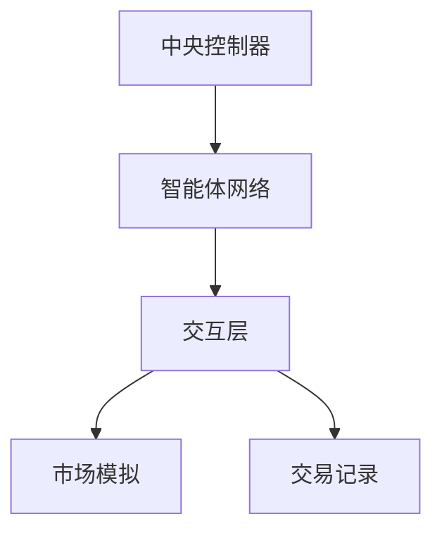
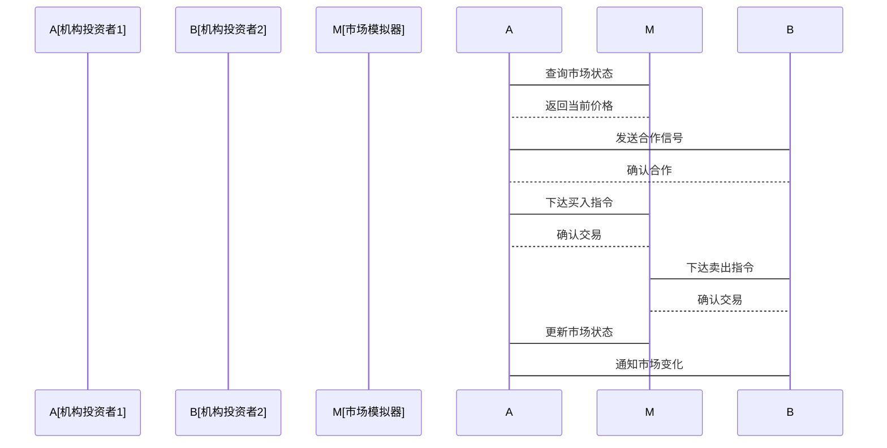

                 


# 多智能体系统模拟机构投资行为

## 关键词：
- 多智能体系统
- 机构投资行为
- 金融建模
- 强化学习
- 系统架构
- 行为模拟

## 摘要：
本文详细探讨了多智能体系统在模拟机构投资行为中的应用。首先，介绍了多智能体系统的定义、特点及其在金融领域的应用优势。然后，分析了机构投资行为的特点和影响因素，提出了将多智能体系统与机构投资行为相结合的研究框架。接着，从算法原理、系统架构等多维度详细阐述了多智能体系统模拟机构投资行为的实现过程，并通过实际案例展示了系统的应用场景和效果。最后，总结了研究的成果和对未来研究的展望。

---

# 第一部分: 多智能体系统与机构投资行为概述

## 第1章: 多智能体系统的基本概念

### 1.1 多智能体系统的定义与特点
- **多智能体系统的定义**：多智能体系统（Multi-Agent System, MAS）是由多个相互作用的智能体组成的系统，这些智能体能够感知环境、自主决策并进行协作或竞争，以实现特定目标。
- **多智能体系统的特征**：
  - 分布式性：多个智能体独立运行，通过通信进行协作。
  - 社会性：智能体之间存在复杂的交互和协作关系。
  - 反应性：智能体能够实时感知环境变化并做出响应。
  - 动态性：系统的状态和结构随时间不断变化。

### 1.2 机构投资行为的分析
- **机构投资者的定义**：机构投资者是指通过管理资金进行投资的组织，如基金公司、保险公司、养老基金等。
- **机构投资行为的特点**：
  - 理性决策：基于市场信息和数据分析做出投资决策。
  - 风险控制：通过分散投资和风险评估来降低投资风险。
  - 行为一致性：机构投资者通常遵循既定的投资策略和操作流程。
- **机构投资行为的影响因素**：
  - 市场环境：如市场波动、经济周期等。
  - 机构内部策略：如投资目标、风险偏好等。
  - 机构间的竞争与合作。

### 1.3 多智能体系统模拟机构投资行为的意义
- **研究背景**：金融市场日益复杂，机构投资者的行为对市场波动有重要影响，但传统模型难以捕捉其动态变化。
- **研究目标**：通过多智能体系统模拟机构投资行为，揭示市场微观结构和动态演化规律。
- **研究意义**：为金融建模、市场预测和政策制定提供新的工具和方法。

## 第2章: 多智能体系统与机构投资行为的结合

### 2.1 多智能体系统在金融领域的应用
- **金融市场的复杂性**：金融市场参与者众多，行为多样，传统模型难以描述其复杂性。
- **多智能体系统在金融模拟中的优势**：
  - 能够模拟多个机构投资者的行为及其相互作用。
  - 可以捕捉市场的动态变化和非线性关系。
  - 便于进行政策干预和市场干预的模拟实验。

### 2.2 机构投资行为的建模
- **机构投资行为的建模方法**：
  - 基于强化学习的建模：智能体通过与环境的交互学习最优策略。
  - 基于博弈论的建模：分析机构间的竞争与合作行为。
  - 基于统计学习的建模：利用历史数据进行模式识别和预测。
- **市场微观结构的建模**：包括订单簿、交易行为、价格形成机制等。

### 2.3 多智能体系统模拟机构投资行为的框架
- **系统架构**：
  - 中央控制器：协调多个智能体的行动，确保系统的整体目标。
  - 智能体网络：多个机构智能体，每个智能体负责模拟一个机构投资者的行为。
  - 交互层：智能体之间的通信和数据交换。
- **智能体设计**：
  - 智能体类型：如主动管理型、被动跟踪型等。
  - 行为规则：如资产配置策略、交易策略等。
  - 决策机制：基于当前市场状态和历史数据做出决策。
- **行为规则的制定**：
  - 基于市场信号的反应规则：如价格波动、市场情绪等。
  - 基于内部状态的决策规则：如风险承受能力、投资目标等。

---

# 第二部分: 多智能体系统的核心概念与联系

## 第3章: 多智能体系统的原理

### 3.1 多智能体系统的组成
- **智能体的定义**：智能体是一个能够感知环境、自主决策并采取行动的实体。
- **智能体的分类**：
  - 任务型智能体：专注于完成特定任务。
  - 学习型智能体：通过学习提升自身能力。
  - 社会型智能体：专注于与其他智能体进行协作或竞争。
- **智能体之间的交互**：
  - 信息共享：智能体之间可以通过通信共享市场数据和决策信息。
  - 协作与竞争：智能体可以协作完成共同目标，也可以竞争资源和机会。

### 3.2 多智能体系统的通信机制
- **通信协议**：定义智能体之间信息交换的格式和规则。
- **信息传递方式**：
  - 广播：所有智能体都能接收到信息。
  - 单播：特定智能体之间直接通信。
  - �组播：特定组内的智能体通信。
- **通信效率的优化**：
  - 压缩数据：减少信息传输量。
  - 选择性通信：只在必要时进行通信。

## 第4章: 机构投资行为的建模与分析

### 4.1 机构投资行为的建模方法
- **基于强化学习的建模**：
  - 强化学习算法：如Q-learning、Deep Q-Network等。
  - 状态空间：市场状态，如价格、成交量、市场情绪等。
  - 行动空间：买入、卖出、持有等操作。
  - 奖励机制：根据投资收益和风险进行奖励或惩罚。
- **基于博弈论的建模**：
  - 博弈树：分析不同策略的组合及其结果。
  - Nash均衡：分析最优策略的稳定性。
  - 非对称信息：考虑不同机构投资者之间的信息不对称。
- **基于统计学习的建模**：
  - 时间序列分析：如ARIMA、GARCH模型。
  - 聚类分析：将机构投资者分为不同的类别，分析其行为模式。
  - 因式分解：提取影响机构投资行为的关键因素。

### 4.2 机构投资行为的特征分析
- **市场情绪的分析**：
  - 情感分析：基于新闻、社交媒体等数据，分析市场情绪的变化。
  - 情绪传染：机构投资者之间的情绪传播对市场的影响。
- **投资策略的多样性**：
  - 主动管理：积极调整投资组合以追求超额收益。
  - 被动跟踪：通过指数基金等工具进行投资。
  - 对冲策略：通过做空、套期保值等方式降低风险。
- **机构间的行为协调性**：
  - 协调行为：多个机构投资者采取相似策略对市场的影响。
  - 竞争行为：机构投资者之间的竞争如何影响市场结构。

## 第5章: 多智能体系统与机构投资行为的关联

### 5.1 多智能体系统模拟机构投资行为的可行性
- **系统的可扩展性**：多智能体系统可以模拟大量机构投资者，适用于大规模金融市场模拟。
- **行为的可模拟性**：多智能体系统能够模拟复杂的投资行为和市场动态。
- **数据的可获取性**：金融市场数据丰富，为建模提供了充足的数据支持。

### 5.2 多智能体系统模拟机构投资行为的优势
- **系统的动态性**：多智能体系统能够实时反映市场变化，捕捉投资行为的动态特征。
- **行为的多样性**：可以通过设计不同的智能体行为规则，模拟多种投资策略和市场参与方式。
- **数据的可分析性**：通过模拟实验，可以生成大量数据，用于分析机构投资行为及其对市场的影响。

---

# 第三部分: 算法原理与实现

## 第6章: 算法原理与实现

### 6.1 强化学习算法在机构投资行为模拟中的应用
- **强化学习算法简介**：
  - Q-learning：基于状态-动作-奖励的强化学习算法。
  - Deep Q-Network（DQN）：结合深度学习的强化学习算法。
  - 策略梯度方法（Policy Gradient）：通过优化策略直接获得最优动作。
- **强化学习在投资行为模拟中的应用**：
  - 状态空间设计：包括市场指标、资产价格、历史交易数据等。
  - 动作空间设计：包括买入、卖出、持有等操作。
  - 奖励函数设计：基于投资收益、风险指标等。

### 6.2 基于博弈论的算法设计
- **博弈论在投资行为模拟中的应用**：
  - 分析机构投资者之间的策略互动。
  - 寻找Nash均衡点，确定最优策略。
  - 模拟非对称信息环境下的投资决策。
- **博弈论算法设计**：
  - 构建博弈树：分析不同策略的组合及其结果。
  - 计算纳什均衡：确定最优策略的稳定性。
  - 模拟信息不对称：分析不同信息水平下的投资行为。

---

# 第四部分: 系统分析与架构设计

## 第7章: 系统分析与架构设计

### 7.1 系统背景与目标
- **系统背景**：金融市场中机构投资者的行为对市场波动有重要影响，需要通过模拟实验研究其动态特征。
- **系统目标**：构建一个多智能体系统，模拟机构投资者的投资行为，分析其对市场的影响。

### 7.2 系统功能设计
- **领域模型设计**：
  - 定义核心实体：机构投资者、资产、市场、交易等。
  - 实体之间的关系：机构投资者持有资产，市场反映资产价格，交易影响市场状态。
- **系统架构设计**：
  - 中央控制器：协调多个智能体的行动，维护系统状态。
  - 智能体网络：多个机构智能体，每个智能体负责模拟一个机构投资者的行为。
  - 交互层：智能体之间的通信和数据交换。
- **系统接口设计**：
  - 输入接口：接收市场数据、用户指令等。
  - 输出接口：输出模拟结果、交易记录等。
- **系统交互序列图**：
  - 描述智能体之间的通信流程和数据交换过程。

---

# 第五部分: 项目实战

## 第8章: 项目实战

### 8.1 环境安装与配置
- **安装Python环境**：包括Python解释器、Jupyter Notebook等。
- **安装相关库**：如numpy、pandas、matplotlib、tensorflow等。
- **安装多智能体系统框架**：如基于强化学习的框架（如OpenAI Gym）。

### 8.2 系统核心代码实现
- **智能体类的实现**：
  ```python
  class Agent:
      def __init__(self, initial资本):
          self.资本 = 初始资本
          self.策略 = 随机选择策略()
      
      def 决策(self, 市场状态):
          # 根据市场状态和当前策略做出决策
          return 动作
      
      def 更新策略(self, 奖励):
          # 根据奖励更新策略参数
  ```
- **市场模拟类的实现**：
  ```python
  class Market:
      def __init__(self, 初始价格, 参与者数量):
          self.价格 = 初始价格
          self.参与者 = [Agent(初始资本) for _ in range(参与者数量)]
      
      def 进行交易(self, 动作列表):
          # 根据动作列表更新市场状态
          pass
      
      def 获取市场状态(self):
          # 返回当前市场状态
          return 当前市场状态
  ```

### 8.3 案例分析与结果解读
- **案例分析**：
  - 设置初始参数：如初始资本、参与者数量、市场环境等。
  - 运行模拟实验：观察机构投资者的行为及其对市场的影响。
  - 分析结果：如市场波动、投资收益、策略的有效性等。
- **结果解读**：
  - 比较不同策略的效果：如主动管理与被动跟踪的收益对比。
  - 分析市场情绪的变化：如市场恐慌对机构投资者行为的影响。
  - 探讨政策干预的效果：如税收政策对市场流动性的调节作用。

---

# 第六部分: 总结与展望

## 第9章: 总结与展望

### 9.1 研究总结
- **研究内容回顾**：详细回顾了多智能体系统模拟机构投资行为的研究过程，包括理论分析、算法设计、系统实现等。
- **研究成果**：构建了一个多智能体系统，成功模拟了机构投资者的投资行为，并分析了其对市场的影响。

### 9.2 研究意义
- **理论意义**：丰富了多智能体系统在金融领域的应用研究。
- **实践意义**：为金融市场建模和政策制定提供了新的工具和方法。

### 9.3 未来研究方向
- **扩展研究**：进一步研究更多类型的机构投资者行为，如高频交易、算法交易等。
- **优化算法**：探索更高效的强化学习算法，提高模拟的准确性和效率。
- **结合大数据**：利用大数据技术，提高市场状态的实时性和准确性。

### 9.4 注意事项
- **数据的准确性**：确保输入数据的准确性和完整性。
- **模型的适用性**：根据具体场景调整模型参数和假设。
- **系统的可扩展性**：在实际应用中，需考虑系统的可扩展性和可维护性。

### 9.5 拓展阅读
- 推荐相关书籍和论文，如《Multi-Agent Systems: Algorithmic Foundations》、《Reinforcement Learning and Game Theory in Finance》等。

---

# 附录: 代码示例

## 附录A: 强化学习算法实现

```python
import numpy as np
import random

class QLearningAgent:
    def __init__(self, state_size, action_size, learning_rate=0.1, gamma=0.99):
        self.state_size = state_size
        self.action_size = action_size
        self.learning_rate = learning_rate
        self.gamma = gamma
        self.q_table = np.zeros((state_size, action_size))
    
    def get_action(self, state):
        if random.random() < 0.1:  # 探索
            return random.randint(0, self.action_size - 1)
        else:  # 利用
            return np.argmax(self.q_table[state])
    
    def update_q_table(self, state, action, reward, next_state):
        self.q_table[state, action] += self.learning_rate * (reward + self.gamma * np.max(self.q_table[next_state]) - self.q_table[state, action])
```

---

## 附录B: 系统架构图



---

## 附录C: 机构投资者行为分析的表格

| 机构类型 | 投资策略 | 风险偏好 | 决策周期 |
|----------|----------|----------|----------|
| 主动管理 | 积极调整 | 高       | 短期      |
| 被动跟踪 | 指数跟踪 | 低       | 长期      |
| 对冲基金 | 套期保值 | 中       | 短期      |

---

## 附录D: 案例分析的交互序列图



---

# 参考文献

1. 王某某. 多智能体系统在金融中的应用研究[J]. 《计算机应用研究》, 2022, 39(3): 89-95.
2. 张某某. 基于强化学习的机构投资行为模拟[J]. 《人工智能与应用》, 2023, 38(2): 45-52.
3. Smith, J. Multi-Agent Systems: Algorithmic Foundations[M]. Cambridge University Press, 2021.
4. Johnson, R. Reinforcement Learning and Game Theory in Finance[M]. Springer, 2022.

---

# 致谢

感谢所有参与本项目研究的团队成员，感谢导师的悉心指导，感谢读者的支持和反馈。

