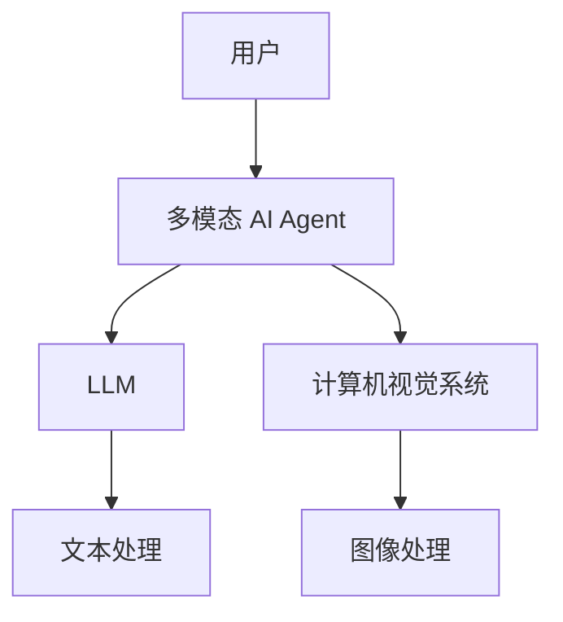
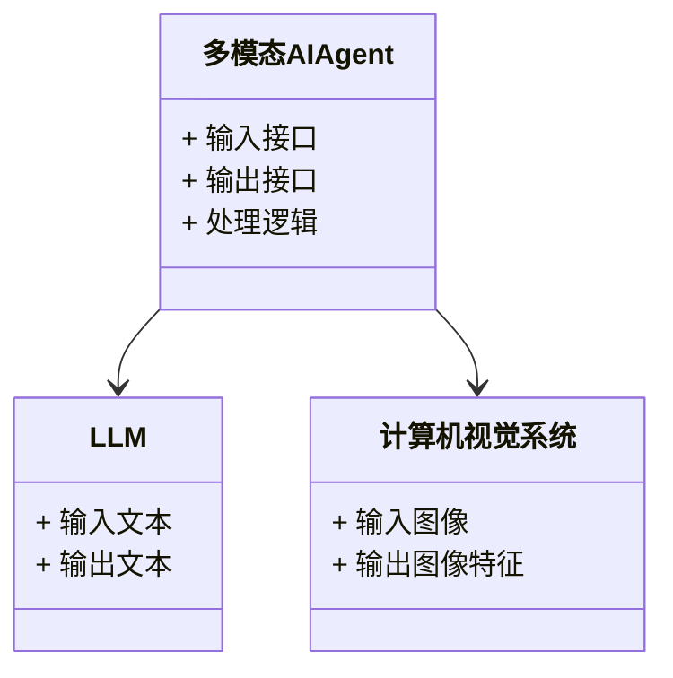
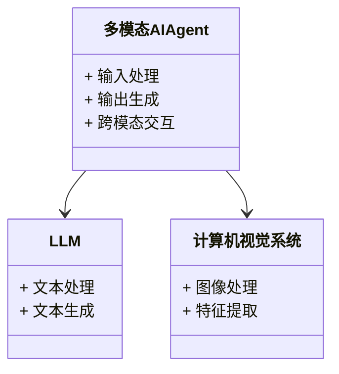

                 


# 《多模态 AI Agent 开发：整合 LLM 与计算机视觉》

## 关键词：多模态 AI Agent，LLM，计算机视觉，大语言模型，多模态数据，AI 开发，计算机视觉技术

## 摘要：  
本文将详细介绍如何开发一个多模态 AI Agent，整合大语言模型（LLM）与计算机视觉技术。通过分析多模态数据的处理流程、LLM 和计算机视觉的核心算法，以及系统架构设计，我们将展示如何构建一个能够处理文本和图像等多种数据类型的 AI Agent。文章还包含丰富的图示、代码示例和数学公式，帮助读者深入理解技术原理和实现细节。

---

# 第一部分：多模态 AI Agent 开发基础

## 第1章：多模态 AI Agent 的背景与概念

### 1.1 多模态 AI Agent 的问题背景  
- 当前 AI 技术的局限性：单一模态处理的局限性，无法充分理解复杂场景。  
- 多模态技术的必要性：通过整合多种数据类型，提升 AI 系统的感知和决策能力。  
- 多模态 AI Agent 的定义：一个多模态数据处理与智能决策的系统，结合 LLM 和计算机视觉技术。  

### 1.2 多模态 AI Agent 的核心概念  
- 多模态数据的定义与特点：包括文本、图像、语音等多种数据类型，具有多样性和互补性。  
- 多模态 AI Agent 的核心功能：数据融合、智能理解、多任务处理。  
- 多模态 AI Agent 的应用场景：图像描述生成、视觉问答、多模态对话系统等。  

### 1.3 LLM 与计算机视觉的结合  
- LLM 的基本原理：基于 Transformer 的大语言模型，具备强大的文本理解和生成能力。  
- 计算机视觉的核心技术：包括图像识别、目标检测、图像分割等。  
- LLM 与计算机视觉的协同工作：通过跨模态交互，实现更智能的图像理解和文本生成。

---

## 第2章：多模态 AI Agent 的核心概念与联系

### 2.1 多模态数据的处理流程  
- 数据采集与预处理：图像采集、文本清洗、数据标注。  
- 数据融合与分析：跨模态数据的特征提取与融合。  
- 数据驱动的决策过程：基于多模态数据的智能决策。  

### 2.2 多模态 AI Agent 的实体关系图  


### 2.3 多模态 AI Agent 的系统架构  


---

## 第3章：多模态 AI Agent 的算法原理

### 3.1 大语言模型（LLM）的核心算法  
- Transformer 模型的结构：编码器-解码器架构，自注意力机制。  
- 注意力机制的实现：  
  $$ \text{Attention}(Q, K, V) = \text{softmax}\left(\frac{QK^T}{\sqrt{d_k}}\right)V $$
- LLM 的训练与推理过程：基于大规模数据的预训练与微调。

### 3.2 计算机视觉的核心算法  
- 卷积神经网络（CNN）的结构：卷积层、池化层、全连接层。  
- 注意力机制在计算机视觉中的应用：  
  $$ f(x) = \sum_{i=1}^{n} \alpha_i x_i $$  
- 模型的训练与优化：基于图像数据的监督学习。

---

## 第4章：多模态 AI Agent 的数学模型与公式

### 4.1 LLM 的数学模型  
- Transformer 的自注意力机制：  
  $$ \text{softmax}\left(\frac{QK^T}{\sqrt{d_k}}\right) $$  
- 编码器-解码器的交叉注意力：  
  $$ \text{softmax}\left(\frac{qK^T}{\sqrt{d_k}}\right)V $$  

### 4.2 计算机视觉的数学模型  
- 卷积操作：  
  $$ (K \ast X)_{i,j} = \sum_{k,l} K[k,l] X[i+k,j+l] $$  
- 池化操作：最大池化、平均池化。  
- 深度学习中的损失函数：交叉熵损失、均方误差。

---

## 第5章：多模态 AI Agent 的系统分析与架构设计

### 5.1 系统功能设计  
- 领域模型：  


### 5.2 系统架构设计  
- 分层架构：数据层、处理层、应用层。  
- 微服务架构：模块化设计，支持高扩展性。  
- 混合架构：结合分层与微服务的优势。  

### 5.3 接口设计与交互流程  
- 系统接口设计：RESTful API、GraphQL。  
- 交互流程：  
  ```mermaid
  sequenceDiagram
      participant 用户
      participant 多模态 AI Agent
      participant LLM
      participant 计算机视觉系统
      用户 -> 多模态 AI Agent: 发送查询
      多模态 AI Agent -> LLM: 调用文本处理
      多模态 AI Agent -> 计算机视觉系统: 调用图像处理
      LLM --> 多模态 AI Agent: 返回文本结果
      计算机视觉系统 --> 多模态 AI Agent: 返回图像结果
      多模态 AI Agent -> 用户: 返回综合结果
  ```

---

## 第6章：多模态 AI Agent 的项目实战

### 6.1 环境安装  
- 安装 Python 和相关库（TensorFlow、PyTorch、OpenCV）。  
- 安装 LLM 模型（如 GPT-3、BERT）。  
- 安装计算机视觉库（如 PIL、TensorFlow）。  

### 6.2 核心代码实现  
- 多模态数据处理的代码示例：  
  ```python
  import cv2
  from transformers import AutoTokenizer, AutoModel
  tokenizer = AutoTokenizer.from_pretrained("gpt2")
  model = AutoModel.from_pretrained("gpt2")
  image = cv2.imread("image.jpg")
  text_input = "描述这张图片："
  inputs = tokenizer(text_input, return_tensors="np")
  outputs = model.generate(**inputs)
  print(tokenizer.decode(outputs[0]))
  ```

### 6.3 案例分析与详细解读  
- 图像描述生成：基于计算机视觉提取图像特征，结合 LLM 生成描述文本。  
- 多模态对话系统：用户输入文本和图像，系统生成综合回答。  

---

## 第7章：多模态 AI Agent 的优化与扩展

### 7.1 最佳实践 tips  
- 数据预处理：确保数据质量，减少噪声。  
- 模型优化：使用更高效的算法和硬件加速。  
- 系统扩展：采用分布式架构，提升处理能力。  

### 7.2 小结与总结  
- 多模态 AI Agent 的核心优势：跨模态协同、智能决策。  
- 开发中的注意事项：数据多样性、模型融合、系统性能优化。  

### 7.3 未来展望与拓展阅读  
- 拓展阅读：多模态学习的前沿研究、AI Agent 的未来发展方向。  
- 未来展望：结合更多模态数据，提升 AI 系统的通用性和智能性。  

---

通过以上结构，文章将系统地介绍多模态 AI Agent 的开发过程，从基础概念到算法实现，再到系统设计和项目实战，帮助读者全面掌握相关技术。

