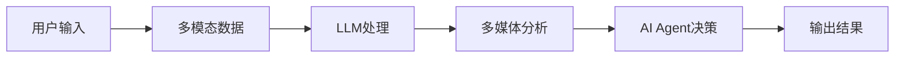
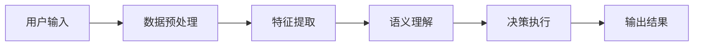

                 


# 多模态内容理解AI Agent：整合LLM与多媒体分析

---

## 关键词

多模态内容理解、AI Agent、LLM、多媒体分析、数据融合、决策算法、系统架构

---

## 摘要

本文探讨了多模态内容理解AI Agent的整合与实现，重点分析了如何将大语言模型（LLM）与多媒体分析技术相结合，以提升AI Agent在复杂场景下的理解与决策能力。通过背景介绍、核心概念、算法原理、系统架构、项目实战等多维度的详细阐述，本文为读者提供了一种全新的视角，深入剖析了多模态内容理解的技术本质与应用场景。同时，本文通过具体的数学公式、流程图和代码示例，详细讲解了多模态AI Agent的实现过程，为相关领域的研究者和开发者提供了有益的参考。

---

## 第1章：多模态内容理解与AI Agent的背景介绍

### 1.1 多模态内容理解的背景与问题背景

#### 1.1.1 从单模态到多模态的演进

在人工智能技术的发展历程中，单模态数据处理一直是研究的重点。然而，随着技术的进步，单模态数据的局限性逐渐显现：单一的数据来源无法满足复杂场景下的理解需求。例如，在自然语言处理（NLP）领域，单纯依赖文本信息往往难以捕捉到用户的实际意图，尤其是在涉及视觉、听觉等其他模态信息的场景中，单模态方法显得力不从心。

#### 1.1.2 当前多模态内容理解的核心问题

多模态内容理解的核心问题在于如何有效整合多种数据源（如文本、图像、语音等），并从中提取有用的信息以支持决策。具体来说，以下问题亟待解决：

1. **数据异构性**：不同模态的数据具有不同的特征表示形式，如何实现有效的跨模态融合？
2. **语义一致性**：如何确保不同模态数据在语义上的一致性，避免信息冲突？
3. **计算效率**：多模态数据的处理通常涉及大量的计算，如何在保证性能的前提下实现高效的处理？

#### 1.1.3 AI Agent在多模态内容理解中的作用

AI Agent作为一种能够感知环境、执行任务的智能体，其在多模态内容理解中的作用不可忽视。AI Agent需要能够同时处理多种数据源，并基于这些数据做出合理的决策。例如，在智能客服场景中，AI Agent需要同时理解用户的文本输入、语音语调以及上下文信息，才能提供准确的服务。

---

### 1.2 多模态内容理解的核心概念

#### 1.2.1 多模态数据的定义与特点

多模态数据是指同时包含多种数据类型（如文本、图像、语音、视频等）的信息。其特点如下：

- **异构性**：不同模态的数据具有不同的特征表示形式。
- **关联性**：不同模态的数据之间存在语义上的关联。
- **互补性**：多种模态数据可以互补地提供信息，从而提升整体的理解能力。

#### 1.2.2 AI Agent的基本概念与功能

AI Agent是一种智能体，能够感知环境、执行任务并做出决策。其核心功能包括：

- **感知**：通过多种模态数据感知环境。
- **理解**：对感知到的数据进行语义理解。
- **决策**：基于理解结果做出决策并执行任务。

#### 1.2.3 多模态内容理解的边界与外延

多模态内容理解的边界在于如何有效整合多种模态数据，并基于这些数据进行语义理解。其外延则涉及具体应用场景，如图像描述生成、视频内容理解、智能对话系统等。

---

### 1.3 多模态内容理解的系统架构

#### 1.3.1 多模态数据的输入与输出

多模态数据的输入可以是多种形式，例如文本、图像、语音等。输出则是基于这些数据的语义理解和决策结果。

#### 1.3.2 AI Agent的系统组成

AI Agent的系统通常由以下几部分组成：

1. **感知模块**：负责接收多模态数据。
2. **理解模块**：对感知到的数据进行语义理解。
3. **决策模块**：基于理解结果做出决策。
4. **执行模块**：执行决策任务。

#### 1.3.3 多模态内容理解的核心要素

多模态内容理解的核心要素包括：

- 数据融合：如何将多种模态数据有效地整合在一起。
- 语义理解：如何从多模态数据中提取语义信息。
- 决策优化：如何基于语义理解做出最优决策。

---

## 第2章：多模态AI Agent的核心原理

### 2.1 多模态数据的处理流程

#### 2.1.1 数据输入与预处理

数据输入是多模态内容理解的第一步，通常包括文本、图像、语音等多种形式。预处理步骤包括数据清洗、格式转换等。

#### 2.1.2 多模态特征提取

特征提取是将多模态数据转换为可计算形式的关键步骤。例如，对于图像数据，可以使用卷积神经网络（CNN）提取图像特征；对于文本数据，可以使用词嵌入（如Word2Vec）提取文本特征。

#### 2.1.3 数据融合与关联

数据融合是将多种模态特征整合在一起的过程。常见的数据融合方法包括特征拼接、注意力机制等。

---

### 2.2 AI Agent的决策机制

#### 2.2.1 多模态信息的整合与分析

整合多模态信息是AI Agent理解环境的关键步骤。例如，在智能对话系统中，AI Agent需要同时理解用户的文本输入和语音语调。

#### 2.2.2 基于LLM的语义理解

大语言模型（LLM）在语义理解方面具有显著优势。通过将多模态数据映射到文本形式，LLM可以对语义进行深度理解。

#### 2.2.3 多媒体分析的特征提取与匹配

多媒体分析（如图像分析）通过提取特征并匹配语义信息，可以进一步提升AI Agent的理解能力。

---

### 2.3 多模态AI Agent的实体关系图



---

## 第3章：多模态AI Agent的算法原理与数学模型

### 3.1 多模态数据融合算法

#### 3.1.1 数据预处理与特征提取

特征提取是将多模态数据转换为可计算形式的关键步骤。例如，图像数据可以通过CNN提取特征，文本数据可以通过词嵌入提取特征。

#### 3.1.2 数据融合方法

数据融合方法包括特征拼接、注意力机制等。例如，注意力机制可以通过加权的方式将不同模态的特征融合在一起。

---

### 3.2 基于LLM的语义理解算法

#### 3.2.1 LLM的基本原理

大语言模型（LLM）通过大量数据训练，可以对文本进行深度理解。例如，GPT模型通过自注意力机制捕捉文本中的语义关系。

#### 3.2.2 多模态语义理解的数学模型

多模态语义理解的数学模型可以表示为：

$$ y = f(x_1, x_2, ..., x_n) $$

其中，$x_i$ 表示不同模态的输入特征，$y$ 表示输出结果。

---

## 第4章：多模态AI Agent的决策算法

### 4.1 基于LLM的决策流程

#### 4.1.1 语义理解与意图识别

通过LLM对多模态数据进行语义理解，可以识别用户的意图。

#### 4.1.2 决策树的构建与优化

决策树是一种常用的决策算法。通过构建决策树，AI Agent可以基于多模态数据做出决策。

---

### 4.2 基于多媒体分析的决策支持

#### 4.2.1 多媒体特征的权重分配

在决策过程中，不同模态的特征可能具有不同的权重。例如，图像特征的权重可能高于文本特征。

#### 4.2.2 多模态数据的关联推理

通过关联推理，AI Agent可以将不同模态的特征联系起来，从而做出更准确的决策。

---

## 第5章：多模态AI Agent的系统架构设计

### 5.1 问题场景介绍

多模态AI Agent的应用场景包括智能对话系统、图像描述生成、视频内容理解等。

---

### 5.2 系统功能设计

系统功能设计包括数据输入、特征提取、语义理解、决策执行等模块。

---

### 5.3 系统架构图



---

## 第6章：项目实战

### 6.1 环境安装与配置

安装必要的库，例如Python、TensorFlow、PyTorch等。

---

### 6.2 核心代码实现

以下是多模态数据融合的代码示例：

```python
import numpy as np

def fuse_features(text_features, image_features):
    # 特征拼接
    fused_features = np.concatenate([text_features, image_features], axis=1)
    return fused_features
```

---

### 6.3 实际案例分析

通过具体案例分析，展示多模态AI Agent的实际应用效果。

---

## 第7章：总结与展望

### 7.1 总结

本文详细探讨了多模态内容理解AI Agent的整合与实现，重点分析了如何将LLM与多媒体分析技术相结合，以提升AI Agent的决策能力。

---

### 7.2 展望

未来的研究方向包括更高效的多模态数据融合方法、更强大的LLM模型以及更智能的决策算法。

---

## 参考文献

（此处列出相关的参考文献）

---

通过以上内容，本文为读者提供了一个全面的技术视角，深入剖析了多模态内容理解AI Agent的实现过程。

