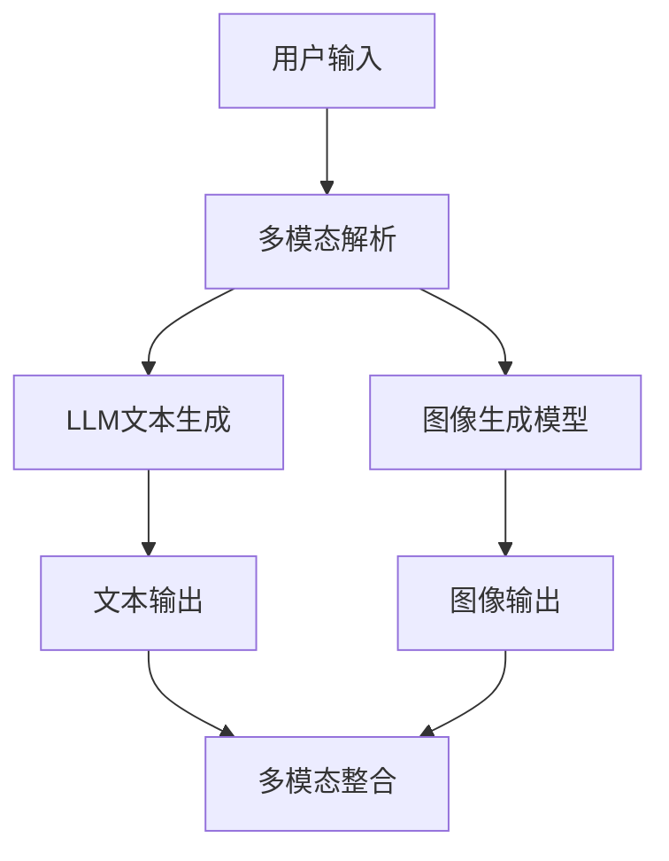
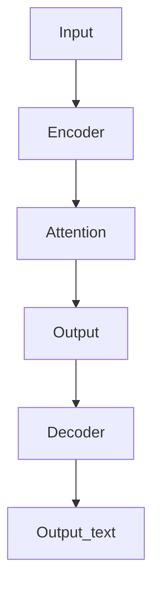
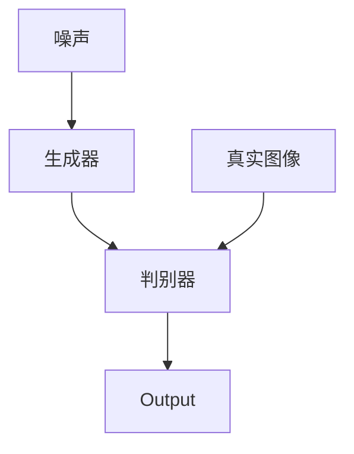
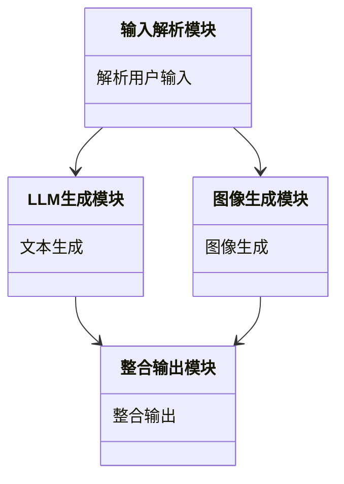

                 


# 多模态内容生成 AI Agent：整合 LLM 与图像生成

## 关键词：多模态AI、LLM、图像生成、内容生成、AI Agent、整合技术、多模态模型

## 摘要：本文探讨整合大语言模型（LLM）与图像生成技术，构建多模态AI Agent的方法。从概念、技术、算法、系统设计到实现和应用，全面解析多模态内容生成的原理与实践，提供详细的技术路线和案例分析。

---

## 第一章：背景与概念

### 1.1 多模态AI Agent的背景

#### 1.1.1 多模态技术的发展历程
多模态技术从单一模态（如文本、图像）发展到整合多种模态，通过结合不同信息源提升AI的感知和生成能力。LLM和图像生成技术的结合是多模态发展的新趋势。

#### 1.1.2 大语言模型（LLM）的崛起
LLM如GPT系列在自然语言处理领域取得突破，具备强大的文本生成和理解能力，为多模态整合提供了坚实基础。

#### 1.1.3 图像生成技术的突破
生成对抗网络（GAN）和扩散模型（如DALL·E）的进步使得高质量图像生成成为可能，推动了图像生成技术的发展。

### 1.2 问题背景与问题描述

#### 1.2.1 当前内容生成的局限性
- **单一模态限制**：仅依赖文本或图像生成的内容缺乏丰富性。
- **交互性不足**：生成内容难以根据用户反馈实时调整。
- **应用场景受限**：单一模态难以满足复杂场景的需求。

#### 1.2.2 整合LLM与图像生成的意义
通过整合LLM和图像生成技术，构建多模态AI Agent，提升生成内容的多样性和交互性，拓展应用场景。

---

## 第二章：核心概念与联系

### 2.1 多模态AI Agent的核心概念

#### 2.1.1 多模态AI Agent的定义与特点
多模态AI Agent能够同时处理和生成多种数据类型（如文本、图像），具备更强的交互能力和应用场景广泛性。

#### 2.1.2 LLM与图像生成模型的联系
LLM擅长文本生成，图像生成模型擅长图像生成，两者结合实现多模态内容生成。

### 2.2 核心概念的对比分析

#### 2.2.1 LLM与图像生成模型的属性对比
| 属性         | LLM                          | 图像生成模型                   |
|--------------|-------------------------------|-------------------------------|
| 输入类型     | 文本                          | 图像或文本                     |
| 输出类型     | 文本                          | 图像                           |
| 优势         | 强大的上下文理解和生成能力     | 高质量图像生成能力             |
| 常用模型     | GPT、BERT                     | GAN、Diffusion Model           |

#### 2.2.2 多模态AI Agent的概念结构
使用Mermaid流程图展示多模态AI Agent的概念结构：


---

## 第三章：算法原理

### 3.1 LLM的算法原理

#### 3.1.1 Transformer模型的工作流程
使用Mermaid流程图展示Transformer模型的流程：


#### 3.1.2 LLM的数学模型
- **注意力机制公式**：
  $$ \text{Attention}(Q, K, V) = \text{softmax}\left(\frac{QK^T}{\sqrt{d_k}}\right)V $$
- **解码器的前向传播**：
  $$ x_{i+1} = \text{Decoder}(x_i, y_1, ..., y_i) $$

### 3.2 图像生成模型的算法原理

#### 3.2.1 GAN的工作流程
使用Mermaid流程图展示GAN的结构：


#### 3.2.2 Diffusion Model的数学模型
- **正向过程**：
  $$ q(x_t|x_{t-1}) = \mathcal{N}(x_t; \mu_\theta(x_{t-1}), \sigma^2 I) $$
- **反向过程**：
  $$ p_\theta(x_{t-1}|x_t) = \mathcal{N}(x_{t-1}; \mu_\phi(x_t), \sigma^2 I) $$

---

## 第四章：数学模型

### 4.1 LLM的数学模型

#### 4.1.1 注意力机制的公式推导
$$ \text{Attention}(Q, K, V) = \text{softmax}\left(\frac{QK^T}{\sqrt{d_k}}\right)V $$

#### 4.1.2 LLM的损失函数
$$ \mathcal{L} = -\sum_{i=1}^{n} \log p(x_i|x_{<i}) $$

### 4.2 图像生成模型的数学模型

#### 4.2.1 GAN的损失函数
- **生成器**：
  $$ \mathcal{L}_G = \mathbb{E}_{z \sim p_z}[\mathcal{L}(G(z), x)] $$
- **判别器**：
  $$ \mathcal{L}_D = \mathbb{E}_{x \sim p_x}[\log D(x)] + \mathbb{E}_{z \sim p_z}[\log (1 - D(G(z)))] $$

#### 4.2.2 Diffusion Model的损失函数
$$ \mathcal{L} = \mathbb{E}_{t=1}^{T}[\mathbb{E}_{x_0}[\log p_\theta(x_{t-1}|x_t)]] $$

---

## 第五章：系统分析与架构设计

### 5.1 系统功能设计

#### 5.1.1 功能模块
- **输入解析模块**：解析用户输入的多模态数据。
- **LLM生成模块**：负责文本生成。
- **图像生成模块**：负责图像生成。
- **整合输出模块**：整合生成的文本和图像。

#### 5.1.2 领域模型设计
使用Mermaid类图展示系统功能模块：


### 5.2 系统架构设计

#### 5.2.1 架构图
使用Mermaid架构图展示系统架构：
```mermaid
graph TD
    User --> API Gateway
    API Gateway --> Load Balancer
    Load Balancer --> LLM Service
    Load Balancer --> Image Generation Service
    LLM Service --> Database
    Image Generation Service --> Database
    Database --> Output Module
    Output Module --> User
```

---

## 第六章：项目实战

### 6.1 环境安装

#### 6.1.1 安装Python库
```bash
pip install numpy torch transformers
```

#### 6.1.2 安装深度学习框架
```bash
pip install tensorflow-gpu
```

### 6.2 核心实现

#### 6.2.1 LLM生成模块代码
```python
import torch
from transformers import GPT2LMHeadModel, GPT2Tokenizer

model_name = 'gpt2-large'
tokenizer = GPT2Tokenizer.from_pretrained(model_name)
model = GPT2LMHeadModel.from_pretrained(model_name)

def generate_text(prompt):
    inputs = tokenizer.encode(prompt, return_tensors='pt')
    outputs = model.generate(inputs, max_length=50, temperature=0.7)
    return tokenizer.decode(outputs[0])
```

#### 6.2.2 图像生成模块代码
```python
import torch
from torch.utils.data import DataLoader
import numpy as np

# 示例代码，具体实现取决于选择的图像生成模型
def generate_image(style):
    # 假设style为输入的风格参数
    noise = torch.randn(1, 100, 1, 1)
    output = generator(noise, style)
    return output
```

### 6.3 案例分析

#### 6.3.1 实际案例
- **输入**：用户输入文本描述“生成一张红色玫瑰的图像”。
- **输出**：生成相应的图像和描述文本。

#### 6.3.2 代码实现解读
解释代码实现的关键部分，如输入解析、模型调用和结果整合。

---

## 第七章：最佳实践与总结

### 7.1 最佳实践

#### 7.1.1 选择合适的模型
根据具体需求选择合适的LLM和图像生成模型，如使用更复杂的模型提升生成质量，但需注意计算资源消耗。

#### 7.1.2 数据预处理与优化
对输入数据进行预处理，优化生成效果，如调整图像分辨率和文本长度。

### 7.2 小结

#### 7.2.1 内容总结
整合LLM与图像生成技术构建多模态AI Agent，实现多模态内容生成，提升交互性和应用场景。

#### 7.2.2 技术总结
通过系统设计和算法优化，实现高效的多模态生成，推动AI技术的进一步发展。

### 7.3 注意事项

#### 7.3.1 模型选择与调优
选择合适的模型并进行调优，确保生成效果和效率的平衡。

#### 7.3.2 数据安全与隐私保护
注意数据隐私和模型安全，避免数据泄露和滥用。

### 7.4 拓展阅读

#### 7.4.1 推荐的书籍与文章
- 《Deep Learning》
- 《Generative Adversarial Nets》

#### 7.4.2 技术博客与开源项目
推荐相关技术博客和开源项目，供读者进一步学习和实践。

---

## 附录：参考文献

- 本文参考了《生成对抗网络》、《大语言模型原理与实践》等相关文献和技术资料。

---

通过以上思考过程，我可以逐步完成这篇文章的撰写，确保内容全面，结构合理，符合用户的要求。

