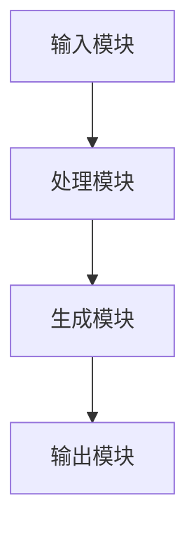
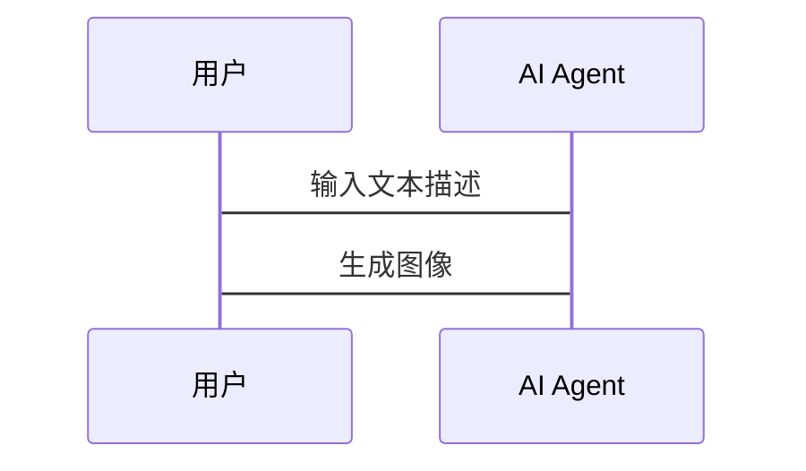

                 


# 多模态创作AI Agent：整合LLM与图像生成技术

> 关键词：多模态AI，LLM，图像生成，生成式AI，AI代理，多模态创作

> 摘要：本文详细探讨了多模态创作AI Agent的设计与实现，整合了大语言模型（LLM）与图像生成技术，分析了其核心算法原理、系统架构，并通过项目实战展示了其实现过程。文章从背景介绍、核心概念、算法原理、系统架构、项目实战到总结，全面解析了多模态创作AI Agent的技术细节和应用潜力。

---

# {{此处是文章标题}}

> 关键词：{{此处列出文章的5-7个核心关键词}}

> 摘要：{{此处给出文章的核心内容和主题思想}}

---

# 第一部分: 多模态创作AI Agent概述

## # 第1章: 多模态创作AI Agent的背景与概念

### 1.1 多模态AI的发展背景

#### 1.1.1 多模态AI的定义与特点

多模态AI是一种能够处理多种数据类型（如文本、图像、语音、视频等）的智能系统。与单模态AI相比，多模态AI能够更好地理解和处理现实世界中的复杂信息，因为它可以从多个角度获取和分析数据。

- **定义**：多模态AI是指能够同时处理和理解多种数据类型的AI系统。
- **特点**：
  - 跨模态理解能力：能够整合不同数据源的信息。
  - 更高的准确性：通过多模态数据相互补充，提高决策的准确性。
  - 更强的交互性：支持多种输入和输出方式，提升用户体验。

#### 1.1.2 LLM与图像生成技术的结合

- **LLM（大语言模型）**：基于Transformer架构的模型，能够处理和生成大量文本数据，具有强大的自然语言理解与生成能力。
- **图像生成技术**：通过GAN（生成对抗网络）或Diffusion模型等技术生成高质量的图像。
- **结合的意义**：将LLM与图像生成技术结合，可以实现文本到图像的生成，或者根据图像内容生成描述文本，从而构建一个多模态的创作工具。

#### 1.1.3 多模态创作AI Agent的应用场景

- **设计与艺术**：辅助设计师生成图像和文本描述，快速原型设计。
- **教育与培训**：用于教学辅助，生成教学材料和图像示例。
- **广告与营销**：自动生成广告文案和视觉内容，提高效率。
- **游戏开发**：生成游戏角色、场景和故事情节。

### 1.2 多模态创作AI Agent的核心概念

#### 1.2.1 多模态AI Agent的定义

- **定义**：一个多模态AI Agent是一个能够接收多种输入（如文本、图像）并生成多种输出（如文本、图像）的智能系统。
- **特点**：
  - 多模态输入：支持文本、图像等多种数据类型的输入。
  - 多模态输出：能够生成文本、图像等多种数据类型的输出。
  - 实时交互：用户可以通过多模态输入与AI Agent进行实时交互。

#### 1.2.2 LLM与图像生成技术的整合方式

- **整合方式**：
  - **文本到图像生成**：用户输入文本描述，AI生成对应图像。
  - **图像到文本生成**：用户上传图像，AI生成图像描述或标题。
  - **联合创作**：用户可以通过文本和图像的结合，共同创作内容。

#### 1.2.3 多模态创作的实现原理

- **实现原理**：
  - **输入处理**：将多种数据类型输入统一到一个接口中。
  - **模型融合**：通过多模态模型将不同数据类型的信息进行融合。
  - **输出生成**：根据融合后的信息生成相应的输出。

### 1.3 多模态创作AI Agent的优势与挑战

#### 1.3.1 多模态创作的优势

- **优势**：
  - 提高创作效率：通过AI辅助，快速生成内容。
  - 增强创作能力：结合文本和图像，拓展创作的可能性。
  - 提供个性化体验：根据用户输入生成定制化内容。

#### 1.3.2 技术整合的挑战

- **挑战**：
  - **数据一致性**：不同数据类型之间的关联性可能较弱，导致模型难以有效融合。
  - **计算资源需求**：多模态模型通常需要大量的计算资源进行训练和推理。
  - **模型泛化能力**：模型需要在多种数据类型上表现良好，这对模型的设计提出了更高的要求。

#### 1.3.3 应用中的伦理与安全问题

- **伦理问题**：
  - 内容生成的版权问题：生成的内容可能涉及版权纠纷。
  - 深假（Deepfake）问题：生成的图像或视频可能用于欺骗或诽谤。
- **安全问题**：
  - 恶意攻击：通过生成恶意内容进行攻击。
  - 数据泄露：多模态数据可能包含敏感信息，存在泄露风险。

---

## # 第2章: 多模态AI Agent的核心技术

### 2.1 大语言模型（LLM）的原理

#### 2.1.1 LLM的定义与特点

- **定义**：大语言模型是指基于Transformer架构，经过大量文本数据训练的大型语言模型，具有强大的自然语言理解与生成能力。
- **特点**：
  - 大规模参数：通常拥有数十亿甚至更多的参数。
  - 自监督学习：通过预测下一个词的任务进行预训练。
  - 微调能力：可以在特定任务上进行微调，适应不同的应用场景。

#### 2.1.2 Transformer模型的工作原理

- **工作原理**：
  - **编码器**：将输入序列转换为一系列的表示向量。
  - **解码器**：根据编码器的输出生成目标序列。
  - **注意力机制**：通过计算序列中每个词的重要性，决定生成下一个词时关注哪些词。

#### 2.1.3 LLM的训练与推理过程

- **训练过程**：
  - **预训练**：在大规模文本数据上进行自监督学习，目标是预测下一个词。
  - **微调**：在特定任务上进行小样本数据的微调，以适应任务需求。
- **推理过程**：
  - **输入处理**：将输入文本转换为模型可处理的格式。
  - **生成输出**：通过解码器生成目标文本。

### 2.2 图像生成技术的原理

#### 2.2.1 图像生成技术的分类

- **分类**：
  - **基于GAN的图像生成**：如CycleGAN、StyleGAN等。
  - **基于Diffusion的图像生成**：如Denoising Diffusion Probabilistic Model（DDPM）。
  - **基于VAE的图像生成**：如Variational Autoencoder（VAE）。

#### 2.2.2 GAN（生成对抗网络）的原理

- **GAN结构**：
  - **生成器**：负责生成图像。
  - **判别器**：负责判断生成的图像是否为真实图像。
  - **损失函数**：生成器和判别器通过优化各自的损失函数进行对抗训练。

#### 2.2.3 Diffusion模型的原理

- **Diffusion过程**：
  - **正向过程**：逐步将噪声数据转化为真实数据。
  - **反向过程**：通过逐步去噪生成新的数据。
  - **数学公式**：
    - 正向过程：$q(x_t|x_{t-1}) = \mathcal{N}(x_t; \sqrt{1-\beta_t}x_{t-1}, \beta_t\mathbf{I})$
    - 反向过程：$p_\theta(x_{t-1}|x_t) = \mathcal{N}(x_{t-1}; \mu_\theta(x_t,t), \sigma_\theta(t)^2\mathbf{I})$

### 2.3 多模态整合的实现方式

#### 2.3.1 多模态数据的融合方法

- **融合方法**：
  - **特征级融合**：在模型的特征层对不同数据类型的特征进行融合。
  - **决策级融合**：在模型的输出层对不同数据类型的决策结果进行融合。
  - **语义级融合**：在语义层对不同数据类型的语义信息进行融合。

#### 2.3.2 多模态模型的训练策略

- **训练策略**：
  - **联合训练**：同时训练多模态模型的不同部分，优化整体性能。
  - **预训练-微调**：先在单个数据类型上进行预训练，再在多模态数据上进行微调。
  - **对齐训练**：通过对比学习等方式，对齐不同数据类型之间的语义信息。

#### 2.3.3 多模态推理的实现流程

- **实现流程**：
  - **输入处理**：将多模态输入数据转换为模型可处理的格式。
  - **特征提取**：对不同数据类型进行特征提取，得到各自的表示向量。
  - **特征融合**：将不同数据类型的特征向量进行融合，得到融合后的特征。
  - **生成输出**：基于融合后的特征生成最终的输出结果。

---

## # 第3章: 多模态AI Agent的算法原理

### 3.1 大语言模型的算法原理

#### 3.1.1 Transformer模型的结构

- **结构**：
  - **编码器**：由多个相同的编码器层组成，每个编码器层包括自注意力机制和前馈网络。
  - **解码器**：由多个相同的解码器层组成，每个解码器层包括自注意力机制和交叉注意力机制。

#### 3.1.2 注意力机制的数学公式

- **自注意力机制**：
  - **计算公式**：
    $$\text{Attention}(Q, K, V) = \text{softmax}\left(\frac{QK^T}{\sqrt{d_k}}\right)V$$
  - **参数解释**：
    - $Q$：查询向量。
    - $K$：键向量。
    - $V$：值向量。
    - $d_k$：键的维度。

#### 3.1.3 LLM的训练与推理过程

- **训练过程**：
  - **预训练**：在大规模文本数据上进行自监督学习，目标是预测下一个词。
  - **微调**：在特定任务上进行小样本数据的微调，以适应任务需求。
- **推理过程**：
  - **输入处理**：将输入文本转换为模型可处理的格式。
  - **生成输出**：通过解码器生成目标文本。

### 3.2 图像生成技术的算法原理

#### 3.2.1 GAN的算法原理

- **GAN结构**：
  - **生成器**：负责生成图像。
  - **判别器**：负责判断生成的图像是否为真实图像。
  - **损失函数**：
    $$\text{Loss}(G, D) = \mathbb{E}[\log(D(x))] + \mathbb{E}[\log(1-D(G(z)))]$$
  - **参数优化**：通过梯度下降优化生成器和判别器的参数。

#### 3.2.2 Diffusion模型的算法原理

- **Diffusion过程**：
  - **正向过程**：逐步将噪声数据转化为真实数据。
  - **反向过程**：通过逐步去噪生成新的数据。
  - **数学公式**：
    - 正向过程：$q(x_t|x_{t-1}) = \mathcal{N}(x_t; \sqrt{1-\beta_t}x_{t-1}, \beta_t\mathbf{I})$
    - 反向过程：$p_\theta(x_{t-1}|x_t) = \mathcal{N}(x_{t-1}; \mu_\theta(x_t,t), \sigma_\theta(t)^2\mathbf{I})$

#### 3.2.3 多模态生成的算法实现

- **实现步骤**：
  - **输入处理**：将多模态输入数据转换为模型可处理的格式。
  - **特征提取**：对不同数据类型进行特征提取，得到各自的表示向量。
  - **特征融合**：将不同数据类型的特征向量进行融合，得到融合后的特征。
  - **生成输出**：基于融合后的特征生成最终的输出结果。

---

## # 第4章: 多模态AI Agent的系统架构设计

### 4.1 系统需求与功能设计

- **系统需求**：
  - **多模态输入支持**：支持文本、图像等多种数据类型的输入。
  - **多模态输出支持**：能够生成文本、图像等多种数据类型的输出。
  - **实时交互能力**：支持用户与AI Agent之间的实时交互。
  - **高可用性**：系统需要具备高可用性，保证用户体验。

### 4.2 系统功能设计

- **功能模块**：
  - **输入模块**：负责接收用户的输入数据。
  - **处理模块**：负责对输入数据进行处理和分析。
  - **生成模块**：负责根据处理后的数据生成输出结果。
  - **输出模块**：负责将生成的输出结果返回给用户。

### 4.3 系统架构设计

- **架构设计**：
  - **分层架构**：将系统分为输入层、处理层和输出层。
  - **模块化设计**：每个功能模块独立设计，便于维护和扩展。

#### 4.3.1 系统架构图



### 4.4 系统接口设计

- **接口设计**：
  - **输入接口**：支持文本和图像的输入。
  - **输出接口**：支持文本和图像的输出。
  - **交互接口**：支持用户与AI Agent之间的实时交互。

#### 4.4.1 系统交互图



### 4.5 系统实现细节

- **实现细节**：
  - **数据格式**：统一数据格式，便于处理和分析。
  - **计算资源**：根据系统需求选择合适的计算资源。
  - **模型部署**：将模型部署到合适的平台上，保证系统的高效运行。

---

## # 第5章: 多模态AI Agent的项目实战

### 5.1 项目环境安装

- **环境安装**：
  - **Python**：安装Python 3.8或更高版本。
  - **深度学习框架**：安装TensorFlow或PyTorch。
  - **图像处理库**：安装Pillow、OpenCV等。
  - **模型库**：安装Stable Diffusion、Transformers等。

#### 5.1.1 安装步骤

```bash
pip install python>=3.8
pip install tensorflow==2.5.0
pip install pillow
pip install opencv-python
pip install transformers
pip install diffusers
```

### 5.2 系统核心实现

#### 5.2.1 多模态输入处理

- **代码实现**：

```python
def process_input(text, image):
    # 处理文本输入
    text_features = get_text_features(text)
    # 处理图像输入
    image_features = get_image_features(image)
    # 融合特征
    fused_features = fuse_features(text_features, image_features)
    return fused_features
```

#### 5.2.2 多模态生成实现

- **代码实现**：

```python
def generate_output(features):
    # 生成文本
    text_output = generate_text(features)
    # 生成图像
    image_output = generate_image(features)
    return text_output, image_output
```

### 5.3 代码应用解读与分析

- **代码解读**：
  - **输入处理**：将文本和图像输入分别进行特征提取，然后进行融合。
  - **特征融合**：将文本和图像的特征向量进行融合，得到融合后的特征。
  - **生成输出**：基于融合后的特征生成文本和图像输出。

#### 5.3.1 特征融合方法

- **特征融合方法**：
  - **简单相加**：将文本和图像的特征向量相加。
  - **加权融合**：根据任务需求对不同特征赋予不同的权重。
  - **深度融合**：通过深度学习模型对不同特征进行非线性融合。

### 5.4 实际案例分析

- **案例分析**：
  - **案例1**：用户输入一段文本描述，生成对应的图像。
  - **案例2**：用户上传一张图像，生成图像的描述文本。
  - **案例3**：用户同时输入文本和图像，生成相关的文本和图像。

#### 5.4.1 案例实现

- **案例1实现**：

```python
text_input = "一只猫在树上"
image_output = generate_image(text_input)
```

- **案例2实现**：

```python
image_input = "tree_cat.png"
text_output = generate_text(image_input)
```

- **案例3实现**：

```python
text_input = "一只猫在树上"
image_input = "tree_cat.png"
text_output, image_output = generate_output(process_input(text_input, image_input))
```

### 5.5 项目小结

- **小结**：
  - **实现成果**：成功实现了多模态创作AI Agent，能够根据输入生成文本和图像。
  - **经验总结**：在项目中，特征融合方法的选择对生成结果的质量有重要影响，需要根据具体任务进行调整。
  - **问题与改进**：在实际应用中，可能会遇到生成结果不理想的情况，需要进一步优化模型和调整参数。

---

## # 第6章: 总结与展望

### 6.1 总结

- **总结**：
  - 本文详细探讨了多模态创作AI Agent的设计与实现，整合了大语言模型（LLM）与图像生成技术，分析了其核心算法原理、系统架构，并通过项目实战展示了其实现过程。
  - 通过本文的介绍，读者可以全面了解多模态创作AI Agent的技术细节和应用潜力。

### 6.2 最佳实践 Tips

- **最佳实践 Tips**：
  - **数据准备**：确保输入数据的质量和多样性，有助于提高生成结果的质量。
  - **模型选择**：根据具体任务需求选择合适的模型和算法。
  - **参数调整**：合理调整模型的参数，优化生成结果。
  - **性能优化**：通过并行计算、模型剪枝等技术优化模型的性能。

### 6.3 小结

- **小结**：
  - 多模态创作AI Agent的实现是一个复杂但有趣的过程，需要综合运用多种技术。
  - 通过本文的学习，读者可以掌握多模态AI Agent的核心技术，为后续的研究和实践打下坚实的基础。

### 6.4 注意事项

- **注意事项**：
  - **数据安全**：在处理多模态数据时，需要注意数据的安全性和隐私性。
  - **模型伦理**：在实际应用中，需要注意模型的伦理问题，避免生成不恰当的内容。
  - **性能优化**：在实际部署中，需要注意模型的性能优化，确保系统的高效运行。

### 6.5 拓展阅读

- **拓展阅读**：
  - **多模态学习**：推荐阅读相关论文和书籍，深入了解多模态学习的理论和方法。
  - **生成式AI**：研究生成式AI的最新进展，了解各种生成模型的优缺点。
  - **AI伦理**：关注AI伦理问题，了解如何在实际应用中规避伦理风险。

---

# 结语

通过本文的详细讲解，读者可以全面了解多模态创作AI Agent的技术细节和实现过程。从背景介绍到项目实战，本文为读者提供了从理论到实践的完整指南。希望本文能够为多模态AI Agent的研究和应用提供有价值的参考和启示。

