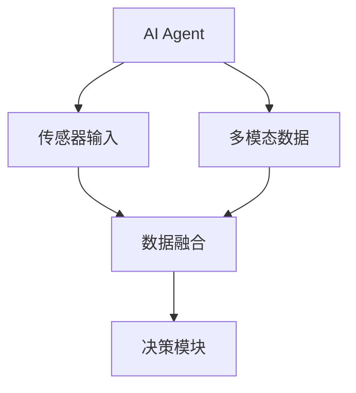
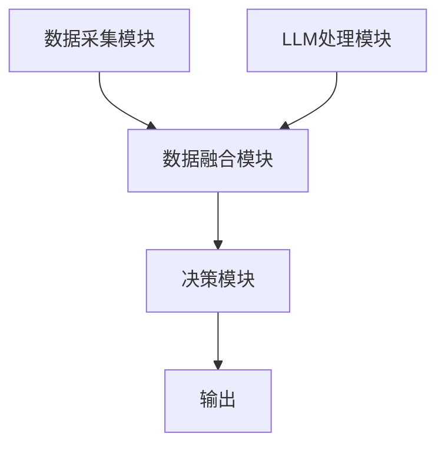

                 


# 多模态感知AI Agent：LLM与多种传感器输入的协同

## 关键词：多模态感知、AI Agent、LLM、传感器输入、协同机制

## 摘要：  
随着人工智能技术的快速发展，多模态感知AI Agent逐渐成为研究热点。本文将深入探讨多模态感知AI Agent的核心概念、算法原理、系统架构以及实际应用。通过结合大语言模型（LLM）与多种传感器输入，分析其协同机制，展示如何通过多模态数据的融合提升AI Agent的智能性和实用性。本文旨在为读者提供全面的技术解析，帮助其理解多模态感知AI Agent的设计与实现。

---

## 第一部分：多模态感知AI Agent的背景与概念

### 第1章：多模态感知与AI Agent概述

#### 1.1 多模态感知的基本概念
多模态感知是指通过多种传感器（如视觉、听觉、触觉等）获取不同类型的数据，并对这些数据进行融合和分析的过程。与单模态感知相比，多模态感知能够提供更全面的信息，从而提升系统的智能性和决策能力。

- **1.1.1 多模态数据的定义**  
  多模态数据是指来自不同传感器或数据源的数据，例如图像、文本、语音、视频、传感器数据等。这些数据具有不同的模态（形式）和特征。

- **1.1.2 多模态感知的核心特点**  
  多模态感知的核心特点包括数据多样性、互补性和复杂性。通过融合多种数据，系统能够更全面地理解环境，做出更准确的决策。

- **1.1.3 多模态感知与单模态感知的对比**  
  通过对比表格，展示多模态感知在信息丰富性、鲁棒性和适用性方面的优势。

| 对比维度 | 单模态感知 | 多模态感知 |
|----------|------------|------------|
| 信息丰富性 | 有限       | 丰富       |
| 鲁棒性     | 较低       | 较高       |
| 适用性     | 有限场景   | 多场景适用  |

---

#### 1.2 AI Agent的基本概念
AI Agent（智能体）是一种能够感知环境、自主决策并执行任务的实体。它可以是一个软件程序、机器人或其他智能系统。

- **1.2.1 AI Agent的定义**  
  AI Agent是具有感知、推理、规划和执行能力的智能实体，能够根据环境输入做出决策。

- **1.2.2 AI Agent的核心功能**  
  包括感知环境、理解输入、推理分析、决策规划和执行任务。

- **1.2.3 AI Agent与传统程序的区别**  
  AI Agent具有自主性、反应性和目标导向性，而传统程序通常依赖于预定义的规则。

---

#### 1.3 多模态感知AI Agent的结合与应用
多模态感知与AI Agent的结合，使得AI Agent能够更高效地处理复杂任务。

- **1.3.1 多模态数据与AI Agent的协同**  
  通过融合多模态数据，AI Agent能够更全面地理解环境，提升决策的准确性。

- **1.3.2 多模态感知AI Agent的优势**  
  包括信息互补性、鲁棒性和智能化。

- **1.3.3 多模态感知AI Agent的应用场景**  
  包括机器人、自动驾驶、智能助手、智慧城市等领域。

---

### 第2章：多模态感知AI Agent的核心概念

#### 2.1 多模态感知AI Agent的定义与特点
多模态感知AI Agent是一种结合多模态感知技术和AI Agent的智能系统，能够通过多种传感器获取信息并进行协同处理。

- **2.1.1 多模态感知AI Agent的定义**  
  多模态感知AI Agent是一种能够通过多种传感器获取数据，并通过协同处理提升智能性和决策能力的AI系统。

- **2.1.2 多模态感知AI Agent的核心特点**  
  包括数据多样性、信息互补性和智能化。

| 属性       | 特点                           |
|------------|--------------------------------|
| 数据来源    | 多种传感器输入                 |
| 冗余性      | 数据互补，提升准确性           |
| 智能性      | 融合多种数据，增强决策能力     |

---

#### 2.2 多模态感知AI Agent的实体关系图
通过Mermaid图展示多模态感知AI Agent的实体关系。



---

## 第二部分：多模态感知AI Agent的算法原理

### 第3章：多模态数据融合算法

#### 3.1 多模态数据融合的基本原理
多模态数据融合是指将来自不同传感器的数据进行整合，以获得更准确的信息。

- **3.1.1 多模态数据融合的数学模型**  
  使用加权融合方法，公式如下：

  $$
  y = \sum_{i=1}^{n} w_i x_i
  $$

  其中，$w_i$ 是第i个传感器的权重，$x_i$ 是传感器的输入，$y$ 是融合后的输出。

- **3.1.2 多模态数据融合的算法流程图**  
  使用Mermaid图展示数据融合的流程。

  ```mermaid
  graph TD
      S1[传感器1输入] --> F[数据融合模块]
      S2[传感器2输入] --> F
      F --> O[融合输出]
  ```

---

### 第4章：LLM与传感器输入的协同机制

#### 4.1 LLM的输入处理
大语言模型（LLM）需要对多模态数据进行预处理，以便生成可理解的输入格式。

- **4.1.1 LLM的输入特点**  
  LLM通常接受文本形式的输入，因此需要将多模态数据转换为文本描述。

- **4.1.2 多模态数据的预处理方法**  
  包括数据清洗、特征提取和格式转换。

- **4.1.3 LLM输入处理的数学模型**  
  使用文本向量化方法，例如词嵌入（Word Embedding）。

  $$
  \text{嵌入向量} = \text{模型编码}(x)
  $$

---

#### 4.2 多模态感知与LLM的协同机制
通过协同机制，多模态数据与LLM实现高效的信息处理。

- **4.2.1 协同机制的数学模型**  
  使用注意力机制（Attention）对多模态数据进行加权处理。

  $$
  \alpha_i = \text{softmax}(e_i)
  $$

  其中，$\alpha_i$ 是第i个传感器的注意力权重，$e_i$ 是对应的能量分数。

- **4.2.2 协同机制的算法流程图**  
  使用Mermaid图展示协同处理的流程。

  ```mermaid
  graph TD
      S1[传感器1输入] --> A[注意力机制]
      S2[传感器2输入] --> A
      A --> L[LLM输入]
      L --> D[决策输出]
  ```

---

## 第三部分：多模态感知AI Agent的系统分析与架构设计

### 第5章：系统分析与架构设计

#### 5.1 问题场景介绍
多模态感知AI Agent的应用场景包括智能机器人、自动驾驶、智能助手等。

- **5.1.1 系统目标与需求分析**  
  系统目标是通过多模态数据融合和LLM协同，实现高效的智能决策。

- **5.1.2 系统功能模块划分**  
  包括数据采集模块、数据融合模块、LLM处理模块和决策模块。

---

#### 5.2 系统架构设计
通过Mermaid图展示系统架构。



---

## 第四部分：多模态感知AI Agent的项目实战

### 第6章：项目实战

#### 6.1 环境安装与配置
- 安装Python、TensorFlow、Keras等依赖库。

#### 6.2 系统核心实现
- 多模态数据融合代码示例：

  ```python
  import numpy as np

  def fuse_multimodal_data(sensor1, sensor2):
      weights = np.array([0.6, 0.4])
      return np.dot(weights, [sensor1, sensor2])

  # 示例输入
  sensor1_input = 0.8
  sensor2_input = 0.5
  fused_output = fuse_multimodal_data(sensor1_input, sensor2_input)
  print(fused_output)
  ```

#### 6.3 实际案例分析
- 分析多模态感知AI Agent在智能机器人中的应用，展示代码实现和实际效果。

---

## 第五部分：最佳实践与总结

### 第7章：总结与展望

#### 7.1 最佳实践
- 数据预处理是关键，需确保多模态数据的准确性和一致性。
- 注意力机制能够有效提升多模态数据的协同效果。

#### 7.2 注意事项
- 多模态数据的融合需要考虑传感器的特性及其互补性。
- LLM的输入处理需注重文本的可解释性和准确性。

#### 7.3 进一步学习的方向
- 深入研究多模态数据融合算法，探索更高效的协同机制。
- 结合具体应用场景，优化系统的性能和用户体验。

---

## 结语

多模态感知AI Agent通过结合大语言模型和多种传感器输入，展现了强大的智能潜力。本文从概念、算法、系统架构到实际应用，全面解析了多模态感知AI Agent的设计与实现。未来，随着技术的不断发展，多模态感知AI Agent将在更多领域发挥重要作用。

---

