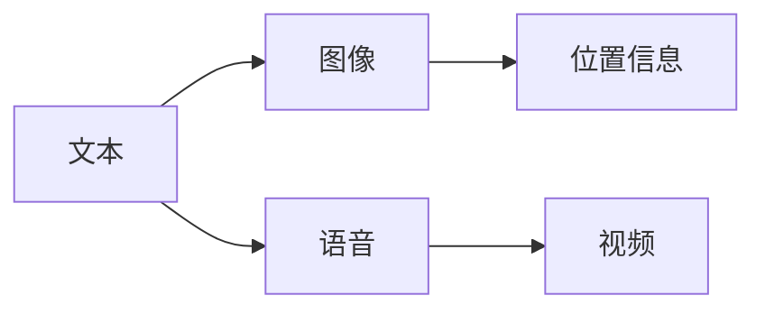
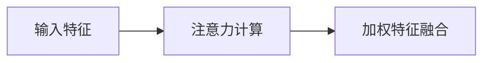
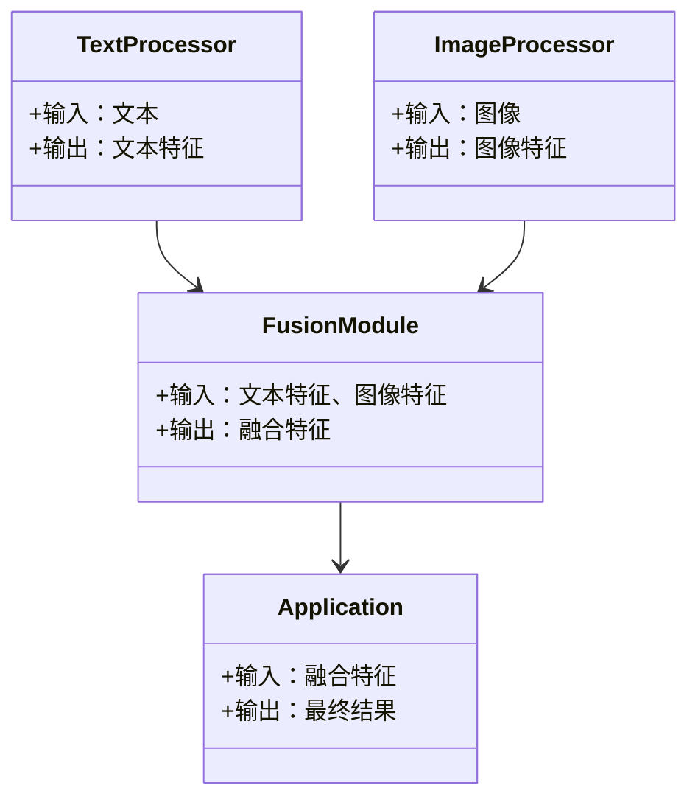
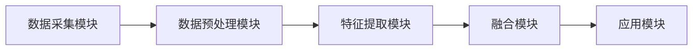

                 


# 多模态融合技术：增强AI Agent的感知与理解能力

## 关键词：多模态融合，AI Agent，感知能力，理解能力，数据融合

## 摘要：  
多模态融合技术通过整合多种数据源（如文本、图像、语音等）的信息，显著提升了AI Agent的感知和理解能力。本文深入探讨了多模态融合的核心概念、算法原理、系统架构设计以及实际应用案例。通过分析多模态数据的属性特征、融合方法和应用场景，本文为AI Agent的开发和优化提供了理论基础和实践指导。

---

# 第1章: 多模态融合技术概述

## 1.1 多模态融合技术的背景与意义

### 1.1.1 多模态数据的定义与特点
- **定义**：多模态数据是指由多种数据类型组成的综合数据集，例如文本、图像、语音、视频等。
- **特点**：
  - **异构性**：不同模态的数据具有不同的特征和表达方式。
  - **互补性**：各模态数据之间能够相互补充，共同提供更全面的信息。
  - **复杂性**：多模态数据的整合需要复杂的算法和计算资源。

### 1.1.2 多模态融合技术的重要性
- 多模态融合技术能够提升AI Agent的感知能力，使其能够更准确地理解输入信息。
- 在实际应用中，多模态融合能够提高系统的鲁棒性和准确性，例如在智能客服、自动驾驶等领域。

### 1.1.3 多模态融合技术在AI Agent中的应用价值
- **智能助手**：通过整合语音和文本信息，提升对话系统的理解和响应能力。
- **智慧城市**：结合图像、传感器数据和文本信息，优化城市管理。
- **增强现实**：通过融合视觉和位置信息，提升用户体验。

## 1.2 多模态融合的核心概念

### 1.2.1 多模态数据的类型与特点
| 数据模态 | 特点 |
|----------|------|
| 文本      | 高语义性，易于处理结构化信息 |
| 图像      | 高空间分辨率，依赖视觉特征 |
| 语音      | 包含情感信息，依赖时序特征 |
| 视频      | 结合了图像和时序信息，数据量大 |

### 1.2.2 多模态融合的定义与分类
- **定义**：多模态融合是将多种数据源的信息进行整合，以获得更准确、全面的结果的过程。
- **分类**：
  - **基于特征的融合**：直接对各模态的特征进行融合。
  - **基于决策的融合**：在决策层对各模态的结果进行融合。
  - **基于模型的融合**：在模型内部进行多模态数据的联合处理。

### 1.2.3 多模态融合的实现方式
- **早期融合**：在数据预处理阶段进行融合，适用于实时性要求高的场景。
- **晚期融合**：在特征提取或决策阶段进行融合，适用于数据量较大的场景。

## 1.3 多模态融合技术的应用场景

### 1.3.1 智能助手与对话系统
- **应用场景**：通过整合语音和文本信息，提升对话系统的理解和响应能力。
- **案例**：智能音箱通过语音指令触发文本搜索，结合上下文信息提供更精准的结果。

### 1.3.2 智慧城市与物联网
- **应用场景**：结合图像、传感器数据和文本信息，优化城市管理。
- **案例**：智能交通系统通过整合摄像头图像和实时交通数据，优化信号灯控制。

### 1.3.3 增强现实与虚拟现实
- **应用场景**：通过融合视觉和位置信息，提升用户体验。
- **案例**：AR导航通过结合地理位置和图像信息，提供更直观的指引。

### 1.3.4 医疗健康与生物识别
- **应用场景**：结合图像和文本信息，提高医疗诊断的准确性。
- **案例**：医学影像分析系统通过整合图像和病历信息，辅助医生进行诊断。

## 1.4 多模态融合技术的挑战与未来趋势

### 1.4.1 数据异构性问题
- 不同模态的数据具有不同的特征和表达方式，如何有效整合这些数据是一个挑战。

### 1.4.2 融合算法的复杂性
- 多模态融合需要复杂的算法和模型设计，如何在有限的计算资源下实现高效的融合是未来的研究方向。

### 1.4.3 计算资源与实时性要求
- 多模态数据的处理需要大量的计算资源，如何在实时性要求高的场景下实现高效的融合是一个挑战。

### 1.4.4 未来技术发展趋势
- **深度学习的进一步发展**：通过更强大的深度学习模型实现更高效的多模态融合。
- **边缘计算的应用**：在边缘设备上进行多模态数据的实时融合，减少数据传输的延迟。

## 1.5 本章小结
本章介绍了多模态融合技术的背景、核心概念和应用场景，并分析了当前技术面临的挑战和未来的发展趋势。

---

# 第2章: 多模态融合的核心概念与联系

## 2.1 多模态数据的属性特征对比

### 2.1.1 数据类型对比
- **文本**：语义丰富，但缺乏空间和时序信息。
- **图像**：具有丰富的空间信息，但缺乏语义理解能力。
- **语音**：包含情感信息，但缺乏上下文信息。
- **视频**：结合了图像和时序信息，但数据量大且处理复杂。

### 2.1.2 数据模态的特征分析
- **文本**：通过词袋模型或词嵌入（如Word2Vec）提取特征。
- **图像**：通过卷积神经网络（CNN）提取空间特征。
- **语音**：通过循环神经网络（RNN）提取时序特征。
- **视频**：结合图像和时序信息，通常使用3D CNN或LSTM提取特征。

### 2.1.3 数据模态之间的关联性
- **文本与图像**：可以通过图像描述生成文本，或者通过文本描述生成图像。
- **语音与图像**：可以通过语音识别生成文本，结合图像进行进一步分析。

## 2.2 多模态融合的实体关系图



## 2.3 多模态融合的原理概述

### 2.3.1 数据预处理与标准化
- **数据预处理**：对各模态数据进行归一化、降维等处理，确保数据的一致性。
- **标准化**：将不同模态的数据转换为统一的特征表示形式。

### 2.3.2 模态间特征提取
- **特征提取**：通过特定的模型提取各模态的特征向量。
- **特征对齐**：将不同模态的特征向量进行对齐，确保它们在语义上具有可比性。

### 2.3.3 融合策略与方法
- **加法融合**：将各模态的特征向量直接相加。
- **加权融合**：根据各模态的重要性对特征向量进行加权。
- **注意力机制**：通过注意力机制动态调整各模态的权重。

## 2.4 本章小结
本章详细分析了多模态数据的属性特征，并通过实体关系图展示了各模态之间的关联性，最后介绍了多模态融合的基本原理和策略。

---

# 第3章: 多模态融合的算法原理

## 3.1 多模态融合算法的数学模型

### 3.1.1 模态间关联性分析
- **相关性分析**：通过计算各模态数据之间的相关系数，评估它们之间的关联性。
- **协方差矩阵**：通过协方差矩阵描述各模态数据之间的相关性。

### 3.1.2 多模态特征融合模型
- **线性融合**：$$ F(x_1, x_2) = w_1x_1 + w_2x_2 $$
- **非线性融合**：$$ F(x_1, x_2) = \sigma(w_1x_1 + w_2x_2 + b) $$，其中$\sigma$是激活函数。

## 3.2 基于注意力机制的多模态融合

### 3.2.1 注意力机制的基本原理
- **注意力计算**：$$ \alpha_i = \frac{e^{w_i^T x_i}}{\sum_j e^{w_j^T x_j}} $$
- **加权特征融合**：$$ y = \sum_{i=1}^n \alpha_i x_i $$

### 3.2.2 多模态注意力模型实现


## 3.3 基于神经网络的多模态融合

### 3.3.1 多层感知机融合
- **模型结构**：$$ y = \sigma(W_1x_1 + W_2x_2 + b) $$
- **优势**：简单易实现，适合处理低维数据。

### 3.3.2 Transformer架构的多模态融合
- **自注意力机制**：通过自注意力机制捕捉模态之间的全局关系。
- **交叉注意力机制**：通过交叉注意力机制实现模态之间的信息交互。

### 3.3.3 深度神经网络融合模型
- **模型结构**：通过多层感知机或卷积神经网络对各模态数据进行特征提取，再进行融合。

## 3.4 本章小结
本章详细讲解了多模态融合算法的数学模型，并通过注意力机制和神经网络模型展示了多模态融合的具体实现方法。

---

# 第4章: 多模态融合的系统架构设计

## 4.1 系统应用场景介绍

### 4.1.1 智能客服系统
- **应用场景**：通过整合语音和文本信息，提升对话系统的理解和响应能力。
- **系统功能**：语音识别、意图识别、文本生成。

### 4.1.2 智能安防监控
- **应用场景**：通过整合图像和传感器数据，提升安防系统的监控能力。
- **系统功能**：图像识别、行为分析、异常检测。

## 4.2 系统功能设计

### 4.2.1 领域模型设计


### 4.2.2 系统架构设计


### 4.2.3 系统接口设计
- **输入接口**：接收多种模态的数据输入。
- **输出接口**：输出融合后的结果或决策指令。
- **交互接口**：提供人机交互界面，方便用户操作。

### 4.2.4 系统交互流程
```mermaid
sequenceDiagram
参与者 用户
参与者 系统
用户->系统：发送多模态数据
系统->系统：进行数据预处理
系统->系统：提取各模态的特征
系统->系统：进行融合处理
系统->用户：返回最终结果
```

## 4.3 本章小结
本章通过系统架构设计展示了多模态融合技术的具体实现方式，并通过领域模型和系统架构图明确了各模块之间的关系和交互流程。

---

# 第5章: 多模态融合技术的项目实战

## 5.1 项目背景与目标

### 5.1.1 项目背景
- **项目名称**：多模态智能助手开发
- **项目目标**：开发一个能够理解并处理多模态数据的智能助手，提升用户体验。

### 5.1.2 项目需求
- **功能需求**：支持文本输入、语音输入和图像输入，能够进行多模态数据的融合处理。
- **性能需求**：在有限的计算资源下实现高效的多模态融合。

## 5.2 项目核心实现

### 5.2.1 环境安装
- **Python版本**：3.8以上
- **依赖库**：numpy、pandas、scikit-learn、tensorflow、pytorch

### 5.2.2 核心代码实现

#### 5.2.2.1 数据预处理代码
```python
import numpy as np
import pandas as pd

def preprocess_data(data):
    # 数据归一化处理
    normalized_data = (data - np.mean(data)) / np.std(data)
    return normalized_data
```

#### 5.2.2.2 多模态融合模型实现
```python
import tensorflow as tf
from tensorflow import keras

def multi_modal_fusion_model(input_shape1, input_shape2):
    input1 = keras.Input(shape=input_shape1)
    input2 = keras.Input(shape=input_shape2)
    
    # 特征提取层
    dense1 = keras.layers.Dense(64, activation='relu')(input1)
    dense2 = keras.layers.Dense(64, activation='relu')(input2)
    
    # 融合层
    concatenated = keras.layers.Concatenate()([dense1, dense2])
    dense3 = keras.layers.Dense(128, activation='relu')(concatenated)
    
    # 输出层
    output = keras.layers.Dense(1, activation='sigmoid')(dense3)
    
    model = keras.Model(inputs=[input1, input2], outputs=output)
    model.compile(optimizer='adam', loss='binary_crossentropy', metrics=['accuracy'])
    return model
```

#### 5.2.2.3 注意力机制实现
```python
import tensorflow as tf
from tensorflow import keras

def attention_layer(input_tensor):
    # 注意力权重计算
    attention_weights = keras.layers.Dense(1, activation='softmax')(input_tensor)
    # 加权特征融合
    output = keras.layers.Dot(axes=1)([input_tensor, attention_weights])
    return output
```

### 5.2.3 代码应用解读与分析
- **数据预处理**：通过归一化处理确保各模态数据的一致性。
- **多模态融合模型**：通过深度学习模型实现多模态数据的特征提取和融合。
- **注意力机制**：通过注意力机制动态调整各模态的权重，提升融合效果。

### 5.2.4 案例分析与详细讲解
- **案例分析**：以智能客服系统为例，展示多模态融合技术的应用效果。
- **详细讲解**：通过具体案例分析，展示多模态融合技术如何提升系统的感知和理解能力。

## 5.3 项目小结
本章通过实际项目案例展示了多模态融合技术的实现过程，并通过代码示例和案例分析深入讲解了多模态融合技术的具体应用。

---

# 第6章: 多模态融合技术的最佳实践与总结

## 6.1 最佳实践 tips

### 6.1.1 数据预处理
- 确保数据的完整性和一致性，进行归一化或标准化处理。
- 处理缺失数据和异常值。

### 6.1.2 模型选择
- 根据具体场景选择合适的融合方法，早期融合适用于实时性要求高的场景，晚期融合适用于数据量大的场景。
- 结合模型的复杂度和计算资源选择合适的算法。

### 6.1.3 系统优化
- 通过并行计算和分布式计算优化系统的性能。
- 使用边缘计算和云 computing 结合，降低数据传输的延迟。

## 6.2 小结
多模态融合技术通过整合多种数据源的信息，显著提升了AI Agent的感知和理解能力。通过合理选择融合方法和优化系统架构，可以进一步提升系统的性能和效果。

## 6.3 注意事项
- **数据隐私**：在处理多模态数据时，需要注意数据的隐私和安全问题。
- **模型可解释性**：多模态融合模型的可解释性是一个重要的研究方向，需要进一步提升。

## 6.4 拓展阅读
- **推荐书籍**：《Deep Learning》、《Hands-On Machine Learning with Scikit-Learn, Keras, and TensorFlow》
- **推荐论文**：《Attention Is All You Need》、《Multi-modal Deep Learning for Image Recognition》

---

# 结语

多模态融合技术作为AI Agent的核心技术之一，通过整合多种数据源的信息，显著提升了系统的感知和理解能力。本文通过系统化的讲解，从基础概念到算法实现，再到实际应用，全面介绍了多模态融合技术的实现和应用。未来，随着深度学习和边缘计算技术的进一步发展，多模态融合技术将在更多领域发挥重要作用。

